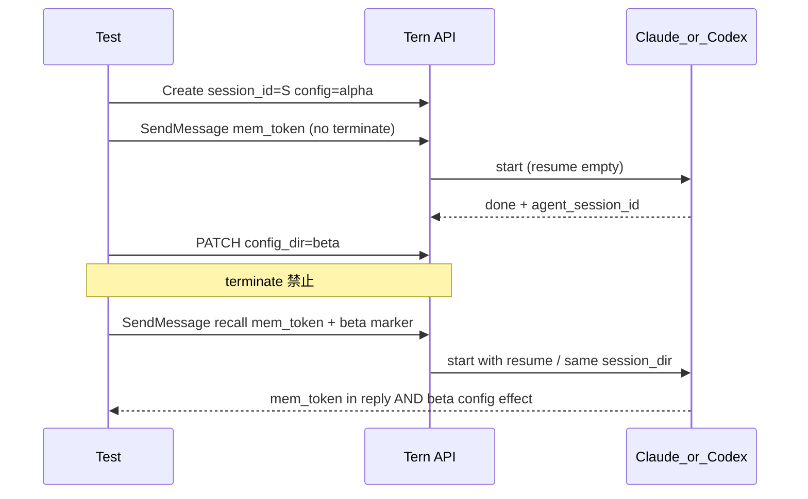

# 002: config_dir 切替後の会話継続証明 (命題の穴埋め)

- 親仕様: [000-ConfigDir-Separate-From-SessionDir.md](file://prompts/phases/000-foundation/branches/feat-profiles/ideas/000-ConfigDir-Separate-From-SessionDir.md) (R8)
- 先行仕様: [001-ConfigDir-Test-Coverage.md](file://prompts/phases/000-foundation/branches/feat-profiles/ideas/001-ConfigDir-Test-Coverage.md)
- 先行計画: [001-ConfigDir-Switch-Same-Session.md](file://prompts/phases/000-foundation/branches/feat-profiles/plans/001-ConfigDir-Switch-Same-Session.md) (PATCH API 実装済み)
- 関連調査: 2026-08-05 `/investigate` — LIVE/mock は config 切替証明に偏り、会話継続は未証明。LIVE がターン間に `terminate` を挟む

## 背景 (Background)

### ユーザー命題 (再掲・要約禁止)

1. Claude を使う
2. 同セッション ID を使い回す
3. `config_dir` を切り替え、違うスキルなどが適用されつつも、同じセッションが継続した会話ができる
4. 上記が問題なければ、Codex でも同じテストをする

### 現状ギャップ (調査で確定)

| 観点 | 001 実装後の実態 | 命題に対する十分性 |
| :--- | :--- | :--- |
| 同一 Tern `session_id` | PATCH + 再利用あり | ID 再利用のみでは不十分 |
| config 切替 | `CLAUDE.md` / `AGENTS.md` マーカー読取 + FS overlay | **設定切替の証明にはなる。会話継続の証明にはならない** |
| 会話継続 | LIVE はターン間に **必ず `terminate`**。応答内容の記憶検証なし。`agent_session_id` が空なら同一性 assert をスキップ | **不十分** |
| Claude resume | SendMessage 時に `--resume` を付けうる | テストが記憶を見ていないため未証明 |
| Codex resume | CLI に `--resume` 相当なし。session id は `codex-{pid}`。継続は `CODEX_HOME=session_dir` 依存が主 | LIVE でも会話継続はほぼ未証明 |
| mock 統合 | overlay 発火用の任意文字列のみ | 会話継続の証明にならない (overlay 専用) |

結論: PATCH API と overlay 切替は揃ったが、**命題 3「同じセッションが継続した会話」は受け入れ条件を満たしていない**。本仕様でテストと必要実装を補う。

## 要件 (Requirements)

### 必須要件

#### R1: 会話継続の操作定義 (受け入れの正)

「同じセッションが継続した会話」とは、次をすべて満たすこと。

1. **同一 Tern `session_id`** を Create から最後まで使い回す (新規 Create しない)
2. ターン間で **`terminate` を呼ばない** (命題経路の LIVE / 追加 E2E では禁止)
3. ターン1でエージェントに **会話専用の秘密トークン** を覚えさせる (config マーカーとは別)
4. `config_dir` を alpha→beta に PATCH した **後の** ターンで、その秘密トークンを **応答テキストから再現** できる
5. 同時に beta 側 config マーカー (スキル / `CLAUDE.md` / `AGENTS.md` 等) も効いている
6. `session_dir` は不変。`agent_session_id` はターン1後に非空で取得でき、切替後も同一 (空なら FAIL。スキップ禁止)

秘密トークンと config マーカーは役割を分離する。

| 種 | 目的 | 例 |
| :--- | :--- | :--- |
| 会話秘密トークン | 会話コンテキスト継続の証明 | `TERN_MEM_<rand>` をターン1で覚えさせ、切替後に想起 |
| config マーカー | 設定切替の証明 | alpha/beta の `CLAUDE.md` / `AGENTS.md` / skill |

#### R2: LIVE から命題経路の terminate を除去

- 現行 `ensureSessionReadyForNextMessage` が **常時 terminate** しているのは命題経路として不正
- 命題 LIVE では terminate しない
- busy / suspended の扱いは R5 の実装で解消する (待機・完了待ち・respond 等)。命題テストから terminate で握りつぶすことは禁止

#### R3: Claude LIVE — 会話継続 + config 切替の同時証明

エージェント: `claudecode`。実 CLI + 実 API キー。`RUN_CONFIG_DIR_LIVE=1` (または本仕様で定める同等フラグ)。

最低手順:

1. Create (`config_dir=alpha`, 固定 `session_dir`)
2. メッセージ1: 秘密トークンを覚えさせる + (必要なら) alpha config マーカー確認
3. **terminate なし**で PATCH `config_dir=beta`
4. メッセージ2: 「さっき覚えたトークンは？」相当 + beta config マーカー確認
5. 断言: 応答に秘密トークン、beta マーカーまたは beta overlay FS、同一 `session_id` / `session_dir` / 非空同一 `agent_session_id`

#### R4: Codex LIVE — Claude と対称

エージェント: `codex`。手順・断言は R3 と対称。

- Codex 側で会話継続ができない場合は **テストを skip して完了扱いにしない**。R6 の実装で継続可能にしてから LIVE を通す
- `agent_session_id` が現状空になりがちな場合も、R1 の「空なら FAIL」を満たすよう実装側で安定 ID を記録するか、仕様で代替の継続指標を明示する (推奨は Tern レコード上の安定 resume キー + `session_dir` 不変 + 記憶想起成功)

#### R5: busy / suspended を terminate なしで次メッセージ可能にする (実装)

調査で判明した問題: SSE `[DONE]` と `execRegistry.Unregister` の競合、および `EventUserInputRequired` による suspended 放置があると、次の SendMessage が `session busy` になる。現行 LIVE は terminate で回避していた。

必須:

1. 命題経路が terminate なしで 2 通目を送れること
2. 正常完了後は exec が確実に unregister されること (レース解消)
3. suspended の場合は、命題テストが依拠する経路を文書化すること (例: プロンプトを user-input 待ちにしない / または正式な respond 完了後に次へ)。**closed にしてから再開する terminate は命題経路の正規手段にしない**

#### R6: Codex 会話継続の実装ギャップ解消 (必要な場合)

現状 Codex は:

- `BuildArgs` に Claude 相当の `--resume` がない
- アダプタ session id が `codex-{pid}` でプロセスごとに変わる

必須: R4 LIVE が記憶想起で通ること。手段は実装計画で選ぶが、方向性は次のいずれか (または組み合わせ)。

- A: Codex CLI の公式 resume / thread 継続手段を Tern から渡す
- B: 同一 `CODEX_HOME` (`session_dir`) 上の会話履歴を次プロセスが確実に引き継ぐことを証明し、Tern レコードに安定な継続キーを保持する
- C: 上記が不可能な場合は本仕様の User Review で「Codex は製品制約上継続不可」と明示し、命題 4 の扱いを人間が再決定する (勝手にスコープ外に落とさない)

#### R7: 既存 LIVE / ドキュメントの修正

- `TestE2E_ConfigDir_Live_*_SwitchSameSession` を R1–R4 に合わせて書き換える (または後継テストに置換し、旧テストは命題証明から外す)
- Reference Manual / ternctl 説明に「config 切替後も同一 session で会話継続可能。切替のために terminate は不要」を明記
- mock 統合は overlay / API 専用と位置づけを明示し、「会話継続証明」を名乗らない

### 任意要件

- mock で会話継続をシミュレートする (EventSystem 固定 ID + 偽記憶) — 最終受け入れには使わない
- Claude のみ先に R3 を通し、Codex は R6 完了後に R4 — 順序は可。ただし両方通るまで受け入れ完了としない (命題 4)

### 非要件 (Out of Scope)

- 名前付き profile 解決
- terminate API 自体の削除 (busy 強制終了用途は残す。命題経路での常用を禁止するだけ)
- config オーサリング / 配布

## 実現方針 (Implementation Approach)



### 設計決定

1. **証明の二軸を分離**: config 切替 (マーカー/FS) と会話継続 (記憶トークン想起) を同一 LIVE 内で両方必須にする
2. **terminate は命題経路から排除**: busy は製品側の完了・unregister 修正で直す
3. **空 `agent_session_id` スキップ禁止**: Claude は必須。Codex は R6 で定義した継続キーを必須化
4. **001 の PATCH API は維持**: 本仕様は主に検証強化 + busy/Codex 継続の実装補完

### 変更が想定される領域

| 領域 | 内容 |
| :--- | :--- |
| `tests/agentservice_e2e_test.go` | LIVE 書き換え (記憶 + 非 terminate) |
| `shared/libs/go/agentservice` | busy レース / suspended 後の次メッセージ |
| `shared/libs/go/codingagent/codex` | 会話継続に必要な resume / 安定 ID (R6) |
| docs / ternctl 文言 | 切替と継続の説明 |

## 検証シナリオ (Verification Scenarios)

ユーザー命題をそのまま転記する。

1. Claude を使う
2. 同セッション ID を使い回す
3. `config_dir` を切り替え、違うスキルなどが適用されつつも、同じセッションが継続した会話ができる
4. 上記が問題なければ、Codex でも同じテストをする

### シナリオ P-CONT (必須・LIVE)

| ステップ | 操作 | 期待 |
| :--- | :--- | :--- |
| P1 | Claude で Create (`config_dir=alpha`, 明示 `session_dir`) | 201。`session_id=S` |
| P2 | `S` にメッセージ: 秘密トークン `TERN_MEM_*` を覚えよ。ツール不要の短応答 | 200。SSE 完了。`agent_session_id` 非空。**terminate しない** |
| P3 | PATCH `config_dir=beta` | 200。GET で beta。`S` / `session_dir` / `agent_session_id` 不変 |
| P4 | `S` にメッセージ: さっきの秘密トークンを答えよ。併せて beta config の指示に従え (マーカー読取等) | 応答に `TERN_MEM_*`。beta マーカーまたは beta overlay FS。ID 類不変 |
| P5 | 同一手順を Codex で実施 | 同上 |

禁止: P2→P4 の間に `POST .../terminate` を挟むこと。

### シナリオ P-BUSY (実装検証)

正常完了した直後に同一 `session_id` へ 2 通目を送っても `session busy` にならないこと (terminate なし)。

## テスト項目 (Testing)

手動確認のみは禁止。自動テスト必須。

### Build

```bash
./scripts/process/build.sh
```

(Windows / 本ワークスペース。Linux / Remote-SSH Linux の場合は `--skip-etc`)

### Integration / E2E (命題)

```bash
./scripts/process/build.sh && ./scripts/process/integration_test.sh --specify "TestE2E_ConfigDir_Live|TestAgentService_ConfigDir_SwitchSameSession|TestHandlePatchSession"
```

会話継続 LIVE (課金あり・必須):

```bash
RUN_CONFIG_DIR_LIVE=1 ./scripts/process/integration_test.sh --specify "TestE2E_ConfigDir_Live"
```

- フラグ ON かつ CLI/キー不足は Skip ではなく Fatal
- Linux / Remote-SSH Linux: integration は `xvfb-run -a` ラップ、`--headed` / `--ui` なし

### 受け入れ完了条件

- [ ] Claude LIVE が P-CONT を terminate なしで成功
- [ ] Codex LIVE が P-CONT を terminate なしで成功
- [ ] 記憶トークン想起と beta config 効果の両方を断言
- [ ] `agent_session_id` (または R6 で定めた継続キー) が空でスキップされない
- [ ] mock を会話継続の最終証明に使っていない

## User Review Required

None. (承認済み 2026-08-05)

1. **Codex も会話継続必須**: **Yes**
2. **命題 LIVE は user-input を誘発しないプロンプトに限定**: **Yes**

## 参考 — 調査で否定された「十分」な証明

- `AGENTS.md` / `CLAUDE.md` を読ませただけ → config 切替のみ
- Tern `session_id` 文字列の一致だけ → レコード再利用のみ
- `terminate` 後の同一 ID 再利用 → プロセス終了後の再開であり、命題の「継続した会話」の正規証明に使ってはならない
- `if agent_session_id == "" { skip assert }` → 受け入れ不可
