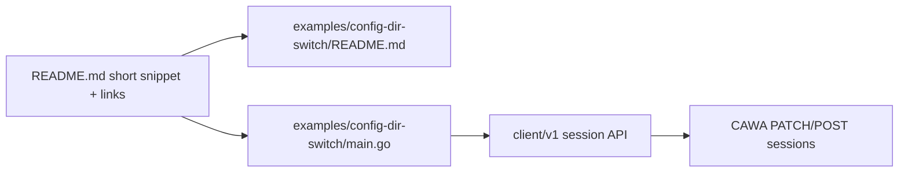

# 003: config_dir 切替継続のクライアント API・README・Example

- 親仕様: [000-ConfigDir-Separate-From-SessionDir.md](file://prompts/phases/000-foundation/branches/feat-profiles/ideas/000-ConfigDir-Separate-From-SessionDir.md) (R8 PATCH)
- 関連: [002-ConfigDir-Conversation-Continuity.md](file://prompts/phases/000-foundation/branches/feat-profiles/ideas/002-ConfigDir-Conversation-Continuity.md) (会話継続 LIVE 済み)
- 目的: 呼び出し側が **同一 `session_id` のまま `config_dir` を切り替えつつ会話を続ける** ための Go クライアント API を整理・文書化し、`examples/` に代表実装を置き、ルート `README.md` から参照できるようにする

## 背景 (Background)

サーバ側では次が実装済みである。

- Create 時の任意 `config_dir`
- `PATCH /api/v1/sessions/:id` による同一セッションでの `config_dir` 更新
- 次の SendMessage での overlay + Claude `--resume` / Codex `exec resume`
- Go client (`client` / `client/v1`) に `SessionRequest.ConfigDir` と `UpdateSessionConfigDir` / `Session.UpdateConfigDir` は既に存在

しかしドキュメントとサンプルが追いついていない。

| 現状 | 課題 |
| :--- | :--- |
| ルート `README.md` の Client Examples | `config_dir` / 切替 / 会話継続に触れない |
| `examples/minimal-client` | Create + 1 メッセージのみ。命題フローを示さない |
| `docs/ReferenceManual-WebAPIs.md` | PATCH は記載済みだが、クライアント呼び出し例が薄い |
| クライアント API | メソッドはあるが、戻り値型が `map[string]any` 中心で呼び出し側の体験が弱い可能性がある |

命題（Claude / Codex・同一 session・config 切替・会話継続）を **アプリ開発者がコピーして始められる形** で公開する必要がある。

## 要件 (Requirements)

### 必須要件

#### R1: クライアント API の公開契約を明確化する

`github.com/axsh/arctic-tern/client/v1` を正とする（deprecated `client` は同等 API を維持）。

最低限ドキュメントと example で使う API:

| API | 役割 |
| :--- | :--- |
| `Client.CreateSession(ctx, SessionRequest{..., ConfigDir})` | 初回 config セット指定 |
| `Session.SendText` / `SendMessage` | 同一 session へのメッセージ (ターン1 / ターン2) |
| `Session.UpdateConfigDir(ctx, configDir)` または `Client.UpdateSessionConfigDir` | 同一 session_id で config 切替 (PATCH)。**terminate 不要** |
| `Client.GetSession(ctx, sessionID)` | 切替後の `config_dir` / `session_dir` / `agent_session_id` 確認 |

制約・セマンティクス（ドキュメントに必須記載）:

1. `UpdateConfigDir` は `work_dir` / `session_dir` / `agent_session_id` を変えない
2. overlay は **次の** `Send*` で適用される
3. 切替のために `Terminate` してはならない（命題経路）
4. `configDir == ""` は overlay クリア（Codex は以降 `--ignore-user-config` 復帰）

#### R2: クライアント API の DX 改善（必要なら実装）

既存 API で example が書ける場合は必須ではないが、次を推奨し実装計画で採否を決める。

| 改善案 | 内容 |
| :--- | :--- |
| A. 型付き GetSession | `GetSession` が `SessionInfo` 構造体を返す（`ID`, `AgentName`, `Status`, `WorkDir`, `SessionDir`, `ConfigDir`, `AgentSessionID`, `Error`）。`map[string]any` 版は互換のため残すか、deprecate コメント |
| B. UpdateConfigDir の戻り値 | PATCH 後のレコードを `SessionInfo` で返す |
| C. コメント (GoDoc) | 上記セマンティクスを英語 GoDoc に明記 |

名前付き `profile` 解決 API は非要件（親仕様どおり）。

#### R3: 代表 Example の追加

新規ディレクトリ案: `examples/config-dir-switch/`

含めるもの:

- `main.go` — 命題フローの最短実装（エージェントはフラグまたは引数で `claudecode` / `codex` を選択可能）
- `README.md` — 前提・実行方法・何を証明しているか・サーバ側との対応表
- `go.mod` / ビルドは既存 examples の慣例に合わせる（`scripts/process/build.sh` が examples をビルドするなら登録）

`main.go` が示すフロー（要約禁止・この順）:

1. `client.New` (+ `WithNoTimeout` 推奨)
2. `CreateSession` with `ConfigDir: alphaDir`, 明示 `SessionDir`
3. `SendText` ターン1（短いプロンプト。秘密トークンを覚えさせるか、example ではデモ用の短い継続確認でも可。課金を抑えるなら「turn-1」と答えさせ、ターン2で「what was turn-1 reply theme」程度でもよいが、**同一 session_id と UpdateConfigDir の順序は必須**）
4. `session.UpdateConfigDir(ctx, betaDir)` — **Terminate しない**
5. `GetSession` で `config_dir` 更新と `id` / `session_dir` 維持をログ
6. `SendText` ターン2（継続 + 新 config に触れる短いプロンプト）
7. 終了時のみ任意で `Terminate`（デモ後クリーンアップ）

CLI フラグ案:

```text
--server URL
--agent claudecode|codex
--model NAME
--work-dir DIR
--session-dir DIR
--config-dir-alpha DIR
--config-dir-beta DIR
--prompt1 TEXT
--prompt2 TEXT
```

アルファ / ベータの config ディレクトリは、example 実行時に一時ディレクトリを作って `CLAUDE.md` / `AGENTS.md` マーカーを書くヘルパーでもよい（リポジトリに大きなフィクスチャを置かない）。

#### R4: ルート README の更新

`README.md` の Client Examples 周辺に短い節を追加する。

必須:

1. **短い説明**（2–4 文）: 同一 session で `config_dir` を切り替えられる。会話は継続。切替に terminate は不要
2. **最小コードスニペット**（Create の `ConfigDir` + `UpdateConfigDir` + 2 通の Send の骨格のみ。長大なロジックは書かない）
3. **詳細へのリンク**: `examples/config-dir-switch/README.md` および `examples/config-dir-switch/main.go` を「詳細な実装・実行手順はこちら」として参照
4. 既存の Reference Manual へのリンク: `docs/ReferenceManual-WebAPIs.md` の PATCH 節

禁止: README に example 全文を貼る。詳細は example 側に置く。

#### R5: Example README を詳細の正とする

`examples/config-dir-switch/README.md` に次を書く（英語。コード・標準ドキュメントは英語ルール）。

- Prerequisites（サーバ起動、vault キー、claude/codex CLI）
- How to run
- What this demonstrates（命題 1–4 との対応）
- API mapping 表（client メソッド → HTTP）
- Notes: no terminate between turns; overlay on next message; empty config_dir clears

#### R6: テスト

- client 単体: `UpdateSessionConfigDir` /（導入するなら）型付き GetSession の httptest モック
- example: 既存と同様、ビルド可能であること（`build.sh` の examples 対象に含める）。LIVE は example 実行必須としないが、`--help` とコンパイルは必須
- 可能なら example 向けの短い単体（フラグパース / 一時 config セット作成）を `examples/config-dir-switch` 内に置く

### 任意要件

- `ternctl` の README 断片への相互リンク
- Python/他言語クライアントは対象外
- example の Docker Compose 同梱

### 非要件

- 名前付き profile API
- Web UI
- サーバ側プロトコル変更（既存 PATCH / Create で足りる前提。不足があれば別仕様）

## 実現方針 (Implementation Approach)



### 設計決定

1. **詳細の正は example**: README は入口、実装の全文と手順は `examples/config-dir-switch/`
2. **client/v1 優先**: 新規コードは v1 のみを推奨。deprecated `client` は同期更新のみ
3. **既存メソッドを壊さない**: `UpdateConfigDir` のシグネチャ変更が必要なら後方互換を優先し、型付き戻りは追加 API で提供
4. **命題の見せ方**: example は「切替 + 同一 session」を必ず示す。実 LLM 課金は任意実行（デフォルトプロンプトは短く）

### 変更が想定される領域

| 領域 | 内容 |
| :--- | :--- |
| `client/v1/session.go` (+ tests) | GoDoc、任意で SessionInfo |
| `client/session.go` | 同等の同期 |
| `examples/config-dir-switch/` | NEW |
| `README.md` | Client Examples に節追加 |
| `scripts/process/build.sh` または examples ビルド列挙 | 新 example を拾うか確認 |

## 検証シナリオ (Verification Scenarios)

ユーザー意図の転記:

1. クライアントコードとなる API を検討する
2. README の更新が必要
3. `examples/` に代表的なコードを準備する
4. 詳細の実装は README から参照する

### シナリオ E1: README → Example 導線

1. ルート README の該当節を読む
2. リンク先 `examples/config-dir-switch/README.md` を開く
3. 記載のコマンドで example をビルド / 実行できる

### シナリオ E2: Example が命題フローを実行する

1. サーバ起動済み
2. `config-dir-switch` を alpha/beta 付きで実行
3. ログに同一 `session_id`、PATCH 後の `config_dir=beta`、ターン2の応答が出力される
4. 実行中に terminate を挟まない

## テスト項目 (Testing)

手動確認のみ禁止。

```bash
./scripts/process/build.sh
```

```bash
./scripts/process/build.sh && ./scripts/process/integration_test.sh --specify "TestClient.*ConfigDir|TestUpdateSessionConfigDir|ConfigDir"
```

（実装計画でテスト名を確定。client パッケージの単体は `build.sh` に含まれる想定。）

Example の存在確認はビルド成功をもって行う。LIVE 課金実行は任意（ドキュメントに明記）。

## User Review Required

None. (承認済み 2026-08-05)

1. **Example ディレクトリ名**: **Yes** — `examples/config-dir-switch`
2. **型付き `SessionInfo`**: **Yes** — 追加し example で使用
3. **デフォルトエージェント**: **Yes** — `claudecode` + `--agent` で codex 切替

## 参考 — 既存 API（実装済み・本仕様で文書化対象）

```go
session, _ := c.CreateSession(ctx, client.SessionRequest{
    Agent: "claudecode", WorkDir: workDir, SessionDir: sessionDir, ConfigDir: alphaDir,
})
_, _ = session.UpdateConfigDir(ctx, betaDir) // PATCH; do not Terminate
stream, _ := session.SendText(ctx, prompt2)
```
