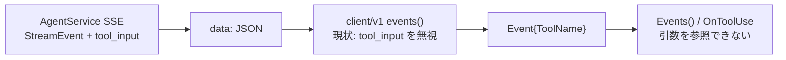
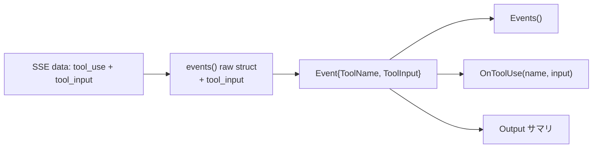

# 000-Client-ToolInput-SSE-Exposure

GitHub Issue: [axsh/arctic-tern#36](https://github.com/axsh/arctic-tern/issues/36)

## 受け入れ判断 (Acceptance Decision)

本 Issue は **公式 Go クライアントが wire 上の既存フィールドを落としている不完全さの修正** として受け入れる。

| Issue Ask | 受け入れ方針 |
|-----------|--------------|
| 1. `client/v1`（および legacy `client`）で `tool_input` を露出できるか | **Yes**。必須要件として実装する |
| 2. 公開 `Event` から意図的に省略しているか（サイズ / プライバシー） | **No（意図的省略ではない）**。`codingagent.StreamEvent` には既にあり、SSE `data:` にも載るが、クライアントのローカル decode struct が未対応なだけ |
| 3. 大きな `tool_input` のサイズ上限 / 切り詰めをクライアントで設けるか | **本 Issue のスコープ外**。クライアントは受信した `tool_input` をそのまま露出する。64 KiB SSE 行問題は `tool_result` と同様に別 Issue（#26 系）で扱う |

**スコープ境界**: サーバー wire / AgentService の変更は不要。クライアントの Event・SSE パーサ・コールバック・Output・ドキュメント整合が主作業。必須要件は **R1–R7**（旧任意要件 R5–R7 も必須に昇格済み）。

## 背景 (Background)

### 問題

AgentService の SSE wire は `tool_use` イベントに `tool_input` を載せる（`codingagent.StreamEvent`）。一方、公式 Go クライアント（`client/v1` および Deprecated な legacy `client`）は SSE デコード時に当該フィールドを捨てるため、`Stream.Events()` / `OnToolUse` の利用者がツール引数（例: `command_execution` の `command`）を参照できない。

### 環境 (Environment)

- arctic-tern: **v0.1.10**
- Client: `github.com/axsh/arctic-tern/client/v1`
- 観測経路: session message SSE（`Stream.Events()` / `OnToolUse`）

### 観測されている非対称 (Observed Asymmetry)

サーバー / wire（`shared/libs/go/codingagent.StreamEvent`）:

```go
ToolName   string                 `json:"tool_name,omitempty"`
ToolInput  map[string]interface{} `json:"tool_input,omitempty"`
```

クライアント（`client/v1.Event`）:

```go
type Event struct {
        Type              EventType
        Text              string
        ToolName          string
        Error             string
        UserInputRequired UserInputRequiredEvent
}
```

SSE デコーダの匿名 struct は `type` / `content` / `tool_name` / `prompt_id` / `choices` / chunk メタデータのみを Unmarshal しており、`tool_input` を含まない。`OnToolUse` も `func(toolName string)` のみ。

### 実際の動作 (Actual)

wire 上の例:

```json
{"type":"tool_use","tool_name":"command_execution","tool_input":{"command":"ls -la"}}
```

`Stream.Events()` は `ToolName == "command_execution"` のみを返し、`tool_input` にはアクセスできない。

### なぜ必要か (Why this matters)

`tool_input` が無いと Go クライアントは次ができない:

- `command_execution` / `Bash` のシェルコマンド表示・ログ
- write / edit 系ツールのファイルパス表示
- サーバー側 System Artifacts が `ToolInput` から推論している進捗 UI と同等の表現

現状の回避策は公式クライアントを迂回して SSE JSON を直接パースするか、事後の `tool_result` を刮ぐこと（結果であり呼び出し引数ではない）に限られる。



## 要件 (Requirements)

### 必須要件

#### R1: `client/v1.Event` に `ToolInput` を追加する

- フィールド例: `ToolInput map[string]any`（または `map[string]interface{}`。既存 `StreamEvent` と意味的に同等）
- `tool_use` 以外のイベントでは `nil`（または未設定）でよい
- wire に `tool_input` が無い / 空の場合は `nil` または空 map。挙動を単体テストで固定する

#### R2: SSE パーサが `tool_input` をデコードして Event に載せる

- 対象: `client/v1/stream.go` の `events()` 内ローカル raw struct
- `json:"tool_input,omitempty"` を Unmarshal し、`Event.ToolInput` にコピーする
- 既存の `tool_result` / `tool_result_part` 再構成ロジックは変更しない

#### R3: legacy `client` パッケージでも同等に露出する

- Deprecated だが #26 対応と同様、当面メンテナンス対象
- `client/stream.go` の `Event` と SSE パーサに同じフィールド伝播を入れる
- 既存単体テストを更新 / 追加する

#### R4: 単体テストで wire → Event の伝播を検証する

最低限のケース:

| ケース | 期待 |
|--------|------|
| `tool_use` + `tool_input` あり | `ToolName` と `ToolInput` が一致 |
| `tool_use` + `tool_input` なし | `ToolName` のみ。`ToolInput` は nil/空 |
| `tool_input` がネストオブジェクト / 配列を含む | JSON 相当の構造が保持される |
| 非 `tool_use` イベント | `ToolInput` は露出不要（nil 可） |

配置: `client/v1/stream_test.go`、`client/stream_test.go`

#### R5: `OnToolUse` / `StreamHandlers.OnToolUse` を引数付きに拡張する

- **v0.x / 互換無視方針のため破壊的変更を許容**し、シグネチャを次へ変更する:

```go
OnToolUse func(toolName string, toolInput map[string]any)
```

- `Run()` / `RunWithHandlers()` / `Stream.OnToolUse` を同様に更新
- legacy `client` の `OnToolUse` も同等に更新する
- リポジトリ内の呼び出し箇所（tests / examples）を合わせて修正する
- 旧シグネチャの併存・互換ラッパは **作らない**

#### R6: `Output()` の表示改善

- 現状は `[Tool: %s]` のみ
- 小さくて安全なキー（例: `command`, `path`）が `ToolInput` にあれば一行サマリを出す
- 大きなペイロードの全文ダンプはしない
- `client/v1` と legacy `client` の両方で実施する

#### R7: ドキュメント追記

- README または client 向けドキュメントに、`tool_use` の `ToolInput` が wire と対応することを短く記載する
- 大きな `tool_input` は本変更では切り詰めないこと、SSE 行サイズ問題は #26 系の別途対応であることを注記する
- `OnToolUse` シグネチャ変更（破壊的）を CHANGELOG または同等の箇所に記載する

### 非要件 (Out of Scope)

| 項目 | 理由 |
|------|------|
| サーバー側 `tool_input` の追加・変更 | 既に wire に載っている |
| クライアント側の `tool_input` サイズ上限 / 切り詰め | Issue Ask 3 への回答どおり。必要なら別仕様 |
| `tool_input` の SSE チャンク化 | `tool_result` 用プロトコルの流用は本 Issue では設計しない |
| プライバシーフィルタ（秘密情報のマスク） | サーバーが送っている内容を透過。マスクが必要なら別 Issue |
| 非 Go クライアント / 生 SSE 消費者の変更 | 既に JSON 上の `tool_input` を読める |

## 実現方針 (Implementation Approach)

### 設計方針

1. **透過 (pass-through)**: サーバーが送った `tool_input` をクライアントが落とさないことが本質
2. **クライアント API 互換は無視してよい**: 本変更では後方互換を設計制約にしない。明瞭な API（`Event.ToolInput`、`OnToolUse(name, input)`）を優先する。破壊的変更は許容し、R7 で文書化する
3. **サーバー変更なし**: AgentService / codingagent の wire 契約はそのまま（サーバー HTTP / SSE 契約は変えない）
4. **legacy 同梱**: Deprecated package も同等のデコード・コールバック・Output 改善を行う（legacy 利用者向けの互換維持は不要。同一の正しい API に揃える）
5. **必須スコープは R1–R7 すべて**: コールバック拡張・Output 改善・ドキュメントも省略しない



### 変更対象（想定）

| ファイル | 変更内容 |
|----------|----------|
| `client/v1/stream.go` | `Event.ToolInput`、raw Unmarshal、OnToolUse シグネチャ、Output サマリ |
| `client/v1/stream_test.go` | R4 / R5 / R6 の単体テスト追加 |
| `client/stream.go` | legacy 同等変更 |
| `client/stream_test.go` | legacy 単体テスト追加 |
| `tests/*.go` / `examples/*` | OnToolUse 呼び出し更新 |
| docs / README / CHANGELOG | R7 |

### `ToolInput` 型の選定

- `map[string]any` を推奨（Go 1.18+ エイリアス。公開 API として読みやすい）
- `codingagent.StreamEvent` は `map[string]interface{}` だが意味は同一。クライアント公開型は `any` でよい

### 大きな `tool_input` について（Ask 3 の詳細回答）

- 現状でもサーバーは `tool_input` を SSE に載せている。クライアントが読むようになっても **wire 上の行サイズは変わらない**
- `file_change` 等で内容が大きい場合、#26 と同様に 64 KiB `bufio.Scanner` 上限に抵触しうる
- 本仕様では:
  - **切り詰め・チャンク化は導入しない**
  - 問題が実測されたら、`tool_result` チャンクプロトコルに倣った **別仕様** で扱う
  - 単体テストでは「通常サイズの引数マップ」を対象とする

### 互換性

**決定: クライアント公開 API の互換性は本仕様では無視する。** 破壊的変更を避けたり、旧シグネチャを残したりする必要はない。明瞭さと実装単純さを優先する。

| API | 方針 |
|-----|------|
| `Event` 構造体 | `ToolInput` を追加する（加法でも破壊でもよい。互換維持は目的にしない） |
| `Events()` | `ToolInput` 付き Event を返す |
| `OnToolUse` / `StreamHandlers.OnToolUse` | `func(toolName string, toolInput map[string]any)` へ変更してよい。旧シグネチャ併存は不要 |
| サーバー HTTP / SSE 契約 | 変更なし（サーバー側は互換を維持） |
| リポジトリ内呼び出し | コンパイルが通るよう追随修正する。外部利用者向けの移行レイヤは作らない |

R7 で破壊的変更である旨を CHANGELOG 等に記載する（互換維持のためではなく、変更の告知のため）。

## 検証シナリオ (Verification Scenarios)

Issue #36 に具体的な手動手順は無いため、受け入れ確認用のシナリオを定義する。

### VS1: モック SSE（単体）

1. `tool_use` + `tool_input: {"command":"ls -la"}` を含む SSE を httptest / `NewStreamFromReader` で供給する
2. `Events()` で受け取った Event の `ToolName` と `ToolInput["command"]` を検証する
3. `OnToolUse` / `RunWithHandlers` でも同じ引数が渡ることを検証する
4. `Output()` が `command` / `path` 等のサマリを出すことを検証する

### VS2: 実エージェント経路（任意・環境依存）

1. Codex または Claude Code セッションでシェル実行を促すプロンプトを送る
2. `client/v1` の `Events()` で `tool_use` を購読する
3. `ToolInput` にコマンド文字列等が入っていることを確認する（LLM 非決定性があるため、単体 VS1 を主、E2E は補助）

## テスト項目 (Testing)

手動確認のみは禁止。以下を実施する。

### 単体テスト（`build.sh` 経由）

```bash
./scripts/process/build.sh
```

追加・更新するパッケージテスト:

- `client/v1` — `tool_input` 伝播（R4）、OnToolUse 引数（R5）、Output サマリ（R6）
- `client` — legacy 同等

### 統合テスト

本変更の主検証はクライアント単体で足りる。回帰として既存 SSE / client/v1 経路を指定実行する。

```bash
./scripts/process/integration_test.sh --specify "TestStream_Events_ReassemblesToolResultParts|TestCodexClientV1|TestAgentService"
```

OnToolUse シグネチャ変更後、コンパイルが通ることを統合テスト群のビルドで確認する（特に `tests/codex_client_v1_large_output_e2e_test.go`、`tests/codex_real_large_output_e2e_test.go`、`tests/interactive_agent_test.go`）。

E2E で LLM 実呼び出しが必要な VS2 は任意とし、必須ゲートにはしない。

## 実装計画への申し送り

実装計画作成時に落とすべきポイント:

1. **R1–R7 すべて必須**として計画に含める（任意扱いしない）
2. クライアント API 互換は無視。R5 の破壊的変更に伴うリポジトリ内呼び出し更新を明示する（互換ラッパは作らない）
3. R6 の Output サマリ規則（対象キー・全文ダンプ禁止）をテスト可能な形で落とす
4. R7 のドキュメント / CHANGELOG 更新を完了条件に含める（破壊的変更の告知）
5. サーバー変更・チャンク化・切り詰めは計画に含めない
