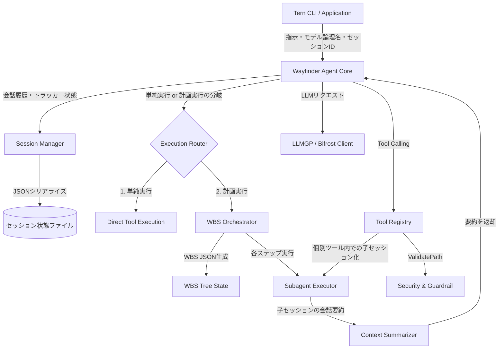

# Wayfinder Agent - 全体概要仕様書

## 1. 背景 (Background)

Ternにおいて、外部ツール（Claude CodeやCodex等）に依存しないポータブルな内製コーディングエージェント「Wayfinder Agent」を搭載します。
これにより、Ternを組み込みたい開発者やライトユーザーに対して、軽量かつ容易にセットアップできるコーディング体験やLLMアシストツールを提供します。
本仕様は、先行プロトタイプである `vv-prototype` の設計思想をベースに、Ternへの統合に最適化した再設計（シングルショット実行対応、ガードレールの現実化、LLMGP統合、サブエージェント機能の完成）を目的とします。

## 2. 要件 (Requirements)

Wayfinder Agent全体として満たすべき共通要件は以下の通りです。

### 必須要件 (Mandatory Requirements)
- **ライブラリおよびCLIモジュール化**: サーバー型 (HTTP/WebSocket) で動作していた `vv-prototype` から、TernのCLIや他のGoプログラムからインポートしてシングルショット（1回限りの起動）で実行できるライブラリ/モジュール形式へ移行すること。
- **実行ブランチの分岐 (Execution Branching)**: ユーザーの要求を受けて、計画を立てる必要がある規模（例: 複数ファイル変更、複雑な手順が必要）かどうかをLLMを用いて判定し、以下のいずれかのルートに分岐して処理をオーケストレーションすること。
  1. **単純実行ルート (Simple Execution)**: 計画作成を行わず、直接ツール（`read_file`, `write_file` など）を呼び出してタスクを解決する。
  2. **計画・実行オーケストレーションルート (Planning & Execution)**: ユーザーの要求から作業分割構成（WBS: Work Breakdown Structure）をLLM（Structured Output推奨）によりJSONのツリー構造として作成し、ステップ順に子セッション（サブエージェント）を起動して処理を巡回・実行する。
- **Tool Callingの実装**: 以下の基礎的なツール呼び出しをサポートすること。
  - `read_file`: ファイルの内容読み込み（ValidatePathによる境界チェックを含む）
  - `write_file`: ファイルの新規作成・上書き
  - `list_directory`: ディレクトリ構成の表示
  - `create_directory`: ディレクトリの作成
  - `edit_file`: ユニークな文字列置換による簡易ファイル編集
  - `search_files`: ファイル検索
  - `grep_files`: テキスト検索
  - `execute_command`: コマンドのフォアグラウンド/バックグラウンド実行
  - `kill_process`: バックグラウンドプロセスの終了
- **セッション状態のシリアライズ・永続化**: CLIのシングルショット実行の間でセッション状態を維持するため、セッションIDに紐づく会話履歴やメタデータ、各種トラッカー（ファイル生成・プロセス生成履歴）をローカルファイルに読み書きできること。
- **サブエージェント（親子セッション）連携**: ツール呼び出し時（特にコマンド実行時など）やWBS実行時、親セッションから独立した子セッションを起動し、子セッションでの試行錯誤やコマンド実行結果をLLMで要約・加工して親セッションに返却することで、親のコンテキストウィンドウの消費を最小限に抑えること。
- **LLMGP/Bifrostへの統合**: LLMへの接続部分をTernのLLMGPクライアント（Bifrost）へ置き換え、指定されたモデルの論理名（Logical Model Name）を使用してテキスト生成およびTool Callingを行えること。

### 任意要件 (Optional Requirements)
- **進捗トラッキング機能**: プランニング機能が生成したステップ（WBSノード）ごとの進捗状況を、永続化されたセッションに記録し、次回起動時にレジュームして続きを実行できること。

## 3. 実現方針 (Implementation Approach)

### システム構成概要

Wayfinder AgentはTernのGoパッケージとして実装され、以下のような階層構造を持ちます。



### 主要なGoパッケージ/構造体設計方針

- **エージェントコア (`internal/agent`)**:
  エージェントの思考ループ（Runループ）を制御します。ユーザーの指示を受け取り、LLMGPを介して思考し、必要に応じてTool Callingを行い、最終的な回答を出力するまでループします。
  - 外部から設定値として `SessionDir`（セッションファイルの保存先ディレクトリ）および `WorkDir`（作業ディレクトリ）を受け取り、実行環境に反映します。
  - **初期化およびフォールバックルール**:
    - `WorkDir`: 設定値が指定されない、または空の場合は現在のカレントワーキングディレクトリ `.` をデフォルトとし、絶対パスに解決します。
    - `SessionDir`: 設定値が指定されない、または空の場合は、`WorkDir` の配下に `.claudecode` ディレクトリ（絶対パス）を自動的に設定してフォールバック先とします（例: `filepath.Join(WorkDir, ".claudecode")`）。
    - 起動時に、`WorkDir` および `SessionDir` は必ず絶対パスに正規化し、後続の処理で参照します。
- **セッションマネージャー (`internal/agent/session`)**:
  セッション情報を管理します。
  - セッション情報には、会話履歴 (`Messages`)、親セッションID (`ParentID`)、作成されたファイル情報 (`FileCreationTracker`)、実行中のバックグラウンドプロセス (`CommandExecutionContext`) が含まれます。
  - ファイルの保存・読み込みの基準パスとして、絶対パスに解決された `SessionDir` を使用します。セッションファイルは `SessionDir` の直下に `[SessionID].json` として保存・管理されます。
- **ツールレジストリ (`internal/agent/tools`)**:
  エージェントに公開するツールの定義とハンドラを登録します。
  - 各ツールがファイル操作やコマンド実行を行う際、基準となるワーキングディレクトリとして絶対パスに解決された `WorkDir` を使用します。
  - コマンド実行ツール（`execute_command`）のプロセス起動時、カレントワーキングディレクトリ（`Cmd.Dir`）には `WorkDir` を明示的に指定します。

## 4. 検証シナリオ (Verification Scenarios)

開発者が手動で動作を確認するための基準シナリオです。

1.  **初期タスク実行シナリオ**:
    - `tern agent run --session-id "s1" --session-dir "tmp/sessions" --work-dir "./workspace" "README.mdのプロジェクト名を確認して"` のように起動。
    - エージェントが `read_file` ツールを呼び出し、`./workspace/README.md` を読み込んで結果を回答することを確認。
2.  **シングルショットとレジュームのシナリオ**:
    - 会話履歴が `tmp/sessions/s1.json` に保存されることを確認。
    - 続いて `tern agent run --session-id "s1" --session-dir "tmp/sessions" --work-dir "./workspace" "それについて要約を追記して"` と起動し、前回の会話コンテキストが復元され、適切に追記タスクが実行されることを確認。
3.  **サブエージェントと要約のシナリオ**:
    - コマンド実行（例: `go test ./...`）を指示した際、親セッションのコンテキストを汚さずに子セッションが立ち上がり、出力結果（数千トークン）がLLMによって「テストが3件成功、エラーなし」のように数百トークンに要約されて親セッションに返却されることを確認。
4.  **ガードレールのシナリオ**:
    - パイプやリダイレクトを含むコマンド `cat file.txt | grep "test"` は正常に実行できることを確認。
    - ワーキングディレクトリ（`WorkDir`）外の絶対パス（例: `/etc/passwd` や `C:\Windows\...`）へのアクセスを指示した際、ガードレールによってアクセスが拒否されることを確認。


## 5. テスト項目 (Testing for the Requirements)

要件が正しく実現されたかを検証するための自動テスト項目です。

### 5.1 単体テスト (Unit Tests)
- **セッションシリアライズのテスト**:
  会話履歴やトラッカー情報をJSON化し、ファイルからデシリアライズした際に状態が正しく復元されることを検証します。
- **パスバリデーションのテスト**:
  ワーキングディレクトリ配下のパスが正しく許可され、境界を越える相対パス（例: `../../secret.txt`）や絶対パスがエラーになることを検証します。
- **コマンドフィルタのテスト**:
  シェル演算子（`|` や `>` など）が含まれていても、危険なコマンド名でない限り実行が拒否されないことを検証します。

### 5.2 統合テスト (Integration Tests)
`integration_test.sh` を使用して、以下のカテゴリで統合テストを実行します。
```bash
./scripts/process/integration_test.sh --categories taskengine,llm --specify tests/integration/agent/...
```
- **サブエージェントフローテスト**:
  モック化されたLLMGPクライアントを使用し、親子セッションの作成、子セッションでのコマンド実行、および要約結果の親セッションへの結合フローが正しく行われることを検証します。
