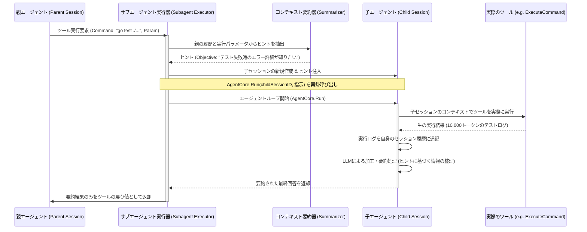

# Wayfinder Agent - サブエージェント連携および要約仕様書

## 1. 背景 (Background)

MCP（Model Context Protocol）や外部コマンドを実行するエージェントでは、コマンドの生出力（ビルドログやテスト出力など）が膨大なトークン数を消費し、親セッションのコンテキストウィンドウを急速に圧迫する問題があります。
これを解決するため、親セッションとは独立した「子セッション（サブエージェント）」を起動して実際のツール実行を肩代わりさせ、その実行結果を親セッションが求める形に「加工・要約」した上で親セッションへ戻す仕組み（サブエージェント連携）を実装します。

## 2. 要件 (Requirements)

### 必須要件 (Mandatory Requirements)
- **子セッションの動的生成**: 特定の重いツール（例: `execute_command`）の実行時、自動的または明示的に親セッションから子セッションを生成できること。
- **実行ディレクトリの引き継ぎ**: 子セッションが起動される際、親セッションに設定されている `WorkDir` および `SessionDir` をそのまま引き継いで動作すること。
- **インテリジェントなヒント (Hints) 生成**: 子セッション起動時、親セッションの会話履歴とツール呼び出しのパラメータから、親エージェントが「何を知りたくてそのコマンドを実行したのか」をLLMで分析し、子セッションへのメタ情報（目的、文脈、制約）として引き渡すこと。
- **子セッション内でのツール実行**: 子セッションは、親から委譲された実際のツール（例: 実際のコマンド実行）を実行し、その生の出力を受け取ること。
- **LLMによる出力の加工・要約**: 子セッションは生の出力結果を受け取った後、LLMを呼び出して「親セッションが求めている情報」に絞り込んだ加工および要約（要約結果、成功/失敗、主要なエラー箇所など）を生成すること。
- **親セッションへの要約結果返却**: 親セッションには、子セッションが要約・加工したテキストのみをツールの実行結果として返却すること。生の出力（数千〜数万トークン）は親の履歴には追加せず、コンテキスト消費を節約すること。
- **階層セッションログの保存**: 子セッションの生の会話履歴や実行ログは、親と同じ `SessionDir` 配下の別のセッションファイル（`[SessionDir]/[ChildSessionID].json`）に永続化し、デバッグ時に後から追跡可能にすること。

### 処理フロー設計と再帰構造

サブエージェントの実行は、親セッションから独立した環境でエージェントループを駆動するため、**`SubagentExecutor` 内部から `AgentCore` を再帰的に呼び出す構造**とします。

親セッションで `execute_command` ツールが呼び出された際の詳細な実行フローは以下の通りです。




### 要約プロンプト設計方針

子セッションで結果を要約する際、以下のシステムプロンプトをLLMへ送信します。
- **目的**: 生のコマンド出力から、親エージェントの関心事項（Objective）に沿った情報のみを抽出すること。
- **フォーマット**:
  - `Status`: 成功/失敗
  - `Summary`: 簡潔な要約（3〜5行程度）
  - `Key Findings / Errors`: 失敗時のスタックトレースや重要なエラー行（不要な進捗ログなどは切り捨てる）

## 4. 検証シナリオ (Verification Scenarios)

1.  **コマンド実行時の要約動作検証**:
    - 親セッションで `execute_command` にて大量のビルドログを吐くコマンド（例: `npm install` や `go build`）を実行するよう指示。
    - 生成された親セッションの履歴ファイル `[SessionDir]/[ParentID].json` を確認し、ツールの出力が生のログではなく、「インストール成功、追加されたパッケージ数」などの要約されたテキストのみになっていることを検証。
2.  **子セッション履歴の独立性検証**:
    - `SessionDir` 配下に、子セッション用の `[ChildID].json` が個別に書き出されていることを検証。
    - その中には、生の数千トークンのコマンド実行結果が `messages` に含まれていることを確認。
3.  **ヒントに基づく要約の動的変化検証**:
    - シナリオA: 親セッションが「ビルドが通るか確認して」と指示してコマンドを実行。 -> 子セッションの要約結果が「ビルド成功」であることにフォーカスしているか検証。
    - シナリオB: 親セッションが「ビルド時にどのような警告 (Warning) が出ているか確認して」と指示してコマンドを実行。 -> 要約結果にエラーではなく警告一覧が抽出されているかを検証。

## 5. テスト項目 (Testing for the Requirements)

### 5.1 単体テスト (Unit Tests)
- `TestGenerateHints`:
  親のダミーメッセージとコマンド文字列を入力し、適切なヒント（Objective, Constraints）が構造化されて出力されることをテスト。
- `TestSummarizationLogic`:
  ダミーの長いビルドエラー出力を与え、LLMGPモックを介して簡潔なエラーサマリーが抽出されることをテスト。

### 5.2 統合テスト (Integration Tests)
`integration_test.sh` を用いて、サブエージェント全体の連携をテストします。
```bash
./scripts/process/integration_test.sh --categories llm,taskengine --specify tests/integration/agent/subagent_test.go
```
- **エンドツーエンド要約結合テスト**:
  親子セッション間の引数伝達、実際のモックコマンド実行、要約結果の親セッションへの伝播までの一連のパイプラインが正しく機能することをアサートします。
