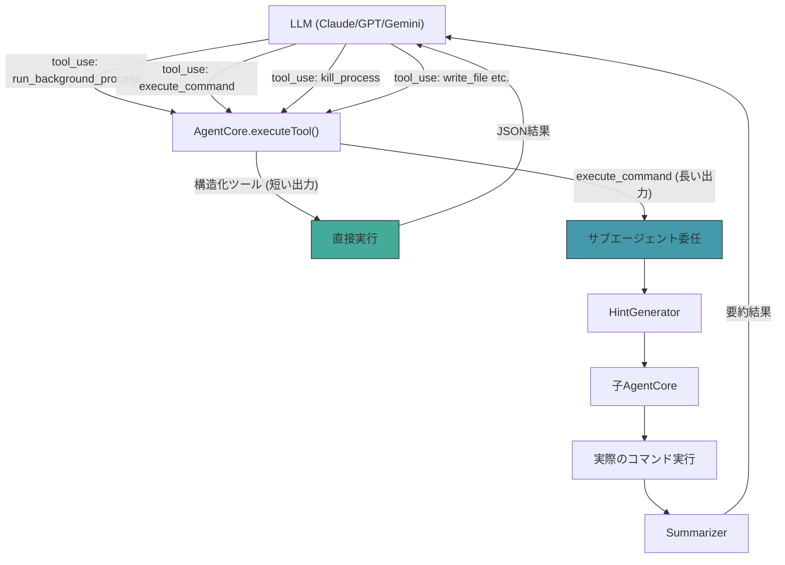
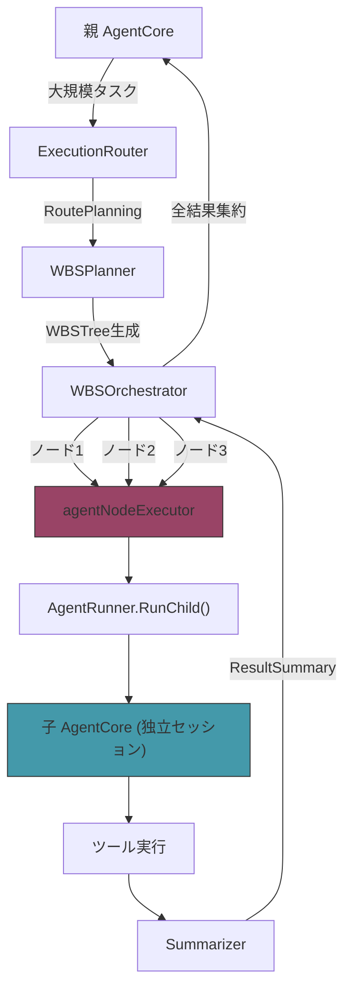

# Wayfinder - ツール細分化とサブエージェント接続

## 1. 背景 (Background)

### 現状の問題

Wayfinderエージェントの現在の実装には、以下の2つの構造的な問題がある。

#### 問題1: `execute_command` の汎用性による要約精度の低下

現在の `execute_command` ツールは、フォアグラウンド実行とバックグラウンド実行の両方を1つのツールで処理している。返却値はテキスト文字列であり、構造化されていない。

```
execute_command(command="sleep 10", background=true)
→ "Background process started with PID: 12345"   ← テキスト。PIDの抽出にLLM依存
```

この設計では:
- サブエージェントの要約でPIDなどの重要な構造化データが失われるリスクがある
- LLMごとに応答フォーマットが異なり、後続処理（例: `kill_process`）でPIDの特定が不安定になる
- `write_file` や `kill_process` は専用ツールとして構造化された結果を返す設計なのに、`execute_command` だけが汎用的すぎる

#### 問題2: サブエージェントが未接続

サブエージェントの実装（`SubagentExecutor`, `HintGenerator`, `Summarizer`）は Part 2 で完了しているが、Adapter層（`adapter.go`）で `AgentCore` にサブエージェントを接続していない。そのため、全てのツール実行が親セッション内で直接行われ、コマンドの生出力がそのまま親LLMの会話履歴に追加される。

大量出力のコマンド（例: `go test ./...`, `npm install`）を実行すると、数千〜数万トークンが親の会話履歴を圧迫し、コンテキストウィンドウの枯渇を招く。

### 関連仕様書

- [002-Wayfinder-Subagent-Hierarchy-and-Summarization.md](file:///c:/Users/yamya/myprog/arctic-tern/work/feat-wayfinder-agent/prompts/phases/000-foundation/branches/feat-wayfinder-agent/ideas/002-Wayfinder-Subagent-Hierarchy-and-Summarization.md): サブエージェントの基本設計（実装済み、未接続）
- [000-Wayfinder-Agent-Overview.md](file:///c:/Users/yamya/myprog/arctic-tern/work/feat-wayfinder-agent/prompts/phases/000-foundation/branches/feat-wayfinder-agent/ideas/000-Wayfinder-Agent-Overview.md): Wayfinder全体設計

---

## 2. 要件 (Requirements)

### 2.1 必須要件: ツール細分化 (アプローチA)

#### R-001: `execute_command` からバックグラウンド実行を分離

`execute_command` ツールの `background` パラメータを廃止し、バックグラウンドプロセス起動は専用ツール `run_background_process` として独立させる。

**変更前:**
```
execute_command(command="sleep 10", background=true)
→ "Background process started with PID: 12345"
```

**変更後:**
```
run_background_process(command="sleep 10")
→ {"status": "started", "pid": 12345, "command": "sleep 10"}
```

- `run_background_process` は構造化されたJSON文字列を返す
- PIDは常に予測可能なフォーマットで返却される
- `execute_command` からは `background` パラメータを削除する

#### R-002: `execute_command` はフォアグラウンド専用に限定

`execute_command` はフォアグラウンド実行のみを担当する。出力が長い場合のサブエージェント要約対象となる。

```
execute_command(command="go test ./...")
→ 生のコマンド出力 (stdout + stderr)
```

#### R-003: `kill_process` の改善

既存の `kill_process` の返却値も構造化する:

**変更前:**
```
kill_process(pid=12345)
→ "Process 12345 killed successfully"
```

**変更後:**
```
kill_process(pid=12345)
→ {"status": "killed", "pid": 12345}
```

また、Windows で `TerminateProcess: Access is denied` が発生した場合でも、プロセスが既に存在しない場合は成功として扱う:

```
kill_process(pid=12345)  ← プロセスが既に終了している場合
→ {"status": "already_terminated", "pid": 12345}
```

### 2.2 必須要件: サブエージェント委任ルーティング (アプローチC)

#### R-004: `executeTool` のルーティングロジック変更

`AgentCore.executeTool()` のサブエージェント委任判定を、ツール名ベースのリストで制御する。

| ツール | サブエージェント委任 | 理由 |
|:---|:---|:---|
| `execute_command` | する (条件付き) | 出力が大きい可能性がある |
| `run_background_process` | しない | PIDを構造化で返すだけ。出力は短い |
| `kill_process` | しない | 結果が構造化されており短い |
| `read_file` | しない | ファイル内容は親が直接必要 |
| `write_file` | しない | 結果が構造化されており短い |
| `edit_file` | しない | 結果が構造化されており短い |
| `list_directory` | しない | 結果は親が直接必要 |
| `create_directory` | しない | 結果が構造化されており短い |
| `search_files` | しない | 結果は親が直接必要 |
| `grep_files` | しない | 結果は親が直接必要 |

`execute_command` のサブエージェント委任は、出力サイズが閾値（例: 10,000文字）を超えた場合のみ行う、もしくは常に行う、のいずれかを実装計画時に決定する。

### 2.3 必須要件: Adapter層での全コンポーネント接続 (実装漏れ修正)

現在、`adapter.go` の `CreateSession()` では `AgentCore` を生成した後、いずれのSetterメソッドも呼んでいない。以下の5つのSetterが全て未接続であり、実装済みの全機能が動作していない状態にある。

| Setterメソッド | 対応する機能 | 関連仕様書 |
|:---|:---|:---|
| `SetSessionID(id)` | セッション永続化 (保存・復元) | 001 |
| `SetSubagentExecutor(exec)` | サブエージェント委任 | 002 |
| `SetRouter(router)` | 計画判定 (simple/planning分岐) | 004 |
| `SetPlanner(planner)` | WBS計画生成 | 004 |
| `SetMessages(messages)` | セッション復元時のメッセージ復元 | 001 |

#### R-005: Adapter層で全コンポーネントを接続

`adapter.go` の `CreateSession()` 内で、以下の全コンポーネントを `AgentCore` に接続する。

```go
// adapter.go CreateSession() 内
llmClient := NewBifrostClient(a.baseURL, a.token)
core := NewAgentCore(llmClient, agentCfg, a.logger)

// 1. セッションIDを設定 (永続化の有効化)
core.SetSessionID(sessionID)

// 2. セッション復元 (既存セッションの再開時)
if cfg.AgentSessionID != "" {
    // store.Load() → SetMessages() でメッセージを復元
}

// 3. サブエージェントを接続 (execute_commandの要約委任)
runner := NewAgentRunnerImpl(...)  // AgentRunner の具象実装
subExec := subagent.NewSubagentExecutor(parentCfg, llmClient, runner, a.logger)
core.SetSubagentExecutor(subExec)

// 4. ExecutionRouter を接続 (simple/planning の自動判定)
router := NewExecutionRouter(llmClient)
core.SetRouter(router)

// 5. WBSPlanner を接続 (WBS計画の自動生成)
planner := planning.NewWBSPlanner(llmClient, a.logger)
core.SetPlanner(planner)
```

#### R-006: AgentRunnerの実装

`subagent.AgentRunner` インターフェースの具象実装を作成する。これは `SubagentExecutor` および WBS `agentNodeExecutor` が子セッションの `AgentCore` を生成・実行するために必要。

```go
// AgentRunner インターフェース (subagent パッケージで定義済み)
type AgentRunner interface {
    RunChild(ctx context.Context, cfg *AgentRunnerConfig, sessionID string,
             llm LLMClient, log logger.Logger, prompt string) (string, error)
}
```

実装は wayfinder パッケージ側に置き、循環importを回避する。


### 2.4 必須要件: WBSノード実行のサブエージェント化 (実装漏れ修正)

#### R-008: WBSノードごとに子セッションを生成して実行

[004-Wayfinder-Planning-and-WBS-Execution-Orchestration.md](file:///c:/Users/yamya/myprog/arctic-tern/work/feat-wayfinder-agent/prompts/phases/000-foundation/branches/feat-wayfinder-agent/ideas/004-Wayfinder-Planning-and-WBS-Execution-Orchestration.md) の仕様に記載されている通り、WBSの各ノードは**新規の子セッション（子AgentCore）を生成して実行**すべきだが、現在の実装では親のAgentCoreの `runSimple()` をそのまま再利用している。

**現在の実装 (誤り):**
```go
// agent_core.go - agentNodeExecutor
func (e *agentNodeExecutor) ExecuteNode(ctx context.Context, node WBSNode) (string, error) {
    prompt := fmt.Sprintf("[WBS Step %s: %s]\n%s", node.ID, node.Name, node.Description)
    return e.core.runSimple(ctx, prompt)  // 親のAgentCoreをそのまま再利用
}
```

**あるべき実装:**
```go
// agent_core.go - agentNodeExecutor (修正後)
func (e *agentNodeExecutor) ExecuteNode(ctx context.Context, node WBSNode) (string, error) {
    prompt := fmt.Sprintf("[WBS Step %s: %s]\n%s", node.ID, node.Name, node.Description)
    childSessionID := fmt.Sprintf("%s-wbs-%s", e.parentSessionID, node.ID)
    // 子セッション(子AgentCore)を生成して実行
    childResult, err := e.runner.RunChild(ctx, e.childConfig, childSessionID, e.llm, e.logger, prompt)
    if err != nil {
        return "", err
    }
    // 結果を要約して返却
    summary, err := e.summarizer.SummarizeForParent(ctx, &Hints{Objective: node.Name}, childResult)
    if err != nil {
        return childResult, nil  // 要約失敗時は生結果をフォールバック
    }
    return summary, nil
}
```

要件:
- WBSの各ノード実行時、独立した子セッション（子 `AgentCore`）を新規生成すること
- 子セッションは親の `WorkDir` および `SessionDir` を引き継ぐこと
- 子セッションのIDは親セッションIDとノードIDから派生させること（例: `parentID-wbs-1.1`）
- 子セッションの実行結果は `Summarizer` で要約し、`WBSNode.ResultSummary` に記録すること
- 子セッションの生の会話履歴は `SessionDir` 配下に個別のファイルとして永続化すること
- `agentNodeExecutor` に `AgentRunner`、`LLMClient`、`Summarizer` への参照を追加すること

### 2.5 任意要件

#### R-007: サブエージェントの有効/無効切り替え

`AgentConfig` にサブエージェントの有効/無効フラグを追加し、設定で切り替え可能にする。

```go
type AgentConfig struct {
    // ...
    EnableSubagent bool   // デフォルト: true
}
```

---

## 3. 実現方針 (Implementation Approach)

### 3.1 ツール層の変更

```
shared/libs/go/wayfinder/tools/
  tool_command.go           ← execute_command (backgroundパラメータ削除)
  tool_command_bg.go [NEW]  ← run_background_process (新規)
  tool_command.go           ← kill_process (構造化応答に変更)
  register.go               ← 新ツールの登録追加
```

### 3.2 AgentCore の変更

```
shared/libs/go/wayfinder/
  agent_core.go             ← executeTool() のルーティングロジック変更
                               agentNodeExecutor を子セッション生成に変更
  agent_runner.go [NEW]     ← AgentRunner の具象実装
  adapter.go                ← SubagentExecutor の接続追加
  config.go                 ← EnableSubagent フラグ追加
```

### 3.3 アーキテクチャ図 (ツール実行)



### 3.4 アーキテクチャ図 (WBS実行)



### 3.4 新ツール `run_background_process` の設計

```go
// tool_command_bg.go
func newRunBackgroundProcess(tc *ToolContext) ToolHandler {
    return func(ctx context.Context, input map[string]any) (string, error) {
        command, _ := input["command"].(string)
        if command == "" {
            return "", fmt.Errorf("run_background_process: command is required")
        }
        if tc.IsBlockedCommand(command) {
            return "", fmt.Errorf("run_background_process: command blocked: %s", command)
        }
        
        cmd := exec.CommandContext(ctx, "sh", "-c", command)
        cmd.Dir = tc.WorkDir
        if err := cmd.Start(); err != nil {
            return "", fmt.Errorf("run_background_process: start failed: %w", err)
        }
        pid := cmd.Process.Pid
        tc.Tracker.TrackProcess(pid, command)
        go func() { _ = cmd.Wait() }()
        
        // 構造化レスポンス
        result := map[string]any{
            "status":  "started",
            "pid":     pid,
            "command": command,
        }
        jsonBytes, _ := json.Marshal(result)
        return string(jsonBytes), nil
    }
}
```

---

## 4. 検証シナリオ (Verification Scenarios)

### シナリオ 1: ツール細分化の動作確認

1. Wayfinder に「sleep 30 をバックグラウンドで実行して」と指示する
2. LLM が `run_background_process` ツールを選択すること
3. 返却値に `{"status": "started", "pid": XXXXX, "command": "sleep 30"}` が含まれること
4. LLM が PID を正確に認識して応答すること
5. 続いて「そのプロセスをkillして」と指示する
6. LLM が `kill_process` ツールを PID 付きで呼び出すこと
7. 返却値に `{"status": "killed", "pid": XXXXX}` が含まれること

### シナリオ 2: サブエージェント経由のコマンド実行

1. サブエージェントを有効にした状態で Wayfinder を起動
2. 「go test ./... を実行して結果を教えて」と指示する
3. `execute_command` がサブエージェントに委任されること (ログで確認)
4. 親セッションの会話履歴に、要約されたテスト結果のみが含まれること (生ログが含まれないこと)
5. 子セッションのログファイルに、生のテスト出力が保存されていること

### シナリオ 3: サブエージェント無効時のフォールバック

1. サブエージェントを無効にした状態 (`EnableSubagent: false`) で Wayfinder を起動
2. `execute_command` が直接実行されること (サブエージェントを経由しないこと)
3. 出力がそのまま親セッションの会話履歴に追加されること

### シナリオ 4: WBSノードのサブエージェント実行

1. 「新しいGoファイルを作成し、テストを書き、ビルドを実行して」と大規模な指示を送信する
2. ExecutionRouter が `RoutePlanning` を選択し、WBSTree が生成されること
3. WBS各ノード (例: ノード1「ファイル作成」, ノード2「テスト作成」, ノード3「ビルド実行」) がそれぞれ**独立した子セッション**で実行されること (ログで子セッションIDが異なることを確認)
4. 各子セッションの生ログが `SessionDir` 配下に個別のJSONファイルとして保存されていること
5. 親セッションの会話履歴には各ノードの `ResultSummary` (要約) のみが含まれていること
6. ノード間の依存関係が正しく解決されること (ノード2はノード1完了後に実行される)

---

## 5. テスト項目 (Testing for the Requirements)

### 5.1 単体テスト (Unit Tests)

- `TestRunBackgroundProcess_Success`: バックグラウンドプロセスが起動し、構造化JSONが返ること
- `TestRunBackgroundProcess_BlockedCommand`: ブロックされたコマンドが拒否されること
- `TestRunBackgroundProcess_EmptyCommand`: 空コマンドでエラーが返ること
- `TestExecuteCommand_NoBackgroundParam`: `execute_command` から `background` パラメータが削除されていること
- `TestKillProcess_StructuredResponse`: 構造化JSONが返ること
- `TestKillProcess_AlreadyTerminated`: 既に終了したプロセスで `already_terminated` が返ること
- `TestKillProcess_AccessDeniedButGone`: Windows `Access is denied` でもプロセスが消えている場合は成功
- `TestExecuteTool_SubagentRouting`: サブエージェントが設定されている場合、`execute_command` がサブエージェントに委任されること
- `TestExecuteTool_NoSubagentRouting`: `run_background_process` はサブエージェントに委任されないこと
- `TestAgentRunner_RunChild`: `AgentRunner` の具象実装が子 `AgentCore` を正しく生成・実行すること
- `TestWBSNodeExecutor_ChildSession`: WBSノード実行時に子セッションが生成されること
- `TestWBSNodeExecutor_ResultSummarized`: WBSノードの実行結果が要約されて `ResultSummary` に記録されること
- `TestWBSNodeExecutor_ChildSessionPersisted`: 子セッションのログが `SessionDir` に個別ファイルとして保存されること

### 5.2 統合テスト (Integration Tests / E2E Tests)

既存のE2Eテストを更新して、新ツール構成で動作することを確認する。

```bash
./scripts/process/build.sh
./scripts/process/integration_test.sh --specify 'TestE2E_Wayfinder'
```

- `TestE2E_Wayfinder_FullScenario_Claude`: 全5ステップ (コード生成、変更、削除、バックグラウンド実行、kill) が新ツールで動作すること
- `TestE2E_Wayfinder_FullScenario_GPTCodex`: 同上
- `TestE2E_Wayfinder_FullScenario_Gemini`: 同上
