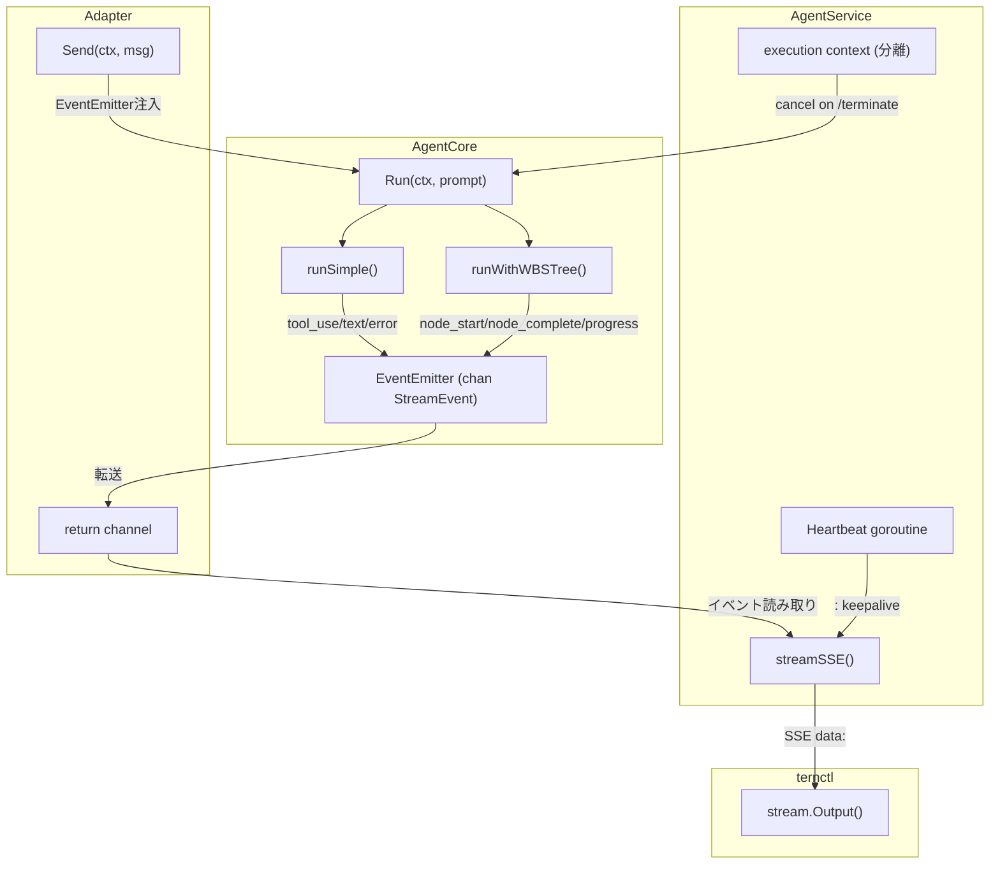

# 006: Wayfinder リアルタイムストリーミングとContext分離

## 背景 (Background)

ternctlクライアントからWayfinder agentを手動実行した際に、以下の2つの問題が確認された:

1. **ストリームログがクライアントに表示されない**: Wayfinder adapter の `Send()` メソッドが `core.Run()` の完了を待つ「バッチ型」設計のため、WBSオーケストレーション（複数ノード x 複数LLM呼び出し）のような長時間タスクでは、最初の `{system}` イベント以降、数分間クライアントに一切の進捗が伝わらない。

2. **WBSノード実行中の context canceled エラー**: `handleSendMessage` が `r.Context()` (HTTPリクエストcontext) をそのまま `agent.CreateSession` → `Send` → `core.Run` → WBSオーケストレーションへ伝播するため、ternctl側のタイムアウトまたは切断により、実行中の全LLM呼び出しが即座に `context canceled` で失敗する。

### 調査結果 (参照)

- [streaming_investigation_report.md](file:///C:/Users/yamya/.gemini/antigravity-ide/brain/617832af-4fc0-466b-8e8b-e8f9e95321b6/streaming_investigation_report.md)

### 現在のアーキテクチャの問題

```
ternctl ─(POST)─> AgentService ─(r.Context())─> adapter.Send() ─(ctx)─> core.Run() ─(ctx)─> WBSOrchestrator
                                                     |                       |
                                         {system} イベント1個だけ         core.Run() 完了まで
                                         即座に送信                     他のイベントなし
                                                                           |
                                                                    ctx がHTTPリクエストに
                                                                    紐づいているため
                                                                    クライアント切断で全体中断
```

## 要件 (Requirements)

### 必須要件

#### R1: EventEmitter機構の導入

AgentCoreにイベントチャネル (`EventEmitter`) を注入し、実行中の各ステップでリアルタイムにイベントを発行する。

- **R1-1**: ツール実行時にイベント発行 (`tool_use`, `tool_result`)
- **R1-2**: LLMからのテキスト応答時にイベント発行 (`text`)
- **R1-3**: WBSノード開始/完了/失敗時にイベント発行 (新イベント型)
- **R1-4**: Simple実行モード (`runSimple`) でも同じイベントを発行する

#### R2: 新しいイベント型の追加

`codingagent.StreamEvent` / `codingagent.EventType` に以下を追加:

| イベント型 | 用途 |
|:---|:---|
| `EventNodeStart` | WBSノード実行開始 |
| `EventNodeComplete` | WBSノード実行完了 (result_summary含む) |
| `EventNodeFailed` | WBSノード実行失敗 (エラー内容含む) |
| `EventProgress` | WBS全体の進捗状況 (完了数/全体数) |

#### R3: Context分離

WBS実行のcontextをHTTPリクエストcontextから分離し、クライアント切断時にもエージェントが処理を継続できるようにする。

- **R3-1**: `handleSendMessage` で `r.Context()` から分離した実行用contextを作成する
- **R3-2**: クライアント切断時にはSSEストリームを閉じるが、エージェント実行は継続する
- **R3-3**: エージェント実行のキャンセルは明示的な `/terminate` API呼び出しでのみ行う
- **R3-4**: 分離contextのキャンセル手段として、既存の `handleTerminate` と連動する仕組みを用意する

#### R4: adapter.go Send() のリファクタリング

現在のバッチ型 `Send()` を、EventEmitter経由のリアルタイムストリーミングに変更する。

- **R4-1**: `core.Run()` の戻り値 (string, error) を待つのではなく、EventEmitter経由でイベントを随時チャネルに送信する
- **R4-2**: `core.Run()` 完了時に `EventResult` を送信してチャネルを閉じる
- **R4-3**: `core.Run()` エラー時に `EventError` を送信してチャネルを閉じる

#### R5: SSE Heartbeat

長時間実行中にSSE接続が中間プロキシやOSレベルでタイムアウトしないよう、定期的にキープアライブを送信する。

- **R5-1**: AgentService の `streamSSE` でイベントがない間、15秒ごとにSSEコメント行 (`: keepalive\n\n`) を送信する
- **R5-2**: ternctlのクライアント (`client/stream.go`) はコメント行を無視する (既に `data:` プレフィックスチェックで無視される)

#### R6: ternctl側のUI改善

- **R6-1**: `[Tool: write_file]` や `[Node Complete: 1 - Set Up Go Web Server]` などの進捗表示をternctlの `Output()` に追加
- **R6-2**: WBS進捗バー的な表示 (例: `[WBS 2/5]`)

#### R7: クライアント側のstream.goへの新イベント型対応

- **R7-1**: `client/stream.go` の `Event` 構造体と `events()` パーサーに新イベント型のサポートを追加

## 実現方針 (Implementation Approach)

### 全体設計



### コンポーネント別変更

#### 1. EventEmitter (新規概念)

```go
// EventEmitter はAgentCoreからイベントを外部に送信するためのチャネルラッパー。
type EventEmitter struct {
    ch chan<- codingagent.StreamEvent
}

func (e *EventEmitter) Emit(ev codingagent.StreamEvent) {
    if e != nil && e.ch != nil {
        e.ch <- ev
    }
}
```

- `AgentCore` に `emitter *EventEmitter` フィールドを追加
- `SetEmitter(ch chan<- codingagent.StreamEvent)` メソッドを追加
- `runSimple` のツール実行ループ内で `emitter.Emit()` を呼ぶ
- `runWithWBSTree` のオーケストレーション内でノード開始/完了/失敗時に `emitter.Emit()` を呼ぶ

#### 2. adapter.go Send() リファクタリング

```go
func (s *wayfinderSession) Send(ctx context.Context, message string) (<-chan codingagent.StreamEvent, error) {
    ch := make(chan codingagent.StreamEvent, 64)
    s.core.SetEmitter(ch)  // EventEmitter注入

    go func() {
        defer close(ch)
        ch <- codingagent.StreamEvent{Type: EventSystem, SessionID: s.id}

        _, err := s.core.Run(execCtx, prompt)  // 分離context使用
        if err != nil {
            ch <- codingagent.StreamEvent{Type: EventError, Error: err}
        } else {
            ch <- codingagent.StreamEvent{Type: EventResult}
        }
    }()

    return ch, nil
}
```

要点: `core.Run()` は依然 goroutine内で実行するが、`EventEmitter` 経由で途中イベントが `ch` に送信されるため、クライアントはリアルタイムに受信できる。

#### 3. Context分離 (AgentService handler.go)

```go
func (s *Server) handleSendMessage(w http.ResponseWriter, r *http.Request) {
    // ...
    // 実行用contextをHTTPリクエストcontextから分離
    execCtx, execCancel := context.WithCancel(context.Background())
    // セッションにcancelを登録 (terminateで使用)
    s.RegisterExecutionCancel(sessionID, execCancel)
    defer s.UnregisterExecutionCancel(sessionID)

    // CreateSession には execCtx を使用
    session, err := agent.CreateSession(execCtx, opts...)
    // ...
    ch, err := session.Send(execCtx, req.Message)

    // SSEストリームは r.Context() で監視 (クライアント切断検知)
    // ただし r.Context() キャンセルでもエージェント実行は継続
    s.streamSSE(r.Context(), w, ch, sessionID)
}
```

`handleTerminate` で `execCancel()` を呼ぶことで、明示的にエージェントを停止:

```go
func (s *Server) handleTerminate(w http.ResponseWriter, r *http.Request) {
    // ...
    if cancel, ok := s.executionCancels[sessionID]; ok {
        cancel()  // エージェント実行を停止
    }
    // ...
}
```

#### 4. SSE Heartbeat (AgentService handler.go)

```go
func (s *Server) streamSSE(clientCtx context.Context, w http.ResponseWriter, ch <-chan codingagent.StreamEvent, sessionID string) {
    // ...
    ticker := time.NewTicker(15 * time.Second)
    defer ticker.Stop()

    for {
        select {
        case <-clientCtx.Done():
            // クライアント切断 → SSEストリーム終了 (エージェントは継続)
            return
        case <-ticker.C:
            fmt.Fprintf(w, ": keepalive\n\n")
            flusher.Flush()
        case ev, ok := <-ch:
            if !ok { goto done }
            // ... 既存のイベント処理
        }
    }
}
```

#### 5. WBSOrchestrator への EventEmitter 伝播

`WBSOrchestrator` の `Execute` メソッド内でノード開始/完了/失敗時に `EventEmitter` を呼ぶ。

方法: `NodeExecutor` インターフェースを変更せず、`WBSOrchestrator` に `EventEmitter` を追加注入する。

```go
type WBSOrchestrator struct {
    executor  NodeExecutor
    persister StatePersister
    emitter   *EventEmitter  // 追加
    logger    logger.Logger
}
```

ノード実行前後:

```go
// Execute内:
o.emit(codingagent.StreamEvent{Type: EventNodeStart, Content: node.Name, ...})
result, err := o.executor.ExecuteNode(ctx, node)
if err != nil {
    o.emit(codingagent.StreamEvent{Type: EventNodeFailed, Content: err.Error(), ...})
} else {
    o.emit(codingagent.StreamEvent{Type: EventNodeComplete, Content: result, ...})
}
// 進捗:
o.emit(codingagent.StreamEvent{Type: EventProgress, Content: "3/7", ...})
```

## 検証シナリオ (Verification Scenarios)

### シナリオ1: Simple実行のストリーミング確認

1. ternサーバーを起動 (`./bin/tern --config ./features/tern/config.yaml`)
2. ternctlで単純なタスクを実行: `./bin/ternctl run --agent wayfinder --prompt "create a file called hello.txt with Hello World"`
3. ternctlの出力に以下がリアルタイムで表示されることを確認:
   - `[System]` イベント
   - `[Tool: write_file]` イベント
   - `[Tool Result] File written: ...` イベント
   - テキスト応答
4. セッションステータスが `completed` であることを確認

### シナリオ2: WBSオーケストレーションのストリーミング確認

1. ternctlで複雑なタスクを実行: `./bin/ternctl run --agent wayfinder --prompt "create a Go web server hosting a space invader game"`
2. ternctlの出力に以下がリアルタイムで表示されることを確認:
   - `[System]` イベント
   - WBSノード開始イベント (`[Node Start: 1 - Set Up Go Web Server]`)
   - ツール実行イベント (各ノード内)
   - WBSノード完了イベント (`[Node Complete: 1 - Set Up Go Web Server]`)
   - 進捗イベント (`[WBS 1/3]`)
3. 全ノードが完了し、セッションステータスが `completed` であることを確認

### シナリオ3: クライアント切断時のエージェント継続

1. ternctlで長時間タスクを実行
2. 実行中にternctlを Ctrl+C で強制終了
3. サーバーログでエージェントが処理を継続していることを確認 (context canceledにならない)
4. セッションファイルにWBSの進捗が保存されていることを確認
5. 別のternctlで `./bin/ternctl session --id <ID>` でステータスを確認
6. 処理完了後、ステータスが `completed` (エラーなし) になることを確認

### シナリオ4: Terminate APIによるエージェント停止

1. ternctlで長時間タスクを実行
2. 別のターミナルから `./bin/ternctl terminate --id <ID>` を実行
3. サーバーログでエージェントのcontextがキャンセルされることを確認
4. セッションステータスが `closed` になることを確認

### シナリオ5: SSE Heartbeatの動作確認

1. ternctlで長時間タスク (LLM応答に時間がかかるもの) を実行
2. 15秒以上イベントがない期間にSSEコメント行 (`: keepalive`) が送信されることをサーバーログで確認
3. ternctlのクライアントがheartbeatを無視し、正常にイベントを受信し続けることを確認

## テスト項目 (Testing for the Requirements)

### ユニットテスト

```bash
# EventEmitter + AgentCoreのイベント発行テスト
cd shared/libs/go && go test ./wayfinder/... -v -run TestEventEmitter

# WBSOrchestrator のイベント発行テスト
cd shared/libs/go && go test ./wayfinder/planning/... -v -run TestOrchestrator.*Event

# Context分離テスト
cd shared/libs/go && go test ./agentservice/... -v -run TestSendMessage.*Context

# SSE Heartbeatテスト
cd shared/libs/go && go test ./agentservice/... -v -run TestSSEHeartbeat

# クライアント新イベント型テスト
cd shared/libs/go && go test ./client/... -v -run TestStream.*Node
```

### ビルド確認

```bash
./scripts/process/build.sh
```

### 統合テスト

```bash
# 既存のE2Eテスト (リグレッション確認)
./scripts/process/integration_test.sh --specify wayfinder
```
