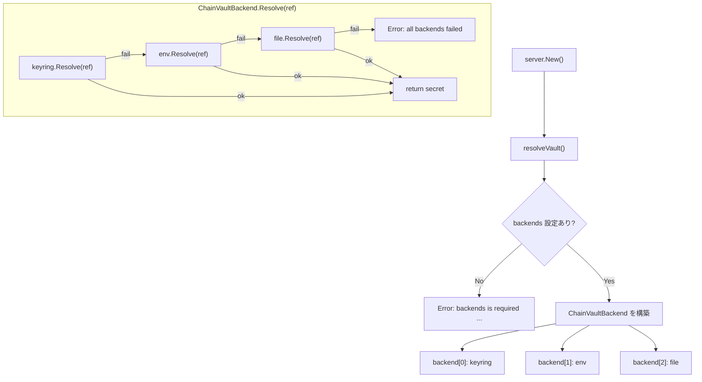

# 000: Vault バックエンド解決をChain of Responsibility方式に改修

## 背景 (Background)

### 問題の概要

`tern-server` で `vault://` URI を使用してシークレット（APIキー）を管理する際、設定ファイル (`tern-config.yaml`) の `vault.backend` で単一のバックエンドを指定する現在の設計に以下の問題がある:

1. **暗黙のフォールバック**: `vault:` セクション未設定時に `EnvVaultBackend` へ無言でフォールバックし、ユーザーに通知がない
2. **`file` バックエンド未実装**: `config.VaultConfig` は `"env"`, `"file"`, `"keyring"` をサポートするが、[resolveVault()](file:///c:/Users/yamya/myprog/arctic-tern/work/fix-auth-failure/server/server.go#L329-L341) では `"keyring"` しか明示ハンドルされない
3. **設計上の違和感**: `secret: "vault://providers/openai/default"` で「vault参照である」ことは宣言済みなのに、取得先を別パラメータ（`backend`）で1つだけ固定指定するのが不自然

### 実際に発生した障害

- `vault.backend` 未指定の状態でサーバーを起動
- `EnvVaultBackend` が暗黙的に選択され、環境変数 `TERN_VAULT_OPENAI_DEFAULT` を探すが未設定
- `codex.exe` が `exit status 1` で即座に終了（`401 Unauthorized`）
- `vault.backend: keyring` を明示的に指定したところ正常に解決された

### 対策方針

単一の `backend` を `backends` リスト（順序付き、必須）に変更し、Chain of Responsibility 方式でシークレットを解決する。

## 要件 (Requirements)

### 必須要件

#### R1: `vault.backends` リストの導入

- 既存の `vault.backend`（単数）を廃止し、`vault.backends`（複数形、リスト型）に置き換える
- リストの順序が解決の優先順位を決定する
- リストに含まれるバックエンドのみが有効化される

```yaml
# 本番環境: keyringのみ、環境変数やファイルは一切参照しない
vault:
  backends: [keyring]

# 開発環境: keyring優先、なければ環境変数を試す
vault:
  backends: [keyring, env]

# ファイルベース: ファイルから読み、なければ環境変数
vault:
  backends: [file, env]
  file_path: ./secrets.json
```

#### R2: `backends` の必須化とバリデーション

- `backends` は必須パラメータとする。未設定または空リストの場合、サーバー起動時にエラーを返す
- エラーメッセージは、ユーザーが問題を即座に解決できるよう具体的な設定例を含める

**エラーメッセージ例:**

```
tern: vault.backends is required but not configured.

Add a 'backends' list to the vault section of your config file to specify
which secret backends to use and in what order they should be tried.

Example configurations:

  # Use OS keyring (recommended for desktop environments)
  vault:
    backends: [keyring]

  # Use OS keyring first, fall back to environment variables
  vault:
    backends: [keyring, env]

  # Use encrypted file backend
  vault:
    backends: [file]
    file_path: /path/to/secrets.json

Supported backends: keyring, env, file
```

#### R3: 個別バックエンドのバリデーション

- リスト内の各バックエンド名が有効であることを検証する
- 不明なバックエンド名が含まれる場合、エラーを返す

**エラーメッセージ例:**

```
tern: unsupported vault backend "aws" in vault.backends.

Supported backends: keyring, env, file

Check your config file for typos in the vault.backends list.
```

- `file` バックエンドが指定されているのに `file_path` が未設定の場合、エラーを返す

**エラーメッセージ例:**

```
tern: vault backend "file" requires vault.file_path to be set.

Example:
  vault:
    backends: [file]
    file_path: /path/to/secrets.json
```

#### R4: Chain of Responsibility による解決

- `vault://` 参照の解決時、`backends` リストの順序に従い各バックエンドを順番に試行する
- あるバックエンドで解決に失敗した場合、次のバックエンドを試す
- 全てのバックエンドで失敗した場合にのみエラーを返す
- エラーメッセージには、どのバックエンドを試行し、それぞれ何故失敗したかを含める

**エラーメッセージ例:**

```
tern: failed to resolve vault reference "vault://providers/openai/default".

Tried 2 backends in order:
  1. keyring: key not found in keyring: providers/openai/default
  2. env: environment variable TERN_VAULT_OPENAI_DEFAULT not set

To fix this, store the secret using one of the configured backends:
  - keyring: tern-vault set providers/openai/default
  - env: export TERN_VAULT_OPENAI_DEFAULT="your-api-key"
```

#### R5: 旧 `backend` パラメータの後方互換

- 旧来の `vault.backend`（単数形）が設定されている場合、エラーを返してマイグレーションを促す
- 暗黙の変換は行わない（明示的なエラーにより、ユーザーが意図的に設定を更新する）

**エラーメッセージ例:**

```
tern: vault.backend (singular) is no longer supported. Use vault.backends (plural) instead.

Migration example:
  # Before
  vault:
    backend: keyring

  # After
  vault:
    backends: [keyring]
```

### 任意要件

#### R6: 解決結果のデバッグログ

- vault参照が正常に解決された場合、DEBUGレベルのログにどのバックエンドで解決されたかを出力する
- 例: `vault ref resolved: vault://providers/openai/default via keyring (tried: 1/2 backends)`

## 実現方針 (Implementation Approach)

### アーキテクチャ概要



### 変更対象ファイル

#### 1. `shared/libs/go/config/config.go` -- `VaultConfig` 構造体の修正

```go
type VaultConfig struct {
    // Backend is the old singular backend field (deprecated).
    Backend string `yaml:"backend,omitempty"`

    // Backends is the ordered list of vault backends to try.
    // Required. Supported values: "keyring", "env", "file".
    Backends []string `yaml:"backends"`

    // FilePath is the file path for FileVaultBackend.
    FilePath string `yaml:"file_path,omitempty"`

    // AESEnabled enables AES encryption for FileVaultBackend.
    AESEnabled bool `yaml:"aes_enabled,omitempty"`
}
```

#### 2. `shared/libs/go/vault/chain_backend.go` -- 新規: ChainVaultBackend

- `VaultStore` インターフェースを実装する新しい型
- 複数のバックエンドを保持し、`Resolve()` 時に順番に試行する
- `Set()`, `Delete()`, `List()` は最初のバックエンドに対してのみ実行する

#### 3. `server/server.go` -- `resolveVault()` の改修

- `backends` リストのバリデーション
- 各バックエンドの構築
- `ChainVaultBackend` の返却
- 旧 `backend` フィールドの検出とエラー

#### 4. `server/server_test.go` -- テスト追加

- `backends` 未設定時のエラーメッセージ検証
- 不明バックエンド名のエラー検証
- 旧 `backend` 使用時のマイグレーションエラー検証
- Chain of Responsibility 解決の正常系/異常系

## 検証シナリオ (Verification Scenarios)

### シナリオ1: `backends` 未設定でサーバー起動

1. `vault:` セクションに `backends` を含めない設定ファイルを作成
2. `tern` サーバーを起動
3. 起動失敗し、設定例を含むエラーメッセージが表示されることを確認
4. エラーメッセージに `keyring`, `env`, `file` の設定例が含まれることを確認

### シナリオ2: Chain 解決（keyring優先、envフォールバック）

1. `vault.backends: [keyring, env]` を設定
2. keyringにはキーを登録しないが、環境変数 `TERN_VAULT_OPENAI_DEFAULT` を設定
3. `vault://providers/openai/default` の解決が成功することを確認
4. DEBUGログに `via env (tried: 2/2 backends)` が出力されることを確認

### シナリオ3: 全バックエンド失敗

1. `vault.backends: [keyring, env]` を設定
2. keyringにもenvにもキーを登録しない
3. エラーメッセージに各バックエンドの失敗理由と修復手順が含まれることを確認

### シナリオ4: 旧 `backend` パラメータ使用時のマイグレーション案内

1. `vault.backend: keyring`（単数形）を設定
2. 起動失敗し、`backends`（複数形）へのマイグレーション手順がエラーメッセージに含まれることを確認

### シナリオ5: 不明なバックエンド名

1. `vault.backends: [keyring, redis]` を設定
2. 起動失敗し、`"redis"` が不明であること、サポート対象一覧が表示されることを確認

## テスト項目 (Testing for the Requirements)

### 単体テスト

| テスト名 | 内容 | 対応要件 |
|---|---|---|
| `TestResolveVault_BackendsRequired` | `backends` 未設定でエラー + メッセージに設定例 | R2 |
| `TestResolveVault_BackendsEmpty` | 空リストでエラー + メッセージに設定例 | R2 |
| `TestResolveVault_UnsupportedBackend` | 不明バックエンド名でエラー + サポート一覧 | R3 |
| `TestResolveVault_FileMissingPath` | `file` 指定で `file_path` 未設定時エラー | R3 |
| `TestResolveVault_OldBackendField` | 旧 `backend` 使用でマイグレーションエラー | R5 |
| `TestChainVaultBackend_FirstSuccess` | 最初のバックエンドで成功 | R4 |
| `TestChainVaultBackend_Fallback` | 1番目失敗、2番目で成功 | R4 |
| `TestChainVaultBackend_AllFail` | 全バックエンド失敗でエラー + 詳細 | R4 |
| `TestChainVaultBackend_Set` | Set()は最初のバックエンドのみ | R4 |

### ビルド・テスト実行コマンド

```bash
# 全体ビルドと単体テスト
./scripts/process/build.sh

# サーバーパッケージのテストのみ
go test -v ./server/...

# vaultパッケージのテストのみ
go test -v ./shared/libs/go/vault/...
```

### 統合テスト

```bash
# サーバー起動に関連するテスト
./scripts/process/integration_test.sh --categories common

# vault解決がLLMリクエストに影響しないことを確認
./scripts/process/integration_test.sh --categories llm
```
