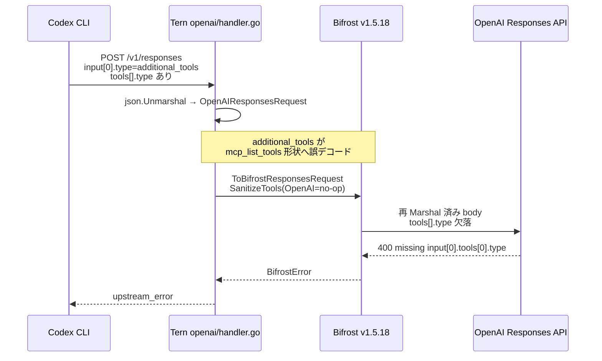
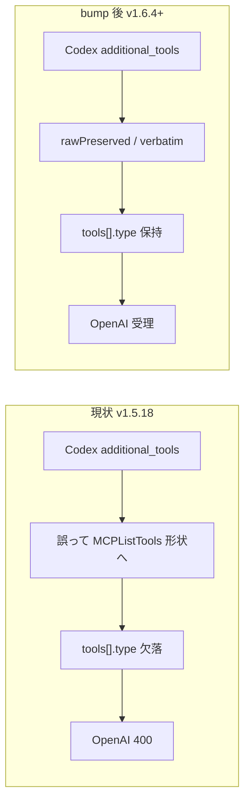

# 000 - Codex Responses `additional_tools` 型欠落修正（Bifrost bump）

GitHub Issue: [axsh/arctic-tern#33](https://github.com/axsh/arctic-tern/issues/33)

関連上流: [maximhq/bifrost#5100](https://github.com/maximhq/bifrost/issues/5100) / [PR #5103](https://github.com/maximhq/bifrost/pull/5103)（core `v1.6.4` 以降）

---

## 背景 (Background)

arctic-tern **v0.1.8**（依存 Bifrost **core v1.5.18**）において、Codex を Responses wire（`POST /v1/responses`）経由で実行すると、ターン開始直後に上流 OpenAI が次のエラーで拒否する。

```text
Missing required parameter: 'input[0].tools[0].type'
```

Tern ゲートウェイはこれを `api_error` / `code=upstream_error` として表面化し、コーディングエージェントのターンが即失敗する。

### 環境 (Environment)

| 項目 | 値 |
|------|-----|
| arctic-tern | v0.1.8（本ブランチ基準） |
| Bifrost | `github.com/maximhq/bifrost/core v1.5.18` |
| Coding agent | Codex（`wire_api` 既定 `responses`） |
| 観測モデル例 | `gpt-5.6-terra` 等の code-mode / Responses-Lite 系 |
| 経路 | Tern LLM Gateway → Bifrost OpenAI Responses handler |

### 期待動作 (Expected)

- Codex ターンが進行する
- Responses リクエスト内の tool 定義（特に `input[].tools[].type`）が OpenAI に正しく届く
- または、不正なツール定義は上流呼び出し前に Tern / Bifrost 側で正規化・拒否され、意味のあるエラーになる

### 実際の動作 (Actual)

- `SendText` 直後に失敗
- ゲートウェイエラー envelope:

```json
{
  "error": {
    "type": "api_error",
    "message": "Missing required parameter: 'input[0].tools[0].type'.",
    "code": "upstream_error"
  }
}
```

### 根本原因 (Root Cause)

机上調査および上流 Bifrost Issue #5100 により、次が確定している。

1. Codex は一部モデル（例: `gpt-5.6-sol` / `gpt-5.6-terra` 系統）で、トップレベル `tools: []` のまま、`input` 配列に **`type: "additional_tools"`** のアイテムを送る。
2. ネストされた各 tool は inbound 時点では `type`（`custom` / `function` / `namespace` 等）を持つ。
3. Bifrost `v1.5.18` の `ResponsesMessage` は **`additional_tools` をモデル化・verbatim 保持しない**。
4. ネスト `tools` が既存の `mcp_list_tools` 形状（`ResponsesMCPTool`、**`type` フィールド無し**）へ誤デコードされ、再シリアライズ時に `type` が欠落する。
5. OpenAI が `input[0].tools[0].type` 欠落で 400 を返す。



### Issue 記載の SanitizeTools 仮説について

Issue #33 は `SanitizeToolsForProvider` が OpenAI で early return することを指摘している。これは事実だが、**本件のエラーパス（`input[0].tools[...]`）の直接原因ではない**。

| 観点 | SanitizeTools（OpenAI skip） | 本件の真因 |
|------|------------------------------|------------|
| 対象 | トップレベル `Params.Tools` | `input[]` 内の `additional_tools` |
| 目的 | 非 OpenAI 向けに `namespace` 等を除去 | round-trip で nested `type` を保持 |
| OpenAI 経路 | no-op | 型落ちが発生 |

したがって本仕様の本命は **Bifrost を `additional_tools` 修正済みバージョンへ bump** することであり、OpenAI 向け sanitize 拡張は必須としない。

### 上流修正の状況

| 項目 | 内容 |
|------|------|
| Bifrost Issue | [#5100](https://github.com/maximhq/bifrost/issues/5100)（CLOSED） |
| 修正 PR | [#5103](https://github.com/maximhq/bifrost/pull/5103) — `additional_tools` を verbatim 保持 |
| 取り込みバージョン | Bifrost core **`v1.6.4` 以降** |
| Tern 現状 | **`v1.5.18` 固定**（未修正） |

---

## 要件 (Requirements)

### 必須要件

| # | 要件 |
|---|------|
| R1 | `go.mod` / `go.sum` の `github.com/maximhq/bifrost/core` を、**`additional_tools` 保持修正を含むバージョン**へ更新すること。**下限は `v1.6.4`**。実装時点でビルド・既存テストが通る範囲で、可能な限り新しい stable core を選ぶこと |
| R2 | Bifrost bump 後、Tern の LLM Gateway（OpenAI / Anthropic / Gemini 等の既存 Bifrost SDK 利用箇所）が **コンパイル可能**であること。破壊的 API 変更がある場合は Tern 側を最小差分で追随すること |
| R3 | Codex → Tern `/v1/responses` → Bifrost → OpenAI 経路で、`additional_tools` 入力アイテム内の **`tools[].type` が欠落しない**こと（upstream が当該 missing parameter で拒否しないこと） |
| R4 | `SanitizeToolsForProvider` の OpenAI early return を「本件の主修正」として変更しないこと。本件は Bifrost bump で解消する。OpenAI 向け sanitize 追加は **任意要件** に限定する |
| R5 | Tern 側で `additional_tools` を独自 raw 保持して Bifrost 変換を迂回する実装は、**本仕様の必須範囲に含めない**（上流修正を採用する） |
| R6 | `additional_tools` の round-trip（Unmarshal → Bifrost 変換 → 再 Marshal）で nested `type` が残ることを、**実 OpenAI 呼び出しなしの単体／テーブルテスト**で検証すること |
| R7 | 既存の LLM Gateway / Codex 関連の単体テストおよび統合テストが **退行しない**こと（`build.sh` 成功、指定統合テスト成功） |
| R8 | Issue #33 の再現シナリオと同等の **実 OpenAI 呼び出し（ライブ）** で、当該 `upstream_error`（`Missing required parameter: 'input[0].tools[0].type'`）が **発生しない**こと。検証は自動テストとし、**キー未登録での Skip による受け入れ完了は不可** |
| R9 | `tests/` にライブ統合テスト（例: `TestLLMGateway_Responses_AdditionalTools_LiveOpenAI`）を追加し、Tern `POST /v1/responses` にシナリオ C 相当の `additional_tools` fixture を送り、上流応答に当該 missing-parameter / `upstream_error` が **含まれない**ことを assert すること。OpenAI キーが無い場合は **Fail**（登録手順をメッセージに含める）。Skip でパス扱いにしない |

### 任意要件

| # | 要件 |
|---|------|
| O1 | Bifrost bump に伴う changelog / 破壊的変更を洗い出し、Tern 側で影響のある API（Responses / Chat / stream chunk 型等）をドキュメント化すること |
| O2 | OpenAI 経路でも不正・空の `type` を持つトップレベル tools をゲートウェイ側で拒否または正規化する防御的 sanitize（本件とは別レイヤの hardening） |
| O3 | `model_profiles` のデモ／example に `gpt-5.6-*` 系（`mode: responses`）の記載を追加し、code-mode モデル利用時の注意を短く記載すること |
| O4 | Bifrost を最新 core（調査時点例: `v1.7.x`）まで上げ、他の Codex 関連修正（tool_search round-trip 等）もまとめて取り込むこと |
| O5 | シナリオ A（Codex `CreateSession` + `SendText`）までライブで実行し、code-mode モデル実機でも同エラーが無いことを追加確認すること |

### 非目標 (Non-Goals)

- Codex CLI 自体のパッチや、`additional_tools` を送らないよう Codex 設定で回避することだけを恒久対策とすること
- Tern 独自の Responses プロトコル再実装（Bifrost 置換）
- `SanitizeToolsForProvider` を OpenAI でも走らせることによる「見かけ上の」本件修正
- Bifrost HTTP サーバ（transports）の導入。Tern は **Go SDK（core）埋め込み**のままとする

---

## 実現方針 (Implementation Approach)

### 方針概要

**Primary**: Bifrost core を `v1.6.4` 以上へ bump し、上流 PR #5103 の `additional_tools` verbatim 保持を取り込む。  
**Secondary**: Tern 側に回帰テストを追加し、再発と bump 副作用を検知する。  
**Reject as primary**: Tern 内 raw バイパス / OpenAI sanitize 拡張のみでの修正。



### 設計上の決定事項

| 決定 | 内容 | 理由 |
|------|------|------|
| D1 | 主修正は Bifrost bump | 真因が Bifrost スキーマ欠落であり、上流に修正済み |
| D2 | 下限バージョンは `v1.6.4` | changelog / #5100 close で `additional_tools` サポートが明記 |
| D3 | 目標バージョンは「下限以上かつ Tern が通る最新 stable」 | 追加の Codex / Responses 修正も取り込める。ただし API 破壊が大きい場合は `v1.6.4` 近傍で打ち切ってよい |
| D4 | Tern 独自 raw 保持は必須にしない | Bifrost と二重実装になり保守コストが高い |
| D5 | `SanitizeTools` の OpenAI skip は維持 | 本件と無関係。非 OpenAI 互換用の既存意図を壊さない |
| D6 | round-trip（オフライン）と **ライブ OpenAI 呼び出しの両方を必須ゲート**とする。キー未登録での Skip による受け入れ完了は不可 | 再発防止と実経路の確認を両立する |

### 実装ステップ（概要）

1. **バージョン選定**
   - `go get github.com/maximhq/bifrost/core@v1.6.4`（またはそれ以降の候補）を試し、コンパイルエラーを列挙
   - 通る最新を採用。通らない場合は差分を最小修正で吸収するか、一段下のタグへ後退
2. **Tern 追随修正**
   - `shared/libs/go/llmgateway/**`（`bifrost_driver.go`, `openai/handler.go`, `anthropic/**`, schemas 利用箇所）の型・メソッド差分を吸収
   - 挙動変更が必要な場合のみ限定的に直す（本件スコープ外のリファクタは行わない）
3. **回帰テスト追加**
   - `additional_tools` を含む最小 JSON を Unmarshal → `ToBifrostResponsesRequest` → `ToOpenAIResponsesRequest`（または同等の再 Marshal）し、`input[0].tools[i].type` が残ることを assert
   - 可能なら Tern handler を httptesttest でモック Bifrost なし／または schema 層のみで検証
4. **検証**
   - `./scripts/process/build.sh`
   - 下記 Testing 節の `integration_test.sh`
   - キーがある環境では Issue 再現手順でスモーク

### 影響範囲

| 領域 | 影響 |
|------|------|
| `go.mod` / `go.sum` | Bifrost core バージョン更新 |
| `shared/libs/go/llmgateway/**` | API 差分吸収の可能性 |
| Codex adapter | 原則変更不要（gateway 経由の修正） |
| `tool_sanitize.go` | 必須変更なし |
| テスト | round-trip / gateway / Codex E2E の追加・更新 |

### リスクと緩和

| リスク | 緩和 |
|--------|------|
| Bifrost minor/major bump による破壊的 API | コンパイルと既存 llmgateway テストで早期検知。必要なら `v1.6.4` ピン |
| 他プロバイダ経路の挙動変化 | Anthropic / Gemini / Ollama の既存テストを実行 |
| `additional_tools` 以外の未修正 Codex 問題が残る | Issue #33 の exact エラー解消を受け入れ基準とし、別問題は別 Issue / 仕様へ切り出す |
| live E2E がキー・モデル依存 | R6 のオフライン round-trip を必須ゲートにする |

---

## 検証シナリオ (Verification Scenarios)

Issue #33 および調査で確定した手順を、要約せず転記・具体化する。

### シナリオ A: Issue #33 Steps to reproduce（E2E・修正後は成功すること）

1. Start a Tern server with OpenAI credentials and a `model_profiles` entry for an OpenAI model that Codex will use on the Responses wire（code-mode / `additional_tools` を送るモデル。例: `gpt-5.6-terra`）。
2. Create a Codex session via the agent client/API（`CreateSession` with `agent=codex`, a valid workdir）。
3. Call `SendText` with a minimal prompt（for example: reply with exactly one word）。
4. Observe the SSE / event stream。

**修正前の Actual**: ターンが即座に失敗し、system/thinking 等に gateway error JSON（`Missing required parameter: 'input[0].tools[0].type'` / `upstream_error`）が含まれる。  
**修正後の Expected**: 当該 `upstream_error` で即死しない。ターンが進行する（モデル応答または後続イベントが流れる）。

### シナリオ B: Bifrost #5100 相当の Codex CLI 直接再現（gateway 経由）

```shell
codex exec --ephemeral --skip-git-repo-check -m gpt-5.6-terra "Reply exactly with OK."
```

前提: Codex の `model_providers.gateway` が Tern の `/v1` を指し、`wire_api = "responses"`。

**修正後 Expected**: HTTP 400（当該 missing parameter）で失敗しない。応答に `OK` 相当が得られる、または少なくとも tool type 欠落エラーではない。

### シナリオ C: `/v1/responses` への合成リクエスト（gateway 単体）

Tern の OpenAI Responses エンドポイントへ、次の構造を持つ JSON を POST する（認証・model は環境に合わせる）。

```json
{
  "model": "<responses-mode-openai-model>",
  "stream": true,
  "tools": [],
  "input": [
    {
      "type": "additional_tools",
      "role": "developer",
      "tools": [
        { "type": "custom", "name": "example_custom" },
        {
          "type": "function",
          "name": "example_fn",
          "description": "example",
          "parameters": {
            "type": "object",
            "properties": { "q": { "type": "string" } },
            "required": ["q"],
            "additionalProperties": false
          }
        },
        {
          "type": "namespace",
          "name": "example_ns",
          "description": "ns",
          "tools": [
            {
              "type": "function",
              "name": "child",
              "description": "child fn",
              "parameters": {
                "type": "object",
                "properties": {},
                "additionalProperties": false
              }
            }
          ]
        }
      ]
    },
    {
      "type": "message",
      "role": "user",
      "content": "Reply exactly with OK."
    }
  ]
}
```

**修正前**: 上流が `input[0].tools[0].type` 欠落で 400。  
**修正後**: 当該エラーで拒否されない（モデル側の別バリデーションは別問題として切り分け可）。

### シナリオ D: 対照実験（Bifrost バイパス）

同一 Codex / 同一モデル / 同一 catalog で、Bifrost を通さない OpenAI 互換ゲート（または OpenAI 直）では成功する（Bifrost #5100 control test）。本修正後の Tern+Bifrost 経路もこれに近づくこと。

### シナリオ E: 非 code-mode モデルの非退行

`gpt-5.3-codex` や `gpt-4o` 等、`additional_tools` を送らない（または送っても問題化しない）モデルでの Codex / Chat / Responses 既存利用が、bump 後も動作すること。

### シナリオ F: Trace による差分確認（調査・受け入れ補助）

1. Tern ログを Trace 相当にし、`openai responses request body`（inbound）を取得する。
2. 可能なら Bifrost / 上流へ送る直前の body も取得する（デバッグ手段がある場合）。
3. inbound では `input[].tools[].type` が存在し、転送 body でも欠落していないことを確認する。

---

## テスト項目 (Testing)

手動確認のみの計画は禁止。以下の自動テストを実装・実行する。

### 単体テスト（`build.sh` で実行）

| テスト配置（例） | テスト名（例） | 検証内容 |
|------------------|---------------|---------|
| `shared/libs/go/llmgateway/openai/` または `llmgateway/` 配下の新テスト | `TestResponsesAdditionalTools_RoundTripPreservesNestedType` | シナリオ C 相当 JSON を Unmarshal → Bifrost 変換 → 再 Marshal し、`input` 内 tools の `type` が保持される |
| 同上 | `TestResponsesAdditionalTools_NamespaceChildTypePreserved` | namespace 配下の function `type` も保持 |
| 既存 `llmgateway` / `anthropic` / `openai` パッケージテスト | （既存） | Bifrost bump 後も PASS |
| 既存 `tool_sanitize` 関連があれば | （既存） | OpenAI skip 挙動が意図どおり残る |

**ビルドコマンド:**

```bash
./scripts/process/build.sh
```

（Linux / Remote-SSH Linux の場合は `./scripts/process/build.sh --skip-etc`）

### 統合テスト（`integration_test.sh` で実行）

| テスト名（例） | カテゴリ | 検証内容 |
|---------------|----------|---------|
| `TestLLMGateway_Responses_AdditionalTools_RoundTrip`（新規・キー不要） | `llm` | schema / Bifrost 層で type 保持 |
| `TestLLMGateway_Responses_AdditionalTools_LiveOpenAI`（新規・**必須ライブ**） | `llm` | 実 OpenAI へ `/v1/responses` を送り、当該 missing-parameter / `upstream_error` が無いこと |
| `TestLLMGateway`（既存群） | `llm` | LLM gateway 非退行 |
| `TestCodexE2E`（既存群のうち Responses を使うもの） | `llm` | Codex E2E 非退行 |

**統合テスト実行コマンド:**

```bash
./scripts/process/build.sh

./scripts/process/integration_test.sh --categories llm --specify "TestLLMGateway"

./scripts/process/integration_test.sh --categories llm --specify "TestCodexE2E"

./scripts/process/integration_test.sh --categories llm --specify "AdditionalTools"
```

新規テスト名が上記 filter にマッチするよう命名すること。`AdditionalTools` で RoundTrip と **LiveOpenAI** の両方が実行されること。Live は OpenAI キー必須（未登録は Fail）。

共通カテゴリのスモーク（任意だが推奨）:

```bash
./scripts/process/integration_test.sh --categories common
```

### 受け入れ基準

- [ ] `go.mod` の Bifrost core が **`v1.6.4` 以上**である
- [ ] `./scripts/process/build.sh` が成功する
- [ ] `TestResponsesAdditionalTools_RoundTripPreservesNestedType`（または同等）が PASS し、nested `type` 欠落を検出できる
- [ ] `TestLLMGateway_Responses_AdditionalTools_LiveOpenAI` が **実 OpenAI 呼び出しで PASS**（Skip での受け入れ完了は不可）
- [ ] `./scripts/process/integration_test.sh --categories llm --specify "TestLLMGateway"` が PASS
- [ ] `./scripts/process/integration_test.sh --categories llm --specify "TestCodexE2E"` が（環境前提を満たす範囲で）PASS または従来どおり Skip
- [ ] Issue #33 の exact エラー（`input[0].tools[0].type` / `upstream_error`）がライブ経路で再発しない
- [ ] `SanitizeToolsForProvider` の OpenAI early return を本件の「修正」として無理に変更していない

---

## 参考リンク

- Issue: https://github.com/axsh/arctic-tern/issues/33
- Bifrost bug: https://github.com/maximhq/bifrost/issues/5100
- Bifrost fix PR: https://github.com/maximhq/bifrost/pull/5103
- Tern Responses handler: `file://shared/libs/go/llmgateway/openai/handler.go`
- Tern tool sanitize: `file://shared/libs/go/llmgateway/tool_sanitize.go`
- Codex wire 既定: `file://shared/libs/go/codingagent/codex/config.go`
