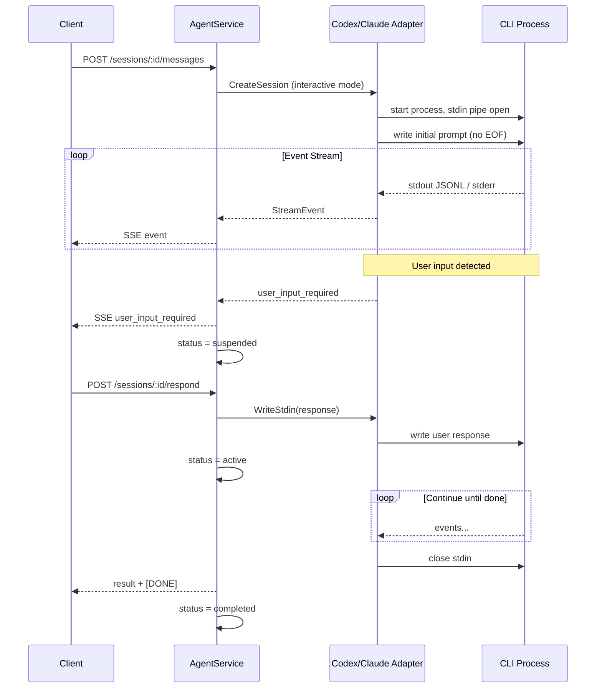

# 仕様書: Coding Agent インタラクティブ実行とユーザー入力要求イベント

## 背景 (Background)

### 現状の課題

Tern の Coding Agent 連携（Codex / Claude Code）は、**「1 メッセージ = 1 CLI サブプロセス起動・stdin 即 EOF」** という非対話・単発実行モデルで設計されている。一方、Codex CLI は実行中にユーザーへの確認・質問・追加入力を要求する対話的振る舞いをとることがあり、以下の問題が断続的に発生している。

1. **実行中の問い合わせ待ち**: エージェントがユーザーへの質問を出力した後、stdin からの応答を待ち続け、SSE ストリームが無イベントのまま停滞する。
2. **アーキテクチャのミスマッチ**: 初回プロンプト送信後に stdin を閉じるため、実行中プロセスへ応答を届ける経路がない。クライアントは `Terminate` による強制停止か、新プロセスでの `ResumeSession` 再送しか選択肢がない。
3. **状態表現の不足**: `SessionRecord` のステータスは `active` / `completed` / `error` / `closed` のみで、「ユーザー入力待ち」を表現できない。Wayfinder には `suspended` と `ask_user` があるが、Codex / Claude Code には同等の仕組みがない。
4. **クライアント実装負担**: 現状、イベントループを直接書く場合は全イベント型のデフォルト動作を自前定義する必要がある。`SendText` 等のユーティリティは `Output` / `Run` 程度にとどまり、ユーザー入力要求への対応を組み込みにくい。
5. **安全装置の欠如**: CLI プロセスに実行時間上限・無出力（idle）上限がなく、ハングが外部から検知しづらい。同一セッションへの並行 `SendMessage` も拒否されない。

### 関連する既存対策（本仕様のスコープ外・前提）

`fix-codex-stdin-blocking` ブランチで実施済みの対策（stdin 経由プロンプト渡し、承認バイパス、stderr ログ、1MB サイズ制限等）は**起動時・初回プロンプト渡し**の問題を主に解決する。本仕様は**実行中の対話要求**および**クライアント・サーバー間のインタラクティブ実行モデル**を対象とする。

### 目標

- Tern を「非対話・単発実行のみ」から、**対話的 Coding Agent 実行を第一級でサポートする**モデルへ拡張する。
- `user_input_required` イベントと `suspended` セッション状態を導入し、クライアントが待ち状態を構造的に扱えるようにする。
- クライアント SDK にコールバックベースのユーティリティを提供し、イベントループのボイラープレートを削減する。

---

## 要件 (Requirements)

### 必須要件

#### R1: `user_input_required` ストリームイベントの追加

- `codingagent.StreamEvent` に新イベント型 `user_input_required`（JSON: `"type": "user_input_required"`）を追加する。
- イベントに含めるフィールド（最低限）:
  - `content` (string): エージェントからの問い合わせテキスト
  - `prompt_id` (string, optional): 同一実行内で複数回の問い合わせを区別する ID
  - `choices` ([]string, optional): 選択肢が判明している場合の候補リスト
- クライアントライブラリ（`client/v1`）にも対応する `EventUserInputRequired` 定数とパース処理を追加する。

#### R2: セッションステータス `suspended` の追加

- `codingagent.SessionRecord`（および agentservice のセッションストア）に `suspended` ステータスを追加する。
- `user_input_required` イベントを送出した時点で、当該セッションのステータスを `suspended` に遷移する。
- `suspended` からの遷移:
  - ユーザー応答受信後の実行継続 → `active`
  - 正常完了 → `completed`
  - エラー・タイムアウト・Terminate → `error` または `closed`
- 終端ステータス（`completed`, `error`, `closed`）から `active` / `suspended` への逆遷移は既存ルールどおり禁止する。

#### R3: 実行中プロセスへのユーザー応答 API

- 新規エンドポイント `POST /api/v1/sessions/:id/respond` を追加する。
- リクエストボディ:
  ```json
  { "content": "ユーザーの回答テキスト" }
  ```
- 前提条件: セッションが `suspended` かつ実行中プロセスが生存していること。それ以外は `409 Conflict` を返す。
- 動作: 応答テキストを実行中 CLI プロセスの stdin に書き込み、stdout イベントストリームを再開する（SSE の場合は同一 HTTP 接続を維持するか、新規ストリーム接続方式のいずれかを実装方針で定義する。後述）。
- 応答後、セッションステータスを `active` に戻す。

#### R4: 双方向 stdin パイプ（インタラクティブ実行モード）

- Codex / Claude Code アダプターにおいて、初回プロンプト書き込み後も **stdin を即座に閉じない** インタラクティブ実行モードを実装する。
- インタラクティブモードでは:
  1. プロセス起動
  2. 初回プロンプトを stdin に書き込み（EOF は送信しない）
  3. stdout イベントをストリーム
  4. ユーザー入力要求を検出 → `user_input_required` 送出 + `suspended`
  5. `respond` API で追加入力を stdin に書き込み
  6. 3 に戻る、または完了・エラーで stdin を閉じてプロセス終了
- **後方互換**: `single_shot` モードを残し、従来どおり初回プロンプト後に stdin EOF を送る。設定またはリクエストフラグで選択可能とする。

#### R5: ユーザー入力要求の検出

以下のいずれか（複数併用可）で「ユーザー入力待ち」を検出し、`user_input_required` を送出する。

| 検出源 | 条件 | 対象 |
|--------|------|------|
| stderr パターン | `Reading additional input from stdin` 等の既知パターン | Codex 必須 |
| プロトコルイベント | Codex `event_msg` の未処理型、将来の `approval_request` 相当 | Codex |
| idle 検知との組み合わせ | 一定時間 stdout/stderr 無出力かつプロセス生存 | Codex / Claude Code |
| 明示的ツール | Wayfinder `ask_user` の `ErrFeedbackRequired` | Wayfinder（既存を新イベントに統合） |

- 検出時は問い合わせテキストを可能な限り `content` に設定する。判別不能な場合は汎用メッセージ（例: `"Agent is waiting for user input"`）とする。

#### R6: プロセス idle タイムアウト（ウォッチドッグ）

- 最後の stdout または stderr 出力から `idle_timeout_seconds` 経過してもプロセスが終了しない場合、プロセスを強制停止し `EventError` を送出する。
- デフォルト値: **300 秒**（5 分）。`model_profiles.yaml` の `coding_agents.<agent>.idle_timeout_seconds` で設定可能。
- エラーメッセージにタイムアウトである旨を明記する（例: `"agent idle timeout after 300s"`）。

#### R7: 最大実行時間（max execution timeout）

- プロセス起動から `max_execution_seconds` 経過した場合、強制停止して `EventError` を送出する。
- デフォルト値: **3600 秒**（1 時間）。`coding_agents.<agent>.max_execution_seconds` で設定可能。

#### R8: 同一セッションの並行 SendMessage 拒否

- セッションに実行中のエージェントプロセスがある場合（`active` または `suspended`）、新規 `POST /messages` は **409 Conflict** を返す。
- エラーレスポンスに現在のステータスと推奨操作（`respond` または `terminate`）を含める。
- `suspended` 状態では `respond` のみ受け付ける。

#### R9: クライアント SDK のコールバックベースユーティリティ

- `client/v1` にイベントハンドラ構造体を追加する:
  ```go
  type StreamHandlers struct {
      OnText                func(text string)
      OnToolUse             func(toolName string)
      OnToolResult          func(content string)
      OnUserInputRequired   func(ev UserInputRequiredEvent) (response string, err error)
      OnError               func(err string) error // non-nil でストリーム中断
      OnResult              func()
  }
  ```
- `Stream.RunWithHandlers(handlers StreamHandlers) error` を追加する。
- `Session.SendTextWithHandlers(ctx, message, handlers)` 等のショートカットを追加する。
- **デフォルト動作**（ハンドラ未設定時）:
  - `OnText`: 標準出力へ出力（`Output` 相当）
  - `OnToolUse` / `OnToolResult`: 無視（または debug ログ相当の無出力）
  - `OnUserInputRequired`: **エラーを返して中断**（明示的ハンドラなしでは対話を自動進行しない）
  - `OnError`: エラーを返して中断
  - `OnResult`: 何もしない
- `OnUserInputRequired` が応答文字列を返した場合、SDK が `respond` API を自動呼び出し、同一セッションのストリームを継続する（インタラクティブループ）。

#### R10: Wayfinder `ask_user` のイベント統合

- Wayfinder の `ask_user` ツール発火時、既存の `ErrFeedbackRequired` サスペンドに加え、クライアント向け SSE に `user_input_required` イベントを送出する。
- Wayfinder セッションも `suspended` ステータスを agentservice 経由でクライアントに可視化する（Wayfinder 内部の `StatusSuspended` との整合）。

### 任意要件

#### O1: `execution_mode` 設定

- `model_profiles.yaml` の `coding_agents.<agent>` に `execution_mode: interactive | single_shot` を追加する。
- デフォルト: Codex / Claude Code は `interactive`、既存テスト互換のため切り替え可能とする。

#### O2: 問い合わせテキストのヒューリスティック検出

- 最後に送出した `EventText` が疑問文パターン（`?` で終わる等）かつ idle 状態の場合に `user_input_required` を送出する。
- 誤検知リスクがあるため初期リリースでは **任意**。stderr / プロトコル検出を優先する。

#### O3: `choices` の構造化

- エージェントが選択肢を提示している場合、パースして `choices` フィールドに格納する。

---

## 実現方針 (Implementation Approach)

### アーキテクチャ概要



### 1. イベント型の拡張

**変更ファイル**:
- `shared/libs/go/codingagent/event.go`: `EventUserInputRequired` 定数追加
- `shared/libs/go/codingagent/codex/protocol.go`: 検出ロジック追加
- `shared/libs/go/codingagent/claudecode/protocol.go`: 同様（必要に応じて）
- `client/v1/stream.go`: パース・ハンドラ対応

**StreamEvent 拡張案**:
```go
type StreamEvent struct {
    Type      EventType              `json:"type"`
    Content   string                 `json:"content,omitempty"`
    PromptID  string                 `json:"prompt_id,omitempty"`
    Choices   []string               `json:"choices,omitempty"`
    // ... 既存フィールド
}
```

### 2. インタラクティブ ProcessManager

**Codex (`shared/libs/go/codingagent/codex/process.go`)**:
- `ProcessManager` に `stdinWriter io.WriteCloser` を保持
- `WriteStdin(text string) error` メソッドを追加
- `StartProcess` を `executionMode` 引数で分岐:
  - `interactive`: プロンプト書き込み後も `stdinWriter` を保持。検出ゴルーチンが idle / stderr を監視
  - `single_shot`: 現行動作（書き込み後 `Close`）
- `WaitForInput` チャネルまたはコールバックで agentservice に通知

**Claude Code (`shared/libs/go/codingagent/claudecode/process.go`)**:
- Codex と同様の stdin パイプ化（現状 `bytes.NewReader(nil)` を置き換え）
- `-p` フラグと stdin の併用仕様を CLI ヘルプで確認し、インタラクティブ時は stdin 追記方式を採用

### 3. AgentService ハンドラ拡張

**`shared/libs/go/agentservice/handler.go`**:
- `handleRespondMessage` を新設（`POST .../respond`）
- `handleSendMessage` に並行実行ガードを追加
- `streamSSE` / `respondSSE` で suspended → active → completed の状態遷移を管理

**SSE 継続方式（推奨）**:
- **方式 A（推奨）**: `respond` は別 HTTP リクエストだが、イベントストリームはセッション単位のバックグラウンドチャネルで継続し、元の SSE 接続が切れていても `GET /sessions/:id/events` で再接続可能にする。
- **方式 B（初期実装）**: `respond` 自体が `Accept: text/event-stream` を受け付け、応答後のイベントを新 SSE ストリームとして返す。クライアント SDK がループ内で自動再接続する。

初期実装は **方式 B**（実装コスト低）とし、将来方式 A に移行可能な設計とする。

### 4. 設定拡張

**`shared/libs/go/config/model_profiles.go`**:
```go
type AgentConfig struct {
    MaxPromptBytes       int    `yaml:"max_prompt_bytes"`
    MaxExecutionSeconds  int    `yaml:"max_execution_seconds"`
    IdleTimeoutSeconds   int    `yaml:"idle_timeout_seconds"`
    ExecutionMode        string `yaml:"execution_mode"` // "interactive" | "single_shot"
}
```

**`settings/example/model_profiles.yaml`**:
```yaml
coding_agents:
  codex:
    max_prompt_bytes: 1048576
    max_execution_seconds: 3600
    idle_timeout_seconds: 300
    execution_mode: interactive
  claudecode:
    max_execution_seconds: 3600
    idle_timeout_seconds: 300
    execution_mode: interactive
```

### 5. クライアント SDK 設計

**`client/v1/session.go`**:
```go
func (s *Session) Respond(ctx context.Context, content string) (*Stream, error)

func (s *Session) SendTextWithHandlers(ctx context.Context, message string, h StreamHandlers) error
```

**`RunWithHandlers` のインタラクティブループ（疑似コード）**:
```go
func (s *Stream) RunWithHandlers(h StreamHandlers) error {
    for {
        stream := s // 初回は SendMessage のストリーム
        for ev := range stream.events() {
            switch ev.Type {
            case EventUserInputRequired:
                if h.OnUserInputRequired == nil {
                    return fmt.Errorf("user input required but no handler configured")
                }
                answer, err := h.OnUserInputRequired(ev)
                if err != nil { return err }
                stream, err = s.session.Respond(ctx, answer)
                if err != nil { return err }
                goto nextStream
            // ... 他イベント
            }
        }
        return nil
    nextStream:
    }
}
```

### 6. 並行実行ガード

- `agentservice.Server` の `activeSessions` と `execCancels` を活用
- `handleSendMessage` 開始時: 既に `sessionID` が activeSessions に存在すれば 409
- `handleRespondMessage` 開始時: ステータスが `suspended` でなければ 409

### 7. Wayfinder 統合

- `shared/libs/go/wayfinder/agent_core.go` の `ask_user` 処理で `codingagent.StreamEvent{Type: EventUserInputRequired, ...}` を emit
- agentservice が Wayfinder セッションの場合も `suspended` を SessionRecord に反映

---

## 検証シナリオ (Verification Scenarios)

### シナリオ 1: Codex 実行中のユーザー入力待ち検出

1. `execution_mode: interactive` で Codex セッションを作成する。
2. 「実装方針を決める前にユーザーに確認を取ること」等、問い合わせを誘発しやすいプロンプトを `SendMessage` する。
3. SSE ストリームで `user_input_required` イベントを受信することを確認する。
4. 同時に `GET /sessions/:id` で `status` が `suspended` であることを確認する。
5. `POST /sessions/:id/respond` で回答を送信する。
6. 以降の SSE でエージェントの処理継続イベント（`text` / `tool_use` / `result`）を受信することを確認する。
7. 最終的に `status` が `completed` になることを確認する。

### シナリオ 2: クライアント SDK コールバックによる自動応答

1. `SendTextWithHandlers` で `OnUserInputRequired` に自動応答（例: `"はい、進めてください"`）を返すハンドラを設定する。
2. シナリオ 1 と同様のプロンプトを送信する。
3. クライアントコードが `respond` API を自前で呼ばなくても、ストリームが完了まで継続することを確認する。

### シナリオ 3: ハンドラ未設定時のフェイルファスト

1. `SendText`（既存 API）または `OnUserInputRequired` 未設定の `RunWithHandlers` でシナリオ 1 を実行する。
2. `user_input_required` 受信時に SDK がエラーを返して中断することを確認する。
3. セッションが `suspended` のまま残ることを確認する。
4. `Terminate` でセッションをクローズできることを確認する。

### シナリオ 4: idle タイムアウト

1. `idle_timeout_seconds: 10` に設定したテスト用 config でエージェントを起動する。
2. ユーザー入力待ちにより 10 秒以上無出力が続く状況を再現する（モックアダプターで代替可）。
3. `EventError`（idle timeout メッセージ付き）が送出されることを確認する。
4. セッション `status` が `error` になることを確認する。

### シナリオ 5: 並行 SendMessage 拒否

1. シナリオ 1 の手順 3 まで進め、`suspended` 状態にする。
2. 同一セッション ID に対して別の `POST /messages` を送信する。
3. HTTP 409 Conflict が返ることを確認する。
4. `POST /respond` は 200 で受け付けられることを確認する。

### シナリオ 6: single_shot モードの後方互換

1. `execution_mode: single_shot` でセッションを作成する。
2. 通常のタスク（ファイル作成等）を実行する。
3. 従来どおり初回プロンプト後に stdin EOF が送られ、正常完了することを確認する。
4. 既存 E2E テスト（`TestCodexE2E_*`, `TestE2E_*`）が single_shot 設定でリグレッションしないことを確認する。

### シナリオ 7: Wayfinder ask_user 統合

1. Wayfinder セッションで `ask_user` を発火させるプロンプトを送信する。
2. `user_input_required` イベントが送出されることを確認する。
3. `respond` で回答後、エージェントが再開することを確認する。

---

## テスト項目 (Testing for the Requirements)

### ビルド・全体検証

1. ビルド＋単体テスト:
   ```bash
   ./scripts/process/build.sh
   ```

2. ユニットテスト（新規・更新）:
   - `shared/libs/go/codingagent/event_test.go`: `EventUserInputRequired` の JSON シリアライズ
   - `shared/libs/go/codingagent/codex/process_test.go`: interactive / single_shot モード分岐
   - `shared/libs/go/agentservice/handler_test.go`: 並行 SendMessage 409、respond 正常系・異常系
   - `client/v1/stream_test.go`: `RunWithHandlers` の user_input_required ループ

3. 統合テスト（Codex / Claude Code E2E）:
   ```bash
   ./scripts/process/integration_test.sh --specify "TestCodexE2E|TestE2E_CodingAgent"
   ```
   - 既存 E2E が `single_shot` デフォルト（テスト config）でリグレッションしないこと

4. 統合テスト（新規インタラクティブ検証）:
   ```bash
   ./scripts/process/integration_test.sh --specify "TestInteractive"
   ```
   - `tests/interactive_agent_test.go`（新規）に以下を実装:
     - `TestInteractive_UserInputRequired_MockAdapter`: モック CodingAgent で suspended / respond フローを検証（CLI 非依存）
     - `TestInteractive_ConcurrentMessageRejected`: 409 検証
     - `TestInteractive_IdleTimeout_MockAdapter`: タイムアウト検証
     - `TestInteractive_ClientRunWithHandlers`: SDK コールバックループ検証

5. 統合テスト（Wayfinder、該当する場合）:
   ```bash
   ./scripts/process/integration_test.sh --specify "TestE2E_Wayfinder"
   ```

### 要件トレーサビリティ

| 要件 | 検証テスト |
|------|------------|
| R1: user_input_required イベント | `TestInteractive_UserInputRequired_MockAdapter`, E2E（手動確認なし） |
| R2: suspended ステータス | 同上 + `GET /sessions/:id` アサーション |
| R3: respond API | `TestInteractive_UserInputRequired_MockAdapter` |
| R4: 双方向 stdin | `TestCodexBuildArgs` / process テスト + モック stdin 書き込みテスト |
| R5: 入力要求検出 | モック stderr パターン注入テスト |
| R6: idle タイムアウト | `TestInteractive_IdleTimeout_MockAdapter` |
| R7: max execution タイムアウト | モックアダプターで短い `max_execution_seconds` テスト |
| R8: 並行 SendMessage 拒否 | `TestInteractive_ConcurrentMessageRejected` |
| R9: SDK コールバック | `TestInteractive_ClientRunWithHandlers` |
| R10: Wayfinder 統合 | `TestE2E_Wayfinder` 拡張または Wayfinder 単体テスト |
| O1: execution_mode | `TestInteractive_SingleShotRegression`（新規） |

### ログ検証ポイント

- サーバーログに `user input required detected` が出力されること
- `suspended` / `active` ステータス遷移が Debug ログに記録されること
- idle / max execution タイムアウト時にプロセス PID と経過時間がログに残ること

---

## 設計上の決定事項

| 項目 | 決定 | 理由 |
|------|------|------|
| 初期 SSE 継続方式 | 方式 B（respond が新 SSE を返す） | 実装コスト低。SDK がループで吸収 |
| デフォルト execution_mode | `interactive`（E2E は `single_shot` で明示） | 本仕様の目的は対話対応。テスト互換は config で担保 |
| OnUserInputRequired 未設定時 | エラーで中断 | 意図しない自動応答を防ぐ |
| suspended 中の操作 | `respond` と `terminate` のみ許可 | 状態機械を単純に保つ |

---

## 影響範囲

| コンポーネント | 変更種別 |
|----------------|----------|
| `shared/libs/go/codingagent/event.go` | イベント型追加 |
| `shared/libs/go/codingagent/codex/process.go` | インタラクティブ stdin |
| `shared/libs/go/codingagent/claudecode/process.go` | 同上 |
| `shared/libs/go/agentservice/handler.go` | respond API、並行ガード |
| `shared/libs/go/agentservice/service.go` | ルーティング追加 |
| `shared/libs/go/config/model_profiles.go` | AgentConfig 拡張 |
| `client/v1/stream.go`, `session.go` | ハンドラ・Respond |
| `features/ternctl/main.go` | 任意: `--auto-answer` フラグ |
| `settings/example/model_profiles.yaml` | 設定追加 |

---

## 非スコープ（本仕様では扱わない）

- `GET /sessions/:id/events` による SSE 再接続（方式 A）の実装
- 問い合わせテキストの高度な NLP 解析による誤検知ゼロ化
- GUI クライアントの実装（SDK を通じた利用を想定）
- Codex / Claude Code CLI 自体の挙動変更
