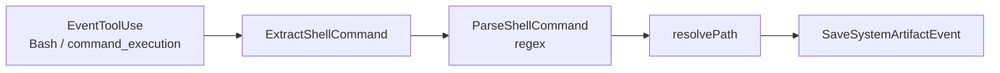
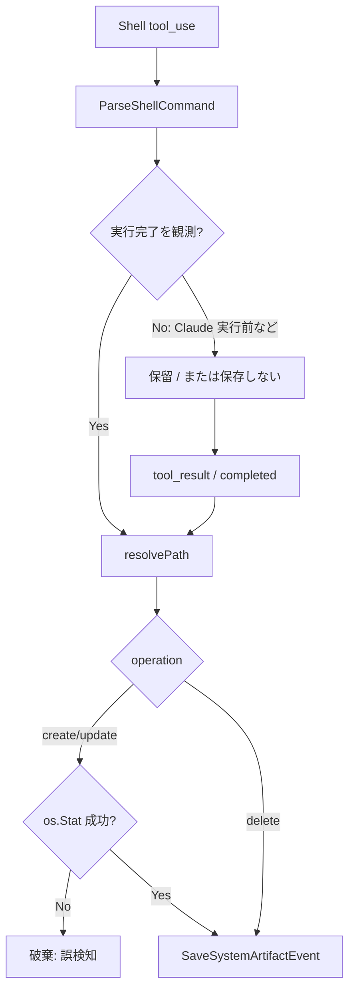

# 000: Tier2 shell_parser の存在確認ガード（誤検知抑制）

## 背景 (Background)

### 現状（実装確認結果）

System Artifact の Tier2（`shell_parser`）は、シェル系ツール（`command_execution` / `Bash` / `shell` / `shell_command`）のコマンド文字列から path + operation を推定する。

主要な実装箇所:

| 箇所 | 役割 |
| :--- | :--- |
| `shared/libs/go/artifact/analyzer/command_parser.go` | `ParseShellCommand` — 正規表現で `>` / `>>` / `tee` / `cp` / `mv` / `touch` / `rm` / PowerShell 等から path を抽出 |
| `shared/libs/go/artifact/analyzer/analyzer.go` | `analyzeShellTool` — 抽出結果を `buildEvent` → `SaveSystemArtifactEvent` |
| 同上 `resolvePath` | 相対 path を session workDir / projectRoot へ解決 |
| 同上 `isIgnoredArtifactPath` | `/dev/null` / `NUL` / `/dev/stdout` 等を除外（既実装） |

現行フロー（概念）:



すでに次の緩和はある。

- デバイスノード（`/dev/null` 等）の除外
- 引用符・末尾スラッシュの正規化（`normalizeShellPath`）

一方で、**抽出 path が実ファイルとして存在するかどうかの確認は無い**。

### 課題

`ParseShellCommand` は保守的ではあるが、コマンド文字列の一部を path と誤認することがある（例: 比較演算・リダイレクト風トークン・メッセージ中の `>` 近傍・フラグや非 path トークン）。

その結果:

1. **存在しない path が System Artifact（ファイル差分）として記録される**（誤検知）。
2. 利用者から見ると「触っていない／存在しないファイル」が差分一覧に混入する。
3. Tier2 はもともと推定であり、正規表現強化だけでは取りこぼしと誤検知の両方をゼロにするのは困難。**事後の実ファイル存在確認**が安価で実効的なゲートになる。

### 本仕様で決めること

1. Tier2（`shell_parser`）のみ、記録前に **解決済み path のファイルシステム存在確認**を入れること。
2. operation（create / update / delete）ごとの扱い。
3. Analyzer が `EventToolUse` を見るタイミング（特に Claude Code の Bash は実行前）との整合。
4. Tier1 / Tier3 への影響範囲（非対象の明示）。

### スコープ外

- Tier1（`structured_tool` / `file_change` / `turn_diff` / `Write` 等）への存在確認の適用。
- Tier3（`workdir_reconcile`）のロジック変更。
- `ParseShellCommand` の正規表現の全面書き換え（本仕様のガードと併用して、個別パターン改善は任意）。
- User Artifact API の変更。
- `file_change_collectors` のキー追加や既定値変更。

---

## 要件 (Requirements)

### 必須要件 (Must)

#### R1: Tier2 記録前に存在確認する

`shell_parser` 経路で System Artifact を保存する直前に、`resolvePath` 済みの絶対 path についてファイルシステム上の存在を確認すること。

- 確認手段は実装計画で固定する（推奨: `os.Stat` または `os.Lstat`）。
- **存在しない path は誤検知とみなし、System Artifact として保存しない**（サイレントに落とす。パニック禁止）。
- 本ゲートは **Tier2（`analyzeShellTool` 系）に限定**する。Tier1 / Tier3 には適用しない。

#### R2: operation 別の判定規則

| Operation | 存在確認の扱い | 理由 |
| :--- | :--- | :--- |
| `create` | **存在するときのみ記録** | 誤検知 path は通常ディスク上に無い。成功した作成・リダイレクト先は完了後に存在する |
| `update` | **存在するときのみ記録** | 同上。追記・上書き先が実在しないなら誤検知とみなす |
| `delete` | **「存在するときのみ記録」は適用しない** | 成功した `rm` の直後は path が消えている。存在必須にすると正当な delete が全て落ちる |

`delete` について本 Must で求めるのは次のいずれか（実装計画で一つに固定）:

- **D-A（推奨）**: `delete` は存在確認ゲートの対象外とし、現行どおり parser 結果を記録する（誤検知抑制の主対象は create/update）。
- **D-B**: `delete` は「親ディレクトリが存在する」等の弱い妥当性チェックのみ行う（path 自体の存在は要求しない）。

本仕様のユーザー要求（「存在しなければ出さない」）の主対象は create/update とする。

#### R3: 確認タイミングは「コマンド実行後のファイルシステム状態」であること

現行 Analyzer は `EventToolUse`（TaskLog Phase `send`）で同期的に動く。

| エージェント | shell イベントの実情 |
| :--- | :--- |
| Codex `command_execution` | `item.started` と `item.completed` の両方で `EventToolUse` を出しうる。完了時にも ToolUse を出すのは Analyzer 向け（コメント済み） |
| Claude Code `Bash` | assistant の `tool_use` 時点（**実行前**）に `EventToolUse` が来る |

したがって、単純に「今の `analyzeShellTool` の先頭で Stat」だけだと:

- Codex の `item.completed` では create/update の実ファイル確認が機能しやすい。
- Claude の実行前 `tool_use` では、これから作るファイルがまだ無く、**正当な create まで落ちる**（退行）。

**Must**: 存在確認は、シェルコマンドがファイルシステムに効果を与えた後の状態に対して行うこと。実装方針は次のいずれか（または同等）を実装計画で一つに固定する。

1. **遅延確定**: shell の path 推定結果を tool_use 時点では仮置きし、対応する `tool_result` / Codex `item.completed` 相当の後で Stat → 保存。
2. **完了イベントのみ記録**: shell_parser の保存を「実行完了が分かるイベント」に限定し、そこで Stat する（Codex は completed のみ、Claude は tool_result 連携）。

制約:

- 正当な create（例: `echo hi > new.txt`）が Claude / Codex の双方で記録され続けること（退行禁止）。
- 誤検知（ディスク上に無い path）は create/update として記録されないこと。

#### R4: パス解決との一貫性

存在確認に使う path は、Artifact に載せる `ActualPath` と同じ解決規則（現行 `resolvePath`）であること。

- 相対 path → session workDir（なければ projectRoot）。
- 絶対 path → Clean した絶対 path。
- Stat に失敗（権限不足等）した場合の扱いは実装計画で固定する。推奨: **記録しない**（誤検知抑制を優先。必要なら debug ログ）。

#### R5: 設定・API 互換

- `file_change_collectors.shell_parser` の意味・既定（ON）は変えない。
- 本ガードは `shell_parser: true` のときの品質改善であり、新しい collector キーは追加しない。
- `shell_parser: false` のときは現行どおり Tier2 保存なし（ゲート不要）。

#### R6: 観測可能性

存在確認で落とした場合、利用者向け API レスポンスを増やさない（沈黙してよい）。任意で debug/trace ログに「dropped non-existent path」を残してよい（Must ではないが推奨）。

### 任意要件 (Nice to have)

- 誤検知になりやすい正規表現パターンの追加除外（例: `2>&1` 以外の fd リダイレクト、明らかに非 path なトークン）。
- `delete` 用の弱い妥当性チェック（D-B）。
- 単体テスト用に `Stat` を差し替え可能にする（filesystem 抽象）。

---

## 実現方針 (Implementation Approach)

### 設計方針

1. **Parser は現状維持を基本**とし、品質ゲートを Analyzer 側（または shell 専用の post-filter）に置く。  
   理由: 誤検知の定義が「ディスク上に無い」であり、文字列だけでは判定不能なケースがある。
2. **ゲート適用箇所**は `ParseShellCommand` の戻りをイベント化する直前（現行なら `analyzeShellTool` 内、または遅延確定用の新関数）。
3. **create/update のみ** `pathExists(resolved) == true` を要求。`delete` は R2 の D-A を既定推奨。
4. **実行後確認**を満たすため、Claude Bash は tool_use → tool_result の相関（`tool_use_id` 等、既存 StreamEvent / TaskLog で取れる情報）を調べ、実装計画で配線する。情報が不足する場合は最小限のイベント拡張を許容する（破壊的 API 変更は避ける）。

### 想定変更ファイル（実装計画で確定）

| 領域 | 候補 |
| :--- | :--- |
| Analyzer | `analyzer.go`（`analyzeShellTool` / 遅延確定）、必要なら新規 `shell_existence.go` |
| Parser | 変更最小。テスト用ケース追加は可 |
| Codex プロトコル | completed のみ shell_parser 保存にする場合は `protocol.go` の started 抑止または Analyzer 側フラグ |
| 単体テスト | `analyzer_test.go` / `command_parser_test.go` |
| 統合 | Artifact / shell 由来の既存 E2E が退行しないことの確認 |

### 擬似フロー（採用イメージ）



### 退行させないケース（受け入れの核）

| ケース | 期待 |
| :--- | :--- |
| `echo hi > real.txt`（実行後 real.txt あり） | create として記録 |
| regex が拾った偽 path（ディスクに無い） | 記録しない |
| `echo x >> existing.log`（ファイルあり） | update として記録 |
| `rm gone.txt`（実行後無し） | delete として記録可能（D-A） |
| Tier1 Write で作った path | 本ゲートの影響なし |
| `shell_parser: false` | Tier2 記録なし（現行） |

---

## 検証シナリオ (Verification Scenarios)

1. workDir に実ファイルを作るシェルコマンド（`echo ... > actual.txt`）を Tier2 のみ有効（または structured_tool OFF）で流し、`actual.txt` が System Artifact に出る。
2. 意図的に「path っぽいが実在しない」トークンを含むコマンド（本番で観測した誤検知パターンがあればそれを優先。無ければ `echo hi > /definitely/not/exist_xyz_12345.txt` のように Stat が失敗する path）を流し、その path が Artifact 一覧に **出ない**。
3. 既存ファイルへの追記（`>>`）が update として残る。
4. `rm` による delete が、存在確認ゲート導入後も記録される（D-A 採用時）。
5. Claude Code の Bash で新規ファイル作成しても、実行完了後には Artifact に載る（実行前 Stat による取りこぼしが無い）。

---

## テスト項目 (Testing)

手動確認のみは不可。単体でゲートを固定し、既存の統合／E2E で退行を見る。

### 単体テスト（`./scripts/process/build.sh`）

| ID | 内容 |
| :--- | :--- |
| U1 | create/update: 解決先が存在する → イベント生成 |
| U2 | create/update: 解決先が存在しない → イベント無し |
| U3 | delete: 解決先が無くても（D-A）イベント生成できる |
| U4 | Tier1 経路に存在ゲートが掛かっていない |
| U5 | （遅延確定を採用する場合）tool_use だけでは create を確定保存せず、完了後に保存 |

### 統合テスト

```bash
./scripts/process/integration_test.sh --specify "FileChangeCollectors"
./scripts/process/integration_test.sh --specify "Artifact"
```

必要に応じて Codex / Claude の shell 由来 Artifact を見る既存 E2E も `--specify` で再実行する（例: turn_diff / tier / CodingAgent 系のうち shell 経由成果物を検証するもの）。新規で誤検知抑制専用の統合テストを足す場合は実装計画でテスト名を固定する。

### ビルド

```bash
./scripts/process/build.sh
```

（Windows / Git Bash 想定。Remote-SSH Linux の場合は `--skip-etc`。）
