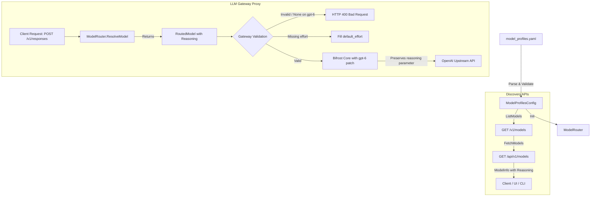

# 000: 推論モデル設定（Reasoning Model Configuration）

## 背景 (Background)

### OpenAI Responses API と GPT-6 Astra (`gpt-6-astra`) の仕様確認

公式ドキュメント（[OpenAI Reasoning Models Guide](https://developers.openai.com/api/docs/guides/reasoning?api-mode=responses)）の調査により、以下の仕様と制約が確認された：

1. **`gpt-6-astra` における reasoning パラメータの必須化**
   - 次世代の推論モデルである `gpt-6-astra` は Responses API において内部推論トークン（reasoning tokens）を活用して応答を生成する。
   - `gpt-6-astra` では reasoning パラメータの指定（`reasoning: { effort: ... }`）が前提となっている。
2. **`effort: "none"` の非サポートと実行時エラー (HTTP 400)**
   - ドキュメントには明示的に **「`gpt-6-astra` does not support `none` reasoning effort. Setting `reasoning.effort` (Responses) or `reasoning_effort` (Chat Completions) to `none` returns HTTP 400.」** と記載されている。
   - 推論を完全に無効化（`none`）することはできず、必ず有効な推論レベルを指定する必要がある。
3. **モデルごとの選択可能 effort の差異（サブセット）**
   - reasoning effort として定義されている全体セットは以下の7種類：
     - `none`, `minimal`, `low`, `medium`, `high`, `xhigh`, `max`
   - 各モデルがサポートする effort は全種類ではなく、モデル固有のサブセットとなる（例: `gpt-6-astra` は `none` を除外したサブセットをサポート）。
4. **モデルごとのデフォルト effort**
   - デフォルトの effort 値もモデル依存である（例: `gpt-5.5` の既定値は `medium`）。

### Bifrost Gateway（`maximhq/bifrost`）における重大な課題

Arctic Tern の LLM Gateway バックエンドとして利用している Bifrost（`v1.7.7`）の内部コード（`core/providers/openai/`）を調査した結果、`gpt-6-astra` に対応していないことによる重大な問題が判明した：

1. **`isOpenAIReasoningModel` による非推論モデル誤判定**
   - `core/providers/openai/utils.go` の `isOpenAIReasoningModel` は `o1`, `o3`, `o4`, `gpt-oss`, `gpt-5` のみを推論モデルと判定しており、`gpt-6` および `astra` は判定対象外（`false`）となっている。
2. **Bifrost による `reasoning` パラメータの自動破棄（HTTP 400 発生）**
   - `core/providers/openai/responses.go` (L345付近) にて、Bifrost は OpenAI モデルかつ `!isOpenAIReasoningModel` の場合、**`req.ResponsesParameters.Reasoning = nil` と強制消去**する処理を行っている。
   - このため、クライアントが正常に `reasoning: { effort: "low" }` を指定してリクエストを送信しても、Bifrost が推論パラメータを削除して OpenAI Upstream に転送してしまい、OpenAI Upstream が「推論パラメータ欠落」として HTTP 400 エラーを返却する。
3. **`xhigh` / `max` effort の強制ダウングレード**
   - `supportsOpenAIXHighReasoningEffort` および `supportsMaxReasoningEffort` も `gpt-5.x` までしか対応しておらず、`gpt-6-astra` に `xhigh` や `max` を指定すると Bifrost が強制的に `high` にダウングレードしてしまう。
4. **複数ターン会話における暗号化推論トークンの欠落**
   - 非推論モデルと判定されることで、過去ターンの `EncryptedContent`（暗号化された推論アイテム）が転送時に除外・スキップされる。
5. **フォーク先での Issue 開設と Upstream PR の存在**
   - 上記課題を解消するため、フォークリポジトリ（[axsh/bifrost](https://github.com/axsh/bifrost)）に Issue [axsh/bifrost#1](https://github.com/axsh/bifrost/issues/1) を開設した。
   - また、Upstream リポジトリ（maximhq/bifrost）においても同等の目的を持つ PR [[fix]: preserve GPT-6 Astra max reasoning effort (#6881)](https://github.com/maximhq/bifrost/pull/6881)（コミット `1ce7fb5`）が提出されていることが確認された。この PR では `acceptsMaxEffort`（または `supportsMaxReasoningEffort`）に `gpt-6-astra` を追加し、E2E テストで Upstream への推論パラメータ透過性を検証している。

### 現在の Arctic Tern の課題

1. **推論要件のメタデータ欠如**
   - 現在の `model_profiles.yaml` および Go の設定構造体（`ModelConfig` / `ModelBehavior`）には、モデルの推論機能（reasoning）に関するメタデータ（推論必須フラグ、利用可能な effort、デフォルト effort）が一切定義されていない。
2. **遅延検出によるエラーとトークン浪費**
   - クライアント（Codex CLI、Webview、外部クライアント）が `gpt-6-astra` に対して reasoning パラメータを省略したり `effort: "none"` を指定してリクエストを送信した場合、LLM Gateway を通過して OpenAI Upstream に到達した段階で初めて HTTP 400（Bad Request）エラーとして返却される。
   - 不要なネットワーク往復とレイテンシが発生し、クライアント側での自己修復も困難となる。
3. **クライアントでの動的選択・提示が不可能**
   - `GET /v1/models` や `GET /api/v1/models` のモデル一覧 API において、各モデルが reasoning を必要とするか、どの effort 選択肢を提供しているかが開示されていないため、UI や CLI がモデルに応じた適切な effort 選択ドロップダウンやバリデーションを提供できない。

### 本仕様の目的

- `model_profiles.yaml` の各モデル設定に「reasoning を必須とするかのフラグ（`required`）」および「選択可能な effort の種類（`supported_efforts`）」、「デフォルト effort（`default_effort`）」を指定可能にする。
- 設定読み込み時（`ModelProfilesConfig.Validate()`）に不正な effort や矛盾した設定（required かつ none 許可など）を検出する厳密なバリデーションを提供する。
- ルーティングレイヤ（`RoutedModel`）およびモデル情報取得 API（`GET /v1/models`, `GET /api/v1/models`）を通じて、内部ゲートウェイおよびクライアントへこのメタデータを透過的に公開する。
- Bifrost 側へのパッチ適用（[axsh/bifrost#1](https://github.com/axsh/bifrost/issues/1)）および `go.mod` での統合により、`gpt-6-astra` に対する推論パラメータが欠落せず Upstream へ正しく伝達される実行基盤を確立する。
- （発展）LLM Gateway において、クライアントが effort を省略した際の既定値補完や、未対応 effort に対する早期バリデーションを実現可能とする基盤を構築する。

---

## 用語 (Terminology)

| 用語 | 説明 |
| :--- | :--- |
| **Reasoning Model** | 応答生成前に内部推論トークン（思考プロセス）を消費して高品質な結果を出すモデル（GPT-6 Astra, GPT-5.5, o-series 等） |
| **Reasoning Effort** | モデルにどれだけ思考（計算リソース・トークン）を割くかを指示するチューニングパラメータ |
| **Effort レベル** | OpenAI で定義されている推論強度（`none`, `minimal`, `low`, `medium`, `high`, `xhigh`, `max`） |
| **`model_profiles.yaml`** | プロバイダ、API キー、モデル定義、振る舞い（Behavior）を一括管理するシステム設定ファイル |
| **`ModelBehavior`** | モデルごとの振る舞いオプション（ツールコール変換、構造化出力、最大トークン数など）を保持する構造体 |
| **`RoutedModel`** | リクエストされたモデル名からプロバイダ・キー・設定を解決したルーティング結果構造体 |
| **Bifrost Core** | Arctic Tern が LLM Upstream 連携に利用しているゲートウェイコア（`github.com/maximhq/bifrost/core`） |

---

## 要件 (Requirements)

### 必須要件 (Must)

#### R1: モデル設定への Reasoning 設定項目の追加

`model_profiles.yaml` の各モデル設定において、以下の項目を指定可能とする：

| 設定項目 | 型 | 必須 | 説明 | 例 |
| :--- | :--- | :--- | :--- | :--- |
| `required` | bool | 任意（既定: `false`） | 当該モデルで reasoning パラメータが必須かどうか | `true` |
| `supported_efforts` | list of string | 任意（`required: true` 時は必須） | 選択可能な effort 値の一覧 | `["low", "medium", "high", "xhigh", "max"]` |
| `default_effort` | string | 任意 | クライアントから effort が未指定の場合の既定値 | `"medium"` |

- 既存のモデル設定との完全な後方互換性を保つ（reasoning 設定が存在しないモデルは従来通り動作する）。
- 配置場所は、既存のモデル固有振る舞いを司る `behavior` 配下（`behavior.reasoning`）を標準とする。

#### R2: 設定ファイルの整合性バリデーション (`Validate()`)

`ModelProfilesConfig.Validate()` において、以下のルールに基づき設定を検証し、不正があれば起動時に即座にエラーとする：

1. **Effort 有効値チェック**:
   - `supported_efforts` および `default_effort` に指定できる文字列は、以下の既知の effort 値のみとする：
     - `"none"`, `"minimal"`, `"low"`, `"medium"`, `"high"`, `"xhigh"`, `"max"`
   - 未知の値（例: `"extreme"`, `"fast"` 等）が含まれる場合はエラー。
2. **必須モデルでの選択肢存在チェック**:
   - `required: true` の場合、`supported_efforts` は空であってはならず、1つ以上の effort が指定されていること。
3. **必須モデルでの `none` 禁止チェック（`gpt-6-astra` 制約の保証）**:
   - `required: true` の場合、`supported_efforts` に `"none"` を含めてはならない（推論必須モデルであるため）。含んでいる場合はエラー。
4. **既定値（`default_effort`）の整合性チェック**:
   - `default_effort` が指定されている場合、必ず `supported_efforts` の一覧に含まれていなければならない。
   - `required: true` の場合、`default_effort` の指定を必須とする（未指定によるフォールバック不能を防止）。
5. **重複チェック**:
   - `supported_efforts` 内に重複する要素（例: `["low", "medium", "low"]`）が存在しないこと。

#### R3: ルーティングレイヤへのメタデータ伝達 (`RoutedModel`)

- `shared/libs/go/llmgateway/handlerctx/context.go` の `RoutedModel` 構造体に `Reasoning *ModelReasoning`（または同等のフィールド群）を追加する。
- `ModelRouter.ResolveModel` において、解決されたモデルの `Behavior.Reasoning` を `RoutedModel` へコピーする。
- セッションキャッシュ（`sessionModels`）および LRU キャッシュにおいても、Reasoning メタデータが正確に保持・複製されること。

#### R4: モデル情報公開 API（`GET /v1/models`, `GET /api/v1/models`）への露出

- `shared/libs/go/llmgateway/backend.go` の `ModelInfo` 構造体、および `client/v1/models.go` の `ModelInfo` 構造体に `Reasoning *ModelReasoning`（omitempty）を追加する。
- LLM Gateway の `GET /v1/models` および AgentService の `GET /api/v1/models` のレスポンスに各モデルの reasoning 設定が含まれるようにする。
- クライアント（CLI, UI, SDK）がモデル一覧を取得した際、モデルごとに推論必須フラグおよび選択可能な effort の一覧を取得できること。

#### R5: Bifrost パッチ適用と統合検証（推論パラメータ透過性の確保）

- Bifrost フォークリポジトリ（[axsh/bifrost](https://github.com/axsh/bifrost) / Issue [axsh/bifrost#1](https://github.com/axsh/bifrost/issues/1)）において以下の修正を適用する：
  1. `isOpenAIReasoningModel` に `gpt-6` および `astra` を追加。
  2. `supportsOpenAIXHighReasoningEffort` および `supportsMaxReasoningEffort` に `gpt-6` および `astra` を追加。
- Arctic Tern の `go.mod` において `replace` ディレクティブを用い、パッチ適用版の Bifrost を参照可能とする。
- `POST /v1/responses` 経由で `gpt-6-astra` に対する `reasoning.effort`（`low`, `xhigh`, `max` 等）が Bifrost でクリアされず、そのまま OpenAI リクエストペイロードに保持されることを検証する。

### 任意要件 (Want / Future)

#### R6: LLM Gateway（`POST /v1/responses`）での早期バリデーションと既定値補完

- 受信したリクエストの `model` をルーティング解決後、そのモデルの `Reasoning` 設定に基づき以下の処理を行う：
  1. クライアントが reasoning.effort を省略している場合、設定の `default_effort` があればリクエスト構造体に自動補完して Upstream へ中継する。
  2. モデルが `required: true` かつ `default_effort` も無く effort が未指定の場合、HTTP 400（`reasoning effort is required for model {model}`）を早期返却する。
  3. クライアントが指定した effort がそのモデルの `supported_efforts` に含まれていない場合（例: `gpt-6-astra` に対し `effort: "none"` を送信）、Upstream に送信せず Gateway 段階で HTTP 400（`unsupported reasoning effort "{effort}" for model {model}`）を返却する。

#### R7: プロバイダ横断の推論パラメータ抽象化

- 将来的に Anthropic の Extended Thinking（`budget_tokens` 等）や Google Gemini の思考設定を扱う際、本設定スキーマを拡張して統合的な推論制御ができるインターフェースを意識した設計とする。

---

## 実現方針 (Implementation Approach)

### 設定構造の設計

`shared/libs/go/config/model_profiles.go` において、`ModelBehavior` の拡張として `ModelReasoning` 構造体を新設する。

```go
// ModelBehavior holds model-specific behavior settings.
type ModelBehavior struct {
	ToolCallFallback bool            `yaml:"tool_call_fallback"`
	StructuredOutput bool            `yaml:"structured_output"`
	MaxOutputTokens  int             `yaml:"max_output_tokens,omitempty"`
	Reasoning        *ModelReasoning `yaml:"reasoning,omitempty"`
}

// ModelReasoning defines reasoning capability constraints and defaults for a model.
type ModelReasoning struct {
	Required         bool     `yaml:"required" json:"required"`
	SupportedEfforts []string `yaml:"supported_efforts,omitempty" json:"supported_efforts,omitempty"`
	DefaultEffort    string   `yaml:"default_effort,omitempty" json:"default_effort,omitempty"`
}
```

#### 定数の定義

```go
// Supported OpenAI reasoning effort levels.
const (
	ReasoningEffortNone    = "none"
	ReasoningEffortMinimal = "minimal"
	ReasoningEffortLow     = "low"
	ReasoningEffortMedium  = "medium"
	ReasoningEffortHigh    = "high"
	ReasoningEffortXHigh   = "xhigh"
	ReasoningEffortMax     = "max"
)

// ValidReasoningEfforts is the set of all recognized reasoning effort levels.
var ValidReasoningEfforts = map[string]struct{}{
	ReasoningEffortNone:    {},
	ReasoningEffortMinimal: {},
	ReasoningEffortLow:     {},
	ReasoningEffortMedium:  {},
	ReasoningEffortHigh:    {},
	ReasoningEffortXHigh:   {},
	ReasoningEffortMax:     {},
}
```

### 設定ファイル例 (`model_profiles.yaml`)

```yaml
providers:
  openai:
    api_keys:
      - name: default
        secret: "vault://providers/openai/default"
        models:
          # GPT-6 Astra: 推論必須、none非対応、既定値はmedium
          - name: gpt-6-astra
            mode: responses
            behavior:
              reasoning:
                required: true
                supported_efforts:
                  - low
                  - medium
                  - high
                  - xhigh
                  - max
                default_effort: medium

          # GPT-5.5: 推論任意、noneを含む、既定値はmedium
          - name: gpt-5.5
            behavior:
              reasoning:
                required: false
                supported_efforts:
                  - none
                  - low
                  - medium
                  - high
                default_effort: medium

          # 従来モデル: reasoning設定なし（後方互換）
          - name: gpt-4o
            behavior:
              structured_output: true
```

### Bifrost パッチ適用方針 ([axsh/bifrost#1](https://github.com/axsh/bifrost/issues/1))

`core/providers/openai/utils.go` において以下の3箇所を改修する：

```go
// 1. 推論モデル判定に gpt-6 / astra を追加
func isOpenAIReasoningModel(model string) bool {
    // ...
    if strings.Contains(modelLower, "gpt-5") ||
       strings.Contains(modelLower, "gpt-6") ||
       strings.Contains(modelLower, "astra") {
        return true
    }
    return false
}

// 2. xhigh effort サポート判定に gpt-6 / astra を追加
func supportsOpenAIXHighReasoningEffort(model string) bool {
    // ...
    return strings.HasPrefix(modelLower, "gpt-5.2") ||
        strings.HasPrefix(modelLower, "gpt-5.3-codex") ||
        strings.HasPrefix(modelLower, "gpt-5.4") ||
        strings.HasPrefix(modelLower, "gpt-5.5") ||
        strings.HasPrefix(modelLower, "gpt-5.6") ||
        strings.HasPrefix(modelLower, "gpt-6") ||
        strings.Contains(modelLower, "astra")
}

// 3. max effort サポート判定に gpt-6 / astra を追加
func supportsMaxReasoningEffort(model string) bool {
    // ...
    return strings.HasPrefix(modelLower, "gpt-5.6") ||
        strings.HasPrefix(modelLower, "gpt-6") ||
        strings.Contains(modelLower, "astra") ||
        strings.HasPrefix(modelLower, "deepseek-v4") ||
        strings.HasPrefix(modelLower, "glm-5.2")
}
```

Arctic Tern の `go.mod` において、以下のように置換ディレクティブを設定して検証する：

```text
replace github.com/maximhq/bifrost/core => github.com/axsh/bifrost/core e05e7f8ca72a8471c7591063c104f350a94f76f2
```

フォーク側（`axsh/bifrost`）のブランチ `fix/gpt-6-astra-reasoning-support`（コミット `e05e7f8ca72a8471c7591063c104f350a94f76f2`）において、Upstream PR [#6881](https://github.com/maximhq/bifrost/pull/6881) の内容を取り込みつつ、`IsOpenAIReasoningModel` への判定追加、`xhigh`/`max` effort 保持、単体テスト、および Upstream 送信電文の E2E 検証テスト（`core/gpt6astrae2e_test.go`）の実装が完了している。

### アーキテクチャとデータフロー



### モデル情報 API レスポンスのスキーマ

`GET /v1/models` および `GET /api/v1/models` のレスポンスに `reasoning` が含まれる：

```json
{
  "models": [
    {
      "provider": "openai",
      "model": "gpt-6-astra",
      "reasoning": {
        "required": true,
        "supported_efforts": ["low", "medium", "high", "xhigh", "max"],
        "default_effort": "medium"
      }
    },
    {
      "provider": "openai",
      "model": "gpt-4o"
    }
  ],
  "default_model": {
    "provider": "openai",
    "model": "gpt-6-astra"
  }
}
```

---

## 検証シナリオ (Verification Scenarios)

### シナリオ 1: 正常系設定の読み込みとモデル情報取得

1. `model_profiles.yaml` に `gpt-6-astra` を定義する：
   - `reasoning.required: true`
   - `supported_efforts: ["low", "medium", "high", "xhigh", "max"]`
   - `default_effort: "medium"`
2. アプリケーションを起動し、設定ファイルのバリデーションが正常に通過することを確認する。
3. `curl http://localhost:PORT/v1/models` を実行し、返却される JSON の `gpt-6-astra` に期待通りの `reasoning` オブジェクトが含まれていることを確認する。
4. `curl http://localhost:PORT/api/v1/models` を実行し、同様に AgentService 経由でも取得できることを確認する。

### シナリオ 2: 設定バリデーションの異常系検知

以下の不正設定を含む YAML を読み込ませ、`Validate()` が適切なエラーメッセージとともに失敗することを確認する：

| ケース | 設定内容 | 期待するエラー |
| :--- | :--- | :--- |
| **未知の effort** | `supported_efforts: ["low", "super-fast"]` | `unknown reasoning effort "super-fast"` |
| **required かつ空** | `required: true`, `supported_efforts: []` | `reasoning.required is true but supported_efforts is empty` |
| **required かつ none** | `required: true`, `supported_efforts: ["none", "low"]` | `reasoning.required is true but supported_efforts contains "none"` |
| **default_effort 不整合** | `supported_efforts: ["low", "medium"]`, `default_effort: "high"` | `default_effort "high" is not in supported_efforts` |
| **required かつ default 欠落** | `required: true`, `supported_efforts: ["low"]`, `default_effort: ""` | `reasoning.required is true but default_effort is empty` |
| **重複 effort** | `supported_efforts: ["low", "medium", "low"]` | `duplicate reasoning effort "low"` |

### シナリオ 3: 後方互換性の担保

1. `reasoning` セクションが存在しない既存モデル（`gpt-4o`, `claude-sonnet-4-6` 等）をロードする。
2. バリデーションエラーが発生しないこと。
3. `RoutedModel` および `ModelInfo` の `Reasoning` フィールドが `nil` となり、JSON レスポンスで `reasoning` キーが省略（omitempty）されること。

### シナリオ 4: Bifrost 経由での `gpt-6-astra` 推論パラメータ保持と Upstream 透過性

1. パッチ適用版 Bifrost を `replace` でリンクした環境において、`POST /v1/responses` に `model: "gpt-6-astra"`, `reasoning: { "effort": "low" }` のリクエストを送信する。
2. Bifrost が `req.ResponsesParameters.Reasoning` を `nil` にクリアせず、OpenAI 送信リクエストに `reasoning: {"effort": "low"}` が保持されていることを確認する。
3. `effort: "xhigh"` および `effort: "max"` を指定した場合にも、`high` への予期せぬダウングレードが発生しないことを確認する。

---

## テスト項目 (Testing)

手動確認のみに依存せず、以下の自動テストを実装・実行する。

### 単体テスト (Unit Tests)

- **`shared/libs/go/config/model_profiles_test.go`**:
  - `TestModelBehavior_Reasoning_YAMLParse`: YAML からの `ModelReasoning` パーステスト（全項目設定、一部省略、未指定）。
  - `TestModelProfilesConfig_Validate_Reasoning`: バリデーションルールの各検証（未知の effort、空リスト、none 含有、default_effort 整合性、重複チェック）。
- **`shared/libs/go/llmgateway/routing_test.go`**:
  - `TestModelRouter_ResolveModel_Reasoning`: `ResolveModel` 時に `Behavior.Reasoning` が `RoutedModel` に正しく反映されることの検証。
- **`shared/libs/go/llmgateway/proxy_test.go`**:
  - `TestProxyServer_ListModels_Reasoning`: `ListModels()` および `GET /v1/models` で `reasoning` メタデータが出力されることの検証。
- **`shared/libs/go/llmgateway/openai/handler_test.go`（またはパッチ検証テスト）**:
  - `TestResponses_GPT6Astra_PreservesReasoning`: `gpt-6-astra` で Bifrost 呼び出し時に `reasoning` が消去されずに保持されることの検証。

### 統合テスト (Integration Tests)

- **実行コマンド**:
  ```bash
  ./scripts/process/integration_test.sh --specify "TestLLMGateway_Models_Reasoning"
  ```
- **利用カテゴリ**: `llm`, `common`
- **対象テスト**:
  - `tests/llm_gateway_test.go`: Gateway 経由でのモデル一覧取得および reasoning メタデータの整合性確認。
  - `tests/agentservice_integration_test.go`: AgentService の `GET /api/v1/models` での reasoning メタデータ中継確認。
