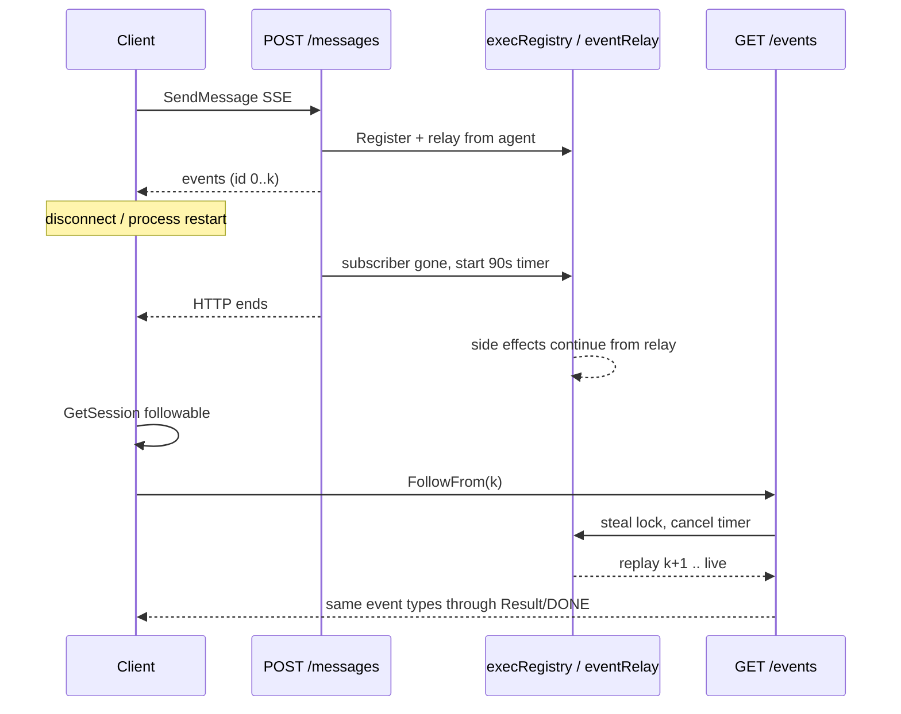

# 000: 飛行中ターン SSE への再接続（Follow / Reattach）

> **関連 Issue**: [axsh/arctic-tern#46](https://github.com/axsh/arctic-tern/issues/46)
>
> Issue #41（上流 Codex がストリーム生存中に reconnect する件）とは別機能である。本仕様は **Tern の公開セッション API で、進行中ターンの SSE を購読し直す** ことだけを扱う。

## 背景 (Background)

セッションに進行中のターンがあるとき、Tern は 2 通目の `POST /api/v1/sessions/{id}/messages` と `PATCH /api/v1/sessions/{id}` を HTTP 409 で拒否する。

```json
{"error":"session busy","hint":"respond or terminate","status":"active"}
```

呼び出し側が元の SSE を失う（プロセス再起動、HTTP クライアントタイムアウト、プロキシ切断）と、**同じターンを追う公開手段が無い**。新しいメッセージは送れず、再購読もできない。文書化されている逃げ道は `POST .../respond`（`suspended` / `user_input_required` のみ）と `POST .../terminate` だけである。

`ResumeSession` はセッション ID のハンドルを作るだけで、飛行中ターンへは購読しない。`GET .../logs` はタスクログであり、`EventText` / `EventToolUse` / `EventResult` の代替ではない。

内部では `eventRelay` がエージェント出力をバッファし、`streamOffset` から逐次 SSE コンシューマへ再生できる（プロセスリトライと `respond` 継続で使用）。これは **第 2 の HTTP 接続としては公開されていない**。

さらに、元の `POST /messages` のゴルーチンが切断後もドレインを握り、既定 15 秒でエージェントプロセスを止める。再接続猶予が短く、かつ Follow 用のコンシューマ所有権が無い。

### 現状の問題

1. busy 中は mutation も第 2 購読も拒否される。409 の `hint` は terminate へ誘導する。
2. SSE 切断は破壊的になりうる（15 秒ドレイン後にプロセス停止）。
3. `eventRelay` はあるが、切断中も同じリクエストが offset を進め、別接続が安全に再生できない。
4. SSE ワイヤに論理イベント `id` が無く、クライアントが再開位置を示せない。

### 本仕様で決めること（調査推奨の確定）

次を採用する。実装計画・実装で覆さない。

| 項目 | 決定 |
| :--- | :--- |
| HTTP | `GET /api/v1/sessions/{id}/events`（SSE）。クエリでセッション GET に混ぜない |
| 同時購読 | ターンあたり SSE 購読は 1 本。後からの Follow が既存購読を奪う（steal） |
| 切断後の生存 | 再接続猶予を設定可能にする。本番既定 **90 秒**（現行 15 秒から延長） |
| 再開位置 | 論理イベント index。空の `from` はターンバッファ先頭から再生 |
| 完了後 | `execRegistry` から消えたターンは Follow しない（短 TTL リプレイは対象外） |
| クライアント | `client/v1` に `Follow` / `FollowFrom`。戻り値は既存 `*Stream` |

---

## 要件 (Requirements)

### 必須要件 (Must)

#### R1: 公開 Follow API

- `GET /api/v1/sessions/{id}/events` を追加する。
- `Accept: text/event-stream` を必須とする。欠ける場合は 406。
- 新しいユーザーメッセージをエンキューしない。stdin にも書かない。
- `execRegistry` に当該セッションのターンがあるとき（`active` または `suspended`）成功する。
- イベント型・終端は `POST /messages` の SSE と同じとする。`EventText` / `EventToolUse` / `EventToolResult`（および `tool_result_part`）/ `EventSystem` / `EventUserInputRequired` / `EventResult` / `EventError` / `data: [DONE]`。
- 接続開始時に、既存の turn context（`turn_id` / `correlation_id`）を `EventSystem` として送る（現行 `POST /messages` と同様）。
- セッションが存在するがターンが `execRegistry` に無いときは **409**。本文は JSON で `error` を `no active turn` とする。セッション欠落と区別するため 404 にしない。
- セッション自体が無いときは現行どおり 404。
- ルーティングは `/logs` と衝突しないこと（`/events` を `routeSessionByID` で先に判定する）。

#### R2: 論理オフセットからの再生

- クエリ `from` は、クライアントが **最後に完全受信した論理イベント** の index（0 始まり）とする。サーバは **その次** から送る。
- `from` 省略または空は **index 0（現在ターンのリレー先頭）** から再生する。プロセス再起動で last id を失った呼び出し側がターン全体を取り戻せるようにする。既に UI へ出した呼び出し側は必ず `from` を付ける。
- 論理イベントと SSE ワイヤ行は 1:1 でない（`tool_result` のチャンク分割）。`from` / `id` は **リレー上の論理 `StreamEvent` の index** であり、ワイヤ行番号ではない。
- 各論理イベントのワイヤ出力に SSE `id: <index>` を付ける。同一論理イベントが複数 `data:` 行になる場合は、それらの行は同じ `id` を共有する。
- `Last-Event-ID` が来た場合は `from` と同じ意味で解釈してよい。両方あるときはクエリ `from` を優先する。
- `from` がバッファ長より大きい、または非整数のときは 400。

#### R3: 単一購読と steal

- 1 ターンに対し、SSE を書くコンシューマは同時に 1 つだけとする。
- Follow（または `POST /messages` / `POST /respond` の SSE）が既に付いている状態で新しい Follow が来たら、**新しい接続を採用**し、旧接続は終了する（steal）。旧側にはそれ以上イベントを書かない。可能なら旧ストリームを閉じる。
- 旧接続の切断を、再接続猶予の開始と誤認してプロセスを殺してはならない。steal 直後は猶予タイマーをキャンセルし、新接続を唯一の購読者とする。
- マルチキャスト（同一イベントを複数 HTTP へ同時配信）はしない。

#### R4: 切断後の再接続猶予

- SSE 購読者がいなくなっても、猶予内はエージェントプロセスと `eventRelay` と `execRegistry` エントリを残す。
- 本番既定の猶予は **90 秒**。現行の切断後ドレイン 15 秒をこれに置き換える（テストの `WithSSEDrainTimeout` は短い値の上書きとして残してよい）。
- YAML `agent_service` に設定を追加する（名称例: `sse_reattach_timeout_seconds`）。0 または未設定は 90。無制限は禁止する。
- Follow が付いている間は猶予タイマーを動かさない。Follow が切れたら猶予を **ゼロから** やり直す。
- 猶予が尽きたら現行どおりプロセスを止め、`execRegistry` を外し、busy を解除する。ターミナル content `client drain timeout` とログ `SSE drain timed out; stopping agent process` は互換のため残してよい。
- 元の `POST /messages` ハンドラは、クライアント切断後に HTTP 応答を終えてよい。ドレインと猶予は **exec に紐づくバックグラウンド** が持つ。同じリクエストゴルーチンが `streamOffset` を進めながら Follow と競合してはならない。

#### R5: 副作用は論理イベントあたり一度

- task log、`AgentSessionID` 抽出、`user_input_required` による `suspended`、終端でのセッション status 更新は、リレー上の各論理イベントについて **一度だけ** 行う。
- Follow が先頭から再生しても、これらの副作用を二重に走らせない。
- SSE への書き込みと副作用適用を分ける。切断中も副作用用の適用は進めてよい（ターン完了をサーバが観測できるようにする）。再生はバッファから行う。

#### R6: busy 契約と hint

- `POST /messages` と `PATCH` の 409 `session busy` は維持する。Follow は mutation ではないので 409 にしない（R1）。
- 409 本文の `hint` を **`follow, respond or terminate`** に更新する（busy を返すすべての箇所）。
- `POST /respond` は従来どおり `suspended` のときだけ成功する。`active` 中の再購読は Follow の役割である。
- `GET /api/v1/sessions/{id}` に、exec があるとき `followable: true` と当該 `turn_id` を含める。exec が無ければ `followable` は false または省略。既存フィールドは壊さない。

#### R7: `client/v1`

- `ResumeSession` の意味は変えない（サーバ通信なし）。
- `(*Session) Follow(ctx) (*Stream, error)` を追加する。`GET .../events`（`from` なし = 先頭から）。
- `(*Session) FollowFrom(ctx, lastEventID string) (*Stream, error)` を追加する。`lastEventID` をクエリ `from` にする。
- `Accept: text/event-stream`。成功時は既存 `newStream`。
- 呼び出し側が論理 id を保持できるよう、`Stream` のイベントにサーバの論理 index を載せるか、SDK が受信完了した論理イベント数を `LastEventID() string` として公開する。チャンク組み立て前のワイヤ行では last id を進めない。
- `RunWithHandlers` は切断時に自動 Follow しない（二重購読・無限ループ防止）。再接続は呼び出し側が `FollowFrom` する。
- レガシー `client` パッケージへの Follow 追加は任意（R8）。v1 は必須。

### 任意要件 (Nice to Have)

#### R8: レガシー `client` パッケージの Follow

- `client`（非 v1）にも同等メソッドを付けてよい。本仕様の必須ゲートではない。

#### R9: 完了直後の短 TTL リプレイ

- ターン完了後も数秒バッファを残して `EventResult` 取りこぼしを回収する。初期実装ではやらない。完了後 Follow は R1 の 409 `no active turn`。呼び出し側は `GetSession` の status で完了を知る。

#### R10: ternctl

- `ternctl` から Follow できてよい。必須ではない。

---

## 実現方針 (Implementation Approach)

### コンポーネント

| 層 | 主な変更 |
| :--- | :--- |
| `agentservice` | `routeSessionByID` に `/events`。`handleFollow`。exec の購読ロックと猶予タイマー。`streamSSERelay` を「接続単位のライタ」と「exec 単位の副作用」に分離。SSE `id:`。hint / `followable` |
| `config` | `sse_reattach_timeout_seconds` と ApplyDefaults |
| `client/v1` | `Follow` / `FollowFrom`、論理 last id |
| 文書 | `docs/ReferenceManual-WebAPIs.md` |

エージェントアダプタ（Codex / Claude / Wayfinder）のプロトコルは変えない。対象は Tern セッション API とリレー所有権である。

### 所有権の分離



切断後も `eventRelay` のソース読み取りゴルーチンは生存する（現行どおり）。やめるのは「切断した HTTP がドレインループで offset とライタを独占すること」である。

### steal と猶予

- `activeExecution` に購読世代（または単一の cancel）を持つ。
- 新しい SSE ライタが登録されたら旧ライタの context を cancel する。
- 購読者カウントが 0 になったときだけ猶予タイマーを開始する。

### `from` と副作用

- 副作用カーソル（適用済み論理 index）と、SSE ライタの開始 index を分ける。
- Follow の `from` はライタ開始位置だけを決める。副作用カーソルは戻さない。

### クライアント再接続手続き（契約）

1. `SendMessage` / `SendText` で SSE を読む。完全に組み立てた論理イベントごとに last id を保存する。
2. 切断後 `GetSession` する。
3. `completed` → Follow しない。
4. `error` かつ drain timeout → ターンはサーバが落としている。Follow しない。必要なら新しい `SendMessage`。
5. `followable` または status が `active` / `suspended` → `FollowFrom(lastID)`。last id が無ければ `Follow()`（先頭再生）。
6. Follow が 409 `no active turn` → 短時間後に `GetSession` を再取得（完了との競合）。
7. Follow 中の `user_input_required` → 既存の `Respond`。
8. 猶予（既定 90 秒）内に付け直す。

---

## 検証シナリオ (Verification Scenarios)

Issue #46 の再現・期待（原文の趣旨を仕様のテスト観点として固定する）。

### Issue の再現手順（原文相当）

1. Tern を起動する（standalone または in-process）。コーディングエージェントを設定する。
2. `POST /api/v1/sessions` のあと `POST /api/v1/sessions/{id}/messages` を `Accept: text/event-stream` で送り、数十秒 `active` なままのプロンプトにする（長い tool use で足りる）。
3. ターンが `active` のあいだに SSE クライアントを落とす（HTTP body を閉じる）。
4. idle を待たずにすぐ、同じ `config_dir` の `PATCH /api/v1/sessions/{id}`、および／または新しいプロンプトの `POST /api/v1/sessions/{id}/messages` を送る。
5. HTTP 409 `session busy` / `hint: respond or terminate` を観測する（本仕様実装後の hint は `follow, respond or terminate`）。
6. 既存ターン SSE をリレー offset から再開する `GET`（本仕様では `/events`）が無い。

### Issue の期待（本仕様での充足）

- 公開 follow/reattach（`GET .../events`）が、`execRegistry` 上のターン（`active` または `suspended`）で成功する。
- 新しいユーザーメッセージを積まない。
- 現在のリレー offset から流す（任意で `Last-Event-ID` / クエリ offset）。
- `POST /messages` SSE と同じイベント型を `EventResult` / `EventError` / `[DONE]` まで届ける。
- `client/v1` が同じ操作を公開する（`Session.Follow(ctx) → *Stream`）。
- 切断ポリシーを Follow とセットで文書化する: 有界の再接続ウィンドウを置く（本仕様: 既定 90 秒）。
- 409 `hint` に follow を含める。
- 次ターンのキューイングは対象外。Follow は **現在ターンを失わない** こと専用。

### シナリオ A: 切断直後に Follow で同一ターンを継続する（必須・モック）

1. fake エージェントが数秒かけて text → tool → result を出す。
2. `POST /messages` SSE で先頭の text を読んだあとクライアントを切る。
3. 猶予内に `GET .../events?from=<最後の論理 id>` する。
4. 200 で残りイベントが流れ、`EventResult` と `[DONE]` で終わる。
5. その間の `POST /messages` は 409。hint に `follow` が含まれる。
6. エージェントプロセスは Follow 成功まで kill されない。

### シナリオ B: `from` なし Follow は先頭から再生する（必須・モック）

1. いくつかの論理イベントを送ったあと切断する。
2. `GET .../events`（`from` なし）する。
3. バッファ先頭（turn context 含む）から再送され、重複を含め最後まで届く。
4. task log 等の副作用がイベント件数ぶん二重に増えない。

### シナリオ C: steal（必須・モック）

1. 第 1 の SSE（`POST /messages` または Follow）が接続中である。
2. 第 2 の `GET .../events` が成功する。
3. 第 1 のストリームはそれ以上イベントを受けない（または接続が閉じる）。
4. 第 2 だけが `EventResult` まで受ける。プロセスは生きている。

### シナリオ D: 猶予切れ（必須・モック）

1. 切断後、短いテスト用猶予（既存 `WithSSEDrainTimeout`）を超えて Follow しない。
2. プロセスが止まり busy が外れる。
3. その後の Follow は 409 `no active turn`。
4. `POST /messages` は 409 以外で受け付けられる。

### シナリオ E: Follow はメッセージを積まない（必須・モック）

1. 飛行中に Follow する。
2. エージェントの `Send` 呼び出し回数は元ターンの 1 回のまま増えない。
3. セッション履歴に新しい user メッセージが追加されない。

### シナリオ F: suspended では Follow のあと Respond（必須・モック）

1. ターンが `user_input_required` で `suspended` になる。元 SSE を切る。
2. Follow で `user_input_required` を（`from` に応じて）再取得できる。
3. `POST /respond` が従来どおり続きの SSE を返す。
4. `active` 中の `POST /respond` は従来どおり衝突する。

### シナリオ G: 完了後 Follow は 409（必須・モック）

1. ターンが `EventResult` まで終わり busy が外れる。
2. `GET .../events` は 409 `no active turn`。
3. `GetSession` の status は `completed`。`followable` は true でない。

### シナリオ H: `client/v1` FollowFrom（必須・httptest）

1. SDK で SendText し、1 イベント後にストリームを閉じる。
2. `FollowFrom` で残りを `*Stream` として読む。
3. `Follow` は `from` なし GET になる。

---

## テスト項目 (Testing)

手動確認だけの計画は禁止する。モックエージェントによる自動テストを必須とする。`t.Skip` は使わない。

### 単体テスト

```bash
./scripts/process/build.sh
```

Linux / Remote-SSH（Linux）では `./scripts/process/build.sh --skip-etc`。

対象:

- `handleFollow` の 200 / 406 / 404 / 409 `no active turn`
- `from` の次 index 再生、不正値 400、`id:` 付与（チャンク行は同一 id）
- steal で旧ライタが止まり新ライタだけが進む
- 購読者 0 のときだけ猶予が動き、Follow でキャンセルされる
- 既定猶予 90 秒（ゼロ値 YAML → 90）
- 再生しても task log 件数が二重にならない
- busy 409 の `hint` が `follow, respond or terminate`
- `GetSession` の `followable` / `turn_id`
- `client/v1` の `Follow` / `FollowFrom` のメソッドと last id

### 統合テスト（モック、必須）

カテゴリ `common`（実 LLM / 実 CLI 不要。httptest + fake agent）。テスト名プレフィックスは `TestSessionFollow` とし、既存 `TestStreamReconnect`（Issue #41）を巻き込まない。

```bash
./scripts/process/build.sh && ./scripts/process/integration_test.sh --categories common --specify "TestSessionFollow"
```

Linux / Remote-SSH（Linux）では:

```bash
./scripts/process/build.sh --skip-etc && xvfb-run -a ./scripts/process/integration_test.sh --categories common --specify "TestSessionFollow"
```

検証すること:

- `TestSessionFollow_ReattachContinuesTurn`: シナリオ A
- `TestSessionFollow_ReplayFromStart`: シナリオ B
- `TestSessionFollow_StealsExistingSubscriber`: シナリオ C
- `TestSessionFollow_TimeoutThenNoActiveTurn`: シナリオ D
- `TestSessionFollow_DoesNotEnqueueMessage`: シナリオ E
- `TestSessionFollow_SuspendedThenRespond`: シナリオ F
- `TestSessionFollow_CompletedRejected`: シナリオ G
- `TestSessionFollow_ClientV1FollowFrom`: シナリオ H

### 統合テスト（実 CLI、任意回帰）

必須ゲートではない。付けるなら `llm` カテゴリで、名前は `TestSessionFollowLive` とする。

```bash
./scripts/process/build.sh && ./scripts/process/integration_test.sh --categories llm --specify "TestSessionFollowLive"
```

Linux / Remote-SSH（Linux）では:

```bash
./scripts/process/build.sh --skip-etc && xvfb-run -a ./scripts/process/integration_test.sh --categories llm --specify "TestSessionFollowLive"
```

前提欠落は Fail。`t.Skip` 禁止。

---

## 対象外

- Issue #41: 上流ストリーム生存中の Codex reconnect / Gateway リトライ
- 現在ターン終了後の **次ターン** の自動キュー
- 完了後イベントの永続リプレイ（R9）
- 同一ターンの複数同時 SSE 配信
- `/logs` を turn SSE の代替にすること
- PATCH を busy 中に通すこと（`config_dir` 据え置きでも 409 のまま。Issue #32 は別）
- `RunWithHandlers` の自動再接続
