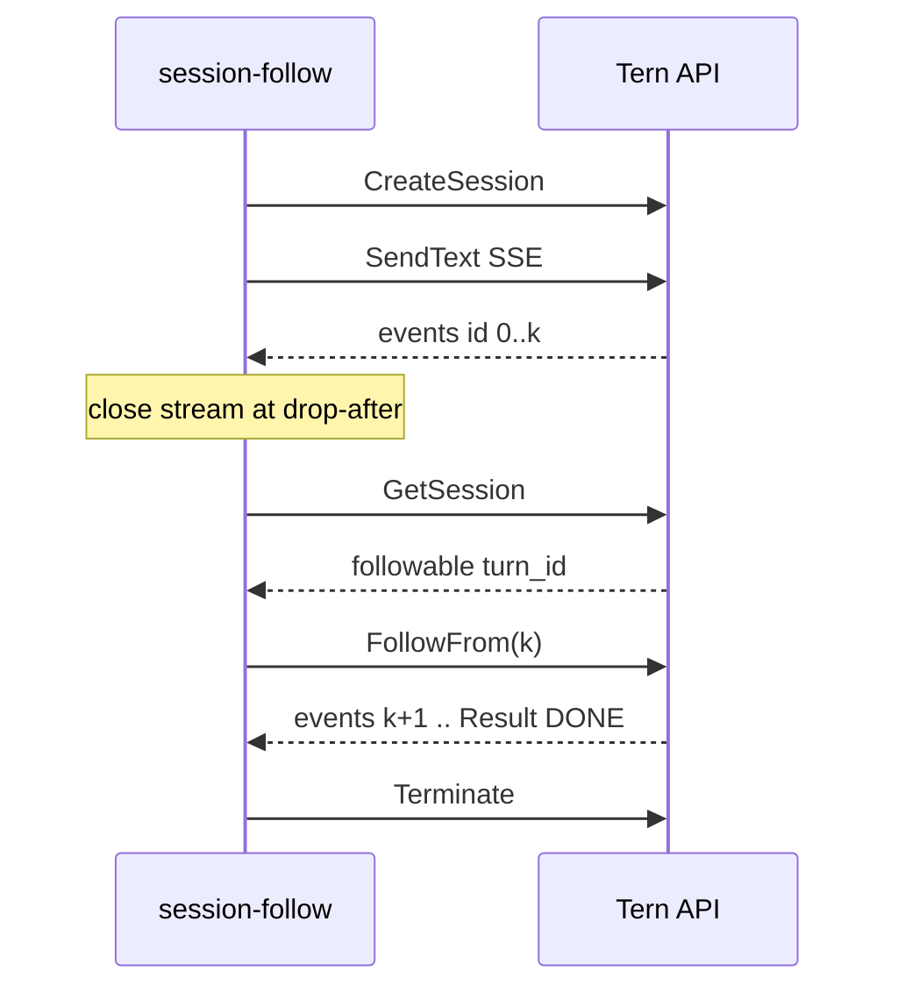

# 001: Client API 例 — セッション SSE 再接続（session-follow）

> **関連 Issue**: [axsh/arctic-tern#46](https://github.com/axsh/arctic-tern/issues/46)
>
> **前提仕様**: [000-Session-SSE-Follow-Reattach.md](file://prompts/phases/001-phase02/branches/feat-reconnect-session/ideas/000-Session-SSE-Follow-Reattach.md)（実装済み: `GET .../events`、`client/v1` の `Follow` / `FollowFrom`）
>
> **位置づけ**: `minimal-client` / `multimodal-client` / `config-dir-switch` と同じ **Client API example**。別プロセスの Tern に **HTTP で CAWA v1 Web API** を叩く。`server.New().Launch` を同じプロセスに埋め込むデモではない。公開 Go クライアントは **`client/v1` のみ**（ルート `package client` は R8 で廃止）。

## 背景 (Background)

飛行中ターンへの Follow は Web API と `client/v1` に入ったが、**HTTP クライアントとしての再接続手続き**を示す example が無い。既存の `minimal-client` は `SendText` から `Output` まで一続きで、切断と `FollowFrom` を示さない。`config-dir-switch` はターン間の PATCH であり、busy 中の再購読ではない。

本 example はプロセス内の AgentService を直接呼ばない。`client.New(serverURL)` が `http://localhost:3100`（または `-server`）へ次の HTTP を送る。

| Client API | HTTP |
| :--- | :--- |
| `CreateSession` | `POST /api/v1/sessions` |
| `SendText` / `SendMessage` | `POST /api/v1/sessions/{id}/messages`（`Accept: text/event-stream`） |
| `GetSession` | `GET /api/v1/sessions/{id}` |
| `Follow` / `FollowFrom` | `GET /api/v1/sessions/{id}/events`（任意 `?from=`） |
| `Respond` | `POST /api/v1/sessions/{id}/respond` |
| `Terminate` | `POST /api/v1/sessions/{id}/terminate` |

Issue #46 の想定呼び出し側（プロセス再起動、HTTP タイムアウト、プロキシ切断）は、次をコードとして見られないと誤って 2 通目の `SendMessage` や `Terminate` に進みやすい。

- `ResumeSession` だけでは購読しない
- busy 中は `POST /messages` が 409
- 再接続は `GetSession` の `followable` を見て `Follow` / `FollowFrom`

本仕様は **Client API example** を追加し、公開 Web API 契約どおりの再接続手続きを実行可能にする。サーバ本体の Follow 実装は変更しない。`net/http` を example の業務ロジックで手書きしない（全部 `client/v1`）。テスト用 httptest も同じ URL パスを HTTP で模倣する。

あわせて、Deprecated のまま残っている **ルートパッケージ `github.com/axsh/arctic-tern/client`（`client/*.go`）を廃止**する。公開クライアントは `client/v1` のみとする。`client/internal`（SSE チャンク等、v1 が import する内部実装）は残す。

---

## 要件 (Requirements)

### 必須要件 (Must)

#### R1: ディレクトリとモジュール（Client API example）

- 配置: `examples/session-follow/`（`minimal-client` と同じ系統のクライアント例）
- 独立 `go.mod`（`module github.com/axsh/arctic-tern/examples/session-follow`、`replace github.com/axsh/arctic-tern => ../../`）
- `import client "github.com/axsh/arctic-tern/client/v1"` のみでセッション操作する。`agentservice` / `server` パッケージを example の実行パスから import しない
- `scripts/process/build.sh` の `examples/*/` ループで **テストと `bin/session-follow` ビルド** が走る（`go.mod` があること）

#### R2: デモ本体（`main.go`）

英語のパッケージコメントと `--help` 相当のフラグ説明。コメントに日本語を入れない。

フラグ（`config-dir-switch` に合わせる）:

| フラグ | 既定 | 意味 |
| :--- | :--- | :--- |
| `-server` | `http://localhost:3100` | Tern サーバ URL |
| `-agent` | `claudecode` | エージェント名 |
| `-model` | 空 | 任意モデル |
| `-work-dir` | `.` | 作業ディレクトリ |
| `-session-dir` | 空（一時ディレクトリ可） | セッションディレクトリ |
| `-prompt` | 長いターンになる英文プロンプト | 最初の `SendText` |
| `-drop-after` | `1` | 何件の **論理イベント**（`id:` 付き、turn context 除く）を受けたら SSE を切るか |

クライアントは **`client.WithNoTimeout()`** を使う（README の長寿命 SSE 方針）。

実行フロー（仕様 000 のクライアント再接続手続きをコードにする。要約せず固定する）:

1. `CreateSession`
2. `SendText` / `SendMessage` で SSE を読む。完全に組み立てた論理イベントごとに `LastEventID()` を保存する
3. `-drop-after` 件に達したらストリーム（HTTP body）を閉じる。**新しいメッセージは送らない**
4. `GetSession` する
5. `completed` → Follow しない。デモは成功として終了してよい（ターンが短すぎた場合はログして非ゼロ終了）
6. `error` かつ drain timeout → Follow しない。非ゼロ終了
7. `followable` または status が `active` / `suspended` → last id があれば `FollowFrom(lastID)`、無ければ `Follow()`（先頭再生）
8. Follow が 409 `no active turn` → 短い間隔で `GetSession` を再取得し、完了なら成功、busy/followable なら Follow をやり直す（有限回。無限ループ禁止）
9. Follow 中の `user_input_required` → 既存の `Respond`（対話が不要ならフラグで固定回答、またはエラーで終了して手順を README に書く）
10. Follow ストリームを `EventResult` / `[DONE]` まで読む
11. `Terminate` はデモ終了時のみ（ターン中に切らない）

ログ（stdout/stderr）で次が分かること:

- session id
- drop した時点の `LastEventID`
- `GetSession` の `status` / `followable` / `turn_id`
- Follow が `Follow` か `FollowFrom` か
- 再購読後に `result` を見たか

409 busy を誘導する `SendMessage` はデモの主経路に入れない。必要ならコメントまたは `-demo-busy` 任意フラグで 1 回 POST して hint に `follow` が含まれることを出す（任意 R6）。

#### R3: README（英語）

`examples/session-follow/README.md`。`config-dir-switch/README.md` と同水準。

含めること:

- 冒頭で **Client API example** であること、別プロセスの Tern へ HTTP すること、`minimal-client` の延長であることを書く
- Prerequisites: 稼働中 Tern（例: `minimal-server`）、選択エージェントの CLI / vault。example 自身はサーバを起動しない
- `go run ./examples/session-follow` と `./bin/session-follow --help`
- What this demonstrates 表: Follow は新メッセージを積まない、`from` は論理 id、猶予（既定 90 秒）内に付け直す、`/logs` は代替でない
- 再接続手続き 1–8 を箇条書き（仕様 000 の「クライアント再接続手続き」と同じ順序）
- リンク: `docs/ReferenceManual-WebAPIs.md` の Follow 節、`GET /api/v1/sessions/:id/events`

#### R4: ルート README への 1 段落（英語）

`README.md` の **Client Examples** 節に、`minimal-client` / `multimodal-client` / `config-dir-switch` と並べて session-follow を追加する。日本語を入れない。in-process `server.New` のサンプル（minimal-server）とは節を混ぜない。

#### R5: 自動テスト（httptest、実 LLM なし）

`examples/session-follow/` に `package main` のテスト（`artifact-pipeline/pipeline_test.go` と同様）。

スタブサーバが最低限扱う経路:

- `POST /api/v1/sessions` → `session_id`
- `POST .../messages` SSE: turn context（`id:` なし）→ `id: 0` text → （遅延可）`id: 1` text → `id: 2` result → `[DONE]`
- `GET .../sessions/{id}` → 初回は `followable: true` と `status: active`、Follow 完了後は `completed` でもよい
- `GET .../events` および `GET .../events?from=` → SSE。`from` があるときはその次から。`Accept` 欠落は 406 でなくてよい（example は必ず付ける）
- `POST .../terminate` → 200

テストケース:

- **Drop then FollowFrom**: 1 イベントで切断し、スタブが `from` クエリを受け、続きの text/result を返す。example のコア関数（`main` から抽出した `run(ctx, flags, client)`）が result まで終わる
- **Follow without from**: last id 空なら `GET .../events` に `from` クエリが無い
- **No Send on Follow**: Follow 経路で `POST .../messages` が増えない
- `t.Skip` 禁止

`main` の I/O を全部 `main()` に閉じ込めるとテストできないので、**セッション操作はテスト可能な関数に切り出す**（`runFollowDemo` 等）。

#### R8: レガシー `client` パッケージの廃止（`client/v1` のみ残す）

現状: `client/client.go` 等は `// Deprecated: Use .../client/v1 instead.` だが、パッケージ自体は残っている。Go の import はほぼ全て `client/v1`。ルート `package client` の残 import は `tests/codex_legacy_client_large_output_e2e_test.go` のみ。

Must:

- 公開 API として残すのは `github.com/axsh/arctic-tern/client/v1` のみ
- ルート `package client` のソースを削除する（少なくとも `client/agents.go`, `client.go`, `client_test.go`, `health.go`, `models.go`, `session.go`, `session_test.go`, `stream.go`, `stream_test.go`。同パッケージの他ファイルがあれば同様）
- `client/v1/` は削除しない。Follow / FollowFrom を含む現行実装を維持する
- `client/internal/` は v1 が使うなら残す（ルート `package client` 専用なら一緒に消す）
- `codex_legacy_client_large_output_e2e_test.go` は **v1 に寄せるか削除**する。同等カバレッジは `tests/codex_client_v1_large_output_e2e_test.go` がある。レガシー専用のアサーションが v1 テストに無い場合だけ、v1 テストへ移してからファイルを消す。レガシーパッケージを残したままテストだけ残すことは禁止
- ルート `README.md` および `docs/` で `github.com/axsh/arctic-tern/client`（v1 無し）を推奨している箇所があれば `client/v1` に直す。Deprecated 案内だけの段落は「v1 を使え」ではなく **パッケージ削除後の記述**にする
- 新規コード（本 example 含む）がルート `package client` を import しない（R1 と重複だが廃止後はコンパイル不能になる）

廃止後、`go list ./client` は失敗してよい。`go list ./client/v1` と `./client/internal/...` は成功すること。

### 任意要件 (Nice to Have)

#### R6: busy 409 の hint デモ

切断直後に意図的に `SendText` し、HTTP 409 と `follow, respond or terminate` をログしてから Follow する。

#### R7: steal のデモ

第 2 プロセスから同じ session id で Follow し、第 1 が止まる様子。初期は必須にしない（説明が長くなる）。

---

## 実現方針 (Implementation Approach)

**Client API 専用。** `client/v1` が内部で HTTP クライアントを使う。example が `http.NewRequest` で Web API を組み立てない。サーバコードは触らない。デモ実行時は別プロセスの Tern が `:3100` 等で待っている前提（`minimal-client` と同じ）。



- 切断は `context.Cancel` または `stream` の body Close。SDK が `Events()` で body を閉じるため、`drop-after` 後は range を抜けて Close する実装にする
- スタブは `from` をクエリから読み、`Last-Event-ID` まで再現しなくてよい（example は `FollowFrom` → `?from=`）
- 実サーバ向け `main` とスタブ向けテストは同じ `runFollowDemo` を使う
- R8 は example と独立した削除作業。example の `go.mod` は最初から v1 のみ。レガシー削除は既存テストが v1 だけで通ることを確認してから行う

---

## 検証シナリオ (Verification Scenarios)

仕様 000 のクライアント再接続手続き（転記）:

1. `SendMessage` / `SendText` で SSE を読む。完全に組み立てた論理イベントごとに last id を保存する
2. 切断後 `GetSession` する
3. `completed` → Follow しない
4. `error` かつ drain timeout → ターンはサーバが落としている。Follow しない。必要なら新しい `SendMessage`
5. `followable` または status が `active` / `suspended` → `FollowFrom(lastID)`。last id が無ければ `Follow()`（先頭再生）
6. Follow が 409 `no active turn` → 短時間後に `GetSession` を再取得（完了との競合）
7. Follow 中の `user_input_required` → 既存の `Respond`
8. 猶予（既定 90 秒）内に付け直す

example の手動実行（実サーバ、CI 必須ゲートではない）:

1. Tern を起動する
2. `go run ./examples/session-follow --server http://localhost:3100 --agent claudecode`
3. ログに drop 時の LastEventID、followable、FollowFrom、最終 result が出る
4. ターンが `drop-after` より先に終わる場合は、example が非ゼロで「turn finished before drop」と説明する

Issue #46 の「idle を待たずに PATCH/POST すると 409」は R6 任意。必須 example は Follow 成功経路。

---

## テスト項目 (Testing)

手動確認だけの計画は禁止。`t.Skip` 禁止。

### 単体（example モジュール、build.sh が実行）

```bash
./scripts/process/build.sh
```

Linux / Remote-SSH（Linux）ではワークスペース方針どおり `./scripts/process/build.sh --skip-etc` が使える環境ではそれを使う。本リポジトリの `build.sh` が当該フラグを持たない場合は `./scripts/process/build.sh`。

これで `examples/session-follow` の `go test` と `go build -o bin/session-follow` が走る。

検証すること:

- R5 の Drop then FollowFrom
- Follow without from
- No Send on Follow

### 単体・ビルド（レガシー client 廃止、R8）

`./scripts/process/build.sh`（Linux なら `--skip-etc` が使える環境ではそれを使う）で:

- `./client` ルートパッケージが存在しない（またはビルド対象に含まれない）
- `./client/v1` の既存テストが通る
- `tests/codex_legacy_client_large_output_e2e_test.go` が残っていない、または v1 import に置き換わっている
- リポジトリ全体で `"github.com/axsh/arctic-tern/client"`（v1 無し）の Go import が 0 件

### 統合（Follow API 回帰、必須）

example は httptest で閉じる。公開 API の回帰は既存プレフィックスを使う。

```bash
./scripts/process/build.sh && ./scripts/process/integration_test.sh --categories common --specify "TestSessionFollow"
```

Linux / Remote-SSH（Linux）:

```bash
./scripts/process/build.sh --skip-etc && xvfb-run -a ./scripts/process/integration_test.sh --categories common --specify "TestSessionFollow"
```

`TestSessionFollowLive` は巻き込まない。

---

## 対象外

- Follow サーバ実装の変更（000 で完了）
- in-process 埋め込みサーバの example（`server.New` / `Launch`）
- ルート `package client` の互換レイヤ維持（R8 で廃止する。example も作らない）
- `client/v1` の API 破壊的変更（Follow 既存契約は維持）
- `net/http` 直叩きの生 REST デモ（Client API を通す）
- ternctl の機能追加（import は既に v1。R8 で触る必要は通常ない）
- 完了後リプレイ（000 の R9）
- GUI / Playwright
