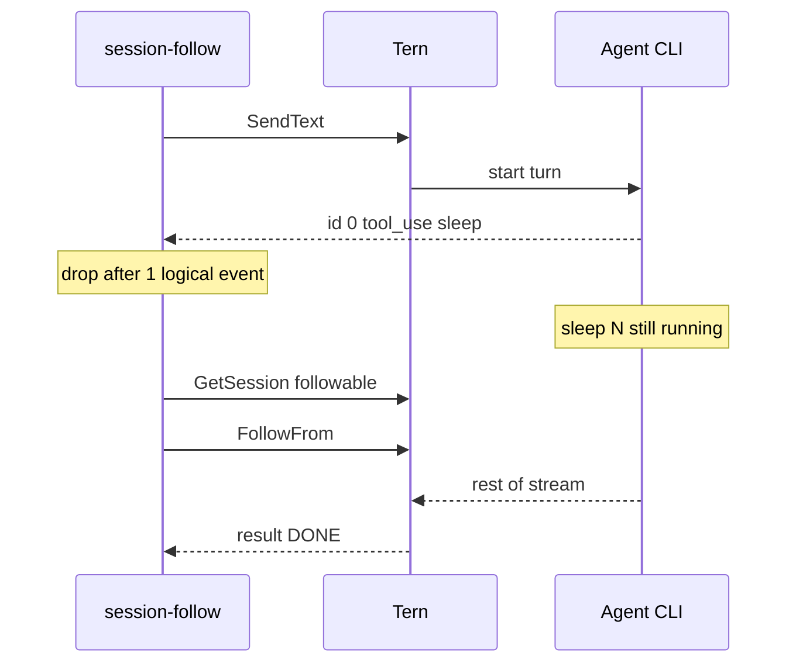

# 002: session-follow を Follow 試験にする（切断時ターン生存）

> **関連 Issue**: [axsh/arctic-tern#46](https://github.com/axsh/arctic-tern/issues/46)
>
> **前提**: [001-Session-Follow-Example.md](file://prompts/phases/001-phase02/branches/feat-reconnect-session/ideas/001-Session-Follow-Example.md) の example は実装済み。httptest は Follow まで通る。ライブでは Follow に入らない。
>
> **本仕様の問い**: エージェントに `sleep` を実行させて擬似ロングランにするのは意味があるか。**条件付きで意味がある。** ターンが切ったあともサーバ側で生きていなければ試験にならない。sleep がその生存窓を作る。窓の外で終わる sleep は無意味。

## 背景 (Background)

`examples/session-follow` の成功条件が「プロセスが 0 で終わること」になっている。ライブでは次が起きた。

1. `SendText` から最初の論理イベントまで約 3 分かかった
2. `-drop-after 1` で HTTP を切った。ログは `drop last_event_id="1"`
3. 直後の `GetSession` は `status=completed`（`followable=true` でも completed を優先）
4. 現行コードは completed なら Follow せず **成功 return** する

```
session completed after drop; skip follow
```

これでは Issue #46 の再購読（`GET .../events`）を一度も叩いていない。httptest は messages を意図的にハングさせるので Follow まで行く。ライブは LLM が速く終わる（またはバッファに残りが乗っている）と completed 分岐で終わる。

`sleep` をプロンプトに入れる案について:

| 判断 | 理由 |
| :--- | :--- |
| **意味がある** | 最初の SSE（多くは `tool_use`）の**あと**に、エージェントプロセスが数十秒ブロックすれば、クライアントが切っても `execRegistry` 上のターンは `active` / `followable` のまま。Follow の対象がある |
| **無意味** | drop より前に sleep が終わる。例: sleep 45 秒でも、最初のイベントまで 3 分かかるなら切った時点でターン終了済み。長い説明文だけでも同様（バッファに result まで入る） |
| **足りない** | sleep だけでは、cancel 後に `Events()` drain が後続 `id:` を読んで `LastEventID()` が進む問題は直らない。ライブで `last_event_id="1"` になったのは `-drop-after 1` なのに drain で id が進んだため、と整合する |

したがって改善は二段。

1. **クライアント**: drop した瞬間の論理 id を固定する。意図した drop なのに `completed` で Follow しない場合は成功にしない
2. **ライブ用プロンプト**: 最初のイベントの直後から `sleep N`（N は drop〜Follow より十分長い）でターンを生かす。N はフラグにする

サーバ Follow 実装（仕様 000）は変えない。



---

## 要件 (Requirements)

### 必須要件 (Must)

#### R1: drop 時点の last id を固定する

`consumeUntilDrop` が `stream.LastEventID()` を drain **後**に読むのをやめる。

- drop を決めたときの `ev.ID`（`-drop-after 0` なら空文字）を戻り値にする
- cancel 後の drain でパーサが後続イベントを読んで `Stream.lastID` が進んでも、Follow に渡す id は変えない
- ログ `drop last_event_id` もこの固定値

#### R2: デモの成功は Follow して result を見ること

`-drop-after` による切断を行った実行では、次を満たさないと **非ゼロ終了**。

- `GetSession` 時点で Follow する（`followable` または `active` / `suspended`）
- `Follow` または `FollowFrom` を少なくとも 1 回成功させる
- Follow 側で `EventResult` を見る（`SawResult == true`）

次は成功にしない（001 の「completed なら成功」を本仕様で上書きする）。

- drop 後すぐ `status=completed` で Follow スキップ
- drop 前に `EventResult` が来て `turn finished before drop`（従来どおり失敗）

drain timeout 後の `status=error` は従来どおり失敗。

#### R3: ライブ用の擬似ロングランは sleep でよい（条件付き）

既定プロンプトを「長い説明文」から、**ツールで sleep してから短く答える**形に変える。

- フラグ `-hold-seconds`（既定 `60`）。プロンプトにこの秒数を埋め込む
- プロンプトは英語。例: シェルで `python -c` の `time.sleep(N)` または POSIX `sleep N` を実行し、終わるまで待ち、終わったら一文だけ返す。ツール以外の長い生成を先にしない。質問しない
- N は「最初の論理イベントから GetSession までのクライアント遅延」より大きいこと。既定 60 は、起動 3 分待ちのあとに 45 秒 sleep が既に終わっている、という失敗を避ける（sleep は **イベント後** に走らせる）
- `-respond` 既定をライブ向けに `yes` にしてよい（サンドボックス許可）。空のまま失敗させるなら README に必須と書く。どちらかを仕様で固定する: **既定 `-respond yes`**

sleep 以外の長い生成（巨大エッセイ）は必須にしない。トークン量に依存し、切断窓が再現しにくい。

#### R4: httptest で「切断時にターン生存」と last id 固定を検証する

既存 3 テストは維持する。追加:

- **Drop last id frozen**: スタブが `id: 0` のあと、同一 messages 接続に `id: 1` text と result を **クライアント cancel 前にバッファへ載せる**（または cancel 後も body に残す）。`-drop-after 1` のとき `DropLastID == "0"`（`"1"` に進まない）。その後 FollowFrom は `from=0`
- **Active after drop required**: スタブの GET session が最初から `completed` なら `runFollowDemo` は error（R2）。既存スタブは `active` + hang なので現状成功のまま

`t.Skip` 禁止。実 LLM を example モジュールのテストから呼ばない。

#### R5: README（英語）をライブ試験手順に更新する

- 成功の定義: Follow ログ（`follow mode=` と `follow saw result=true`）が出ること。`skip follow` は失敗
- sleep / `-hold-seconds` の意味（切断後もエージェントがブロックしている窓）
- 既定ポートは 3100。ポート占有時は `--server` で合わせる
- LIVE 課金の注意は残す

ルート README の session-follow 一文は「再購読する」のままでよい。失敗を成功と読める表現があれば直す。

### 任意要件 (Nice to Have)

#### R6: `-hold-seconds 0` で旧プロンプト

説明文デモに戻せる。Follow 試験としては使わない。

#### R7: ライブ専用の `tests/` E2E

実 Claude を CI 必須にしない。任意の LIVE テストを足すなら `t.Skip` なしのゲートにはしない（既存 LIVE 方針に合わせ、本仕様の必須ゲートは httptest + 既存 `TestSessionFollow_`）。

---

## 実現方針 (Implementation Approach)

example と README と httptest のみ。`client/v1` の `LastEventID()` セマンティクスは変えない（drain で進むのは SDK の動作）。example が **コピーした id** を Follow に使う。

```go
// consumeUntilDrop: when logical >= dropAfter, record ev.ID then cancel.
// return recordedID, not stream.LastEventID() after the Events() loop.
```

成功判定: `runFollowDemo` は R2 を満たさないなら error。`main` は従来どおり `log.Fatalf`。

既定フラグ:

| フラグ | 新既定 |
| :--- | :--- |
| `-prompt` | `-hold-seconds` を埋め込んだ sleep 指示（空なら生成） |
| `-hold-seconds` | `60` |
| `-respond` | `yes` |
| `-drop-after` | `1`（変更なし） |

プロンプト生成（英語・固定テンプレート、N は int）:

```
Run a shell command that sleeps for N seconds (python -c with time.sleep(N) or POSIX sleep N). Do not answer before the sleep finishes. After it finishes, reply with exactly one short sentence. Do not ask questions. Do not write a long essay before the tool call.
```

スタブ追加ケース: messages が turn context + `id: 0` + 続けて `id: 1` と result を書き、その後 hang または即閉じ。クライアントは 1 件で cancel。アサーション `DropLastID=="0"`。

---

## 検証シナリオ (Verification Scenarios)

ユーザー提案（要約しない）:

- このままでは試験になっていないので改善したい
- sleep を実行させて擬似的にロングランプロセスにするのはどうか
- あまり意味がないか

ライブ手動（CI 必須ゲートではない。成功定義は R2）:

1. Tern を起動する（エージェント CLI と vault あり）
2. `./bin/session-follow --server http://localhost:<port> --agent claudecode`（既定 hold 60、drop 1、respond yes）
3. ログに `drop last_event_id` のあと `GetSession` が `completed` だけで終わらない
4. `follow mode=FollowFrom` または `Follow` と `follow saw result=true` が出る

---

## テスト項目 (Testing)

手動確認だけの計画は禁止。`t.Skip` 禁止。

本リポジトリの `scripts/process/build.sh` と `integration_test.sh` に `--categories` / `--skip-etc` は無い。未知フラグは失敗する。

```bash
./scripts/process/build.sh
```

example `session-follow` で検証すること:

- 既存: Drop then FollowFrom / Follow without from / No Send on Follow
- 新規: Drop last id frozen（R4）
- 新規: session JSON が `completed` のみなら `runFollowDemo` が error（R2）

```bash
./scripts/process/build.sh && ./scripts/process/integration_test.sh --specify "TestSessionFollow_"
```

Linux / Remote-SSH（Linux）で `xvfb-run` があるとき:

```bash
./scripts/process/build.sh && xvfb-run -a ./scripts/process/integration_test.sh --specify "TestSessionFollow_"
```

`TestSessionFollowLive` は巻き込まない。実 Claude ライブは必須ゲートにしない。

---

## 対象外

- Follow サーバ実装の変更
- `client/v1.Stream.LastEventID` の仕様変更（example 側で id を固定する）
- ルート `package client`（001 で廃止済み）
- steal / busy 409 デモ（001 の任意 R6/R7）
- GUI / Playwright
