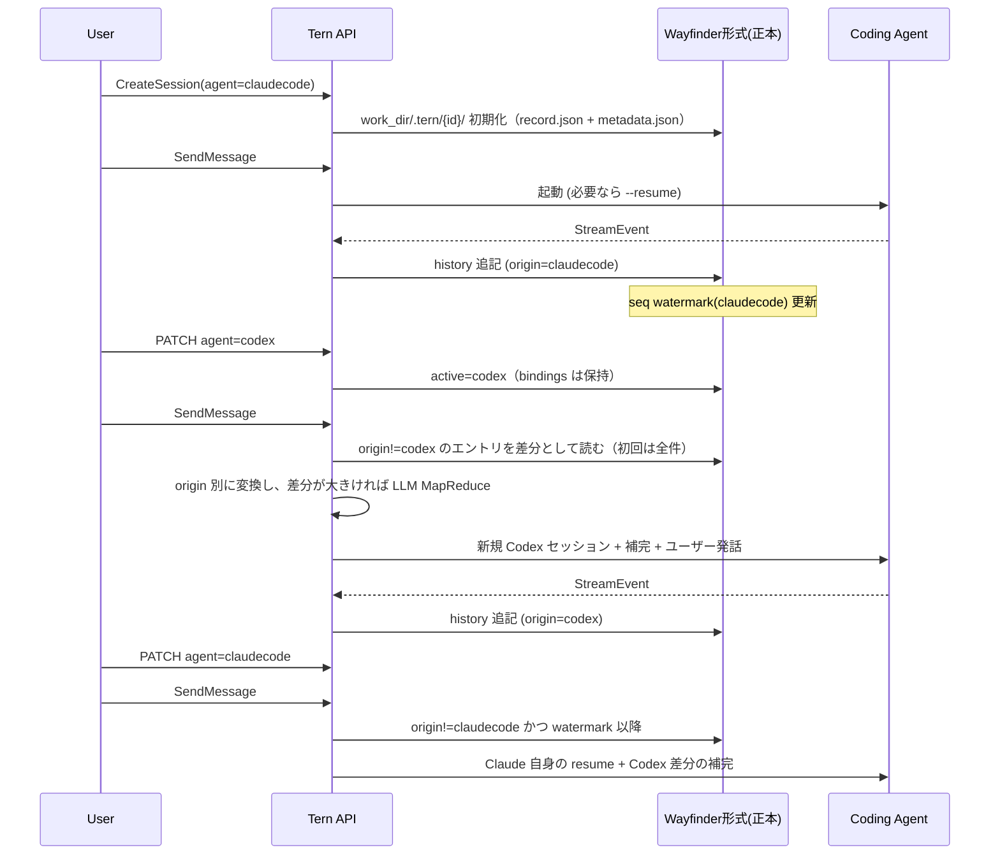

# 000: Wayfinder 形式を正本とするセッション可搬性

## 背景 (Background)

Tern の製品目標は、Coding Agent を切り替えても作業の文脈を失わないことである（README の Session portability / Agent switching / Context-preserving agent migration）。しかし現状、Tern セッションが保持しているのは薄いメタデータであり、会話の実体は各 Coding Agent の内部実装に委ねられている。

### 現状の問題

1. **Tern セッションと Agent セッションの非対称**
   - `SessionRecord` は `id` / `agent_name` / `model` / `status` / `work_dir` / `session_dir` / `agent_session_id` を持つだけである。
   - 会話セッションの実装はメモリ上の `MemorySessionStore` であり、サーバ再起動で Tern 側のレコードは消える。
   - 成果物ストアの SQLite（`artifact/store`）は Tern **サーバプロセス**向けの索引であり、ワークスペースに紐づく会話正本ではない。
   - 同一 Tern `session_id` でも、Claude Code と Codex の native セッションは相互に再開できない。`--resume` と `exec resume` は互いの ID を解釈しない。

2. **会話ログが Tern 側に残らない**
   - `POST /api/v1/sessions/:id/messages` はユーザー入力だけを `{session_dir}/history/` に追記する。
   - assistant / tool_use / tool_result は SSE `StreamEvent` とメモリ上の TaskLog に流れ、Wayfinder 形式の history には入らない。
   - Wayfinder エージェントだけが `metadata.json` / `context.json` / `history/` に会話全体を持つ。Claude / Codex 利用時はこの形式が正本になっていない。

3. **エージェント切替 API が無い**
   - `PATCH /api/v1/sessions/:id` は `config_dir` のみ更新する。`agent_name` は作成時固定。
   - デフォルト `session_dir` は `work_dir/.{agent_name}` のため、所有者がエージェント名に紐づいて見える。ワークスペース直下に Claude / Codex と同列の Tern フォルダが無い。
   - 切替時に「前回までの差分を補って新規 native セッションを始める」経路が存在しない。

4. **由来が無いと変換を精緻にできない**
   - Claude の tool 名（`Read` / `Bash` 等）と Codex の item 型（`command_execution` 等）は同一視できない。
   - 切替後の正本は混在ログになる。セッション全体の `agent_name`（いま動いているエージェント）だけでは、各エントリの出自を表せない。

### 技術的背景

- Claude Code は `CLAUDE_CONFIG_DIR={session_dir}` 配下の `projects/<slug>/{uuid}.jsonl` に transcript を書き、`--resume {id}` で再開する。JSONL 形式は公式に内部仕様であり版で変わりうる。
- Codex は `CODEX_HOME={session_dir}` 配下の `sessions/YYYY/MM/DD/rollout-*.jsonl` と SQLite 索引で thread を管理し、`codex exec resume {thread_id}` で再開する。
- Tern アダプタは既に stdout JSONL を共通 `StreamEvent` に正規化している。ターン完了時点でこのイベント列を正本へ取り込む方が、native ファイルの事後パースより安定する。
- Wayfinder は既に階層化セッション（history = 事実の append-only、context = compaction 済みの派生）を持つ。これを「Wayfinder エージェント専用」から「全 Coding Agent の互換レイヤの正本」へ昇格する。
- Codex の `/import` や Claude の `claude import` は対話 TUI / 設定移行が中心で、Tern のヘッドレス `CreateSession` → `SendMessage` には載せられない。

### 本仕様で決めること

Wayfinder のセッションデータ形式を **Wayfinder 形式** と呼び、全 Coding Agent 共通セッションの正本とする。各エージェントの native セッションは派生であり、取り込みと切替補完は常に Wayfinder 形式を経由する。

---

## 要件 (Requirements)

### 必須要件 (Must)

#### R1: Wayfinder 形式を共通セッションの正本とする

- Tern セッションに紐づく会話コンテキストの正本は Wayfinder 形式とする。対象エージェントは `claudecode` / `codex` / `wayfinder` とする。
- 正本は **ワークスペースディレクトリ** に置く。単一 SQLite / 単一 JSONL にまとめない。Claude の `projects/<slug>/{uuid}.jsonl` や Codex の `sessions/YYYY/MM/DD/rollout-*.jsonl` と同様、**管理単位がディレクトリ一覧で分かる**こと（様式の公式公開は必須としない）。

```text
{work_dir}/.tern/                      # ワークスペースに紐づく Tern ホーム（.claude / .codex に相当）
  {session_id}/                        # 1 Tern セッション = 1 フォルダ（一覧の単位）
    record.json                        # SessionRecord（API 再構成用。プロセスメモリの正本ではない）
    metadata.json                      # Wayfinder 索引（seq、active_agent、bindings、supplement）
    context.json                       # 派生コンテキスト（compaction 済み）
    history/                           # 事実（append-only）。1 エントリ = 1 ファイル
      0000001.json
      0000002.json
    native/                            # 実行エージェントの CLI ホーム（overlay 先）
      projects/                        # Claude（CLAUDE_CONFIG_DIR = native/）
      sessions/                        # Codex（CODEX_HOME = native/）
      ...
```

- `{work_dir}/.tern/{session_id}/` を Tern の `session_dir` とする。history / metadata / record はここ直下。`native/` だけを `CLAUDE_CONFIG_DIR` / `CODEX_HOME` と overlay の対象にする（正本と vendor データが混ざって見えないようにする）。
- **history は監査可能な事実**であり、compaction しても削除・上書きしない。
- **context.json は派生**である。エージェント切替やモデル窓の違いに応じて history から再生成してよい。
- **record.json はセッション単位の API メタ**である。成果物 SQLite に会話を移さない。
- Wayfinder エージェント既存の読み書きと後方互換を維持する（フィールド追加は任意フィールドまたはデフォルト値で既存ファイルを読めること）。内部入れ子ストアは `native/` 配下または `{session_dir}/{wayfinderSessionID}/` に置いて history と衝突させない（R8）。

#### R2: 各履歴エントリに由来 (origin) を記録する

- `history/` の各エントリに、そのデータを蓄積した Coding Agent 由来を必須で記録する。
- 値はアダプタの `Name()` と一致させる。

| origin | 意味 |
|---|---|
| `claudecode` | Claude Code 実行ターンで記録されたエントリ |
| `codex` | Codex 実行ターンで記録されたエントリ |
| `wayfinder` | Wayfinder 実行ターンで記録されたエントリ |

- origin はセッション単位ではなく **エントリ単位** とする。切替後の正本は混在してよい。
- origin は append 時に確定し、**後から変更しない**。
- `role` が `user` でも、そのメッセージを受け取った実行エージェントの origin を付ける（ユーザー入力の所属ターンを一意にするため）。
- セッション全体の実行先（後述の active agent）と、エントリの origin は別概念とする。

#### R3: ターン完了時に差分を正本へ取り込む

- 1 ターン（`SendMessage` 開始から `EventResult` またはプロセス終了まで）が完了したら、前回取り込み以降の差分を Wayfinder 形式へ追記する。
- 取り込みの一次ソースはアダプタが既に正規化した `StreamEvent` とする。
  - user プロンプト
  - assistant テキスト（ストリーム断片は 1 メッセージに結合）
  - tool_use / tool_result
- native JSONL（Claude transcript / Codex rollout）の事後パースは、切替差分の導出にも欠落修復にも使わない。正本への取り込みは `StreamEvent` のみとする。
- 同一内容を二重に history へ書かない（ターン境界と seq で冪等にする）。

#### R4: エージェント切替でも Tern セッションは同一のままにする

- 同一の Tern `session_id` と同一の `session_dir` を維持したまま、実行エージェントを切り替えられること。
- **他エージェント**の `--resume` / `exec resume` id は渡さない。Claude の uuid を Codex に渡す、その逆は禁止する。切替先に渡す補完は **Wayfinder 形式（Tern 正本）から生成**する。JSONL の直コピーもしない。
- 切替先が Tern セッション内で一度も動いていなければ、新規 native セッションを開始する。
- 切替先が `AgentBindings` に自分の native id を持つ場合は、**そのエージェント自身の** resume を使ってよい（長時間動かしたエージェントへ戻るため）。同一エージェントの連続フォローアップも現行どおり native resume でよい。

#### R5: 切替時の差分検出とコンテキスト補完

- 切替差分は **Tern 正本（history + origin + bindings）だけ**から導く。native JSONL / rollout は読まない。
- metadata にエージェントごとの紐付け（自分の native session id と、そのエージェントへ最後に反映した history seq）を持つ。
- 差分の意味は「切替先 Coding Agent が **自分では書いていない** 正本エントリ」である。検出は `origin != 切替先`。user メッセージの origin はそのターンの実行エージェントなので、他エージェント期間の user 発話もここに含まれる。
- 具体化:
  - **初回**（切替先の binding に native id が無い）: native が空なので、正本の全 history を補完する。このとき `origin != 切替先` は結果的にほぼ全件になる（まだ自分由来が無い）。
  - **復帰**（自分の native id を resume する）: 自分由来（`origin == 切替先`）は native 側にあるので補完しない。残差は `origin != 切替先` かつ `seq > watermark`。watermark は同じ foreign ブロックの再注入を防ぐ。
- 補完の第一手段は、切替後の当該ターンの **先頭プロンプトへの注入** とする。
  - 注入文は origin を見て変換する（ツール名や結果の表現を切替先向けに正規化・注釈する）。
  - 実運用ではエージェント切替は「長時間同一エージェントで進めたあと、一部の処理だけ別エージェントに渡す」ことが多く、初回切替の差分は大きくなりやすい。**差分が大きい場合の要約は LLM Map&Reduce を必須**とする（既存 `MapReduceSummarizer`。チャンク要約 → ペアワイズ Reduce）。history 自体は縮めない。
  - LLM 呼び出しがチャンク単位で失敗したときは、既存どおりそのチャンクだけ `structuredFallbackSummary` に落とす。ターン全体を失敗させない。
- native ファイルを捏造して `--resume` 可能に見せかける方式は、本仕様の範囲外（禁止）とする。

#### R5.1: 切替補完戦略は複数アルゴリズムと LLM 設定で差し替え可能にする

切替補完は単一ハードコードにしない。サーバ既定と、セッション / メッセージ単位の Client API の両方で戦略を選べること。

必須アルゴリズム:

| algorithm | 意味 |
|---|---|
| `map_reduce` | 既定。差分が閾値を超えたら LLM Map&Reduce。直近 N 件は原文のまま origin 付きで残す |
| `full` | 要約しない。origin 付き全文注入（短差分・デバッグ） |
| `structured` | LLM を使わず構造化連結要約（LLM 障害時や明示指定） |

必須の LLM / アルゴリズム設定:

- `model`: 要約用モデル。空なら当該セッションの model、それも空ならゲートウェイ既定
- `max_chunk_messages`: Map チャンクサイズ（既定 20。既存 MapReduce と同じ）
- `threshold_bytes`: このバイト数以下なら `map_reduce` 指定でも全文注入
- `recent_keep`: 要約せず末尾に残すメッセージ数（既定 8）

優先順位（後勝ち、フィールド単位）:

1. サーバ設定 `agent_service.supplement`（内部既定）
2. セッションに保存した戦略（PATCH で更新）
3. 当該 `SendMessage` の `supplement`（ワンショット上書き。ディスクは変えない）

PATCH は渡されたフィールドだけセッションへ保存する。サーバ既定を `metadata.json` にコピーしない（サーバ設定変更が後から効くようにする）。GET が返す `supplement` は 1 と 2 をマージした**実効値**（ターン上書きは含めない）。未知の `algorithm` は 400。未指定フィールドは上位の既定を使う。

#### R6: セッションディレクトリをワークスペースの `.tern/` にする

- 明示指定された `session_dir` は、そのパスを **1 セッション分の Tern フォルダ**（`record.json` / `history/` がある場所）として尊重する。テストの一時ディレクトリ向け。
- 未指定時のデフォルトは `work_dir/.{agent_name}` をやめ、**`work_dir/.tern/{session_id}`** とする。エージェント名をパスに含めない。同一ワークスペースに複数 Tern セッションがあってよい。
- `{work_dir}/.tern/` はワークスペースに紐づくセッション置き場である。Tern サーバの成果物 SQLite とは役割が違う。
- overlay の保護対象（`projects/` / `sessions/` 等）は `native/` 側で維持する。正本の `record.json` / `metadata.json` / `context.json` / `history/` は overlay で消さない。
- Claude / Codex の native データは `{session_dir}/native` を `CLAUDE_CONFIG_DIR` / `CODEX_HOME` として書いてよい（サブディレクトリが異なるため共存可能）。

#### R7: 実行エージェント切替の API

- 既存セッションの実行エージェントを変更できること。候補は `PATCH /api/v1/sessions/:id` の拡張、または同等の専用操作。
- 更新対象は少なくとも `agent_name`（active agent）。`session_dir` / Tern `session_id` / ワークスペースの `.tern/{id}` は変えない。
- セッションが実行中（busy / suspended）のときは切替を拒否する。
- 切替後、旧エージェントの native resume id は active としては使わず、bindings に残す。
- GET セッションは active agent と、正本側の bindings 概要、および実効中の supplement 戦略を返せるようにする。

#### R7.1: 同一エージェントでのモデル切替

- 既存セッションの `model` を `PATCH` で変更できること（`agent` はそのまま）。
- `session_id` / `session_dir` / `agent_session_id`（active）は変えない。次ターンは **同じ native を resume** し、新しい `WithModel` だけを付ける。
- モデル切替では補完プロンプト（`Tern session context transfer`）を注入しない。コンテキストは native resume と正本追記で維持する。
- 未知モデルは CreateSession と同じ検証で 400。busy / suspended は 409。
- `agent` と `model` を同時に変えるときはエージェント切替（R4 / R7）を優先し、active native id はクリアする。切替先の model として新しい値を使う。

#### R8: 既存 Wayfinder エージェントの互換

- Wayfinder を実行エージェントにした既存フロー（history 追記、compaction、レジューム）は壊れないこと。
- 既存 history ファイルに origin が無い場合、読み込み時は `wayfinder` とみなす（マイグレーションまたはデフォルト）。
- Wayfinder 内部の入れ子ディレクトリは正本の `history/` と衝突しないこと。

#### R10: ワークスペースの `.tern/` から Tern セッションを復元できる

- 会話セッションの正本は成果物 SQLite ではなく `{work_dir}/.tern/{session_id}/` である。
- サーバプロセスのメモリ（`MemorySessionStore`）はキャッシュにすぎない。`Create` / `Update` のたびに `record.json` と Wayfinder 正本をディスクへ書く。
- プロセス再起動後も、ワークスペースを指定すれば Tern セッションを再構成できること。
  - `{work_dir}/.tern/` を走査し、各 `{session_id}/record.json` から `SessionRecord` を復元する（ディレクトリが管理単位。`.tern/` 内に SQLite 索引は置かない）。
  - 復元後の `Get` / `SendMessage` / エージェント切替は、再起動前と同じ `session_id` と `session_dir` で継続できる。
- `List` を `work_dir` 付きで呼べること（ディスク走査）。`work_dir` 無しの List は当該プロセスが既に開いているセッションのみでよい。
- 単一ファイル（巨大 JSONL や `{work_dir}/.tern/session.db`）に履歴を詰め込まない。

### 任意要件 (Nice to Have)

#### R9: 正本に一度も入らなかった内容の修復（対象外）

- 切替差分のバックフィルは R5 のとおり Tern セッション内で完結する（`origin != 切替先`、必要なら watermark）。
- SSE 欠落などで **正本に一度も追記されなかった** assistant / tool は、origin では検出できない（無いものは差集合に出ない）。それを Claude JSONL / Codex rollout から補うのは ingest 修復であり、切替差分の導出とは別問題である。公式が内部形式としているため本仕様では行わない。

#### R11: native イベント識別子の保持

- origin に加え、native の tool_use_id / item id を任意フィールドで残し、再変換の精度を上げる。
- 欠ける場合でも origin + role + seq で変換できること。

#### R12: ライブ・ハンドオフ

- 実行中プロセスを止めずにエージェントを切り替えることは対象外（Phase 3）。本仕様はターン境界での切替に限定する。

---

## 実現方針 (Implementation Approach)

### 設計上の決定事項

| 決定 | 内容 |
|---|---|
| 正本 | ワークスペース `{work_dir}/.tern/{session_id}/` の Wayfinder 形式（record / history / metadata / 派生 context）。単一ファイルにしない |
| サーバ SQLite | 成果物ストアなどプロセス用。会話セッションの正本にはしない |
| 互換レイヤ | Wayfinder は実行エンジン必須の中継ではなく、**データモデル**として全エージェントに使う |
| 取り込み一次ソース | `StreamEvent`（ターン完了時） |
| 切替時の再開 | 他エージェントの resume id は使わない。自分の binding があれば自分を resume。初回のみ新規 native |
| 切替差分 | Tern 正本のみ。`origin != 切替先`（復帰時は watermark 以降に限定）。native JSONL は読まない |
| 大きい差分の要約 | LLM Map&Reduce（必須）。失敗チャンクのみ structured fallback |
| 切替戦略 | サーバ既定 + PATCH（セッション） + SendMessage（ターン）。algorithm は map_reduce / full / structured |
| 同一エージェント継続 | 現行の `--resume` / `exec resume` を維持 |
| 同一エージェントのモデル切替 | PATCH `model`。native resume を維持。補完注入しない |
| 由来 | エントリ必須フィールド `origin` |
| native ファイル捏造 | しない |
| vendor `/import` | Tern ヘッドレス経路では使わない |

### 全体フロー



### データモデル拡張

`shared/libs/go/wayfinder/session` の `Message` / `HistoryEntry` / `SessionMetadata` を拡張する。

```go
type Message struct {
    Role         string
    Content      string
    ContentParts []ContentPart
    Timestamp    time.Time
    Pinned       bool
    Seq          int
    ToolCalls    []ToolCallRecord
    ToolCallID   string
    Origin       string // "claudecode" | "codex" | "wayfinder"
}

type AgentBinding struct {
    AgentSessionID     string `json:"agent_session_id"`
    IngestedThroughSeq int    `json:"ingested_through_seq"`
}

type SupplementStrategy struct {
    Algorithm        string `json:"algorithm,omitempty"`
    Model            string `json:"model,omitempty"`
    MaxChunkMessages int    `json:"max_chunk_messages,omitempty"`
    ThresholdBytes   int    `json:"threshold_bytes,omitempty"`
    RecentKeep       int    `json:"recent_keep,omitempty"`
}

type SessionMetadata struct {
    // 既存フィールド...
    ActiveAgent   string                  `json:"active_agent"`
    AgentBindings map[string]AgentBinding `json:"agent_bindings,omitempty"`
    Supplement    SupplementStrategy      `json:"supplement,omitempty"`
}
```

- `ActiveAgent` はいま実行に使うアダプタ名。Tern `SessionRecord.AgentName` と同期する。
- `AgentBindings[name]` は、そのエージェント**自身の** native id（復帰時の resume 用）と、正本からそのエージェントへ反映済みの最終 seq を持つ。
- `Supplement` はセッション単位の切替補完戦略（部分指定可）。空ならサーバ既定の `map_reduce`。
- 切替先が未実行なら binding が無いので、差分は正本全件（`origin != 切替先` も実質全件）。復帰時は自分を resume し、差分は他 origin のみ。

### ディレクトリ共存

```text
{work_dir}/.tern/{session_id}/          # SessionRecord.SessionDir
  record.json
  metadata.json
  context.json
  history/
  native/                              # CLAUDE_CONFIG_DIR / CODEX_HOME / overlay
    projects/
    sessions/
    skills/
```

overlay は `native/` に対して行い、保護名に加え親の `record.json` / `metadata.json` / `context.json` / `history` を削除・置換しない。

### 取り込み (ingest)

`handleSendMessage` / SSE 完了時:

1. ユーザーメッセージは現行どおり history に書く。そのとき `Origin = record.AgentName` を付ける。
2. ターン中の `EventText` を結合し assistant メッセージとして追記する（origin 同じ）。
3. `EventToolUse` / `EventToolResult` を tool メッセージとして追記する。
4. `metadata.agent_bindings[active].ingested_through_seq` を最新 seq にする。
5. `EventSystem` の native id は現行どおり `SessionRecord.AgentSessionID` へ保存し、同時に `AgentBindings[active].AgentSessionID` へ書く。

既存の `AppendSessionMessage`（file://shared/libs/go/agentservice/multimodal.go）は origin / assistant 追記に耐えるよう整理する。seq 採番は Wayfinder の `%07x.json` と一致させる。

### 切替補完 (supplement)

変換コンポーネント（例: `shared/libs/go/wayfinder/portable` または `codingagent/portable`）が次を行う。

1. history を `LoadHistory` する。
2. 切替先の `AgentBindings[target]` を見る。
   - native id が無い（初回）: `resumeOwn=false`。差分は正本全件。
   - native id がある（復帰）: `resumeOwn=true`。差分は `origin != target` かつ `seq > IngestedThroughSeq`。
3. 各エントリを切替先向けテキストへ変換する。`origin` で分岐する。
   - 同一 origin → 表現をほぼそのまま
   - 異なる origin → ツール名と結果を中立表現にし、由来を注釈する
4. `BuildSupplement(target, delta, strategy)` で注入ブロックを作る。
   - `full`: origin 付きレンダリングのみ
   - `structured`: LLM なしの構造化要約
   - `map_reduce`（既定）: レンダリング結果が `threshold_bytes` 超なら、末尾 `recent_keep` を残し、それより前を `MapReduceSummarizer`（LLM）で 1 要約にする。チャンク失敗時のみ structured fallback
5. ユーザー発話の前に注入する。`resumeOwn` なら `WithAgentSessionID` に自分の native id を付ける。初回は空（新規 native）。
6. ターン完了後、target の binding と watermark を更新する。

注入は「補完である」ことを明示し、切替先がそれを過去の自分の発話と誤認しにくい形にする。

### API

`supplement` オブジェクト（PATCH / GET / SendMessage で共通）:

```json
{
  "algorithm": "map_reduce",
  "model": "",
  "max_chunk_messages": 20,
  "threshold_bytes": 32768,
  "recent_keep": 8
}
```

- `PATCH /api/v1/sessions/:id`
  - 既存: `config_dir`
  - 追加: `agent`（`claudecode` / `codex` / `wayfinder`。未登録名は 400）
  - 追加: `supplement`（R5.1。セッションの切替補完戦略を保存。`agent` なしでも可）
  - 追加: `model`（R7.1。同一エージェントのモデル変更。resume は維持）
  - `agent` / `config_dir` / `supplement` / `model` の少なくとも一方が必須。
  - `agent` 変更時は overlay を次ターンで再適用。active の `agent_session_id` はクリアし、`AgentBindings` は残す（復帰 resume 用）。
- `POST /api/v1/sessions/:id/messages`
  - 追加: 任意 `supplement`。当該ターンの切替注入だけ上書きする（セッション保存値は変えない）。
- `GET /api/v1/sessions?work_dir=...`
  - 当該ワークスペースの `{work_dir}/.tern/*/record.json` を走査し、メモリへ載せて返す（R10）。
- `GET /api/v1/sessions/:id`
  - 既存フィールドに加え、bindings 要約と実効 `supplement` 戦略を含める。
  - `session_dir` は Tern セッションフォルダ（`.tern/{id}`）。native ホームは `{session_dir}/native`。
- クライアント SDK v1:
  - `UpdateAgent(agent)`（agent 切替の薄いラッパ）
  - `UpdateModel(model)`（同一エージェントのモデル切替。resume 維持）
  - `Update(UpdateSessionRequest)`（`agent` / `model` / `config_dir` / `supplement` を任意組み合わせ）
  - `SendMessageWithOpts`（ターン単位の `supplement` 上書き）
  - `List(workDir)`（ワークスペースの `.tern` を走査して復元）
  - `SessionInfo.Supplement` に GET の実効戦略を載せる。

### デフォルト session_dir

`handleCreateSession` のフォールバックを `{work_dir}/.{agent}` から `{work_dir}/.tern/{session_id}` に変える。アダプタへ渡す CLI ホームは `{session_dir}/native`。明示 `session_dir` は絶対パス化して維持（1 セッション分の Tern フォルダ）。切替しても変更しない。

### スコープ外

- Gemini CLI 等、未接続エージェント。形式上 origin を増やせるが本仕様では 3 値に固定。
- Codex `/import`・Claude `claude import` の自動化。
- native JSONL の書き戻しによる偽 resume。
- SSE 欠落分を native JSONL から正本へ修復すること（R9。切替差分は origin で足りる）。
- TaskLog を正本にすること（正本はディスク上の Wayfinder 形式）。
- `{work_dir}/.tern/session.db` のような単一ファイルに会話を集約すること。
- 成果物 SQLite を会話セッションの正本にすること。

### 影響範囲（想定）

| 領域 | 内容 |
|---|---|
| `shared/libs/go/wayfinder/session` | origin / bindings / supplement 戦略の保存 / 旧ファイル互換 |
| `shared/libs/go/wayfinder/portable` | 差分抽出、origin 変換、MapReduce / full / structured 注入 |
| `shared/libs/go/config` | `agent_service.supplement` サーバ既定 |
| `shared/libs/go/agentservice` | ingest、PATCH agent/supplement、File/Workspace SessionStore、`.tern/{id}`、GatewaySummarizer |
| `shared/libs/go/codingagent` | overlay は `native/`、切替時に他エージェントの resume id を渡さない |
| `client/v1` | `Update` / `UpdateAgent` / `SendMessageWithOpts` |
| 単体・統合テスト | モックエージェントで決定的に検証 |

---

## 検証シナリオ (Verification Scenarios)

コンテキスト維持は **切替なし → モデル切替 → エージェント切替 → 往来 → 要約が必要な切替** の順で積み上げる。後段は前段が落ちていたら意味をなさない。各段は一意な印（例: `CTX-TOKEN-7F3A`）を 1 ターン目に埋め、後段でその印が失われないことを見る。

### シナリオ B1: 切替なしでも今まで通りコンテキストが維持される（必須・最初に通す）

1. 同一 Coding Agent・同一モデルでセッションを作る。
2. 印を含むメッセージを送り、ストリームを完了させる。
3. エージェントもモデルも変えずに 2 ターン目を送る。
4. 2 ターン目は 1 ターン目と **同じ native session id で resume** する（`--resume` / `exec resume`）。
5. 正本 history に 1 ターン目の印が残っている。既存エントリは上書きされない。
6. 注入用の Transfer 見出しは **出ない**（切替ではない）。

これは本仕様が入ったあとも「今まで通り」動くことのゲートである。エージェント切替テストより先に必ず通す。

### シナリオ B2: モデルだけ切り替えてもコンテキストが維持される

1. シナリオ B1 のあと、`PATCH` で `model` だけを別の有効モデルに変える。`agent` は変えない。
2. `session_id` / `session_dir` / `agent_session_id` は変わらない。
3. 次の SendMessage は **同じ native id で resume** し、アダプタには新しい model が渡る。
4. Transfer 見出しは出ない。正本の印は残る。

### シナリオ 1: Claude ターンの正本取り込み

1. `session_dir` を明示したセッションを `agent=claudecode` で作成する。
2. テキストメッセージを 1 回送り、ストリームを完了させる。
3. `{session_dir}/history/` に user と assistant（およびツールがあれば tool）が追記されている。
4. それらの `origin` がすべて `claudecode` である。
5. `metadata.json` の `active_agent` が `claudecode` で、bindings に Claude の native id と watermark がある。
6. `{session_dir}/record.json` があり、再ロードで同じ `id` / `session_dir` が復元できる。

### シナリオ 2: 同一 Tern セッションで Codex へ切替し、補完して継続する

1. シナリオ 1 のセッションに対し、実行エージェントを `codex` に切り替える。
2. Tern `session_id` と `session_dir` は変わらない。
3. 切替直後の `SendMessage` で Codex は新規 native セッションとして起動する（Claude の session id を `exec resume` に渡さない）。
4. Codex へ渡るプロンプトに、シナリオ 1（または B1）の正本内容が補完として含まれる（`origin != codex`、実質全件）。**印がそのプロンプトに含まれる。**
5. 完了後、新しい history エントリの `origin` は `codex` である。シナリオ 1 のエントリは `claudecode` のまま変わらない。

### シナリオ 2b: 長時間動かしたエージェントへ戻り、他 origin だけを補完する

1. シナリオ 2 のあと、実行エージェントを再び `claudecode` に切り替える。
2. Claude の起動は bindings に残した **自分の** native id で resume する。Codex の id は渡さない。
3. 注入されるのは `origin != claudecode` の差分（シナリオ 2 の Codex ターン）である。Claude 自身の旧 history は注入しない。Codex 側で残した印（または Codex ターンの本文）が含まれる。
4. history の旧 origin は書き換わらない。

### シナリオ 2c: Coding Agent の往来（A→B→A→B）でもコンテキストが維持される

1. シナリオ 2b のあと、再び `codex` に切り替えて SendMessage する。
2. Codex は **自分の** binding native id で resume する。Claude の id は渡さない。
3. 注入は Claude 復帰ターン以降の `origin != codex`（watermark より後）。
4. どの段でも正本の既存エントリは上書きされない。

### シナリオ 3: 由来が混在しても変換できる

1. 正本に `origin=claudecode` の tool_use と `origin=wayfinder` の assistant が混在する fixture を置く。
2. 実行エージェントを `codex` にしてメッセージを送る。
3. 注入テキストがエントリごとに由来を区別しており、Claude 由来のツール呼び出しを Codex の resume 対象として扱っていない。

### シナリオ 4: 同一エージェントのフォローアップは native resume を維持する

1. Claude で 1 ターン完了し native id を得る。
2. エージェントを切り替えずに 2 ターン目を送る。
3. 起動引数に `--resume {同じ native id}` が付く。
4. history は追記され、既存エントリは上書きされない。

### シナリオ 5: origin 欠落の旧 history

1. origin フィールドの無い既存 Wayfinder history を配置する。
2. ロードできる。欠落 origin は `wayfinder` として扱う。
3. 新規追記分には origin が必須で書き出される。

### シナリオ 6: busy 中は切替できない

1. セッションが実行中または suspended のとき PATCH で agent を変える。
2. 失敗し、active agent は変わらない。

### シナリオ 7: 要約が必要な大きさでもコンテキスト（印）が維持される

1. 正本に多数ターンの history を置き、バイト数が `threshold_bytes` を超える状態にする。早いエントリに一意な印を埋め、末尾 `recent_keep` からは外す。
2. 実行エージェントを切り替え、既定（`map_reduce`）で SendMessage する。
3. mock / 実 Summarizer の入力チャンクにその印が含まれる。注入文に MapReduce 要約（印が要約側へ落ちていること）と、末尾 `recent_keep` の origin 付き原文が含まれる。history ファイルの件数・内容は変わらない。
4. 同じセッションで `SendMessage` に `"supplement": {"algorithm":"full"}` を付けて送ると、当該ターンの注入は全文（印が原文のまま）になり、セッション保存の戦略は `map_reduce` のままである。
5. PATCH で `"supplement": {"algorithm":"structured"}` にすると、以降の切替注入（上書きが無いターン）は LLM を呼ばない。

### シナリオ 8: ワークスペースの `.tern/` からセッションを復元する

1. `session_dir` 未指定でセッションを作り、1 ターン完了する。`session_dir` は `{work_dir}/.tern/{session_id}` である。
2. プロセス相当の SessionStore を捨て、`work_dir` 指定の List で再ロードする。
3. 同じ `id` で GET / SendMessage できる。history 件数は変わらない。
4. `.tern/` 直下に `session.db` は無い。履歴は `history/*.json` である。

---

## テスト項目 (Testing)

手動確認だけの計画は禁止する。モック CodingAgent で CLI 非依存の自動テストを必須とする。実 CLI の LIVE は回帰確認として `llm` カテゴリに置く。

### 単体テスト

```bash
./scripts/process/build.sh
```

対象の例:

- `HistoryEntry` の origin 必須シリアライズ / 旧ファイル欠落時のデフォルト
- watermark / origin 差分抽出（初回は全件、復帰は `origin != 切替先` かつ seq より後）
- origin 別の注入テキスト変換（Claude ツール名を中立化）
- MapReduce 戦略（閾値超で LLM 要約、失敗チャンクは structured、`full` は LLM を呼ばない）
- supplement 戦略の優先順位（サーバ既定 < PATCH セッション < SendMessage）
- overlay が正本の `history/` / `metadata.json` / `record.json` を消さない（overlay 対象は `native/`）
- session_dir 未指定時のデフォルトが `work_dir/.tern/{session_id}`
- 新しい SessionStore インスタンスが `{work_dir}/.tern/*/record.json` から SessionRecord を復元する

### 統合テスト（モックエージェント、必須）

```bash
./scripts/process/build.sh && ./scripts/process/integration_test.sh --categories common --specify "TestSessionPortability"
```

Linux / Remote-SSH（Linux）では:

```bash
./scripts/process/build.sh --skip-etc && xvfb-run -a ./scripts/process/integration_test.sh --categories common --specify "TestSessionPortability"
```

検証すること（梯子の順。後段だけ通して前段を省略しない）:

- `TestSessionPortabilityBaselineSameAgent`: シナリオ B1。同一 agent・同一 model の 2 ターン目が resume。印が history に残る。Transfer 見出し無し
- `TestSessionPortabilityModelSwitchKeepsResume`: シナリオ B2。PATCH model のみ。native id 不変。新しい model。Transfer 無し。印が history に残る
- `TestSessionPortabilityIngestOrigin`: モックが StreamEvent を返した後、history に user/assistant が origin 付きで残る
- `TestSessionPortabilityAgentSwitchSupplement`: PATCH で agent 切替後、次の CreateSession に **他エージェントの** resume id が無く、プロンプトに正本差分と印が含まれる
- `TestSessionPortabilitySwitchBackResumesOwn`: 元のエージェントへ戻すと自分の native id で resume し、注入は他 origin のみ
- `TestSessionPortabilityAgentRoundTrip`: シナリオ 2c。A→B→A→B。各復帰で自分の native を resume する
- `TestSessionPortabilityMixedOriginImmutable`: 切替後も旧 origin が書き換わらない
- `TestSessionPortabilitySameAgentResume`: 同一 agent の 2 ターン目は AgentSessionID が WithAgentSessionID に渡る（B1 の resume 側面）
- `TestSessionPortabilityBusyRejectsSwitch`: busy なら切替失敗
- `TestSessionPortabilityMapReduceKeepsToken`: シナリオ 7。閾値超。Summarizer 入力に印。注入に要約印。history 非破壊。`full` 上書きで原文の印
- `TestSessionPortabilitySupplementStrategy`: ターン上書き `full` はセッション戦略を変えない、PATCH `structured` は以降 LLM を呼ばない
- `TestSessionPortabilityReloadFromWorkspace`: 新ストアで work_dir を List し、同じ session_id で継続できる。単一 sqlite ファイルは無い

### 統合テスト（実 CLI、任意回帰）

Claude / Codex が PATH にある環境向け。カテゴリ `llm`。

```bash
./scripts/process/build.sh && ./scripts/process/integration_test.sh --categories llm --specify "TestSessionPortabilityLive"
```

Linux / Remote-SSH（Linux）では:

```bash
./scripts/process/build.sh --skip-etc && xvfb-run -a ./scripts/process/integration_test.sh --categories llm --specify "TestSessionPortabilityLive"
```

- `TestSessionPortabilityLiveBaseline`: 同一 agent・同一 model で 2 ターン目が 1 ターン目の印を参照できる（今まで通り）
- `TestSessionPortabilityLiveModelSwitch`: モデルだけ変えても印を参照できる
- `TestSessionPortabilityLiveSwitch`: 実 Claude 1 ターン → Codex 切替 → 印を参照できる
- `TestSessionPortabilityLiveRoundTrip`: Claude → Codex → Claude で、行きの事実と先方の差分が落ちない
- 前提（vault / CLI）が欠ける場合はスキップせず、既存 LIVE ハーネスの前提整備に合わせる。

### 影響範囲のリグレッション

既存セッション継続・config_dir 切替が壊れないこと。

```bash
./scripts/process/integration_test.sh --categories llm --specify "TestConfigDir|TestSession"
```
