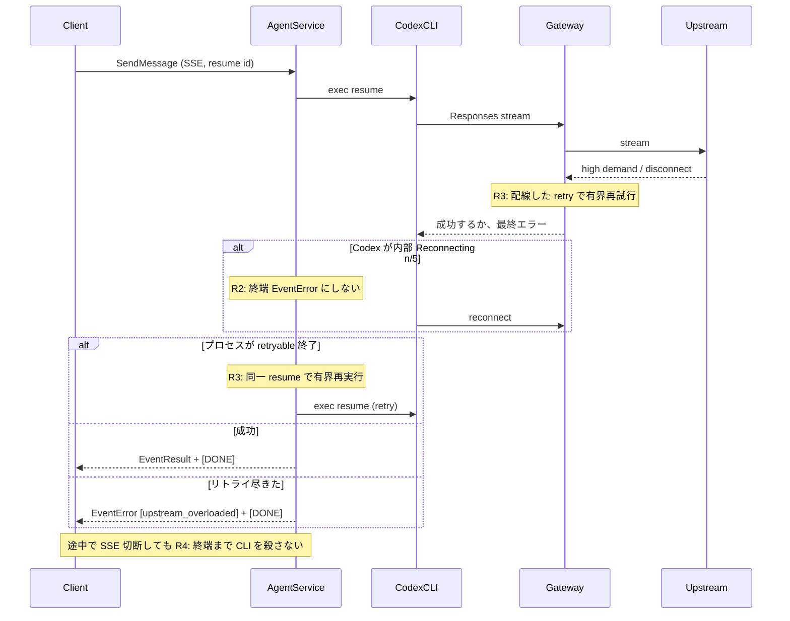

# 001: Codex ストリーム再接続エラーからのセッション復旧

> **関連 Issue**: [axsh/arctic-tern#41](https://github.com/axsh/arctic-tern/issues/41)

## 背景 (Background)

in-process の Tern（`server.New(...).Launch(...)`、報告当時 `v0.1.13`）で長寿命セッションを `resume+send` していると、上流が一瞬混雑しただけで Codex ターンが硬く失敗する。呼び出し側は同じ Tern `session_id` で送り直しても、Codex CLI が `exit status 1` を繰り返し、セッション再利用の実経路検証が止まっている。

### 現状の問題

1. **一時的な上流エラーを終端扱いにしている**
   - Codex CLI は上流ストリーム失敗時に最大 5 回まで再接続する。その途中で stderr（または stdout JSONL の `error` / `turn.failed`）へ次のような文言が出る。
     - `Reconnecting... 1/5 (We're currently experiencing high demand, which may cause temporary errors.)`
   - この文字列は Tern のソースには無い。Issue の `arctic_tern stream error:` 接頭辞も Tern の `log.Warn` には無く、呼び出し側の包み込みか CLI トレースの混在である。
   - Codex プロセスが非ゼロ終了すると、stderr **全体**が `EventError.Content` になり、SSE 経由で呼び出し側へ流れる（`codex CLI process exited with error`）。

2. **Tern 側に有界リトライも分類も無い**
   - `codingagent.Retry` / `IsRetryableError` は EOF・connection reset 等のみで、本番の Send 経路からは呼ばれない。
   - `llm_gateway.retry`（`max_retries` 等）は設定型だけ存在し、Bifrost / ストリーム handler に配線されていない。
   - Gateway は上流のストリームエラーチャンクを SSE `event: error` としてそのまま Codex へ転送する。吸収も再試行もしない。

3. **クライアント切断がプロセスを殺す**
   - Send は独立 `execCtx` を作るコメントがある（クライアント切断後もエージェントを動かすため）。
   - しかし SSE 側 `r.Context()` が切れると `client disconnected during SSE stream` のあと `finishActiveExecution` が走り、`agentSess.Close()` する。
   - Windows では `taskkill /F /T` ですぐプロセスツリーを殺す。Codex が 2/5 以降を試している最中でも中断する。
   - `client/v1` の `RunWithHandlers` は最初の `EventError` で即 return するため、再接続中のエラーイベントは SSE 切断を誘発しやすい。

4. **失敗後の resume が安全でない**
   - `StatusError` でも次の Send は API 上拒否されない。
   - 毎回新しい `codex exec resume <thread_id>` プロセスが立つ。中途半端に kill した thread をそのまま resume すると、同じ失敗が連鎖する。
   - 呼び出し側は「一時エラーだから待てばよい」のか「セッションを捨てるべきか」を区別できない。

### 技術的背景

- 1 ターンの Codex 実行は毎回 `CreateSession` で CLI を起動する。native id があれば `codex exec resume <id>`。
- stdout JSONL の `type:error` / `turn.failed` は即 `EventError`。stderr の reconnect 行は Debug ログだが、プロセス失敗時に結合されて Content になる。
- 観測モデル例: `gpt-5.6-terra`（LLM Gateway / Bifrost 経由）。混雑は上流プロバイダ側の事象である。
- Issue 側で websocket panic と固定ポート衝突は既に排除済みとあり、残っているのはライブ経路のストリーム復旧である。

### Claude Code の確認結果（レビュー時）

`claudecode` アダプタも **同じ Tern Send 経路**（独立 `execCtx`、SSE 切断後の `finishActiveExecution` → `Close()`）を通る。CLI 側の差分は次のとおり。

| 項目 | Codex | Claude Code |
|---|---|---|
| 起動 | 毎ターン `CreateSession` → `codex exec` / `exec resume` | 毎ターン `CreateSession` → `claude -p` / `--resume` |
| 上流 | `OPENAI` + Responses（`base_url={gateway}/v1`） | `ANTHROPIC_BASE_URL={gateway}`（`/v1/messages`） |
| 内部再接続メッセージ | `Reconnecting... n/5` / `high demand`（Issue で確認） | Tern ソースにもテストにも **該当文字列は無い**。Claude CLI が独自リトライしても Tern は解釈しない |
| stdout `error` 型 | `type:error` / `turn.failed` を即 `EventError` | プロトコルに `type:error` マッピングは無い。JSON パース失敗と `stream_event` の unmarshal 失敗だけ即 `EventError`（`Error` フィールド。`Content` は空になりうる） |
| `type:result` | `turn.completed` が結果 | `{type:result}` は **常に** `EventResult`。`is_error` を見ない |
| 非ゼロ終了 | stderr 全体を `EventError.Content` | **同じ**（`claude CLI process exited with error`） |
| Windows Close | `taskkill /F /T` | **同じ** |
| 本番 Retry | 未配線 | **同じ** |

結論: Issue #41 の固有文言とプロセス churn の再現核は Codex。ただし Claude も (1) 上流エラーは Gateway の Anthropic ストリームが同様に吸収しない、(2) プロセス非ゼロ終了は生 stderr で終端する、(3) SSE 切断で即 kill する。R1 分類・R4 切断時非 kill・Gateway retry は Claude にも効く。R3 の **プロセス再実行** を Claude 必須にする必要は、現状の再現ログが Codex 専用であるため無い。

### 本仕様で決めること

一時的な上流ストリーム障害を **分類可能な retryable エラー** として扱い、Tern 内の有界リトライで回復するか、回復不能なら呼び出し側がセッションを安全に扱うための分類エラーを返す。Codex の内部 5 回再接続を途中で殺さない。

---

## User Review Required

1. **対象エージェント**: Claude Code のアダプタをレビュー時に確認済み（上記「Claude Code の確認結果」）。`Reconnecting... 1/5` 相当の Tern 解釈は無く、Issue 再現核は Codex のまま。必須のプロセス再実行（R3）は Codex。R1 分類・R4 非 kill・Gateway retry は Send / Gateway 共通なので Claude にも適用する。Claude へのプロセス再実行は任意（R6）でよい。反対があれば必須範囲を広げる。
2. **リトライ階層**: Gateway で上流ストリームをリトライする（既存 YAML `llm_gateway.retry` を配線）ことと、AgentService で Codex プロセス終了後に同一 resume id で有界再実行することの両方を必須とする。どちらか一方だけでは、Issue の「プロセス churn」は止まらない。
3. **クライアント切断**: 一時エラー中に SSE クライアントが切れても、ターン完了（成功 / 分類済み失敗）までは CLI を kill しない。コメントどおり `execCtx` を生かし、切断はログに留める。
4. **失敗後のセッション状態**: 有界リトライが尽きた retryable 失敗では `StatusError` にしてよいが、`Error` に安定コード（例: `upstream_overloaded`）を残し、同じ `session_id` での後続 Send（resume）を API として禁止しない。スレッドが壊れている場合の修復は本仕様の対象外（任意で新規 native を切るヒントを返す程度）。

反対がなければこの 4 点で進める。

---

## 要件 (Requirements)

### 必須要件 (Must)

#### R1: 一時的な上流ストリームエラーを分類する

- 次を **retryable** と判定する（大文字小文字を無視した部分一致でよい）。
  - `Reconnecting...`
  - `We're currently experiencing high demand`
  - HTTP 429 / `too many requests` / `overloaded`
  - 既存 `IsRetryableError`（EOF、connection reset、broken pipe、connection refused、connectex）
- 判定入力は Codex stderr、stdout `error`/`turn.failed` の message、Gateway が上流から受けたエラーメッセージとする。
- retryable でない認証失敗・不明モデル・プロンプト検証エラーは従来どおり非 retryable 終端とする。
- SSE / JSON の失敗表現には、人が読むメッセージに加えて **安定コード** を含める。
  - retryable: `upstream_overloaded`（または同等の固定文字列）
  - 非 retryable: 現行どおりメッセージ主体でよいが、可能なら `upstream_error`
- 呼び出し側が `EventError.Content` だけをログしてもコードが残ること（例: 先頭または末尾に `[upstream_overloaded]`）。既存のテキスト Content を壊しすぎないこと。

#### R2: Codex の再接続を終端イベントにしない

- `Reconnecting... n/5` のような進行中メッセージを、ターン終端の `EventError` として SSE に出さない。
- stdout JSONL の `type:error` でも、本文が R1 の retryable 判定に当たる間は終端にしない。stderr Debug は維持してよい。
- Codex プロセスが **まだ生きている** あいだは、内部 5 回再接続を待つ。成功すれば通常どおり `EventResult`。
- プロセスが非ゼロ終了し、stderr が retryable のみなら、その Content を生 stderr ダンプのままクライアントへ流して終端としない（R3 の再実行へ回す）。非 retryable 終了は現行どおり `EventError`。

#### R3: 有界リトライで resume+send を回復する

- **Gateway**: `llm_gateway.retry` を Bifrost / ストリーム要求に配線する。未設定時の既定は有界であること（例: `max_retries` 0 を「リトライ無し」と読む現行コメントは、ゼロ値なら実装側の安全な既定（少なくとも 1〜数回）を使うか、YAML 既定をドキュメントする。**ゼロのまま放置して Issue を再現させたままにしない**）。
- **AgentService（Codex）**: 同一 Tern `session_id` / 同一 native resume id / 同一プロンプトで、プロセスが retryable 終了したときは有界回数だけ `CreateSession` + Send をやり直す。回数は設定可能とし、無制限は禁止。
- リトライ間隔は短い固定または既存 `RetryInterval` 相当。上流高負荷を悪化させない上限を持つ。
- 有界回数内で `EventResult` が出れば、呼び出し側から見てそのターンは成功とする（途中の reconnect 文言を成功パスの SSE に混ぜない）。
- 尽きても失敗なら R1 の分類エラーを **1 回だけ** 返し、そのターンでプロセスをこれ以上起こさない。

#### R4: クライアント切断で再接続中の CLI を殺さない

- SSE クライアントが切れても（`client disconnected during SSE stream`）、当該ターンが終端するまで `finishActiveExecution` → `Close()` → Windows `taskkill /F` を走らせない。
- 独立 `execCtx` を本当に生かす。切断時はセッション状態を `client disconnected before completion` で即 `StatusError` に固定しない（終端イベント待ち。既に非 retryable 失敗ならその結果を採用）。
- ターン終端後（成功・分類失敗どちらでも）は現行どおりレジストリ解除と Close を行う。busy 解除を忘れない。
- `client/v1` は retryable 分類の `EventError` を受けても、サーバがリトライを続ける場合はストリームを切らずに待つ。サーバが最終分類エラーを出して `[DONE]` したときだけ return する。
  - サーバが途中の reconnect を SSE に出さない（R2）なら、現行 `RunWithHandlers` の「最初の EventError で return」でも足りる。その場合クライアント変更は任意。

#### R5: 失敗しても同じ Tern セッションで後続 Send できる

- 分類済み retryable 失敗のあと、同じ `session_id` で次の Send（resume）ができる。409 busy は実行中のみ。
- 他エージェントの native id を resume に使わない（セッション可搬性仕様 R4 を破らない）。
- 本仕様は Wayfinder 正本の ingest を変えず、成功ターンだけ ingest する現行を維持する。失敗ターンで中途の reconnect ログを history に書かない。

### 任意要件 (Should / May)

#### R6: Claude / Wayfinder へのプロセス再実行（Should）

- R1 の分類器は全エージェント共通でよい。
- `claudecode` / `wayfinder` へのプロセス単位リトライは Codex と同じでなくてよい。切断で即 kill しない（R4）は共通にした方がよいが、本 Issue の必須ゲートは Codex。

#### R7: 壊れた native thread の自動再作成（May）

- resume が連続して同じ分類エラーになる場合に native id を捨てて新規 thread を始めることは本仕様の対象外。ヒント文字列を分類エラーに含めてよい。

#### R8: 実上流高負荷の自動緩和（May）

- モデル切替やレートリミット・キューイングは対象外。有界待機と分類までとする。

---

## 実現方針 (Implementation Approach)

### レイヤ



### 設計上の決定

1. **正本は分類関数 1 つ**
   - `codingagent.IsRetryableError` を拡張するか、stream 用の `IsRetryableUpstream(msg string) bool` を同じパッケージに置く。Gateway と Codex adapter と AgentService が同じ判定を使う。

2. **終端はプロセス生死で決める**
   - 生きている間の retryable ログは終端ではない。
   - 死んで retryable なら AgentService が再実行。
   - 死んで非 retryable、またはリトライ尽きたら終端 `EventError`。

3. **Gateway retry はストリーム開始失敗とチャンクエラーの両方**
   - `ResponsesStreamRequest` がすぐエラーを返す場合と、チャンクで `BifrostError` が来る場合。後者は接続を閉じてから有界再接続する。無限 `continue` で壊れたストリームを引きずるのは禁止。

4. **Windows kill のタイミング**
   - `Stop()` の `taskkill /F` はユーザー terminate とターン終了時のみ。SSE 切断ハンドラからは呼ばない。

5. **セッション可搬性との境界**
   - `wrapPromptWithSupplement` / origin ingest は本仕様で変更しない。失敗ターンを history に入れない既存 ingest を維持する。

6. **テスト容易性**
   - Codex 実 CLI 無しで、fake CLI（既存 `process_repro_test` 系）が reconnect 文言を stderr に出し、一度失敗して二度目に成功する経路を必須テストにする。
   - Gateway は httptest または stub Bifrost でエラーチャンク → 再試行成功を単体で見る。

---

## 検証シナリオ (Verification Scenarios)

Issue [#41](https://github.com/axsh/arctic-tern/issues/41) に書かれた再現手順（原文のまま）:

1. Start in-process Tern runtime with valid config (llm_gateway + agent_service + model_profiles).
2. Create a session and run repeated `resume+send` calls (long-lived session reuse scenario).
3. Under load/transient upstream instability, observe SSE stream reconnect warning.
4. Subsequent calls frequently fail with Codex CLI process exit and caller receives stream error.

期待（Issue 原文）:

- Transient upstream reconnects should be recoverable within Tern without causing repeated hard failures.
- `resume+send` should either:
  - eventually succeed after bounded retries, or
  - return a classified/recoverable error that allows safe session-level recovery without repeated process churn.

### シナリオ A: 再接続中は呼び出し側が失敗しない（必須・モック）

1. fake Codex が stderr に `Reconnecting... 1/5 (We're currently experiencing high demand, which may cause temporary errors.)` を出し、その後正常な JSONL でターンを完了する。
2. SendMessage（SSE）は `EventError` を出さず `EventResult` で終わる。
3. プロセスは 1 回だけ起動する（成功した内部再接続を Tern が kill しない）。

### シナリオ B: retryable プロセス終了後に同一 resume で回復する（必須・モック）

1. 1 回目のプロセスは retryable 文言を stderr に残して exit 1。
2. AgentService が同じ native resume id で 2 回目を起動し、2 回目は `EventResult`。
3. SSE クライアントは最終的に成功を見る。呼び出し側に生 stderr ダンプの終端エラーは出ない。
4. 起動回数は有界（2 回目で成功する設定でも上限を超えて起こさない）。

### シナリオ C: リトライが尽きたら分類エラーを 1 回返す（必須・モック）

1. すべての試行が retryable 終了する。
2. SSE に終端 `EventError` が 1 回だけ来る。Content に安定コード（`upstream_overloaded`）が含まれる。
3. その後、同じ `session_id` で次の Send が 409 以外で受け付けられる（busy が残らない）。

### シナリオ D: SSE 切断が再接続中の CLI を殺さない（必須・モック）

1. fake CLI が reconnect 文言のあと、意図的に遅延してから成功する。
2. 遅延中に HTTP クライアント（SSE）を切る。
3. fake CLI プロセスは遅延完了まで生存する（Windows でも即 `taskkill` されない）。
4. ターンはサーバ側で完了し、busy が解除される。

### シナリオ E: 非 retryable はリトライしない（必須・モック）

1. stderr / stdout が認証失敗など非 retryable。
2. プロセス再実行はしない。直ちに `EventError`。Gateway も同様に非 retryable を再試行しない。

### シナリオ F: Issue のライブ resume+send（任意・実 CLI）

Issue の再現手順を実 Codex / 実 Gateway で行う。必須ゲートではない。失敗するなら分類エラーで止まり、プロセスを無限に起こさないこと。

---

## テスト項目 (Testing)

手動確認だけの計画は禁止する。モック / fake CLI による自動テストを必須とする。実 CLI の LIVE は `llm` カテゴリの任意回帰とする。`t.Skip` は使わない。

### 単体テスト

```bash
./scripts/process/build.sh
```

Linux / Remote-SSH（Linux）では `./scripts/process/build.sh --skip-etc`。

対象:

- `IsRetryableUpstream`（名称は実装時に決定）: high demand / Reconnecting / 429 / 既存接続系 / 認証失敗
- Codex `ParseExecEvent`: retryable な `error` / `turn.failed` を終端 EventError にしない（または caller が無視できる印を付ける）
- Gateway: ストリーム開始失敗とエラーチャンクの有界リトライ、非 retryable は 1 回で返す
- `llm_gateway.retry` 未設定でも有界既定が効く
- AgentService: retryable 終了で同一 resume id 再実行、上限で分類エラー 1 回
- 切断時に `Close()` / `taskkill` が走らないこと（fake プロセスの生存で検証）

### 統合テスト（モック / fake CLI、必須）

```bash
./scripts/process/build.sh && ./scripts/process/integration_test.sh --categories common --specify "TestStreamReconnect"
```

Linux / Remote-SSH（Linux）では:

```bash
./scripts/process/build.sh --skip-etc && xvfb-run -a ./scripts/process/integration_test.sh --categories common --specify "TestStreamReconnect"
```

検証すること:

- `TestStreamReconnect_InProcessReconnectSucceeds`: シナリオ A
- `TestStreamReconnect_ProcessRetrySameResume`: シナリオ B
- `TestStreamReconnect_ExhaustedReturnsClassifiedError`: シナリオ C
- `TestStreamReconnect_ClientDisconnectDoesNotKillCLI`: シナリオ D
- `TestStreamReconnect_NonRetryableNoRetry`: シナリオ E

`go test -run` は正規表現のため、上記プレフィックスで LIVE を巻き込まない名前にする（`TestStreamReconnectLive` は別プレフィックス）。

### 統合テスト（実 CLI、任意回帰）

```bash
./scripts/process/build.sh && ./scripts/process/integration_test.sh --categories llm --specify "TestStreamReconnectLive"
```

Linux / Remote-SSH（Linux）では:

```bash
./scripts/process/build.sh --skip-etc && xvfb-run -a ./scripts/process/integration_test.sh --categories llm --specify "TestStreamReconnectLive"
```

- 前提欠落（`codex` が PATH に無い、vault / gateway 未設定）は Fail。`t.Skip` 禁止。
- 検証はシナリオ F。必須ゲートはモック側。

---

## 対象外

- websocket panic、固定ポート 3100 衝突（Issue 記載どおり既に試験側で排除済み）
- セッション可搬性（エージェント切替・Wayfinder 正本）の追加機能
- 上流プロバイダの容量増強やモデル自動切替
- native thread 破損時の自動新規作成（R7）
