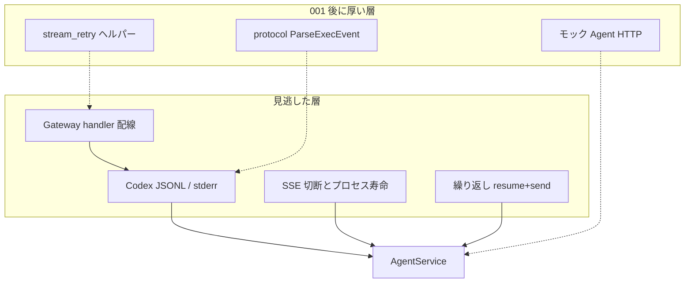

# 002: ストリーム再接続復旧のリグレッション被覆

> **先行仕様**: [001-Codex-Stream-Reconnect-Recovery.md](file://prompts/phases/001-phase02/branches/feat-session-migration/ideas/001-Codex-Stream-Reconnect-Recovery.md)
> **関連 Issue**: [axsh/arctic-tern#41](https://github.com/axsh/arctic-tern/issues/41)

## 背景 (Background)

Issue #41（Codex の `Reconnecting... n/5` / 上流 high demand を Tern が終端失敗にする）の復旧ロジックは 001 で入れた。見落とし調査の結論は、障害そのものより **「終端 EventError」「透過 Gateway」「成功パス E2E」という前提がテストで固定されていた** ことが原因である。

001 実装後も、回帰ネットは次の形に偏っている。

| あるもの | 足りないもの |
|---|---|
| `ParseExecEvent` が retryable JSONL を無視する単体 | 同一 OS プロセスが `error` のあと `turn.completed` を出す fake CLI |
| `StartProcess` の stderr reconnect + exit 0/1 | AgentService HTTP まで fake `codex` を通す経路 |
| `OpenStreamWithRetry` / `ShouldRetryStreamChunk` のヘルパー単体 | OpenAI / Anthropic ハンドラが実際にそれを呼ぶことの検証 |
| モック `codingagent.Agent` の `TestStreamReconnect_*` | モックを経由しない JSONL / Bifrost チャンク |
| LIVE `resume+send` 2 回 | 間に retryable を挟んだ 3 回以上。成功テキスト必須（分類エラー単独 PASS 禁止） |
| 切断時にモック `Close` が早いと失敗するテスト | 古い `DisconnectUpdatesStatus` 系との不変条件の衝突確認 |

これでは Bifrost 移行時と同じことが起きる。ヘルパーと YAML は残るが、本番呼び出しやプロセス層が再び空洞化しても CI は緑のままである。

本仕様の目的は新機能ではなく、**001 の不変条件を、見落としが起きた層で自動的に壊せるようにすること** である。本番コードの変更は、そのテストを成立させる最小限（fake CLI の進行遅延、ハンドラ試験用のスタブ、矛盾する既存テストの更新）に限る。



---

## User Review Required

1. **スコープはテスト厚みである。** 001 の復旧挙動をやり直さない。本番変更は fake CLI・試験用スタブ・矛盾テストの修正に限る。反対があれば「テストのためならリトライ実装の切り直しも可」とする。
2. **既存 E2E の `t.Skipf`（CLI 欠如・上流 API エラー）の一掃は任意（R8）。** 必須は本仕様で新設・強化するテストが `t.Skip` を使わないことと、LIVE が汎用 502 で PASS しないこと。
3. **必須ゲートは fake CLI / ハンドラスタブ。** 実 Codex / 実 Anthropic の LIVE は任意回帰。通すなら期待テキストを断言する。`[upstream_overloaded]` だけの成功は別テスト名にし、必須ゲートに混ぜない。
4. **`integration_test.sh` に `--categories` は無い。** 実行は `--specify` のみ。カテゴリ名 `llm` は位置づけの説明に使う。

反対がなければこの 4 点で進める。

---

## 要件 (Requirements)

### 必須要件 (Must)

#### R1: 同一プロセス内の reconnect を fake CLI で固定する

`installFakeCodexForProcessTest`（[file://shared/libs/go/codingagent/codex/process_repro_test.go](file://shared/libs/go/codingagent/codex/process_repro_test.go)）を、行の途中で待ける形に拡張してよい。

次を **StartProcess** で検証する。

- stdout に retryable な `{"type":"error",...}` または `turn.failed` を出し、プロセスは生きたまま、その後 `turn.completed` を出して exit 0。
- この間、終端 `EventError` は出ない。`EventResult` は 1 回。`CreateSession` 相当のプロセス起動は 1 回。
- 既存の stderr reconnect + exit 0 / retryable exit 1 / unauthorized は残す（退化させない）。

#### R2: fake CLI を AgentService HTTP まで通す

モック `codingagent.Agent` ではなく、PATH 上の fake `codex` で in-process Tern（`httptest` または `server.Launch`）に Send する。

- シナリオ R1 と同じ JSONL を 1 ターン流し、SSE に `"type":"error"` が無く `"type":"result"` がある。
- AgentService のプロセス再実行回数は 0（同一プロセス内復帰）。起動回数の観測方法は実装時に決めてよい（fake のカウンタファイル、または Resume id が 1 つ）。
- `t.Skip` 禁止。fake はテストがビルドする。

#### R3: Gateway ハンドラがリトライヘルパーを使うことを壊せる

[file://shared/libs/go/llmgateway/stream_retry.go](file://shared/libs/go/llmgateway/stream_retry.go) の単体だけでは不足とする。次を OpenAI Responses ストリームと Anthropic ストリームの **ハンドラ** で検証する。

- ストリーム open が 1 回目だけ retryable 失敗 → 2 回目成功。呼び出し回数が 2。
- データチャンク前の leading error chunk が retryable → 再 open。クライアントへ `event: error` を出さない（または最終成功のみ）。
- 非 retryable（認証失敗など）は 1 回でエラーを返す。
- `llm_gateway.retry` がゼロ値の `AppConfig` でも有界既定（現状 `max_retries=2`）がハンドラ経路で効く。ゼロを「リトライ無し」に戻したら失敗する。

ハンドラから Bifrost SDK を切り離すスタブが無ければ、本仕様の範囲で試験用フックを足してよい。本番の透過プロキシ挙動は変えない。

#### R4: 本番配線が再び死なないガード

ヘルパー削除や未使用化を CI で落とす。実装は次のいずれか（複数可）。

- ハンドラ試験（R3）が本番ファイル経由である（テスト専用の `OpenStreamWithRetry` 再実装を別パッケージに置いて緑にしない）。
- または、`openai/handler.go` と `anthropic/handler.go` が `NewRetryBudget` / `RetryLeadingChunk` / `openResponsesStream` 相当を参照していることをコンパイルまたはソース検査テストで固定する。

`codingagent.Retry` を Send から呼ぶことは必須にしない。001 の本番入口は AgentService のプロセス再実行と Gateway ストリーム予算である。その入口がテストから到達できない状態を禁止する。

#### R5: 繰り返し resume+send

同一 Tern `session_id` で Send を **3 回以上**。2 回目だけ fake が retryable 終了（exit 1 + high demand）し、3 回目は成功。1 回目と 3 回目は `EventResult`。

モック Agent でもよいが、R2 の fake CLI でやる方が望ましい。Issue の「長寿命セッション再利用」を 2 回 LIVE 成功だけで代用しない。

#### R6: SSE 切断とプロセス寿命の不変条件を一本化する

- クライアントが途中 cancel しても、R1 の遅延付き fake が `turn.completed` するまで `ProcessManager.Stop` / Windows `taskkill` 相当が走らない。
- ターン終端後は Close する。
- 既存の `TestStreamSSERelay_DisconnectUpdatesStatus` が「切断即 completed / 即 Close」を要求しているなら、001 の R4（切断はログ、終端まで drain）に合わせて更新する。矛盾した緑を残さない。

#### R7: LIVE の偽陽性を止める

[file://tests/llm_stream_reconnect_live_test.go](file://tests/llm_stream_reconnect_live_test.go) の `liveReconnectTurn` は、`EventResult` が無いときに `[upstream_overloaded]` だけで return している。必須ゲートに使わない。LIVE を残すなら:

- 成功判定は期待テキスト（または明確な `EventResult` + 非エラー）。
- 分類済み overload は **別テスト** とし、名前に `Overload` / `Classified` を含め、必須 `--specify` 集合に入れない。
- 前提欠落（CLI / vault）は Fail。`t.Skip` 禁止。

#### R8（既存テストの Skip）: 本仕様の新規コードでは禁止

新規・改修するテストは [file://prompts/rules/testing-rules.md](file://prompts/rules/testing-rules.md) 6.1 に従い `t.Skip` / `t.Skipf` を使わない。既存 `agentservice_e2e_test.go` / `codex_e2e_test.go` の Skip 一掃は任意要件 R10。

### 任意要件 (Nice to Have)

#### R9: 配線検査の汎用化

`yaml` の `retry:` キーを持つ設定構造体は、対応する本番呼び出し点が無ければ失敗する、といった汎用デッドコンフィグ検査。本仕様では Gateway / AgentService のストリーム復旧に限って必須（R4）とし、全 YAML への拡大は任意。

#### R10: 歴史的 E2E の Skip 削減

`codex CLI not found` や `API/model issues` の Skip を Fail にする、または fake / 分類エラーへ置き換える。範囲が広いので本仕様の必須ゲートにしない。

#### R11: `integration_test.sh --categories`

スキル文書にある `common` / `llm` 等。未実装のため本仕様では必須にしない。実装するなら `TestStreamReconnect` を `llm` に載せる。

---

## 実現方針 (Implementation Approach)

### 原則

- 001 の分類子・Gateway 予算・Codex プロセス再実行・切断時非 kill を前提にする。挙動変更が必要ならテストが要求する最小限。
- モック Agent の `TestStreamReconnect_*` は残してよい。それだけでは R1–R3 を満たしたことにしない。
- fake `codex` は既存の `go build` 一時バイナリ方式を再利用する。行間 sleep・起動カウンタ・stderr / exit は環境変数で足りる。
- Gateway は Bifrost SDK をインタフェース化するか、テストビルド用 fake を handlerctx に差す。プロダクションのチャンク転送形式は変えない。
- 中間ファイルは `tmp/` のみ。

### テスト命名

`go test -run` は正規表現である。

| プレフィックス | 用途 | 必須ゲート |
|---|---|---|
| `TestStreamReconnectRegression` | fake CLI HTTP・繰り返し Send・切断 | 必須 |
| `TestHandleResponsesStream_Retry` / Anthropic 同等 | ハンドラ配線 | 必須（単体。build.sh） |
| `TestStartProcess_InProcessRetryableThenResult` | プロセス内 JSONL | 必須（単体。build.sh） |
| `TestStreamReconnect_` | 既存モック | 残す。本仕様の追加必須ではない |
| `TestStreamReconnectLive` | 実 CLI 成功テキスト | 任意。`--specify` を必須コマンドに混ぜない |
| `TestStreamReconnectLiveOverload` | 分類エラー許容 | 任意。必須に混ぜない |

### 既存テストとの関係

- `TestStartProcess_ReconnectStderrDoesNotEmitEventErrorOnSuccess` は **stderr + 成功終了** であり、R1 の **stdout JSONL 進行中 error → 同一プロセスで completed** を代替しない。
- `TestStreamReconnect_InProcessReconnectSucceeds` はモックが最初から成功するため、reconnect を通っていない。名前は残してよいが、R1/R2 の代替に数えない。
- `TestStreamReconnect_ClientDisconnectDoesNotKillCLI` はモック `Close` 回数。R6 は fake プロセスの生存で再固定する。

---

## 検証シナリオ (Verification Scenarios)

ユーザーから手順の提示は無い。以下は本仕様の受け入れ手順である。

### シナリオ A: 同一プロセスで reconnect 後に成功（必須）

1. fake `codex` が stdout に retryable `error`、待ち、`turn.completed`、exit 0。
2. `StartProcess` および AgentService SSE の両方で `EventResult` 1 回、終端 `EventError` 0。
3. プロセス再実行回数 0。

### シナリオ B: Gateway ハンドラが 1 回リトライして成功（必須）

1. OpenAI と Anthropic のストリームハンドラに、1 回目だけ high demand / 429 相当を返すスタブを繋ぐ。
2. 2 回目は通常チャンク。
3. クライアントは成功ストリームを受け、leading `event: error` で終わらない。
4. ゼロ値 `RetrySettings` でも 2 回目が走る。

### シナリオ C: 3 回の resume+send（必須）

1. 同一 `session_id`。
2. 2 回目だけ fake が retryable exit 1。
3. AgentService が同一 resume id でプロセス再実行し、そのターンは成功 SSE。
4. 3 回目も成功。セッションは busy のまま残らない。

### シナリオ D: 切断しても fake プロセスを殺さない（必須）

1. fake が completed まで 300ms 以上かかる。
2. SSE クライアントを早期 cancel。
3. completed 前に Stop/taskkill 相当が無い。
4. その後ターンが終わり Close される。

### シナリオ E: 非 retryable は 1 回で終端（必須、既存の退化防止）

unauthorized 等。プロセス再実行しない。Gateway も 1 回。

### シナリオ F: LIVE 成功テキスト（任意）

実 Codex で 2 ターン。各ターンが指定文字列を含む `EventResult`。overload タグだけの PASS にしない。

---

## テスト項目 (Testing)

手動確認だけの計画は禁止する。`t.Skip` は本仕様の必須テストで使わない。

本リポジトリの `scripts/process/integration_test.sh` は `--categories` 未実装のため、**`--specify` のみ** を使う。位置づけ上のカテゴリは `llm`。

### 単体テスト（必須）

Windows:

```bash
./scripts/process/build.sh
```

Linux / Remote-SSH（Linux）:

```bash
./scripts/process/build.sh --skip-etc
```

`build.sh` が次を含むこと。

- `TestStartProcess_InProcessRetryableThenResult`（名称は実装時にこの意図が分かれば可）
- OpenAI / Anthropic ハンドラのリトライ配線テスト
- ゼロ値 `RetrySettings` がハンドラ経路で既定リトライすること
- R6 に合わせて更新した切断テスト

### 統合テスト（必須ゲート）

Windows:

```bash
./scripts/process/build.sh && ./scripts/process/integration_test.sh --specify "TestStreamReconnectRegression"
```

Linux / Remote-SSH（Linux）:

```bash
./scripts/process/build.sh --skip-etc && xvfb-run -a ./scripts/process/integration_test.sh --specify "TestStreamReconnectRegression"
```

`TestStreamReconnectLive` をこの正規表現に含めない（`Regression` プレフィックス）。

検証すること:

- シナリオ A の HTTP 面（R2）
- シナリオ C（R5）
- シナリオ D（R6）
- シナリオ E を統合側でも見る場合は同プレフィックスか、既存 `TestStreamReconnect_NonRetryableNoRetry` の残置でよい

### 統合テスト（任意 LIVE）

Windows:

```bash
./scripts/process/build.sh && ./scripts/process/integration_test.sh --specify "TestStreamReconnectLiveResumeSend$"
```

Linux / Remote-SSH（Linux）:

```bash
./scripts/process/build.sh --skip-etc && xvfb-run -a ./scripts/process/integration_test.sh --specify "TestStreamReconnectLiveResumeSend$"
```

- `$` で `TestStreamReconnectLiveClaudeResumeSend` や overload 用を巻き込まない。Claude LIVE を回すときだけ別 `--specify`。
- 期待テキストが無いターンは Fail。

---

## 対象外

- 001 で入れた復旧アルゴリズムの再設計（分類語彙、リトライ回数の変更、Claude へのプロセス再実行必須化）
- 上流プロバイダの容量、モデル自動切替、native thread 破損の自動修復
- セッション可搬性（Wayfinder 正本 / エージェント切替）の追加機能
- 全 E2E からの `t.Skip` 削除（任意 R10）
- `--categories` の実装（任意 R11）
