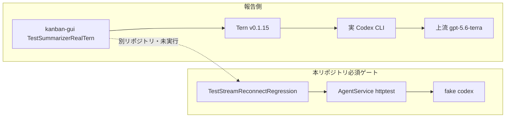
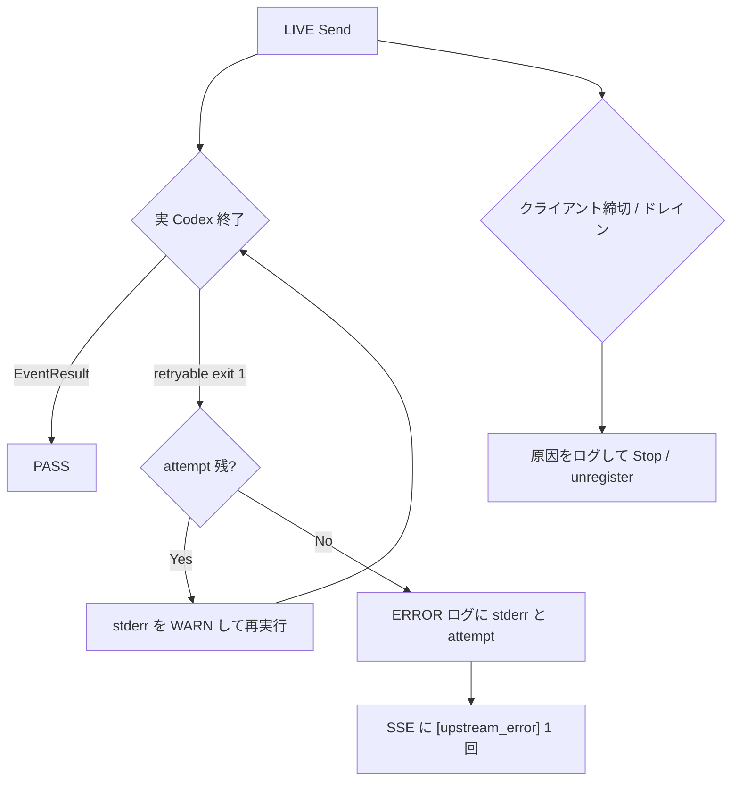

# 004: 実 Codex live-path を本リポジトリで検出可能にし、v0.1.15 後の残失敗を潰す

> **関連 Issue**: [axsh/arctic-tern#41](https://github.com/axsh/arctic-tern/issues/41)
> **報告コメント**: [issuecomment-5308746982](https://github.com/axsh/arctic-tern/issues/41#issuecomment-5308746982)
> **先行仕様**: [001-Codex-Stream-Reconnect-Recovery.md](file://prompts/phases/001-phase02/branches/feat-session-migration/ideas/001-Codex-Stream-Reconnect-Recovery.md), [002-Stream-Reconnect-Regression-Coverage.md](file://prompts/phases/001-phase02/branches/feat-session-migration/ideas/002-Stream-Reconnect-Regression-Coverage.md), [003-Codex-Exit-Status1-And-Stream-Timeout-Recovery.md](file://prompts/phases/001-phase02/branches/feat-session-migration/ideas/003-Codex-Exit-Status1-And-Stream-Timeout-Recovery.md)

## 背景 (Background)

[PR #43](https://github.com/axsh/arctic-tern/pull/43) / 計画 004（仕様 003）により、汎用 `exit status 1` の有界再実行、壊れた `exec resume` の自己修復、SSE 切断ドレイン 15 秒上限を入れた。報告側は `arctic-tern v0.1.15` で同じ Windows live-gate を再試験し、依然失敗と記録している。

### 報告（要約せず転記）

Retested with arctic-tern v0.1.15 on the same Windows live-gate path.

Result: still failing.

Current observed errors:
- codex CLI process exited with error (exit status 1)
- arctic_tern stream error: exit status 1 [upstream_error]
- arctic_tern stream error: stream read error: context deadline exceeded

Real-tern tests still fail in our run:
- TestSummarizerRealTern_SingleCardReady
- TestSummarizerRealTern_ResumeSameSession
- TestSummarizerRealTern_ResumeAfterKanbanRestart

So v0.1.15 did not resolve this reproducible live-path failure in our environment.

### v0.1.15 が意味すること

`[upstream_error]` が付いている以上、分類と「中間エラーを SSE に出さない」経路は動いている。 Tern は有界再実行のあと **枯渇して分類エラーを返した**。復旧そのもの（最終的に `EventResult` を返すこと）は失敗している。

`TestSummarizerRealTern_SingleCardReady` が落ちていることは、**resume 破損スレッドだけが原因ではない**ことを示す。初回 `codex exec`（native thread なし）でもプロセスが非ゼロ終了し、3 回程度の再実行では足りていない、または再実行中に呼び出し側が `context deadline exceeded` で切れている。

`stream read error: context deadline exceeded` は、呼び出し側（または Gateway 上流読み）の締切が、Codex 起動・有界再実行・15 秒ドレインの合計より短いときに出る。 Tern が分類エラーを返すのと並行して見える。

### なぜ本リポジトリの必須ゲートでは事前に落ちなかったか

これは実装漏れの「テストを書き忘れた」だけではなく、**検証の置き場所と前提が報告パスと一致していない**ためである。

| 報告側 live-gate | 本リポジトリの必須ゲート（計画 003 / 004） |
| :--- | :--- |
| 実 `codex` CLI + 実上流（観測ルート `gpt-5.6-terra`） | fake `codex`（PATH に挿したテスト用バイナリ） |
| kanban-gui の `TestSummarizerRealTern_*`（別リポジトリ） | `TestStreamReconnectRegression`（本リポジトリ `tests/`） |
| Windows 実運用相当の ResumeAndSend / クライアント締切 | HTTP `httptest` + クライアント締切はテスト側で 4 分など長め |
| 初回カード生成・同一セッション再利用・Kanban 再起動後 resume | fake が「1 回 exit 1 のあと成功」するシナリオ |

具体的な阻害は次のとおり。

1. **必須 `--specify` に LIVE を混ぜない方針**（仕様 002 URR3、計画 003/004 の Verification）。`TestStreamReconnectLiveResumeSend` は実 Codex を使うが、計画どおり必須ゲートから外している。fake 回帰が緑ならマージ可能。
2. **LIVE があっても報告と条件が違う。** `mustStartCodexE2EServer` はモデル `gpt-4o`。報告は `gpt-5.6-terra`。vault / keyring / 実プロバイダ負荷も共有していない。
3. **落ちているテストコードがこのリポジトリに無い。** `TestSummarizerRealTern_SingleCardReady` 等は kanban-gui（arctic-tern 外）の real-tern ゲートである。ワークスペースルール上、親ディレクトリや別リポジトリを読んで実行できない。
4. **fake は「既知の失敗を注入して回復すること」しか検証しない。** 実 Codex が stderr なしで何度も exit 1 する、または起動がクライアント締切より長い、という失敗は fake が成功 JSONL を書けば再現しない。
5. **枯渇後の `[upstream_error]` は計画 004 の意図どおりの終端である。** 必須ゲートは「1 回失敗→2 回目成功」を主に見ており、「実 CLI が 3 回とも死ぬ」「初回 Send が分類エラーで終わる」を不合格にしていない。

そのため、報告側の Windows live-gate で初めて見える失敗を、こちらの `build.sh` + `TestStreamReconnectRegression` では事前に赤にできない。



---

## User Review Required

レビューで確定した。以降の実装計画はこの 3 点を前提にする。

1. **実 Codex LIVE はマージ必須ゲートに入れる。** `TestLiveCodex_*` を `integration_test.sh --specify` の必須コマンドに含める。Codex CLI・vault・実 API が無い環境は `t.Skip` せず `t.Fatal`（仕様 002 の LIVE 方針）。CI が落ちることは承知のうえ。
2. **モデルは報告の `gpt-5.6-terra` に合わせない。** モデル名はすぐ変わる。既存 LIVE と同じ解決（サーバ既定 / `gpt-4o` 等の現行ヘルパー）を使う。特定プロバイダモデル名を仕様に固定しない。
3. **15 秒ドレインは残す。** `defaultSSEClientDrainTimeout`（15s）は変更しない。設定化・延長もしない。切断後に終端が来なければ 15 秒で `ProcessManager.Stop()` し busy を解除する現行動作を維持する。

本番の `process_retry` 既定（3 回 / 3 秒）は本仕様では変えない。枯渇時ログ（R2）を見てから別仕様とする。

---

## 要件 (Requirements)

### 必須要件 (Must)

#### R1: 報告 3 件と等価の実 Codex LIVE を本リポジトリ `tests/` に置く

kanban-gui のテストファイルは移植しない（別リポジトリ）。同じ失敗が見えるシナリオを `tests/` にコード化する。`t.Skip` / `t.Skipf` 禁止。`codex` が PATH に無い、vault が無い場合は仕様 002 どおり `t.Fatal`。

- `TestLiveCodex_SingleCardReady`: native resume なしの初回 Send。SSE に `"type":"result"` があり、`"type":"error"` が無い。本文に固定トークン（例: `live-card-ready`）を含む。
- `TestLiveCodex_ResumeSameSession`: 同一 HTTP `session_id` で 2 回 Send。2 回目も `EventResult`。`session_id` が変わらない。
- `TestLiveCodex_ResumeAfterInProcessRestart`: 1 回目 Send 成功後、同一プロセス内で AgentService 相当を止めずにセッションストアだけ残す、または in-process `Launch` を再起動して同じ `session_id` で Send。`EventResult`。`409` で終わらない。

モデル名はハードコードで報告側に合わせない。既存 `mustStartCodexE2EServer` / `createE2ESessionWithModel` の現行既定を使う。

#### R2: 枯渇した汎用 `exit status 1` を「理由が残る失敗」にする

再実行を使い切って `[upstream_error]` を返すとき、次を ERROR ログに含める（運用者が TRACE なしで見られること）。

- Tern `session_id`
- 試行番号と `max_attempts`
- その試行が `exec resume` か fresh `exec` か
- `AgentSessionID`（空ならその旨）
- Codex プロセスの stderr 全文（または末尾 8KiB）と `exit status`

SSE のクライアント向け本文は現行どおり分類タグ 1 回でよい。中間リトライは現行どおり SSE に出さない。

#### R3: 初回 Send（SingleCardReady 相当）は分類エラーだけでは不合格

本仕様で追加する `TestLiveCodex_SingleCardReady` は必須ゲートに含まれ、`EventResult` を要求する。`exit status 1 [upstream_error]` 単独は失敗。計画 004 の fake「1 回失敗→成功」は残すが、live 初回カードの代替にしない。

#### R4: `context deadline exceeded` を Tern 側で切り分ける

次をログまたは分類で区別する。

- クライアント SSE 切断（`r.Context()` の `ctx.Done()`）
- ドレイン上限による `ProcessManager.Stop()`
- Gateway / 上流の `context deadline exceeded`

呼び出し側に返す最終エラーが `stream read error: context deadline exceeded` のとき、Tern ログに上記のどれかを出す。ドレインで殺した場合は `[upstream_error]` に `client drain timeout` 由来であることがログで分かること。

#### R5: LIVE を必須 `--specify` に含める

マージ検証は fake 回帰に加え `TestLiveCodex_` を必ず実行する。正規表現が `TestStreamReconnectLive` まで飲みこまないこと（プレフィックスは `TestLiveCodex_` に限る）。

#### R8: 15 秒ドレインを維持する

`defaultSSEClientDrainTimeout` は 15 秒のまま。YAML 新フィールドは設けない。`WithSSEDrainTimeout` は試験専用のまま。

### 任意要件 (Nice to Have)

#### R6: `process_retry` 既定の変更

ログ（R2）を見てから `max_attempts` / `interval_seconds` を上げる。本仕様の必須にはしない。

#### R7: kanban-gui の `TestSummarizerRealTern_*` 本体の修正

対象外（別リポジトリ）。

---

## 実現方針 (Implementation Approach)



1. **LIVE シナリオは既存 `mustStartCodexE2EServer` / `sendE2EMessage` / `liveReconnectTurnMustSucceed` を再利用する。** 新規ヘルパーは `tests/` に置き、fake PATH を使わない。モデル名は報告側に固定しない。
2. **必須ゲートは 2 本。** `TestStreamReconnectRegression`（fake）と `TestLiveCodex_`（実 Codex）。`go test -run` は正規表現なので、後者は `Live` を含む既存 `TestStreamReconnectLive*` を飲み込まない。
3. **stderr 保持。** `codex/process.go` の `stderrBuf` は既に Wait 時に使う。枯渇時の AgentService は `term.content` に stderr 由来の文言が載っている。足りなければプロセス終了イベントに stderr を載せるフィールドは増やさず、`term.content` と attempt を ERROR ログに出す。
4. **締切の切り分け。** `streamSSERelay` の `clientGone`、`stopExecOnDrainTimeout`、Gateway `stream read error` は既に別関数にある。ログメッセージを一意文字列にし、LIVE 失敗時にどの文字列が出たかを autograde できるようにする。
5. **15 秒ドレインは変更しない。** 発火時は現行どおり WARN し、busy を解除する。
6. 中間ファイルは `tmp/` のみ。`--categories` は未実装のため付けない。

---

## 検証シナリオ (Verification Scenarios)

報告コメントの手順と結果を検証項目とする（要約しない）。

1. arctic-tern v0.1.15 相当（本ブランチ）を同じ Windows live-gate で再試験する。
2. 次のエラーが残るかどうかを見る。
   - `codex CLI process exited with error (exit status 1)`
   - `arctic_tern stream error: exit status 1 [upstream_error]`
   - `arctic_tern stream error: stream read error: context deadline exceeded`
3. 次の real-tern テストが残るかどうかを見る。
   - `TestSummarizerRealTern_SingleCardReady`
   - `TestSummarizerRealTern_ResumeSameSession`
   - `TestSummarizerRealTern_ResumeAfterKanbanRestart`
4. 本リポジトリ側では、上記 3 件と等価な `TestLiveCodex_*` が `EventResult` で終わること。分類エラー単独では不合格。
5. `TestLiveCodex_SingleCardReady` が落ちたときは、サーバ ERROR ログに試行番号と Codex stderr（空なら空である旨）があること。

---

## テスト項目 (Testing)

`integration_test.sh` に `--categories` は無い。未知フラグで失敗する。位置づけは `llm`。実行は `--specify` のみ。

Windows:

```bash
./scripts/process/build.sh
```

```bash
./scripts/process/build.sh && ./scripts/process/integration_test.sh --specify "TestStreamReconnectRegression" && ./scripts/process/integration_test.sh --specify "TestLiveCodex_"
```

Linux / Remote-SSH（Linux）:

```bash
./scripts/process/build.sh --skip-etc
```

```bash
./scripts/process/build.sh --skip-etc && xvfb-run -a ./scripts/process/integration_test.sh --specify "TestStreamReconnectRegression" && xvfb-run -a ./scripts/process/integration_test.sh --specify "TestLiveCodex_"
```

`TestLiveCodex_` は Codex / vault 欠落で Fatal する。フル `integration_test.sh`（フィルタなし）も `TestStreamReconnectLive*` と同様に落ちる。既知の制約であり、本仕様では Skip に戻さない。

kanban-gui の `TestSummarizerRealTern_*` は本リポジトリでは実行しない（R7）。

---

## 対象外

- Claude Code / Wayfinder 固有のプロセス再実行追加
- 上流プロバイダのクォータ・混雑そのものの解消
- kanban-gui テストコードの変更
- `--categories` の実装
