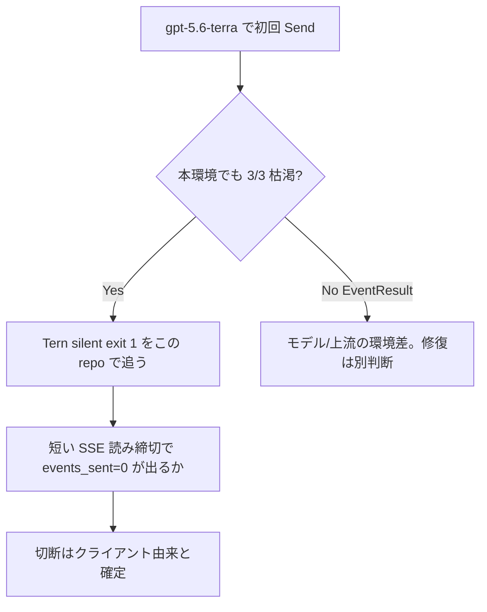
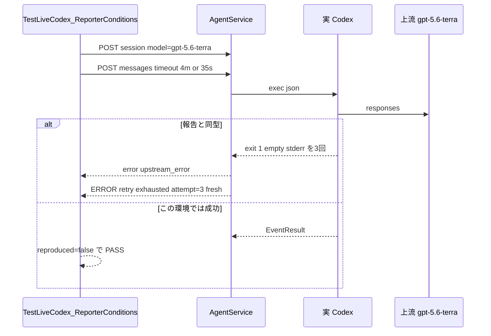

# 005: 報告条件で live 失敗を再現し、原因を切り分ける

> **関連 Issue**: [axsh/arctic-tern#41](https://github.com/axsh/arctic-tern/issues/41)
> **再現手順コメント**: [issuecomment-5309016142](https://github.com/axsh/arctic-tern/issues/41#issuecomment-5309016142)
> **観測ログコメント**: [issuecomment-5309034949](https://github.com/axsh/arctic-tern/issues/41#issuecomment-5309034949)
> **先行仕様**: [004-Live-Codex-Failure-Detection-And-Recovery.md](file://prompts/phases/001-phase02/branches/feat-session-migration/ideas/004-Live-Codex-Failure-Detection-And-Recovery.md)

## 背景 (Background)

[PR #44](https://github.com/axsh/arctic-tern/pull/44) / v0.1.16 は枯渇 ERROR `codex process retry exhausted` と必須 LIVE `TestLiveCodex_*`（モデル `gpt-4o`）を入れた。本リポジトリでは `gpt-4o` の 3 件が `EventResult` で緑だった。報告側は同じ v0.1.16 で kanban-gui live-gate が赤のままである。

仕様 004 の URR は「モデルを `gpt-5.6-terra` に合わせない」「`process_retry` 既定はログを見てから」だった。ログが揃った今、**修復（回数引き上げ等）の前に、提出された条件でこちらでも落ちるかを確認する**。落ちなければ環境差（モデル・クライアント締切・busy-recovery）であり、落ちれば Tern 側の silent exit 1 をこのリポジトリで追える。

kanban-gui の `TestSummarizerRealTern_*` と `kanban_summarizer_tern_live.sh` はこのワークスペース外であり、移植しない。等価条件を `tests/` に置く。

### 報告の再現手順（要約せず転記）

[issuecomment-5309016142](https://github.com/axsh/arctic-tern/issues/41#issuecomment-5309016142):

```
Detailed reproduction procedure (Windows, stable local setup)

1) Host setup
- OS: Windows 11
- Repo: sysnavi (kanban-gui project)
- arctic-tern version under test: v0.1.16
- Codex CLI installed and available on PATH
- OPENAI_API_KEY (or equivalent provider credential path used by your Tern config) is set

2) Update dependency to target version
- In features/kanban-gui:
  - go get github.com/axsh/arctic-tern@v0.1.16
  - go mod tidy

3) Sanity checks (should pass)
- From repo root:
  - ./scripts/process/build.sh --project kanban-gui
  - ./scripts/process/integration_test.sh --project kanban-gui --specify "TestSummarizerTernMock|TestSummarizerRealTern"

4) Real live gate (this is where failure reproduces)
- From repo root:
  - ./scripts/process/kanban_summarizer_tern_live.sh RealTern

5) Expected failure signatures in logs
- Repeated Codex process exits:
  - codex CLI process exited with error (exit status 1)
- Agent-side retry exhaustion:
  - codex process retry exhausted ... [upstream_error]
- Stream-level failures:
  - arctic_tern stream error: exit status 1 [upstream_error]
  - arctic_tern stream error: stream read error: context deadline exceeded
- Final test failure in live run:
  - FAIL: TestSummarizerRealTern_SingleCardReady
  - FAIL: TestSummarizerRealTern_ResumeSameSession
  - FAIL: TestSummarizerRealTern_ResumeAfterKanbanRestart

6) Typical behavioral sequence observed
- Tern runtime starts successfully (gateway + agent service healthy).
- First summarize request creates a session and starts Codex.
- During stream/resume cycles, Codex exits with status 1 repeatedly.
- Tern client retries, then busy-recovery path recreates sessions.
- Session continuity assertions fail and/or test ends with timeout/failed summary status.

7) Notes to avoid false positives
- We already eliminated local fixed-port conflicts by using dynamic ports in our real-tern test harness.
- We also fixed unrelated websocket read panic in kanban integration tests.
- Despite those local fixes, this live-path failure still reproduces.

If needed, I can provide a trimmed log bundle with timestamps around one failing run only.
```

### 報告の観測フィールド（要約せず転記）

[issuecomment-5309034949](https://github.com/axsh/arctic-tern/issues/41#issuecomment-5309034949):

```
Follow-up with requested concrete details.

1) Full fields for `codex process retry exhausted`
(From v0.1.16 live-gate run)

- 2026-08-17T03:18:59+09:00 ERROR codex process retry exhausted agent_session_id=01a00bcb-f668-7ab3-aa16-2f08327f5cca agent_session_id_empty=false attempt=3 component=agentservice exit_status=1 max_attempts=3 resume_mode=fresh session_id=e3d467ab51dae4c01d327ac773b76a21 stderr=exit status 1 [upstream_error] stderr_empty=false terminal_content=false
- 2026-08-17T03:21:02+09:00 ERROR codex process retry exhausted agent_session_id=01a00bcd-dafc-7140-b8be-555fca8cdd03 agent_session_id_empty=false attempt=3 component=agentservice exit_status=1 max_attempts=3 resume_mode=fresh session_id=c1f89d3094d66a45cbb0050362b5930e stderr=exit status 1 [upstream_error] stderr_empty=false terminal_content=false
- 2026-08-17T03:23:21+09:00 ERROR codex process retry exhausted agent_session_id=01a00bcf-f340-7ad0-a503-b0550c390e34 agent_session_id_empty=false attempt=3 component=agentservice exit_status=1 max_attempts=3 resume_mode=fresh session_id=d6af90859e46f4ccd2b4d09d925e05a8 stderr=exit status 1 [upstream_error] stderr_empty=false terminal_content=false
- 2026-08-17T03:25:32+09:00 ERROR codex process retry exhausted agent_session_id=01a00bd1-f8b3-7aa2-870e-9eaeb90924d7 agent_session_id_empty=false attempt=3 component=agentservice exit_status=1 max_attempts=3 resume_mode=fresh session_id=a0ed8ae463770f11dcfee6f7d64f7344 stderr=exit status 1 [upstream_error] stderr_empty=false terminal_content=false

2) Unique log for one of deadline/cutoff points
- SSE disconnect marker:
  - 2026-08-17T03:19:32+09:00 WARN client disconnected during SSE stream component=agentservice events_sent=0 session_id=e3d467ab51dae4c01d327ac773b76a21
- Gateway lifecycle marker:
  - 2026-08-17T03:21:42+09:00 INFO proxy server shutting down component=llmgateway

3) Model name + client SSE timeout seconds
- Model name seen in runtime logs: `gpt-5.6-terra`
- From kanban-gui client code (`internal/summarizer/arctic_tern_client.go`):
  - `defaultStreamDrainTimeout = 3 * time.Second`
  - This is used by `drainSSE(...)` after result reception unless overridden by config.
- Config side (`features/kanban-gui/config.yaml`):
  - `summarizer.tern.stream_drain_timeout` is currently unset in our test config (so default 3s applies).
- Related overall per-card timeout in config defaults (`internal/config/config.go`):
  - `Summarizer.CardTimeoutSeconds` default is 300s.

4) Trimmed log snippet (requested)

[trimmed log begin]
2026-08-17T03:17:29+09:00 INFO proxy server started component=llmgateway port=63158
2026-08-17T03:17:30+09:00 INFO starting codex CLI process ... model="gpt-5.6-terra" ... base_url="http://localhost:63158/v1" ...
2026-08-17T03:17:57+09:00 WARN codex CLI process exited with error ... exit status 1
2026-08-17T03:18:59+09:00 ERROR codex process retry exhausted ... attempt=3 max_attempts=3 resume_mode=fresh stderr=exit status 1 [upstream_error]
2026/08/17 03:18:59 WARN tern_provider: send prompt retry ... error="arctic_tern stream error: exit status 1 [upstream_error]"
2026/08/17 03:19:30 WARN tern_provider: send prompt retry ... error="arctic_tern stream error: stream read error: context deadline exceeded"
2026/08/17 03:19:30 WARN summarizer: provider error ... error="context deadline exceeded"
2026-08-17T03:19:32+09:00 WARN client disconnected during SSE stream component=agentservice events_sent=0 session_id=e3d467ab51dae4c01d327ac773b76a21
2026-08-17T03:21:42+09:00 INFO proxy server shutting down component=llmgateway
--- FAIL: TestSummarizerRealTern_SingleCardReady
--- FAIL: TestSummarizerRealTern_ResumeSameSession
--- FAIL: TestSummarizerRealTern_ResumeAfterKanbanRestart
[trimmed log end]
```

報告ログから既に読み取れる事実（再現確認の合格条件に使う）:

- モデルは `gpt-5.6-terra`。`tests/testdata/model_profiles.yaml` の openai 一覧にこの名前は無い（`gpt-4o` 等のみ）。
- 枯渇は 4 行とも `attempt=3` / `max_attempts=3` / `resume_mode=fresh` / `exit_status=1` / `stderr=exit status 1 [upstream_error]` / `terminal_content=false`。
- 4 行とも Tern `session_id` が異なる。
- 切断は `client disconnected during SSE stream` かつ `events_sent=0`。ドレイン Timeout 文言と Gateway `upstream stream read deadline exceeded` は報告に無い。
- kanban-gui の `defaultStreamDrainTimeout = 3s` は結果受信後の `drainSSE`。カード全体は 300s。`03:18:59` 枯渇から `03:19:30` 締切までの約 31 秒は、この 3s でも 300s でもない。



---

## User Review Required

実装計画に入る前に、次を確定してほしい。

1. **本仕様の再現テストだけ `gpt-5.6-terra` を使う。** 既存 `TestLiveCodex_*` の `liveCodexModel`（`gpt-4o`）は変えない。仕様 004 URR2（モデルを報告に固定しない）の例外は、この再現用テストに限る。
2. **`process_retry` 既定（3 回 / 3 秒）と 15 秒ドレインは本仕様では変えない。** 再現と切り分けが目的。回数変更は原因が「一過性で回数不足」と分かってから別仕様。
3. **kanban-gui は実行しない・移植しない。** `busy-recovery` による session 作り直しは呼び出し側。本リポジトリでは HTTP クライアントの短縮タイムアウトと、枯渇後の再 Send が 409 かどうかまでを見る。
4. **再現用テストは `t.Skip` 禁止。** PATH に `codex` が無い、vault が無い、`gpt-5.6-terra` がプロファイルに無くて 400 になる、は `t.Fatal`。プロファイルへモデル名を追加してから実行する。
5. **既存 `TestLiveCodex_`（`gpt-4o`）は必須ゲートのまま残す。** 報告モデル用テストの `--specify` は別フィルタ（例: `TestLiveCodex_ReporterConditions`）にする。報告モデルがこの環境でも死ぬ場合、それを `TestLiveCodex_` に混ぜると `gpt-4o` 成功まで巻き添えになる。

---

## 要件 (Requirements)

### 必須要件 (Must)

#### R1: `gpt-5.6-terra` を LIVE セッション作成で使えるようにする

`tests/testdata/model_profiles.yaml` の openai `models` に `name: gpt-5.6-terra` を追加する。`mustStartCodexE2EServer` はこのファイルを `model_profiles_path` にしている。未登録のままだと `handleCreateSession` が unsupported model で 400 になり、報告条件に到達しない。

本番 `settings/example/model_profiles.yaml` への追加は任意（R7）。

#### R2: 報告モデルでの初回 Send 再現テスト

`tests/` に `TestLiveCodex_ReporterConditions_SingleCardReady` を追加する。

- `mustStartCodexE2EServer` を使う（`t.Skip` 禁止）。
- セッション作成の `model` は `"gpt-5.6-terra"`（`liveCodexModel` の `gpt-4o` は使わない）。
- `session_dir` は送らず `{work_dir}/.tern/{id}`（既存 `createLiveCodexSession` と同じ）。
- プロンプトは固定トークンを要求する（例: `Reply with exactly: live-terra-ready`）。
- HTTP クライアント待ちは既存 `liveReconnectTurnMustSucceed` と同じ `4 * time.Minute`（報告のカード 300s に近い「十分長い」側）。短い締切は R3。
- **アサーションは「必ず EventResult」ではない。** 次のいずれか一方を **観測結果としてコードとテストログに残す**:
  - **再現成功（報告と同型）**: SSE に `"type":"error"` があり content が `exit status 1` と `[upstream_error]` を含む。`"type":"result"` が無い。サーバ ERROR に `codex process retry exhausted`、`attempt=3`、`max_attempts=3`、`resume_mode=fresh`、`exit_status=1`、stderr が実質 `exit status 1`（CLI 本文なし）。
  - **再現失敗（この環境では通る）**: `"type":"result"` があり `"type":"error"` が無い。本文に固定トークンを含む。テストは **PASS** し、ログに「gpt-5.6-terra では枯渇しなかった」を残す。
- どちらでも `t.Skip` しない。再現しなかったことを FAIL にはしない（環境差を不合格にしない）。再現したことを「テスト失敗」にもしない（いまは修復しない）。判定はテスト名と `t.Logf` で明示する。

実装上、Go の `testing` は再現＝FAIL にしやすい。次で固定する: **再現しても `t.Error` しない。** `t.Logf("reproduced_reporter_exhaustion=true")` または `t.Logf("reproduced_reporter_exhaustion=false")`。計画の検証ステップでログを読む。CI が緑のままモデル差を記録できるようにする。

例外: サーバ起動失敗、400（プロファイル漏れ）、PATH なしは Fatal（前提欠落）。

#### R3: 約 31 秒の SSE 読み切断を本リポジトリで出す

報告は枯渇の約 31 秒後に `stream read error: context deadline exceeded` と `client disconnected during SSE stream` / `events_sent=0` である。kanban-gui の 3s drain とは別。

`TestLiveCodex_ReporterConditions_ShortSSERead` を追加する。

- モデル `gpt-5.6-terra`。
- `sendE2EMessage` 相当の `http.Client{Timeout: 35 * time.Second}`（報告の 31 秒付近。延長して隠さない）。
- 切断後、AgentService ログに `client disconnected during SSE stream` が出ること。可能なら `events_sent` を記録する。
- `SSE drain timed out; stopping agent process` と `upstream stream read deadline exceeded` が **必須ではない**（報告にも無い）。出たらログする。
- Codex 欠落は Fatal。

#### R4: 枯渇フィールドをテストから読めるようにする

LIVE サーバは `server.Launch` の stdout ロガーである。再現判定に `attempt` 等が要る。次のいずれか（実装計画で一方に固定）:

- `server.WithLogger` で capture logger を渡し、ERROR `codex process retry exhausted` の kv を読む。`Launch` がオプションを無視するなら、
- テストがサーバログファイル（`tmp/` は実行時のみ。リポジトリへはコミットしない）を読む。

確認するキー: `attempt`、`max_attempts`、`resume_mode`、`exit_status`、`stderr`、`session_id`、`agent_session_id_empty`、`terminal_content`。

#### R5: 再現のあと原因メモを計画チェックリストで埋める（コード修復はしない）

実装実行の Verification で、R2 の `reproduced_reporter_exhaustion` の真偽に応じて次を記録する（実装計画の Verification / 計画末尾の判定欄。仕様書は編集しない想定でも、計画に空欄を置く）。

| 観察 | 解釈 |
| :--- | :--- |
| terra で 3/3 枯渇、stderr が exit status 1 のみ | Tern + このモデル/上流で silent exit 1 が再現。修復は回数でもモデル経路でも次仕様 |
| terra で EventResult | 004 の gpt-4o LIVE と同じ。報告特有（モデルまたは kanban クライアント） |
| 短縮 Timeout で切断 + events_sent=0 | クライアント締切が Gateway deadline ではないことの再現 |
| 枯渇後すぐ再 Send が 409 | busy / ドレイン中。kanban busy-recovery の入力になり得る |
| 枯渇後すぐ再 Send が 200 で別 session をテストが作る | 本リポジトリのヘルパーは同一 ID を使う。作り直しは kanban 側 |

#### R6: 検証コマンド

`integration_test.sh` に `--categories` は無い。付けない。

Windows:

```bash
./scripts/process/build.sh && ./scripts/process/integration_test.sh --specify "TestLiveCodex_ReporterConditions"
```

Linux / Remote-SSH（Linux）:

```bash
./scripts/process/build.sh --skip-etc && xvfb-run -a ./scripts/process/integration_test.sh --specify "TestLiveCodex_ReporterConditions"
```

正規表現 `TestLiveCodex_ReporterConditions` は `TestLiveCodex_SingleCardReady` にマッチしない。既存必須ゲート `TestLiveCodex_` は本仕様の `--specify` に混ぜない（terra 枯渇のログが gpt-4o テストに交ざるのを避ける）。gpt-4o ゲートは従来どおり別コマンド。

### 任意要件 (Nice to Have)

#### R7: `settings/example/model_profiles.yaml` へ `gpt-5.6-terra` を追加

再現テストには testdata だけで足りる。

#### R8: 35 秒以外の Timeout テーブル（20s / 60s）

R3 の 35s で足りる。増やさない。

---

## 実現方針 (Implementation Approach)

1. **プロファイル。** `tests/testdata/model_profiles.yaml` の openai models に `gpt-5.6-terra` を追加する。mode は既存の Chat Completions 系と同じ（`gpt-5.3-codex` のような `mode: responses` は、Codex 側の `wire_api=responses` とは別。モデルエントリに responses を付けない）。
2. **ヘルパー。** `createLiveCodexSession` をモデル引数付きにするか、`createLiveCodexSessionWithModel(t, baseURL, workDir, "gpt-5.6-terra")` を `tests/llm_live_codex_test.go` に追加する。`liveCodexModel` 定数は `gpt-4o` のまま。
3. **ロガー。** `mustStartCodexE2EServer` が logger を差し込めないなら、再現用に `mustStartCodexE2EServerWithLogger` を同ファイルへ追加する。capture は仕様 004 / 計画 005 の `captureLogger` と同型でよい。
4. **再現判定。** `testing` の失敗にしない。`t.Logf("reproduced_reporter_exhaustion=%v", ...)` を必須にする。実装計画の Verification がログを読む。
5. **短い Timeout。** `http.Client{Timeout: 35 * time.Second}`。キャンセル後に capture の Warn `client disconnected during SSE stream` を待つ（既存 `TestStreamSSERelay_DisconnectLogsClientGone` と同じ待機ループ、上限は数秒）。
6. **修復禁止。** `MaxAttempts`、ドレイン 15s、分類ロジック、self-heal、Gateway retry は触らない。
7. 中間ファイルは `tmp/` のみ。`--categories` は付けない。



---

## 検証シナリオ (Verification Scenarios)

1. 報告コメントの kanban 手順（上文に全文転記）は **本リポジトリでは実行しない**。
2. 本リポジトリで `TestLiveCodex_ReporterConditions_SingleCardReady` を実 Codex + vault 付き Windows で実行する。
3. ログに次があるかを見る（報告と同型なら reproduced=true）。
   - `codex CLI process exited with error` および `exit status 1`
   - `codex process retry exhausted` の `attempt=3` `max_attempts=3` `resume_mode=fresh` `stderr` が実質 `exit status 1`
   - SSE `[upstream_error]`
4. `TestLiveCodex_ReporterConditions_ShortSSERead` で 35s クライアント Timeout のあと `client disconnected during SSE stream` を見る。`events_sent` を記録する。
5. 既存 `TestLiveCodex_SingleCardReady`（`gpt-4o`）は別コマンドで緑のままであることを確認する（退行防止）。

## テスト項目 (Testing)

位置づけは `llm`。`--categories` は未実装。`--specify` のみ。

報告モデル再現（本仕様）:

```bash
./scripts/process/build.sh && ./scripts/process/integration_test.sh --specify "TestLiveCodex_ReporterConditions"
```

既存 gpt-4o ゲート（退行）:

```bash
./scripts/process/build.sh && ./scripts/process/integration_test.sh --specify "TestLiveCodex_SingleCardReady"
```

Linux / Remote-SSH では `build.sh --skip-etc`、各 `integration_test.sh` を `xvfb-run -a` でラップする。

kanban-gui の `./scripts/process/kanban_summarizer_tern_live.sh RealTern` は本リポジトリに無い。実行しない。

## 対象外

- `process_retry.max_attempts` / `interval_seconds` の変更
- `defaultSSEClientDrainTimeout`（15s）の変更
- kanban-gui の busy-recovery / `defaultStreamDrainTimeout` 3s の修正
- `liveCodexModel` を `gpt-5.6-terra` に差し替えること
- Claude Code / Wayfinder 固有の再実行
- `--categories` の実装
