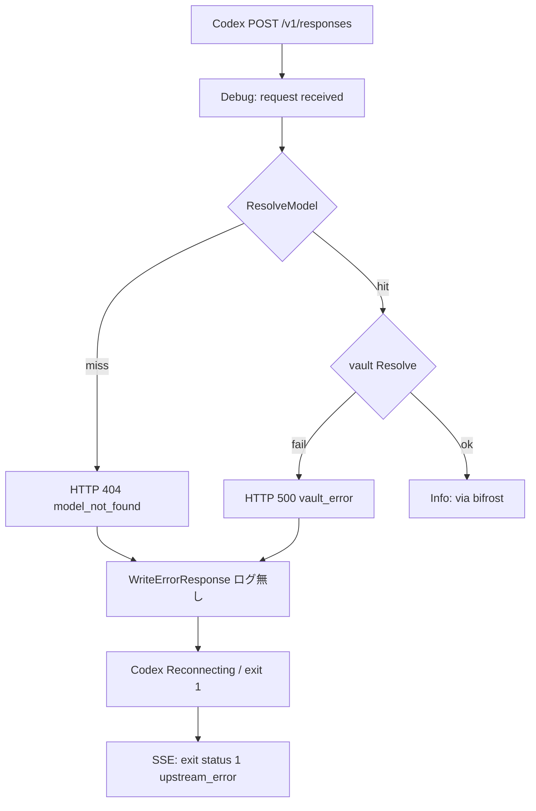
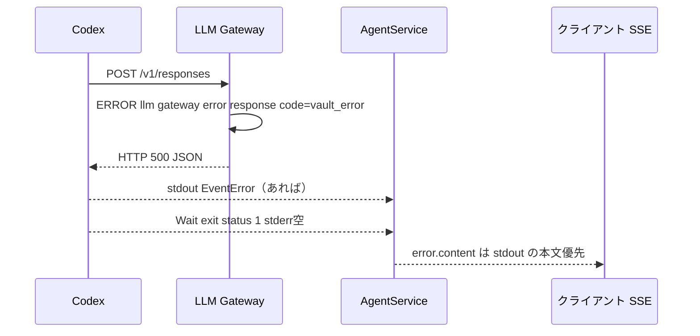

# 006: Gateway 失敗をログと SSE でクライアントが判断できるようにする

> **関連 Issue**: [axsh/arctic-tern#41](https://github.com/axsh/arctic-tern/issues/41)
> **先行**: [005-Reproduce-Reporter-Live-Conditions.md](file://prompts/phases/001-phase02/branches/feat-session-migration/ideas/005-Reproduce-Reporter-Live-Conditions.md)
> **kanban 最終コメント**: RealTern は `vault.backends: [keyring]` に揃えたあと `gpt-5.6-terra` で PASS。再現経路の原因は呼び出し側 vault 未設定。本仕様はその切り分け不能を Tern API / ログ側で防ぐ。

## 背景 (Background)

#41 の live-gate は、Tern LIVE（`vault.backends: [keyring]`、`gpt-4o`）では約 10 秒で `EventResult`、kanban RealTern（`vault.backends: [env]`、`TERN_VAULT_OPENAI_DEFAULT` unset、`gpt-5.6-terra`）では約 27 秒 × 3 の `exit status 1` と `codex process retry exhausted`、SSE 本文 `exit status 1 [upstream_error]` に見えた。

切り分けの結果:

- Gateway は `openai responses request received ... model=gpt-5.6-terra path=/v1/responses` まで到達していた。
- `openai responses request via bifrost` は、モデル解決 **および** vault 解決の **あと** にしか出ない（[openai/handler.go](file://shared/libs/go/llmgateway/openai/handler.go)）。
- `vault://providers/openai/default` は env backend では **`TERN_VAULT_OPENAI_DEFAULT`**（`OPENAI_API_KEY` ではない）。unset なら `Resolve` 失敗 → HTTP 500、本文 `failed to resolve API key from vault`、code `vault_error`。
- `handlerctx.WriteErrorResponse` は JSON を書いて **ログしない**。ログを 404/500 文字列で grep しても見つからない。
- Codex は 500 を在庫文言 `Reconnecting... 1/5 (We're currently experiencing high demand, which may cause temporary errors.)` に言い換え、5/5 のあと stderr 空で `exit status 1`。
- [codex/process.go](file://shared/libs/go/codingagent/codex/process.go) は stderr が空なら `errMsg = err.Error()`（`exit status 1`）を使い、stdout 上の 404/500/Reconnecting を終端分類に使わない。
- AgentService SSE と枯渇 ERROR の `stderr` は実質 `exit status 1 [upstream_error]`。クライアントは vault / モデル未登録 / 真の上流混雑を分岐できない。

kanban 側は keyring に揃えてこのレーンを PASS にした。故障そのものは呼び出し側設定である。**判断不能だったのは Tern のエラーログ不足と、SSE 終端が Wait() の `exit status 1` だけだから**である。`process_retry` 既定（3 / 3 秒）は変えない。同じ 500 を延ばすだけである。



---

## User Review Required

実装計画に入る前に、次を確定してほしい。

1. **`process_retry` 既定（3 回 / 3 秒）と 15 秒ドレインは変えない。** 本仕様は観測と終端メッセージの正確さ。回数変更は対象外。
2. **Gateway HTTP JSON の schema は変えない。** `type` / `message` / `code` / `status` はそのまま。足すのはログと、AgentService が既に持つ SSE `error.content` の中身。
3. **Codex が 500 本文を捨てて `high demand` だけ出す場合、SSE は高負荷に見え得る。** そのときも Gateway ERROR ログには `vault_error` が残ること。完全な HTTP 本文の SSE 転送は、Codex が stdout に残した範囲までとする。
4. **kanban-gui は移植しない。** 検証は本リポジトリの単体・統合のみ。

---

## 要件 (Requirements)

### 必須要件 (Must)

#### R1: Gateway のエラー応答を ERROR ログする

`handlerctx.WriteErrorResponse`（または全呼び出しを通る薄いラッパ）で、HTTP を書く直前に ERROR ログする。DEBUG だけでは足りない（RealTern の既定は `info` でも、ERROR は出る必要がある。調査では `debug` の `request received` しか手掛かりが無かった）。

メッセージ本文（変更禁止の定数）:

```text
llm gateway error response
```

フィールド（スネークケース）:

| キー | 値 |
| :--- | :--- |
| `status` | `GatewayError.Status`（例: 404, 500, 503, 413） |
| `code` | `GatewayError.Code`（例: `model_not_found`, `vault_error`, `not_configured`） |
| `type` | `GatewayError.Type` |
| `message` | `GatewayError.Message` |
| `path` | リクエストパス（分かるなら。例: `/v1/responses`） |
| `method` | HTTP メソッド |
| `model` | パース済みモデル名（パース前失敗なら空でよい） |

対象は OpenAI Responses / Chat Completions、Anthropic Messages、Google 等、`WriteErrorResponse` を使う全経路。個別 handler にだけログを足して他経路を残すのは禁止。

vault 失敗の現行本文（変更しない）:

```text
failed to resolve API key from vault
```

code: `vault_error`、status: 500。

モデル未登録の現行本文（変更しない）:

```text
model not found: ` + req.Model
```

code: `model_not_found`、status: 404。

`via bifrost` の Info は成功経路のまま。エラーでは出ない。

#### R2: Codex 終端エラーは stderr 空なら stdout の最後のエラーを使う

[codex/process.go](file://shared/libs/go/codingagent/codex/process.go) の `cmd.Wait()` 失敗時:

現行:

```go
errMsg := strings.TrimSpace(stderrBuf.String())
if errMsg == "" {
    errMsg = err.Error()
}
```

変更後:

1. `stderrBuf` が空でない → 現行どおり stderr を `errMsg` にする。
2. stderr が空 → そのプロセスの stdout から得た **最後の** `codingagent.EventError` の `Content` を `errMsg` にする（例: `unexpected status 404 Not Found: model not found: gpt-4o`、または `Reconnecting... 5/5 (...)`）。
3. それでも空 → 現行どおり `err.Error()`（`exit status 1`）。

この `errMsg` を `IsNonRetryableError` / `IsRetryableUpstream` / `ClassifiedErrorContent` と SSE へ渡す `StreamEvent{Type: EventError, Content, Retryable}` に使う。枯渇 ERROR の `stderr` フィールドも同じ文字列になる（AgentService は既に terminal content を載せる）。

#### R3: 設定ミスは process 再実行しない

[codingagent/retry.go](file://shared/libs/go/codingagent/retry.go) の `IsNonRetryableError` に次を足す（小文字比較、既存の `model not found` は残す）。

```text
failed to resolve api key from vault
vault_error
unexpected status 404
unexpected status 401
unexpected status 403
```

`unexpected status 500` は汎用 5xx の再試行を残すため **足さない**（vault 500 は本文 `failed to resolve api key from vault` / `vault_error` で非再試行）。

R2 のあと、404 本文が `errMsg` に乗れば既存 `model not found` でも非再試行になる。vault 本文が Codex stdout に残れば R3 で非再試行。残らなければ Gateway ERROR ログだけが手がかり（URR3）。

#### R4: 単体テストで 404 と vault 500 をログ・HTTP の両方で固定する

モック Router / Vault の httptest。未知モデル → 404 JSON + ERROR `llm gateway error response` の `code=model_not_found`。vault `Resolve` 失敗 → 500 JSON + ERROR の `code=vault_error`。`via bifrost` は出ない。

#### R5: 検証コマンド

`integration_test.sh` に `--categories` は無い。付けない。

Windows:

```bash
./scripts/process/build.sh && ./scripts/process/integration_test.sh --specify "TestGatewayErrorResponseLog|TestCodexEmptyStderrUsesStdoutError"
```

Linux / Remote-SSH（Linux）:

```bash
./scripts/process/build.sh --skip-etc && xvfb-run -a ./scripts/process/integration_test.sh --specify "TestGatewayErrorResponseLog|TestCodexEmptyStderrUsesStdoutError"
```

テスト名は実装計画で確定してよい。プレフィックスは上に合わせる。kanban live-gate は実行しない。`TestLiveCodex_` の必須ゲート（gpt-4o）は退行として別 `--specify "TestLiveCodex_SingleCardReady"` で残す（任意で本仕様の Verification に含めてよい）。

### 任意要件 (Nice to Have)

#### R6: Chat Completions / Anthropic でも同じ ERROR 定数・フィールド

R1 のラッパを使えば自動で満たす。別実装を増やさない。

#### R7: SSE の `error.content` に Gateway `code` をタグで付ける

既存 `ClassifiedErrorContent` の `[upstream_error]` / `[upstream_overloaded]` に加え、非再試行なら `[vault_error]` や `[model_not_found]`。HTTP JSON の `code` と同じ文字列。なくても R1+R2 で調査可能。

#### R8: README / ReferenceManual に `received` 対 `via bifrost` と vault env 名を1段落

`TERN_VAULT_OPENAI_DEFAULT` と `vault://providers/openai/default` の対応。`OPENAI_API_KEY` では env backend は満たさない。

---

## 実現方針 (Implementation Approach)

1. **ログは一箇所。** `handlerctx.WriteErrorResponse` に `logger.Logger` を渡すか、`WriteLoggedErrorResponse(w, err, log, kv ...any)` を追加し、既存 `WriteErrorResponse` はラッパから呼ぶ。handler が `ctx.Logger()` を渡す。`log == nil` なら現行どおりログなし（テストの httptest で logger 無しでも壊れない）。
2. **component** は既存どおり Gateway 側の `WithComponent("llmgateway")` 済み logger を使う。
3. **process.go** は stdout ループで `lastErrContent string` を保持する。`ev.Type == EventError && ev.Content != ""` のとき更新。Wait 失敗時の stderr 空分岐で使う。
4. **AgentService は handler_retry の枯渇ロジックを変えない**（MaxAttempts、ドレイン）。終端 `EventError.Content` が変われば枯渇ログと SSE は自然に追従する。
5. 中間ファイルは `tmp/` のみ。`--categories` は付けない。



---

## 検証シナリオ (Verification Scenarios)

1. 未知モデルで Responses を 1 回 POST する。HTTP 404、JSON `code=model_not_found`。capture logger に ERROR `llm gateway error response` と `status=404`。`via bifrost` は無い。
2. 登録モデル + vault `Resolve` がエラー。HTTP 500、JSON `message=failed to resolve API key from vault`、`code=vault_error`。ERROR ログに `code=vault_error`。`via bifrost` は無い。
3. Codex fake: stdout に `unexpected status 404 Not Found: model not found: gpt-4o` 相当の EventError、stderr 空、Wait `exit status 1`。終端 EventError.Content は 404 本文を含み、`exit status 1` 単独ではない。`IsNonRetryableError` が true。process 再実行しない。
4. stderr 空・stdout に EventError 無し・Wait `exit status 1`。終端は現行どおり `exit status 1`（R2 のフォールバック）。
5. `process_retry` 既定と `defaultSSEClientDrainTimeout = 15s` はテストで値が変わっていないことを回帰する（既存テストがあればそれを使う）。

---

## テスト項目 (Testing)

位置づけは Gateway / Codex 単体が主。`--categories` は未実装。`--specify` のみ。

```bash
./scripts/process/build.sh && ./scripts/process/integration_test.sh --specify "TestGatewayErrorResponseLog|TestCodexEmptyStderrUsesStdoutError"
```

退行（任意）:

```bash
./scripts/process/build.sh && ./scripts/process/integration_test.sh --specify "TestLiveCodex_SingleCardReady"
```

Linux / Remote-SSH では `build.sh --skip-etc`、各 `integration_test.sh` を `xvfb-run -a` でラップする。

kanban の `kanban_summarizer_tern_live.sh RealTern` は本リポジトリに無い。実行しない。

---

## 対象外

- `process_retry.max_attempts` / `interval_seconds` の変更
- `defaultSSEClientDrainTimeout`（15s）の変更
- Gateway エラー JSON schema の破壊的変更
- kanban-gui / busy-recovery / `saveMeta` の修正
- `liveCodexModel` を terra にすること
- `--categories` の実装
- Codex CLI 本体が 500 本文を捨てる挙動の修正（上流 CLI）
