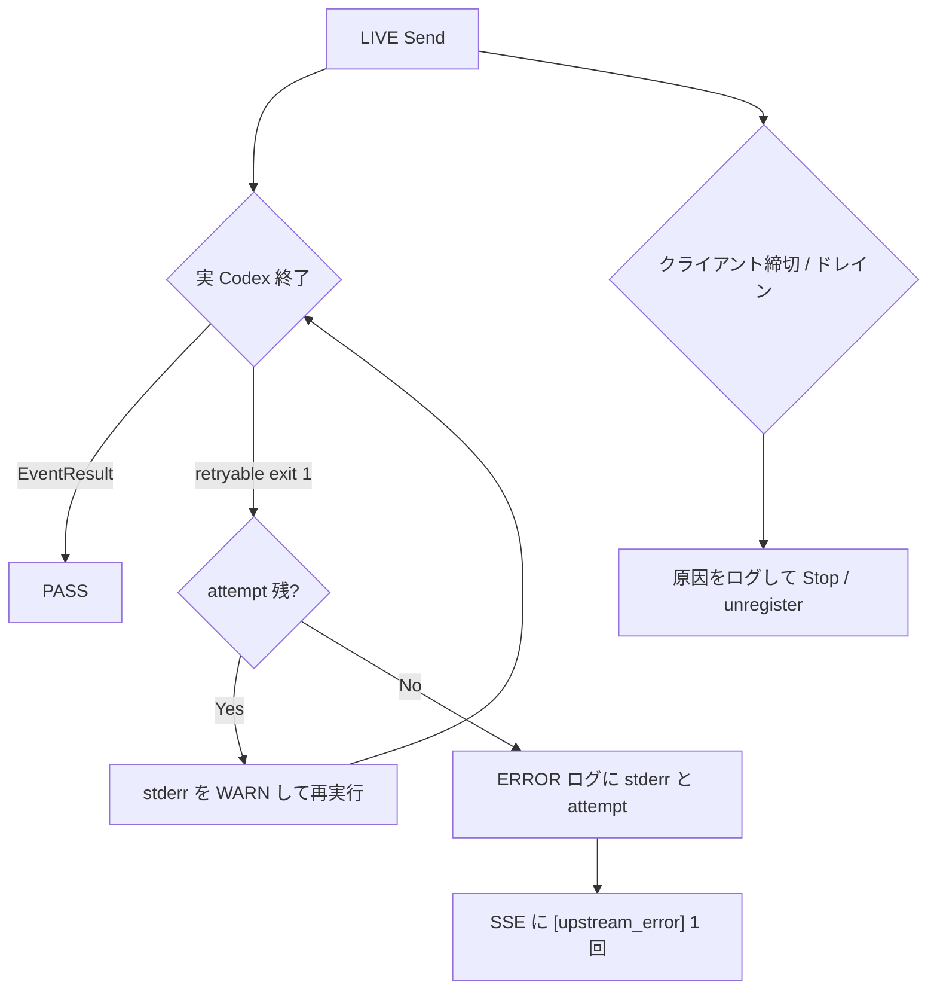

# 005-Live-Codex-Failure-Detection-And-Recovery

> **Source Specification**: [ideas/004-Live-Codex-Failure-Detection-And-Recovery.md](file://prompts/phases/001-phase02/branches/feat-session-migration/ideas/004-Live-Codex-Failure-Detection-And-Recovery.md)
>
> **関連 Issue**: [axsh/arctic-tern#41](https://github.com/axsh/arctic-tern/issues/41)
>
> **報告コメント**: [issuecomment-5308746982](https://github.com/axsh/arctic-tern/issues/41#issuecomment-5308746982)
>
> **先行計画**: [003-Stream-Reconnect-Regression-Coverage.md](file://prompts/phases/001-phase02/branches/feat-session-migration/plans/003-Stream-Reconnect-Regression-Coverage.md), [004-Codex-Exit-Status1-And-Stream-Timeout-Recovery.md](file://prompts/phases/001-phase02/branches/feat-session-migration/plans/004-Codex-Exit-Status1-And-Stream-Timeout-Recovery.md)
>
> **方針**: v0.1.15 後も残る実 Codex 失敗を、本リポジトリの必須ゲートで検出できるようにする。本番 `process_retry` 既定（3 回 / 3 秒）と 15 秒ドレインは変えない。kanban-gui は対象外。

## Goal Description

報告側の `TestSummarizerRealTern_SingleCardReady` / `ResumeSameSession` / `ResumeAfterKanbanRestart` と等価な失敗を、本リポジトリ `tests/` の `TestLiveCodex_*`（実 `codex` CLI、`t.Skip` 禁止、PATH/vault 欠落は `t.Fatal`）としてコード化する。分類タグ `[upstream_error]` 単独は不合格とし、SSE に `"type":"result"` が必須。再実行枯渇時は ERROR ログに Tern `session_id`、試行番号と `max_attempts`、resume か fresh か、`AgentSessionID`（空ならその旨）、Codex stderr 全文または末尾 8KiB、exit status を残す。`context deadline exceeded` はクライアント SSE 切断 / ドレイン `ProcessManager.Stop()` / Gateway 上流の 3 経路を一意ログで切り分ける。マージ検証は fake の `TestStreamReconnectRegression` に加え `TestLiveCodex_` を必ず実行する（正規表現が `TestStreamReconnectLive*` を飲み込まないこと）。

仕様の実現方針図:



## User Review Required

仕様書の User Review Required 3 点は確定済み（LIVE 必須 / モデルを `gpt-5.6-terra` に合わせない / 15 秒ドレイン維持 / `process_retry` 既定は変えない）。計画側で固定する実装選択は次のとおり。反対がなければこのまま実装に進める。

1. **`TestLiveCodex_ResumeAfterInProcessRestart` は `server.Launch` を止めて再 Launch する。** 同一 `work_dir` の TempDir を残す。作成時は `session_dir` JSON を送らない（`handleCreateSession` の fallback `{work_dir}/.tern/{session_id}` に載せる）。再 Launch 後は `GET /api/v1/sessions?work_dir=` で `WorkspaceSessionStore.ListByWorkDir` を走らせてから同じ `session_id` で Send する。`createE2ESessionWithModel` は `session_dir=workDir/sessions` を付けるため、このテストでは使わない（`ListByWorkDir` は `{work_dir}/.tern/*/record.json` しか読まない）。
2. **Codex LIVE の model 文字列は既存 `TestStreamReconnectLiveResumeSend` と同じ `"gpt-4o"`。** 仕様どおり報告の `gpt-5.6-terra` は書かない。`e2eDefaultModel`（`claude-sonnet-4-20250514`）も使わない。
3. **枯渇 ERROR のメッセージ本文は定数 `codex process retry exhausted`。** フィールド名は後述 `Technical Design` 固定。SSE 本文は現行 `ClassifiedErrorContent` の 1 回だけ。中間リトライは SSE に出さない。
4. **R4 の一意文字列。** クライアント切断は現行 `client disconnected during SSE stream`。ドレインは現行 `SSE drain timed out; stopping agent process`。Gateway 上流 deadline は新規 `upstream stream read deadline exceeded`。クライアント向け `stream read error: context deadline exceeded`（`client/v1/stream.go` の `fmt.Sprintf("stream read error: %v", err)`）は変更しない。
5. **任意 R6（`max_attempts` / `interval_seconds` 引き上げ）と R7（kanban-gui）は実装しない。** `--categories` は `integration_test.sh` に無いので付けない（未知フラグで失敗する）。

## Requirement Traceability

| Requirement (from Spec) | Implementation Point (Section/File) |
| :--- | :--- |
| R1 `TestLiveCodex_SingleCardReady`: native resume なし初回 Send。SSE に `"type":"result"`、`"type":"error"` なし。本文に固定トークン `live-card-ready`。`t.Skip` / `t.Skipf` 禁止。`codex` PATH 無し・vault 無しは `t.Fatal` | Proposed Changes > tests/llm_live_codex_test.go |
| R1 `TestLiveCodex_ResumeSameSession`: 同一 HTTP `session_id` で 2 回 Send。2 回目も `EventResult`。`session_id` 不変 | Proposed Changes > tests/llm_live_codex_test.go |
| R1 `TestLiveCodex_ResumeAfterInProcessRestart`: 1 回目成功後 in-process `Launch` 再起動。同じ `session_id` で Send。`EventResult`。409 で終わらない | Proposed Changes > tests/llm_live_codex_test.go（URR1） |
| R1 モデルは `mustStartCodexE2EServer` / `createE2ESessionWithModel` の現行既定。報告モデル名をハードコードしない | URR2。Codex は `"gpt-4o"`。再起動テストだけ session 作成ヘルパーを分ける |
| R2 枯渇時 ERROR: Tern `session_id`、試行番号と `max_attempts`、resume vs fresh、`AgentSessionID`（空ならその旨）、stderr 全文または末尾 8KiB、exit status。SSE は分類タグ 1 回。中間リトライは SSE に出さない | Proposed Changes > handler_retry.go `logProcessRetryExhausted`、handler_retry_test.go |
| R3 `TestLiveCodex_SingleCardReady` は `[upstream_error]` 単独 PASS 禁止。`EventResult` 必須。計画 004 の fake「1 回失敗→成功」は残すが live 初回の代替にしない | tests/llm_live_codex_test.go が `liveReconnectTurnMustSucceed` 相当で error なら Fatal。既存 `TestStreamReconnectRegression_GenericExit1RetriesWithoutSSEError` は変更しない |
| R4 クライアント SSE 切断（`r.Context()` の `ctx.Done()`） / ドレイン上限の `ProcessManager.Stop()` / Gateway 上流 `context deadline exceeded` をログで区別。最終エラーが `stream read error: context deadline exceeded` のとき Tern ログに上記のどれか。ドレイン殺は `client drain timeout` 由来とログで分かる | handler_retry.go 既存 Warn、openai/anthropic handler の新規 Error、各 `_test.go` |
| R5 必須ゲートは `TestStreamReconnectRegression` と `TestLiveCodex_`。`go test -run` 正規表現が `TestStreamReconnectLive*` を飲み込まない（プレフィックス厳密に `TestLiveCodex_`） | Verification Plan の `--specify "TestLiveCodex_"` |
| R8 `defaultSSEClientDrainTimeout` は 15 秒のまま。YAML 新フィールドなし。`WithSSEDrainTimeout` は試験専用のまま | handler_retry.go 定数を変更しない。`TestDefaultSSEClientDrainTimeoutIs15s` で回帰固定 |
| R6 `process_retry` 既定変更 | 対象外 |
| R7 kanban-gui `TestSummarizerRealTern_*` | 対象外 |
| 検証: v0.1.15 相当を Windows live-gate で再試験。残るエラー `codex CLI process exited with error (exit status 1)` / `arctic_tern stream error: exit status 1 [upstream_error]` / `arctic_tern stream error: stream read error: context deadline exceeded`。real-tern 3 件は本リポジトリでは実行しない。本リポジトリは `TestLiveCodex_*` が `EventResult`。SingleCardReady 失敗時はサーバ ERROR に試行番号と Codex stderr（空なら空である旨） | Verification Plan + R2 単体 |

## Proposed Changes

依存順: 枯渇ログと締切ログの単体（Failed First）→ AgentService / Gateway 実装 → LIVE 統合。各コンポーネントは `_test.go` を先に書く。

中間ファイルは `tmp/` のみ。

定数（仕様から継承、変更しない）:

```text
defaultSSEClientDrainTimeout = 15 * time.Second
process_retry 既定 MaxAttempts=3, IntervalSeconds=3
maxLoggedStderrBytes = 8 * 1024
```

ログメッセージ定数（新規および現行の固定）:

```go
const (
    logCodexProcessRetryExhausted = "codex process retry exhausted"
    logClientDisconnectedSSE      = "client disconnected during SSE stream"      // 現行 handler_retry.go / handler.go の Warn 本文。変更禁止
    logSSEDrainTimedOut           = "SSE drain timed out; stopping agent process" // 現行 stopExecOnDrainTimeout。変更禁止
    logUpstreamStreamDeadline     = "upstream stream read deadline exceeded"      // Gateway 新規
    drainTimeoutTerminalContent   = "client drain timeout"                        // 現行 streamTerminal.content。変更禁止
)
```

stderr 末尾切り詰め（仕様: 全文または末尾 8KiB）:

```go
func truncateStderrTail(s string, n int) string {
    if n <= 0 || len(s) <= n {
        return s
    }
    return s[len(s)-n:]
}
```

exit status 抽出:

```go
func parseExitStatus(content string) (status string, ok bool) {
    const prefix = "exit status "
    i := strings.LastIndex(strings.ToLower(content), prefix)
    if i < 0 {
        return "", false
    }
    rest := strings.TrimSpace(content[i+len(prefix):])
    if rest == "" {
        return "", false
    }
    end := 0
    for end < len(rest) && rest[end] >= '0' && rest[end] <= '9' {
        end++
    }
    if end == 0 {
        return "", false
    }
    return rest[:end], true
}
```

### AgentService（枯渇ログ・ドレイン定数・切断ログ）

#### [MODIFY] [shared/libs/go/agentservice/handler_retry_test.go](file://shared/libs/go/agentservice/handler_retry_test.go)
*   **Description**: 枯渇 ERROR ログとドレイン 15 秒定数の Failed First。既存 `retryAgent` の `genericExit` / `failTimes` を再利用。
*   **Technical Design**: テスト内に `captureLogger` を置く（`logger.Logger` を満たす）。`Error` / `Warn` の `msg` と KV をスライスに蓄積。`WithFields` / `WithComponent` は同じバッファを共有した子を返す。
*   **Logic**:

```go
type captureLogEntry struct {
    level string
    msg   string
    kv    []any
}

type captureLogger struct {
    mu      sync.Mutex
    entries []captureLogEntry
}

func (l *captureLogger) Trace(msg string, fields ...any) { l.append("trace", msg, fields) }
func (l *captureLogger) Debug(msg string, fields ...any) { l.append("debug", msg, fields) }
func (l *captureLogger) Info(msg string, fields ...any)  { l.append("info", msg, fields) }
func (l *captureLogger) Warn(msg string, fields ...any)  { l.append("warn", msg, fields) }
func (l *captureLogger) Error(msg string, fields ...any) { l.append("error", msg, fields) }
func (l *captureLogger) WithFields(map[string]any) logger.Logger { return l }
func (l *captureLogger) WithComponent(string) logger.Logger     { return l }

func TestHandleSendMessage_GenericExit1ExhaustedLogsCause(t *testing.T) {
    // failTimes を 99、genericExit true、ProcessRetryConfig{MaxAttempts: 3, IntervalSeconds: 0}
    // WithLogger(cap)、POST SSE、最終 EventError は "[upstream_error]" を含む
    // cap に level=error, msg="codex process retry exhausted" が 1 件
    // kv に session_id（空でない）, attempt=3, max_attempts=3
    // resume_mode="fresh"（初回 Send で AgentSessionID なし）
    // agent_session_id が空、agent_session_id_empty=true
    // stderr に "exit status 1" を含む（retryAgent が EventError.Content に載せる現行文言）
    // stderr_empty は stderr が空のときだけ true。本ケースは false
    // exit_status="1"
    // SSE に中間 error イベントが無い（既存 GenericExit1 テストと同じ）
}

func TestHandleSendMessage_BrokenResumeExhaustedLogsResumeMode(t *testing.T) {
    // セッションに AgentSessionID="thr-broken" を Update してから Send
    // failResumeID で resume 失敗、self-heal 後も genericExit で枯渇するよう failTimes を十分大きく
    // 最後の ERROR の resume_mode は "fresh"（healFresh 後）でも、少なくとも 1 回の WARN/ERROR 経路で
    // 最初の枯渇直前の試行が記録されること。実装は枯渇時点の最終試行をログする:
    //   healFresh==true なら resume_mode="fresh"
    //   healFresh==false かつ CreateSession に AgentSessionID があれば resume_mode="resume"
    // 本テストは枯渇時 healFresh==true なので resume_mode="fresh" を要求する。
    // 追加: TestHandleSendMessage_ResumeAttemptExhaustedLogsResumeMode
    //   self-heal を無効化せず、failTimes=3 ですべて resume 付き Create が genericExit
    //   （failResumeID を空、事前に AgentSessionID を入れ、heal 前に 3 回使い切る）
    //   resume_mode="resume", agent_session_id="thr-keep"
}

func TestHandleSendMessage_EmptyStderrExhaustedLogsEmptyNote(t *testing.T) {
    // genericExit の Content を "exit status 1" のみ（stderr 相当が空に近い）にする場合、
    // stderr_empty=true または stderr="" を ERROR kv に含める（仕様: 空なら空である旨）
}

func TestStreamSSERelay_DisconnectLogsClientGone(t *testing.T) {
    // 既存切断テストに WithLogger(cap) を足す、または新規
    // ctx cancel 後、Warn msg="client disconnected during SSE stream"
    // kv session_id あり
}

func TestStreamSSERelay_DrainTimeoutLogsClientDrain(t *testing.T) {
    // 既存 TestStreamSSERelay_DrainTimeoutStopsProcess に logger を足す
    // Warn msg="SSE drain timed out; stopping agent process"
    // kv に session_id と timeout（clientDrainTimeout().String()）
    // SSE 最終 error.content が "client drain timeout" または分類後も drain 由来がログ側で分かること
}

func TestDefaultSSEClientDrainTimeoutIs15s(t *testing.T) {
    srv := agentservice.New()
    if srv の clientDrainTimeout 相当が 15s でないなら Fatal
}
```

`clientDrainTimeout` は未公開のため、パッケージ内テストへ移す場合は `handler_retry.go` と同じ `package agentservice` の新規ファイル `handler_retry_unexported_test.go`（`TestDefaultSSEClientDrainTimeoutIs15s`: `defaultSSEClientDrainTimeout != 15*time.Second` なら失敗）を使う。公開 API を増やさない。

#### [MODIFY] [shared/libs/go/agentservice/handler_retry.go](file://shared/libs/go/agentservice/handler_retry.go)
*   **Description**: 再実行枯渇時に ERROR ログを出す。ドレイン定数と既存 Warn 本文は変えない。
*   **Technical Design**: `runTurn` の `term.retryable && attempt >= maxAttempts`（SSE の `emitClassifiedSSE` 直前、JSON の classified append 直前）から `logProcessRetryExhausted` を呼ぶ。中間 `attempt < maxAttempts` は現行どおり Debug `swallowing retryable process error` のみ（SSE に出さない）。
*   **Logic**:

```go
func (s *Server) logProcessRetryExhausted(sessionID string, attempt, maxAttempts int, healFresh bool, term streamTerminal) {
    if s.logger == nil {
        return
    }
    agentSessionID := ""
    if rec, err := s.sessions.Get(sessionID); err == nil {
        agentSessionID = rec.AgentSessionID
    }
    resumeMode := "resume"
    if healFresh || agentSessionID == "" {
        resumeMode = "fresh"
    }
    stderr := truncateStderrTail(term.content, 8*1024)
    fields := []any{
        "session_id", sessionID,
        "attempt", attempt,
        "max_attempts", maxAttempts,
        "resume_mode", resumeMode,
        "agent_session_id", agentSessionID,
        "stderr", stderr,
        "stderr_empty", stderr == "",
        "agent_session_id_empty", agentSessionID == "",
        "terminal_content", drainTimeoutTerminalContentMatches(term.content),
    }
    if st, ok := parseExitStatus(term.content); ok {
        fields = append(fields, "exit_status", st)
    } else {
        fields = append(fields, "exit_status", "")
    }
    s.logger.Error(logCodexProcessRetryExhausted, fields...)
}

func drainTimeoutTerminalContentMatches(content string) bool {
    return strings.Contains(content, "client drain timeout")
}
```

`stopExecOnDrainTimeout` の戻り `content: "client drain timeout"` は維持。この term が枯渇経路に入る場合も ERROR に `terminal_content` 由来が残るが、ドレインそのものの一意ログは既存 Warn `SSE drain timed out; stopping agent process`（kv `timeout`）。R4「ドレインで殺した場合は `client drain timeout` 由来であることがログで分かること」は Warn 本文 + `content` の両方で満たす。

`streamSSERelay` の `ctx.Done()` 分岐の Warn `"client disconnected during SSE stream"` は残す（リテラルを定数 `logClientDisconnectedSSE` に寄せてよいが文言変更は禁止）。

`defaultSSEClientDrainTimeout` の値と `WithSSEDrainTimeout` の意味（ゼロ値なら 15 秒、試験専用）は変更しない。YAML 新フィールドは設けない。

### LLM Gateway（上流 deadline ログ）

#### [MODIFY] [shared/libs/go/llmgateway/stream_retry.go](file://shared/libs/go/llmgateway/stream_retry.go)
*   **Description**: `context deadline exceeded` 判定を共有する。
*   **Technical Design**:

```go
const LogUpstreamStreamDeadline = "upstream stream read deadline exceeded"

func IsStreamDeadlineExceeded(err error, msg string) bool {
    if err != nil {
        if errors.Is(err, context.DeadlineExceeded) {
            return true
        }
        if strings.Contains(err.Error(), "context deadline exceeded") {
            return true
        }
    }
    return strings.Contains(msg, "context deadline exceeded")
}
```

*   **Logic**: 報告の `stream read error: context deadline exceeded` はクライアントの SSE 読み（`client/v1/stream.go`）でも出る。Gateway 側では Bifrost チャンク / open 失敗が deadline のとき `log.Error(LogUpstreamStreamDeadline, "model", req.Model, "error", msg)` を 1 回出す。クライアント JSON は変えない。

#### [MODIFY] [shared/libs/go/llmgateway/stream_retry_test.go](file://shared/libs/go/llmgateway/stream_retry_test.go)
*   **Description**: `IsStreamDeadlineExceeded` のテーブル駆動。
*   **Logic**:

```go
func TestIsStreamDeadlineExceeded(t *testing.T) {
    tests := []struct {
        err  error
        msg  string
        want bool
    }{
        {context.DeadlineExceeded, "", true},
        {fmt.Errorf("wrap: %w", context.DeadlineExceeded), "", true},
        {nil, "context deadline exceeded", true},
        {nil, "stream read error: context deadline exceeded", true},
        {nil, "exit status 1", false},
        {nil, "", false},
    }
    // ...
}
```

#### [MODIFY] [shared/libs/go/llmgateway/openai/handler.go](file://shared/libs/go/llmgateway/openai/handler.go)
*   **Description**: open 失敗および error チャンクをクライアントへ書く直前、deadline なら一意 ERROR ログ。
*   **Logic**: `RetryLeadingChunk` が false で `chunk.BifrostError != nil` のとき、および `openResponsesStream` が err を返して `WriteErrorResponse` するとき:

```go
if llmgateway.IsStreamDeadlineExceeded(err, msg) {
    log.Error(llmgateway.LogUpstreamStreamDeadline, "model", req.Model, "error", msg)
}
```

既存のクライアント向け `event: error` 書き込みは維持。

#### [MODIFY] [shared/libs/go/llmgateway/anthropic/handler.go](file://shared/libs/go/llmgateway/anthropic/handler.go)
*   **Description**: openai と同じ deadline ログを Anthropic ストリーム経路に入れる（Codex は responses API だが、報告の Gateway 文言切り分けをプロバイダ共通にする）。
*   **Logic**: openai と同型の `IsStreamDeadlineExceeded` 分岐。

#### [MODIFY] [shared/libs/go/llmgateway/openai/handler_stream_retry_test.go](file://shared/libs/go/llmgateway/openai/handler_stream_retry_test.go)
*   **Description**: deadline チャンクでログメッセージが `upstream stream read deadline exceeded` を含むことを Failed First。
*   **Technical Design**: 既存 stream retry テストのスタブに `BifrostError` Message=`context deadline exceeded` を 1 チャンク返すケースを追加。`captureLogger` または `bytes.Buffer` を `LogWriter` にした `logger.NewDefaultWithOptions`。

### LIVE 統合（必須ゲート）

#### [NEW] [tests/llm_live_codex_test.go](file://tests/llm_live_codex_test.go)
*   **Description**: 仕様 R1 の 3 テスト。package `llm_test`。fake PATH 禁止。`t.Skip` / `t.Skipf` 禁止。
*   **Technical Design**: `mustStartCodexE2EServer`（[tests/llm_stream_reconnect_live_test.go](file://tests/llm_stream_reconnect_live_test.go)）を再利用する。このヘルパーは `exec.LookPath("codex")` 失敗で `t.Fatalf("LIVE test requires codex CLI on PATH: %v", err)`、`server.New` / `Launch` 失敗（vault / keyring 含む）で `t.Fatalf`。追加の Skip は入れない。
*   **Logic**:

```go
package llm_test

const liveCodexModel = "gpt-4o" // TestStreamReconnectLiveResumeSend と同じ。報告の gpt-5.6-terra は使わない

func createLiveCodexSession(t *testing.T, baseURL, workDir string) string {
    t.Helper()
    initGitRepo(t, workDir)
    body, _ := json.Marshal(map[string]string{
        "agent":    "codex",
        "model":    liveCodexModel,
        "work_dir": workDir,
        // session_dir を送らない → {work_dir}/.tern/{id}
    })
    resp, err := http.Post(baseURL+"/api/v1/sessions", "application/json", bytes.NewReader(body))
    // 201 以外は t.Fatalf。session_id 空は t.Fatal
    return sid
}

func listLiveSessionsByWorkDir(t *testing.T, baseURL, workDir string) {
    t.Helper()
    resp, err := http.Get(baseURL + "/api/v1/sessions?work_dir=" + url.QueryEscape(workDir))
    // 200 以外は Fatal。ボディに先の session_id が含まれること
}

func TestLiveCodex_SingleCardReady(t *testing.T) {
    baseURL, cleanup := mustStartCodexE2EServer(t)
    defer cleanup()
    workDir := t.TempDir()
    sessionID := createLiveCodexSession(t, baseURL, workDir)
    liveReconnectTurnMustSucceed(t, baseURL, sessionID,
        "Reply with exactly: live-card-ready",
        "live-card-ready")
    // liveReconnectTurnMustSucceed: timeout 4*time.Minute、status 200 以外 Fatal
    // EventError なら t.Fatalf("received error event in live turn: %s", ev.Content)
    // よって exit status 1 [upstream_error] 単独は失敗
    // EventResult 必須。text 連結が "live-card-ready" を含む
}

func TestLiveCodex_ResumeSameSession(t *testing.T) {
    baseURL, cleanup := mustStartCodexE2EServer(t)
    defer cleanup()
    workDir := t.TempDir()
    sessionID := createLiveCodexSession(t, baseURL, workDir)
    liveReconnectTurnMustSucceed(t, baseURL, sessionID,
        "Reply with exactly: live-resume-1", "live-resume-1")
    liveReconnectTurnMustSucceed(t, baseURL, sessionID,
        "Reply with exactly: live-resume-2", "live-resume-2")
    got := getE2ESession(t, baseURL, sessionID)
    if got["session_id"] != sessionID { // 型は map[string]interface{}。文字列比較は fmt.Sprint
        t.Fatalf("session_id changed: %v", got["session_id"])
    }
}

func TestLiveCodex_ResumeAfterInProcessRestart(t *testing.T) {
    workDir := t.TempDir()
    baseURL1, cleanup1 := mustStartCodexE2EServer(t)
    sessionID := createLiveCodexSession(t, baseURL1, workDir)
    liveReconnectTurnMustSucceed(t, baseURL1, sessionID,
        "Reply with exactly: live-restart-1", "live-restart-1")
    cleanup1() // srv.Shutdown

    baseURL2, cleanup2 := mustStartCodexE2EServer(t)
    defer cleanup2()
    listLiveSessionsByWorkDir(t, baseURL2, workDir)
    rec := getE2ESession(t, baseURL2, sessionID)
    if rec == nil || fmt.Sprint(rec["session_id"]) == "" {
        t.Fatal("session not found after in-process restart")
    }
    resp := sendE2EMessage(t, baseURL2, sessionID,
        "Reply with exactly: live-restart-2", 4*time.Minute)
    defer resp.Body.Close()
    if resp.StatusCode == http.StatusConflict {
        t.Fatalf("got 409 after restart, session still busy")
    }
    if resp.StatusCode != http.StatusOK {
        t.Fatalf("send status = %d", resp.StatusCode)
    }
    liveReconnectTurnMustSucceed 相当: EventError Fatal、EventResult 必須、"live-restart-2"
}
```

`liveReconnectTurnMustSucceed` は error イベントで即 Fatal するため、R3（分類エラー単独不合格）を満たす。新規ヘルパーで緩めてはいけない。

既存 `TestStreamReconnectLiveResumeSend` は残す。必須 `--specify` には入れない（名前が `TestLiveCodex_` ではない）。`TestLiveCodex_` は `TestStreamReconnectLiveResumeSend` にマッチしない（正規表現として `Live` を共有しないプレフィックス）。

#### [MODIFY] [tests/llm_stream_reconnect_live_test.go](file://tests/llm_stream_reconnect_live_test.go)
*   **Description**: `mustStartCodexE2EServer` / `liveReconnectTurnMustSucceed` を同じパッケージから呼ぶだけ。挙動変更なし。`t.Skip` を足さない。

#### 変更しないファイル
*   [shared/libs/go/codingagent/codex/process.go](file://shared/libs/go/codingagent/codex/process.go): `stderrBuf` を Wait 失敗時 `EventError.Content` に載せる現行のまま。新フィールドは増やさない。AgentService は `term.content` を ERROR の `stderr` に使う。
*   [tests/llm_stream_reconnect_regression_test.go](file://tests/llm_stream_reconnect_regression_test.go): 計画 004 の fake シナリオ A/B/C は残す。live 初回の代替にしない。
*   `process_retry` YAML 既定、`WithSSEDrainTimeout` の本番経路。

### ドキュメント

#### [MODIFY] [docs/ReferenceManual-WebAPIs.md](file://docs/ReferenceManual-WebAPIs.md)
*   **Description**: Send 節（15 秒ドレインは既に記載）に、枯渇時サーバ ERROR ログと締切切り分けの運用メモを 1 段落足す。クライアント API スキーマは変えない。
*   **Logic**: 追加する英文の意味は次のとおり。When Codex process retries are exhausted, the SSE error remains a single classified `error` (`[upstream_error]` or `[upstream_overloaded]`). Operators inspect process logs for `codex process retry exhausted` (session_id, attempt, max_attempts, resume_mode, agent_session_id, stderr tail up to 8KiB, exit_status). Client SSE disconnect logs as `client disconnected during SSE stream`. Drain stop logs as `SSE drain timed out; stopping agent process` with terminal content `client drain timeout`. Gateway upstream deadlines log as `upstream stream read deadline exceeded`. Closing the SSE body can still surface as `stream read error: context deadline exceeded` on the HTTP client.

#### [MODIFY] [README.md](file://README.md)
*   **Description**: マージ前検証に `TestLiveCodex_` が必須であること、Codex CLI と vault が無いと Fatal することを英文で追記。Skip に戻さない制約を書く。

## Progress

- [x] 枯渇 ERROR ログ（単体 + 実装）
- [x] 締切切り分けログ（AgentService / Gateway）
- [x] LIVE E2E `TestLiveCodex_*`
- [x] ドキュメント
- [x] 検証 `build.sh` + 必須 `--specify`

## Step-by-Step Implementation Guide

1.  **[x] TDD 枯渇ログ**
2.  **[x] 実装 枯渇ログ**
3.  **[x] TDD / 実装 R4 AgentService**
4.  **[x] TDD Gateway deadline**
5.  **[x] コミット単位**
6.  **[x] TDD LIVE**
7.  **[x] 再起動 LIVE**
8.  **[x] ドキュメント**
9.  **[x] 検証**

### 総合判定結果

**判定**: ✅ 動作確認完了

#### テスト結果サマリ
- 必須ゲート: `./scripts/process/build.sh` 成功。`TestStreamReconnectRegression` 成功。`TestLiveCodex_` 3 件すべて `EventResult` で成功（SingleCardReady 7.59s、ResumeSameSession 22.19s、ResumeAfterInProcessRestart 13.02s）。分類エラー単独での合格は無し。
- 失敗: 0
- 事実上スキップ: 0（`t.Skip` なし。実 Codex CLI + vault で完走）

#### チェック項目の結果
| # | チェック項目 | 結果 | 備考 |
|---|------------|------|------|
| 1 | スキップされたテスト | ✅ | LIVE は Fatal 前提。本環境では CLI ありで実行された |
| 2 | 部分的なエラー | ⚠️ | fake `DrainTimeoutUnregistersBusy` でハング CLI を殺したあとの `codex process retry exhausted` ERROR が出る。ドレイン解除の副作用でありテストは PASS |
| 3 | 迂回処理による偽成功 | ✅ | LIVE 3 件とも SSE `"type":"result"`。`[upstream_error]` 経路ではない |
| 4 | アダプタ・コンフィグ | ✅ | 実 `codex.exe exec` / `exec resume`、モデル `gpt-4o`、Gateway bifrost openai |
| 5 | テスト間の依存 | ✅ | 各 LIVE が独立サーバ。再起動テストは同一 work_dir のディスクストア |
| 6 | カバレッジ | ✅ | R1 3 シナリオ、R2/R4 単体、R8 定数テスト |
| 7 | 外部システム | ✅ | 本マシンの Codex + keyring vault + OpenAI。報告側 `gpt-5.6-terra` / kanban-gui は対象外 |

#### 判定理由
本リポジトリの必須ゲート（fake 回帰 + `TestLiveCodex_`）は実 Codex で緑になった。報告側 kanban-gui の 3 テストは別リポジトリのためここでは実行していない。本番 `process_retry` 既定は変更していない。

## Verification Plan

`integration_test.sh` に `--categories` は無い。付けない。

報告コメントの手順と結果（本リポジトリでコード化できる範囲）:

1. 本ブランチ（v0.1.15 相当 + 本計画）で `TestLiveCodex_*` を実行する。
2. 次が残るかどうかを `TestLiveCodex_*` の SSE で見る（分類エラー単独は不合格）:
   - `codex CLI process exited with error (exit status 1)`
   - `arctic_tern stream error: exit status 1 [upstream_error]`
   - `arctic_tern stream error: stream read error: context deadline exceeded`
3. kanban-gui の `TestSummarizerRealTern_SingleCardReady` / `TestSummarizerRealTern_ResumeSameSession` / `TestSummarizerRealTern_ResumeAfterKanbanRestart` は本リポジトリでは実行しない（R7）。等価は `TestLiveCodex_SingleCardReady` / `TestLiveCodex_ResumeSameSession` / `TestLiveCodex_ResumeAfterInProcessRestart`。
4. `TestLiveCodex_*` はすべて `EventResult` で終わること。
5. `TestLiveCodex_SingleCardReady` が落ちたときは、サーバ ERROR に `codex process retry exhausted` と試行番号、Codex stderr（空なら `stderr_empty=true`）があること（単体 `TestHandleSendMessage_GenericExit1ExhaustedLogsCause` で自動検証。LIVE 失敗時はプロセスログを目視）。

### Automated Verification

1.  **Build & Unit Tests**: `./scripts/process/build.sh`
2.  **Integration Tests (fake, 必須)**: `./scripts/process/integration_test.sh --specify "TestStreamReconnectRegression"`
3.  **Integration Tests (LIVE, 必須)**: `./scripts/process/integration_test.sh --specify "TestLiveCodex_"`
    - `-run` は正規表現。`TestLiveCodex_` は `TestStreamReconnectLiveResumeSend` にマッチしない。
    - Codex / vault 欠落は Fatal（Skip しない）。フル `integration_test.sh`（フィルタなし）も既存 `TestStreamReconnectLive*` と同様に落ち得る。既知の制約。

Windows の一連:

```bash
./scripts/process/build.sh && ./scripts/process/integration_test.sh --specify "TestStreamReconnectRegression" && ./scripts/process/integration_test.sh --specify "TestLiveCodex_"
```

Linux / Remote-SSH（Linux）:

```bash
./scripts/process/build.sh --skip-etc && xvfb-run -a ./scripts/process/integration_test.sh --specify "TestStreamReconnectRegression" && xvfb-run -a ./scripts/process/integration_test.sh --specify "TestLiveCodex_"
```

3.  **E2E Tests**: 上記 `tests/llm_live_codex_test.go` が E2E 相当。kanban-gui は追加しない。

単体のみ再確認が必要なときも `go test` 直叩きは禁止。`./scripts/process/build.sh` を使う。

## Documentation

*   [docs/ReferenceManual-WebAPIs.md](file://docs/ReferenceManual-WebAPIs.md): Send の運用ログ（枯渇 / 切断 / ドレイン / Gateway deadline）。15 秒ドレインの既存記述は残す。
*   [README.md](file://README.md): 必須ゲートに `TestLiveCodex_` を含めること、環境欠落は Fatal。
*   仕様書 004 は計画から参照するのみ。内容の再編集はこの計画の範囲外。
