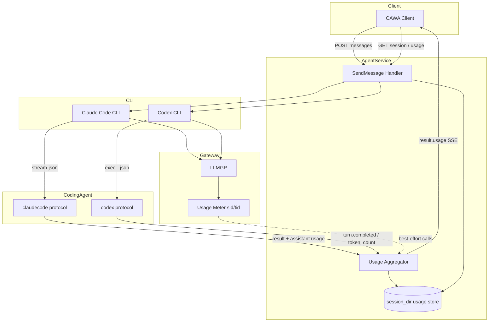

# 000: Coding Agent トークン利用量の計測（セッション / ターン / LLMコール）

## 背景 (Background)

### 現状

Arctic Tern は Claude Code / Codex などの Coding Agent に対し、`POST /api/v1/sessions/:id/messages`（SendMessage）で指示を送り、SSE / JSON で応答イベントを返す。エージェント CLI は既にトークン利用量を含むイベントを stdout に出力している。

| Agent | 利用量の出所（CLI） | Tern 側の扱い（現状） |
| :--- | :--- | :--- |
| Claude Code | `result` の `usage` / `total_cost_usd` / `modelUsage`、各 `assistant.message.usage` | `result` は空の `EventResult` のみ。`usage` は破棄 |
| Codex | `turn.completed.usage`、`event_msg` の `token_count` | `turn.completed` は空の `EventResult` のみ。`token_count` は明示的に無視 |

`StreamEvent` に usage フィールドはなく、Web API（SendMessage / Get Session）にも利用量は露出しない。LLM Gateway（LLMGP）は Anthropic / OpenAI 応答の `usage` をプロキシ先へ返すだけであり、セッション／ターン単位の集計ストアはない。

### 課題

1. **利用者・上位システムがコストを把握できない**  
   メッセージ送信から応答完了までに消費した input / output トークンが API から取れない。

2. **データは流れているが捨てている**  
   CLI と Gateway の双方に利用量があるのに、抽象化レイヤ（`codingagent`）が破棄している。

3. **集計粒度のニーズが複数ある**  
   - セッション合計: 長期コスト把握  
   - ターン合計: 1 回の SendMessage のコスト  
   - LLMコール単位: どのステップが重いのかの分析（精度は低信頼でも可）

### 本仕様で決めること

1. **ターン合計**（必須・高信頼）を CLI 終端イベントから抽出し、SendMessage 応答に載せる。
2. **セッション合計**（必須）を Tern 側でターン合計を累積し、Web API / Client API から参照できるようにする。
3. **LLMコール単位**（必須だが低信頼可）を、可能な範囲で正確に出す仕組み（CLI パーサ＋必要なら Gateway 相関）を設ける。
4. 各レコードに **source / confidence** を付け、利用者が信頼度を判断できるようにする。
5. 集計取得は **Web API（`GET .../usage` 等）と Client API（`GetUsage` 等）の両方を Must** とする。

### スコープ外

- 請求（billing）の正として `total_cost_usd` を使うこと。CLI のコストは推定であり、本機能は開発・運用の可視化が目的。
- Provider Console / Usage API との突合バッチ。
- Wayfinder 専用の詳細メトリクス UI（Wayfinder は LLMGP 直叩きのため、本仕様の Gateway 経路でベストエフォート対応する程度に留める）。
- トークン単価表のメンテナンスと自動課金。

---

## 用語 (Terminology)

| 用語 | 定義 |
| :--- | :--- |
| ターン (Turn) | 1 回の `POST .../messages`（SendMessage）実行。既存の `turn_id` と一致する |
| セッション (Session) | Tern の HTTP `session_id` 配下の一連のターン |
| LLMコール (LLM Call / Step) | エージェントループ内の 1 回のモデル応答サイクル（ツール呼び出しを挟む前後の各 API 応答） |
| input_tokens | モデルへ送ったトークン（プロンプト側） |
| output_tokens | モデルから受け取ったトークン（応答側） |
| cached_input_tokens 等 | キャッシュ関連。エージェントが提供する場合に任意で保持する |

---

## 要件 (Requirements)

### 必須要件 (Must)

#### R1: 共通 Usage モデルを定義する

次のフィールドを持つ共通構造（名称は実装計画で固定）を `codingagent` 層に定義する。

| フィールド | 必須 | 説明 |
| :--- | :--- | :--- |
| `input_tokens` | Yes | 送信トークン |
| `output_tokens` | Yes | 受信トークン |
| `cached_input_tokens` | No | キャッシュ読取など（取得できる場合） |
| `cache_creation_input_tokens` | No | Claude 等 |
| `reasoning_output_tokens` | No | Codex 等 |
| `total_tokens` | No | 提供元が出す場合のみ。無い場合はサーバ側で合成しない（誤算防止） |
| `total_cost_usd` | No | Claude `result` 等の推定コスト。請求用途禁止をドキュメント明記 |
| `model` | No | 分かる場合のモデル名 |
| `source` | Yes | データ出所（後述の列挙） |
| `confidence` | Yes | `high` / `low` |
| `turn_id` | ターン紐付け時 | Tern turn id |
| `call_id` | コール単位時 | コール識別子（メッセージ id 等。無ければサーバ採番） |

`source` の列挙（安定 ID）:

| source | 意味 | 既定 confidence |
| :--- | :--- | :--- |
| `claude_result` | Claude Code `result.usage` | `high` |
| `claude_assistant` | Claude Code `assistant.message.usage` | `high`（同一 message id 重複除去後） |
| `codex_turn_completed` | Codex `turn.completed.usage` | `high` |
| `codex_token_count` | Codex `token_count`（累計差分または `last_token_usage`） | `high`（差分ロジックが明確な場合）/ 不明時 `low` |
| `llmgateway` | LLMGP が Upstream 応答から記録 | `low`（コール単位の既定）または設計で `high`（ターン突合できる場合） |
| `derived_session_sum` | Tern がターン合計を加算 | `high`（加算元が高信頼の場合） |

#### R2: ターン合計を必須で取得・公開する

- SendMessage 完了時（終端 `result` 到達時）に、そのターンの **input_tokens / output_tokens** を必ず公開する。
- 公開経路:
  1. SSE / JSON の終端イベントに usage を付与する（推奨: 既存 `type: "result"` に `usage` オブジェクトを追加）。
  2. 同一内容をセッション永続領域にターン単位で保存する。
- Claude: `result` の `usage`（および可能なら `modelUsage`）を正とする。
- Codex: 第一候補は `turn.completed.usage`。無い／不完全な場合は `token_count` の差分または `last_token_usage` で補完する。
- いずれからも取れない場合:
  - 終端 `result` は従来どおり送出する。
  - `usage` は省略するか `confidence: low` の空相当とし、ログに警告を出す。
  - 可能なら LLMGP 集計でベストエフォート補完する（R4）。

#### R3: セッション合計を必須で集計・公開する

- Tern セッションに累積カウンタを持つ。

| 集計 | 定義 |
| :--- | :--- |
| `session.usage.input_tokens` | 当該セッションの全ターン `input_tokens` の合計 |
| `session.usage.output_tokens` | 全ターン `output_tokens` の合計 |
| 任意の cache / cost 系 | ターン側に値があるもののみ合算。無いフィールドは合算対象外 |

- `GET /api/v1/sessions/:id` のレスポンスに `usage`（セッション合計のみ）を含める。ターン／コールの詳細一覧はここに載せない（ペイロード肥大を避ける）。
- ターン別・コール別の内訳は専用 Web API で取得する（**固定**）:
  - `GET /api/v1/sessions/:id/usage`
  - レスポンスに、**返却した `turns[]` の再合計**としての `usage`、各ターン usage、各ターン配下の `calls[]`（コール単位、欠落可）を含める。
  - クエリ未指定時は全ターン（現行どおり）。
- **Usage クエリ（Must）**: 直近ターンや差分取得のため、次のクエリをサポートする。

| Query | 意味 |
| :--- | :--- |
| `last_n` | 末尾 N ターンのみ（0 / 省略 = 制限なし） |
| `after_turn_id` | 指定 `turn_id` **より後**のターンのみ（排他） |
| `from_turn_id` / `to_turn_id` | `turn_id` の inclusive 範囲（空は開放端） |
| `since` / `until` | ターン終了時刻の範囲（RFC3339）。`TurnUsageRecord` に `ended_at` が無い場合は未対応でもよいが、フィールド追加を推奨 |

- レスポンスのトップレベル `usage` は **フィルタ後の `turns` の合計**（`source=derived_session_sum`）。セッション全体の累計は `GET /sessions/:id` の `usage`、またはクエリなしの `GetUsage` で取る。
- キャンセル／エラー終了のターン: 取得できた部分 usage があれば加算し、`partial: true` 等で明示する。完全に無い場合は加算しない。

#### R3b: Client `GetUsage` は可変長引数でクエリする（メソッド分割しない）

```go
type UsageQuery struct {
	LastN       int       // 0 = no limit
	AfterTurnID string
	FromTurnID  string
	ToTurnID    string
	Since       time.Time // zero = unset
	Until       time.Time
}

func (c *Client) GetUsage(ctx context.Context, sessionID string, opts ...UsageQuery) (*SessionUsageReport, error)
func (s *Session) GetUsage(ctx context.Context, opts ...UsageQuery) (*SessionUsageReport, error)

// 全件
rep, _ := sess.GetUsage(ctx)
// 直近1ターン
rep, _ := sess.GetUsage(ctx, client.UsageQuery{LastN: 1})
// 前回より後
rep, _ := sess.GetUsage(ctx, client.UsageQuery{AfterTurnID: prev})
```

- `GetUsageQuery` という別名メソッドは作らない。
- 複数 `opts` が渡された場合は **先頭のみ有効**（またはマージ規則を実装計画で1つに固定）。推奨: 先頭のみ。

#### R4: LLMコール単位を低信頼でも出せる仕組みを設ける

- 目的: 「できるだけ正確に」コール単位の input / output を残す。欠落・重複を許容し、`confidence: low` を付けてよい。
- **Claude（優先経路）**:
  - `assistant` イベントの `message.usage` と `message.id` をパースする。
  - 同一 `message.id` は 1 回だけ数える（公式コスト追跡の重複除去規則）。
  - 各コールをターンに紐付けて保存する。
- **Codex（補完経路）**:
  - CLI だけではコール単位が弱いため、LLMGP 側で Upstream 応答の `usage` を記録する経路を設ける。
  - 相関キー: API キーメタデータ等に **Tern の `session_id` と `turn_id` が解決できる情報** を載せる（現行 `sid=` はネイティブ AgentSessionID のみなので拡張が必要）。
  - 実装計画でメタデータ形式を固定する（例: `sid=<ternSession>` / `tid=<turnId>`、または既存 `sid` を複合キーに変更）。後方互換（ルーティング用 `sid`）を壊さないこと。
- コール単位レコードは `GET /api/v1/sessions/:id/usage` の各ターン `calls[]` で参照可能にする。
- ターン合計とコール合計が一致しない場合:
  - **ターン合計を正**とする（高信頼）。
  - コール側は参考値とし、差分があってもターン合計を書き換えない。
  - ログまたはレスポンスメタに `calls_sum_mismatch: true` を付けてよい。

#### R5: StreamEvent / SSE 契約の後方互換

- 既存クライアントが未知フィールドを無視できる前提で、`result` に `usage` を **追加**する（イベント型の破壊的変更はしない）。
- 新しい必須イベント型を増やして既存クライアントを壊さない。
- `docs/ReferenceManual-WebAPIs.md` を更新する（Get Session の `usage`、`GET .../usage`、SendMessage `result.usage`）。

#### R6: エージェント網羅

| Agent | ターン合計 | セッション合計 | コール単位 |
| :--- | :--- | :--- | :--- |
| `claudecode` | Must（CLI） | Must（Tern 累積） | Must（CLI assistant usage） |
| `codex` | Must（CLI） | Must（Tern 累積） | Must（LLMGP ベストエフォート、欠落可） |
| `wayfinder` | Should（LLMGP） | Should | Should（LLMGP） |

Wayfinder は本仕様の Must 対象外でもよいが、共通 Usage モデルと Gateway 記録があれば流用可能にする。

#### R7: 永続化

- ターン usage とコール usage はセッションディレクトリ配下に永続化する（例: `{session_dir}/usage/` または既存 metadata / history への付帯）。パスは実装計画で固定。
- プロセス再起動後も `GET` でセッション合計・ターン一覧を再現できること。
- `tmp/` のみへの保存は不可。

#### R8: Client API (`client/v1`) を必須で提供する

Web API と対になる Client SDK を **Must** とする。

| 項目 | 要件 |
| :--- | :--- |
| 型 | `TokenUsage`（または同等名）と、Get Usage レスポンス用の `SessionUsageReport`（セッション合計 + turns + calls）を定義する |
| GetSession | `SessionInfo` にセッション合計 `Usage` フィールドを含める（Web の Get Session と対応） |
| GetUsage | `Client.GetUsage(ctx, sessionID, opts ...UsageQuery)` および `Session.GetUsage(ctx, opts ...UsageQuery)`。`opts` 省略で全件。`UsageQuery` は R3b のとおり。`GET .../usage` にクエリを載せる |
| SendMessage | ストリーム終端の `result` イベントからターン `usage` を読めること（既存 Stream / イベント型の拡張）。破壊的変更はしない |
| テスト | `client/v1` の単体テストで GetSession / GetUsage（全件・LastN・AfterTurnID）のデコードを検証する |
| ドキュメント | Client 向け README または既存 docs に Usage 取得例（全件と LastN:1）を追記する |

### 任意要件 (Should / May)

#### S1: コスト推定の露出

- Claude の `total_cost_usd` / `modelUsage` をターン usage に任意フィールドとして載せてよい。
- ドキュメントに「推定であり請求に使わない」と明記する。

#### S2: リアルタイムの部分 usage

- ターン途中でコール usage を SSE 中継してもよい（例: `type: "usage"` または progress 付帯）。必須ではない。

---

## 実現方針 (Implementation Approach)

### 全体アーキテクチャ



### 設計方針

1. **正の階層**  
   - ターン合計 = CLI 終端（高信頼）  
   - セッション合計 = ターン合計の加算（Tern）  
   - コール単位 = 可能な限り CLI、不足は LLMGP（低信頼可）

2. **パーサ拡張が第一歩**  
   - `claudecode.ParseJSONLinesEvents`: `result` から usage 抽出。`assistant` から `message.usage` + id。  
   - `codex.ParseExecEvent`: `turn.completed` の `usage` 抽出。`token_count` を無視から抽出へ変更。  
   - `StreamEvent` に `Usage *TokenUsage`（仮名）を追加。

3. **Aggregator**  
   - ターン中: コール usage をバッファ  
   - ターン終了: ターン usage を確定し永続化、セッション累積を更新  
   - コール合計とターン合計の不一致はターン側を優先

4. **Gateway 相関（Codex コール単位）**  
   - BuildEnv のメタデータに Tern session / turn を載せる  
   - LLMGP は応答 `usage` をメモリまたはセッション連携ストアへ記録  
   - AgentService がターン終了時にフラッシュして usage store へマージ  
   - ルーティング用既存 `sid`（モデル sticky）との互換を実装計画で検証する

5. **API 契約（Web + Client。JSON キー名は実装計画で最終確定）**

- Web: `GET /api/v1/sessions/:id`（セッション累計）、`GET /api/v1/sessions/:id/usage[?last_n=&after_turn_id=&...]`（詳細・フィルタ可）、SendMessage `result.usage`
- Client: `GetUsage(ctx)` / `GetUsage(ctx, UsageQuery{...})` が上記と対応。レスポンス `usage` は返却 turns の再合計
- Get Session の `usage` は常にセッション累計（フィルタなし）

SendMessage 終端:

```json
{
  "type": "result",
  "turn_id": "turn-...",
  "usage": {
    "input_tokens": 12000,
    "output_tokens": 800,
    "cached_input_tokens": 4000,
    "source": "claude_result",
    "confidence": "high"
  }
}
```

Get Usage:

```json
{
  "session_id": "...",
  "usage": {
    "input_tokens": 50000,
    "output_tokens": 3200,
    "source": "derived_session_sum",
    "confidence": "high"
  },
  "turns": [
    {
      "turn_id": "turn-1",
      "usage": { "input_tokens": 12000, "output_tokens": 800, "source": "claude_result", "confidence": "high" },
      "calls": [
        {
          "call_id": "msg_...",
          "input_tokens": 10000,
          "output_tokens": 200,
          "source": "claude_assistant",
          "confidence": "high"
        }
      ]
    }
  ]
}
```

### リスクと緩和

| リスク | 緩和 |
| :--- | :--- |
| Claude `result.usage` がサブエージェントを含まない | `modelUsage` / `total_cost_usd` を任意で併記。ドキュメントで差異を説明 |
| Codex `token_count` が累計 | 差分または `last_token_usage` を使う。実装計画でフィクスチャ検証 |
| Gateway `sid` 変更でルーティング破綻 | メタデータにフィールド追加し、既存 `sid` セマンティクスを維持 |
| SSE ペイロード肥大 | コール一覧は Get Usage に寄せ、SSE はターン合計のみを Must とする |

---

## 検証シナリオ (Verification Scenarios)

### V1: Claude ターン合計

1. `claudecode` セッションを作成する。
2. 短いテキストで SendMessage（SSE）する。
3. 終端 `result` に `usage.input_tokens > 0` かつ `usage.output_tokens > 0`、`confidence` が `high` であることを確認する。
4. Web の `GET .../usage` と Client の `GetUsage` の双方で同一ターンが記録され、セッション合計が一致することを確認する。

### V2: Codex ターン合計

1. `codex` セッションを作成する。
2. SendMessage する。
3. 終端 `result.usage` に input / output が入ることを確認する（`codex_turn_completed` または `codex_token_count`）。

### V3: セッション累積

1. 同一セッションで SendMessage を 2 回行う。
2. セッション合計の input / output が、各ターン合計の和と一致することを確認する。

### V4: Claude コール単位

1. ツールを使うプロンプト（ファイル Read など）で複数ステップを発生させる。
2. usage の `calls` が 1 件以上あり、各 call に input / output があることを確認する。
3. calls の合計とターン合計が一致しなくてもエラーにならないこと、ターン合計が正であることを確認する。

### V5: Codex コール単位（ベストエフォート）

1. Codex で複数ツールステップのターンを実行する。
2. Gateway 記録が有効な場合、`calls` が 0 件より多い、または 0 件でもターン usage は存在することを確認する。
3. `confidence` が `low` でも API が 200 で返ること。

### V6: 後方互換

1. usage 非対応クライアント相当（`usage` フィールド無視）でも SendMessage が完了し、`result` / `[DONE]` 契約が維持されること。

### V7: Client API

1. `client/v1` でセッション作成 → SendMessage 完了後、`GetSession` の `Usage` にセッション合計が入ることを確認する。
2. 続けて `GetUsage` で `turns` / `calls` がデコードできることを確認する。

---

## テスト項目 (Testing)

手動確認のみは禁止。単体テストと統合テストの両方を計画する。

### 単体テスト（`scripts/process/build.sh` 経由）

- `claudecode`: `result` / `assistant` usage パース、message id 重複除去
- `codex`: `turn.completed.usage` / `token_count` パースと差分
- Aggregator: ターン確定、セッション加算、mismatch フラグ
- Handler: SSE `result` に usage が載ること（モックエージェント）、`GET .../usage` ハンドラ
- `client/v1`: `GetSession` / `GetUsage` の JSON デコードとメソッド存在

### 統合テスト

```bash
./scripts/process/integration_test.sh --specify "TokenUsage"
```

（テスト名プレフィックスは実装時に `TestClaudeCodeE2E_TokenUsage_*` / `TestCodexE2E_TokenUsage_*` 等で揃える。カテゴリは `common` または既存 Coding Agent E2E と同じ枠を用いる。）

追加でカテゴリ実行が必要な場合:

```bash
./scripts/process/integration_test.sh --categories common
```

### 受け入れ基準（抜粋）

| ID | 基準 |
| :--- | :--- |
| A1 | Claude / Codex の SendMessage 終端にターン `usage.input_tokens` / `output_tokens` が載る |
| A2 | Web: `GET .../sessions/:id` と `GET .../usage` でセッション合計・ターン内訳が取れる |
| A3 | Client: `GetSession` / `GetUsage` で同等データが取れる |
| A4 | Claude でコール単位が 1 件以上取れる（ツール複数ステップ時） |
| A5 | Codex コール単位は欠落してもターン合計は欠落しない |
| A6 | 既存 SSE 終端契約（`result` → `[DONE]`）を壊さない |

---

## 参考 (References)

- 調査結果（本ブランチの事前調査）: CLI は usage を出力済み、Tern パーサが破棄
- Claude Agent SDK Cost Tracking: https://code.claude.com/docs/en/agent-sdk/cost-tracking
- 既存パーサ: `shared/libs/go/codingagent/claudecode/protocol.go`, `shared/libs/go/codingagent/codex/protocol.go`
- StreamEvent: `shared/libs/go/codingagent/event.go`
- Web API: `docs/ReferenceManual-WebAPIs.md`
