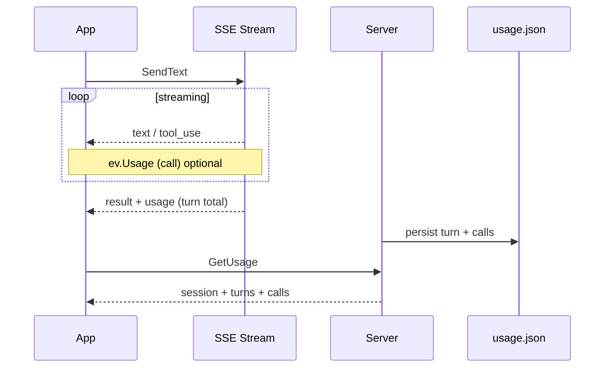

# 002: Token Usage のストリーム UX と Example 整理

## 背景 (Background)

### 現状の疑問（ユーザー指摘）

`examples/token-usage/main.go` では `sendAndCollectUsage` が SendText ごとに `result.Usage` だけを拾い、後段で `session.GetUsage(ctx)` を呼んでいる。

```go
turn1, err := sendAndCollectUsage(ctx, session, "...")
// ...
repAll, err := session.GetUsage(ctx)
```

利用者から次の疑問が出た:

1. **ストリームを見たいときに Usage も欲しい場合、どう書くのか？**
2. **ストリーム処理のあと `GetUsage` すれば足りるのでは？**（L77 があるから `sendAndCollectUsage` は不要では）
3. **`sendAndCollectUsage` は美しくない。** 独立したユースケースが思いつかない。
4. **理解できるのは**、ストリームイベントに usage が載り、LLM call usage がそのタイミングで並列に見える、という意図なら納得できる、という指摘。

### 現行 API の事実（調査結果）

| 取得経路 | いつ使えるか | 何が取れるか |
| :--- | :--- | :--- |
| **SSE `Event.Usage`** | ストリーム中〜終端 | イベントごと。`result` には**ターン合計**（確定値）。`text` 等の中間イベントには **call 単位**（`call_id` 付き、`claude_assistant` 等）が載る場合がある |
| **`GetUsage` / `GET .../usage`** | **ターン終了後**（永続化後） | セッション / ターン / calls の**完全な階層**。`UsageQuery` で絞り込み可 |
| **`GetSession().Usage`** | ターン終了後 | セッション累計のみ（calls なし） |

000 仕様の設計判断:

- SSE ペイロード肥大を避けるため、**Must はターン終端 `result.usage` のみ**。
- **call 一覧は `GetUsage` に寄せる**（000 R349）。
- サーバ内部では `turnUsageAggregator` が中間イベントの call usage を集約し、終端で `usage.json` に永続化する。

Client `stream.go` は**全イベント型**で JSON の `usage` を `Event.Usage` にデコードする。つまり API 上は「ストリームを読みながら call usage を見る」ことは**既に可能**だが、example / ドキュメントがそれを示していない。

### 問題の本質

1. **Example が二重経路を並置している**  
   `sendAndCollectUsage`（`result.Usage`）と `GetUsage`（永続レポート）を両方デモしているが、**同じターン合計を二回見せている**だけで、学習価値が低い。

2. **`sendAndCollectUsage` 専用の独立ユースケースが弱い**  
   ストリーム本文を表示しないラッパーであり、minimal-client の `stream.Output` パターンとも乖離している。

3. **「ストリーム + Usage」の正攻法が未整理**  
   利用者が期待する「Output しながら usage も見る」パターンが example / docs に書かれていない。

### 本仕様で決めること

1. **推奨パターンを明文化**する（ストリーム中 vs ターン後）。
2. **`examples/token-usage` から `sendAndCollectUsage` を除去**し、読みやすいフローに直す。
3. （Should）ストリーム中の **call 単位 usage** を optional にデモするか、少なくとも docs で触れる。

---

## 要件 (Requirements)

### 必須要件 (Must)

#### R1: 利用パターンの整理（ドキュメント）

次の表を `examples/token-usage/README.md` および必要なら `docs/` に追記する。

| 目的 | 推奨 API | 備考 |
| :--- | :--- | :--- |
| 本文をストリーム表示し、ターン完了だけ知りたい | `stream.Output(w)` または `OnText` + **`OnResult` で `ev.Usage`** | ターン合計のみ。calls は含まない |
| セッション / ターン / calls の完全レポート | **SendText 完了後** `sess.GetUsage(ctx)` | **原則これが正攻法**。永続化済み |
| 直近ターンだけ | `sess.GetUsage(ctx, UsageQuery{LastN: 1})` | 000 R3b |
| セッション累計だけ（軽量） | `GetSession().Usage` | calls / 履歴なし |
| ストリーム中に call 単位を逐次表示 | `Events()` / `Run()` のループで **`ev.Usage != nil && ev.Usage.CallID != ""`** | ベストエフォート。000 の Must 対象外 |

**原則（Must 明記）**:

> SendText のストリームが **正常終了（`result` または `[DONE]`）した後**なら、`GetUsage` でターン / call / セッション合計を取得する。**追加の HTTP 呼び出しはターンあたり 1 回で足りる。**  
> `result.Usage` は **そのターンの確定合計の即時スナップショット**であり、`GetUsage` の当該ターンと一致する（永続化タイミングの差でごく短いレースは許容、E2E で一致を担保）。

#### R2: Example のフロー変更

`sendAndCollectUsage` を**削除**し、001 仕様 R2 を次のように**更新解釈**する:

```text
1. CreateSession
2. SendText #1 → stream.Output(os.Stdout)  （または OnText で stdout）
3. SendText #2 → 同上
4. GetUsage(ctx) … 全件 → Session / Turn / Call 表示
5. GetSession().Usage でセッション累計突合
6. GetUsage(ctx, UsageQuery{LastN: 1}) … LastN セクション
7. Terminate
```

- **削除**: 各 SendText 直後の「`(stream result after SendText #N)`」表示ブロック。
- **理由**: `GetUsage` が同じ情報をより完全に返すため冗長。

#### R3: Example のストリーム処理

- `minimal-client` と同様 **`stream.Output(os.Stdout)`** を使う（専用ヘルパー禁止）。
- エラーは `log.Fatalf`（001 R6 準拠）。

#### R4: 001 仕様との整合

- 001 の R2 ステップ 3–5（各 Send 直後の result.Usage 表示）は **002 により Supersede** する。
- 3 階層表示（Session / Turn / LLM call）と `LastN=1` デモは **維持**（GetUsage 経由のみ）。

### 任意要件 (Should)

#### S1: ストリーム中 call usage の optional デモ

Example に **コメントまたは `--verbose-usage` フラグ**で、次を示してもよい:

```go
stream, _ := session.SendText(ctx, msg)
for ev := range stream.Events() {
    if ev.Usage != nil && ev.Usage.CallID != "" {
        log.Printf("[call usage] call_id=%s in=%d out=%d", ...)
    }
    // text は Output と同等の処理
}
```

- デフォルト OFF（出力が冗長になるため）。
- README に「リアルタイム call usage は Events ループで ev.Usage を見る」と 1 段落書く。

#### S2: Client Stream API の拡張（将来）

本イテレーションでは **Must にしない**。必要なら別 idea で:

- `Stream.OnUsage(func(u TokenUsage))`
- `Stream.LastTurnUsage()`（`OnResult` 後の糖衣）

---

## 実現方針 (Implementation Approach)

### 設計判断



1. **Example は「ストリーム = 本文表示」「Usage = GetUsage」に一本化**する。
2. **`result.Usage` の主用途**は、永続化前にターン合計を**即座**に知りたい場合（課金ダッシュボード、Send 直後の assert）。Example の主目的（3 階層学習）には不要。
3. **LLM call のリアルタイム表示**は、000 の Must 外だが Client は既に `Event.Usage` をデコード済み。Should として docs / optional フラグで触れる。

### 変更対象（想定）

| パス | 変更 |
| :--- | :--- |
| `examples/token-usage/main.go` | `sendAndCollectUsage` 削除、`Output` 利用 |
| `examples/token-usage/README.md` | R1 パターン表、GetUsage 正攻法の明記 |
| `ideas/001-Token-Usage-Example.md` | R2 の Send 直後表示を 002 参照に更新（実装計画時） |
| `docs/ReferenceManual-WebAPIs.md` | 任意: stream vs GET usage の 1 段落 |

---

## 検証シナリオ (Verification Scenarios)

### V1: Example 実行（手動）

1. Tern サーバを起動する。
2. `cd examples/token-usage && go run .` を実行する。
3. 2 回の SendText で**ストリーム本文**が stdout に流れることを確認する。
4. 終了ログ前に `=== Session usage ===` / `=== Turn usage ===` / `=== LLM call usage ===` / `=== LastN=1 ===` が出ることを確認する。
5. `sendAndCollectUsage` 相当の「stream result after SendText #N」行が**出ない**こと。

### V2: GetUsage のみで 3 階層

1. Example 実行後、Turn が 2 件以上、Session usage ≈ 各 Turn の和であることを目視確認する。
2. `LastN=1` セクションで Turn が 1 件（末尾）であること。

### V3: 既存 E2E 非退行

1. `./scripts/process/build.sh` が成功する。
2. `./scripts/process/integration_test.sh --specify "TokenUsage"` が成功する（example 変更のみのため TokenUsage E2E はそのまま通る想定）。

---

## テスト項目 (Testing)

| ID | 内容 | 自動化 |
| :--- | :--- | :--- |
| T1 | example が `go build` される（`build.sh` の examples ループ） | `./scripts/process/build.sh` |
| T2 | TokenUsage E2E 非退行 | `./scripts/process/integration_test.sh --specify "TokenUsage"` |
| T3 | README に利用パターン表がある | レビュー |
| T4 | main.go に `sendAndCollectUsage` が無い | レビュー / grep |

**統合テストコマンド（Must）**:

```bash
./scripts/process/build.sh
./scripts/process/integration_test.sh --specify "TokenUsage"
```

新規 E2E は Must にしない（example は手動 V1 + build コンパイルで足りる）。

---

## 参考 (References)

- 親仕様: [000-Token-Usage-Metering.md](file://prompts/phases/001-phase02/branches/feat-token-counter/ideas/000-Token-Usage-Metering.md)（SSE はターン合計 Must、calls は GetUsage）
- 前 example 仕様: [001-Token-Usage-Example.md](file://prompts/phases/001-phase02/branches/feat-token-counter/ideas/001-Token-Usage-Example.md)（R2 の Send 直後表示は 002 で supersede）
- Client: `client/v1/stream.go`（`Event.Usage`）、`client/v1/usage.go`（`GetUsage`）
- 雛形: [examples/minimal-client/main.go](file://examples/minimal-client/main.go)
