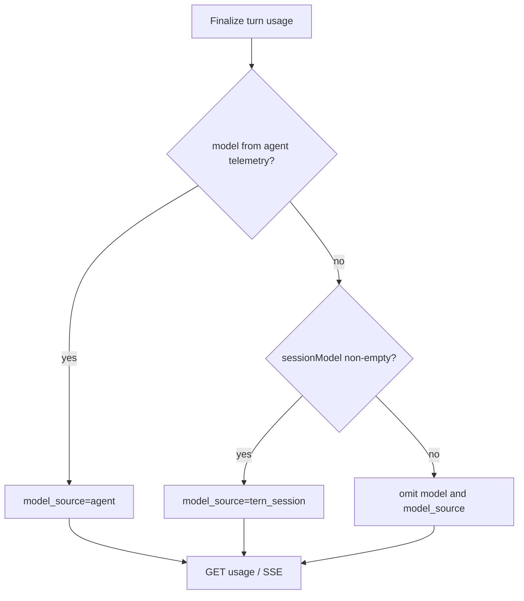

# 003: Usage のモデル帰属明示（model_source）

## 背景 (Background)

### レビューでの合意（2026-09-02）

1. **Codex** は CLI の `turn.completed.usage` に **モデル名が載らない**（現行 Codex JSONL）。トークン合計は取得可能。
2. **クライアント側**では `GetSession().Model` と usage を関連付けて管理できるが、**毎回 Join するよりサーバが返す方がよい**。
3. **`model` が空**だけでは「プロバイダが報告しなかった」のか「未実装」なのか区別できない。**情報ソースを明示**するフィールドが必要。
4. **Codex 向けサーバ補完**: CLI にモデルが無い場合、Tern は **ターン開始時のセッション `model`** を `usage.model` に入れて返す。ソースは **`tern_session`** と明示する。
5. **命名（レビュー追記）**: `model_reported`（bool）は「false なのに model がある」誤解を招く。**モデル名の情報ソース**（Coding Agent vs Tern）を表す名前にする。
6. **エージェント非依存フォールバック（レビュー追記）**: Claude Code でも万が一モデル名がテレメトリに無い場合、**Codex と同じ** `tern_session` 補完にフォールバックする。補完ロジックは **agentservice 層でエージェント共通**とする（Codex 専用分岐にしない）。

### 命名検討

| 案 | 形式 | 評価 |
| :--- | :--- | :--- |
| `model_reported` | bool | **却下** — false なのに `model` 非空と矛盾して見える |
| `model_from_agent` | bool | やや改善するが、集計行（model 空）の意味が弱い |
| `model_origin` | string enum | 可。やや抽象 |
| **`model_source`** | **string enum** | **採用** — `source`（トークン計測元）と対になる語感。値で意味が読める |

**採用値**（安定 API ID）:

| 値 | 意味 |
| :--- | :--- |
| `"agent"` | Coding Agent / CLI テレメトリから得た `model`（Claude `modelUsage` 等） |
| `"tern_session"` | Tern がターン開始時のセッション `model` で補完した値（Codex 等） |
| 省略 or `""` | `model` も無い行（セッション合計など） |

> `source`（`claude_result` / `codex_turn_completed` …）は **トークン数の計測経路**。  
> `model_source` は **`model` 文字列の出所**。別軸。

### 現状の問題

`TokenUsage` には `model` フィールドがあるが、未設定時は JSON から **省略**される（`omitempty`）。

クライアントから見ると Codex ターンは `model` キー無しで、未取得なのかバグなのか不明。

### 本仕様で決めること

1. API に **`model_source`**（string）を追加する。
2. **テレメトリにモデルが無い場合**（エージェント種別を問わず）、サーバはセッション `model` を補完し **`model_source: "tern_session"`** とする。
3. エージェントテレメトリ由来は **`model_source: "agent"`** とし、セッション model で上書きしない。
4. クライアント向けに意味をドキュメント化する。

---

## 要件 (Requirements)

### 必須要件 (Must)

#### R1: `model_source` フィールド

`TokenUsage`（Web API / Client / SSE `result.usage` / `GetUsage` の全階層）に追加:

```go
// Model source identifiers (stable API IDs).
const (
    ModelSourceAgent       = "agent"
    ModelSourceTernSession = "tern_session"
)

// Model is the effective model id when non-empty.
Model string `json:"model,omitempty"`

// ModelSource indicates where Model came from.
// agent: Coding Agent CLI telemetry.
// tern_session: Tern session model at turn start (server backfill).
// Omitted or empty when Model is empty (e.g. session aggregate).
ModelSource string `json:"model_source,omitempty"`
```

| `model_source` | `model` | 意味 |
| :--- | :--- | :--- |
| `"agent"` | 非空 | Coding Agent テレメトリ由来 |
| `"tern_session"` | 非空 | Tern がターン開始時セッション model で補完 |
| 省略 / `""` | 空 | モデル行なし（集計行など） |

不変条件:

- `model` 非空なら **`model_source` は `agent` または `tern_session` のいずれか必須**。
- `model` 空なら **`model_source` も省略**（`tern_session` + 空 model は禁止）。
- セッション合計（`derived_session_sum`）は **`model` 省略・`model_source` 省略**。

#### R2: モデル決定の優先順位（エージェント共通）

Finalize 時、**agentservice 層**で次の順に適用する（パーサーはテレメトリのみ。補完はここで一元化）:

1. **Agent テレメトリ** — ターン確定時点で `model` が非空 → `model_source = agent`（Claude `modelUsage`、将来 Codex `server_model`、LLMGP upstream 等）。
2. **Tern セッション補完** — 上記が無く、ターン開始時 `sessionModel`（`record.Model` スナップショット）が非空 → `model = sessionModel`、`model_source = tern_session`。
3. **モデル無し** — 両方無し → `model` 省略、`model_source` 省略（稀。セッション model 未設定のターン等）。

> **Must**: ステップ 2 は **Codex 専用ではない**。Claude で `result` に `modelUsage` が無い、`assistant` にも model が無い、等の **あらゆるエージェント**で同じフォールバックを適用する。

#### R2b: エージェント別の典型例

| 経路 | 最終 `model_source` | `model` |
| :--- | :--- | :--- |
| Claude `result` + `modelUsage` | `agent` | `modelUsage` のキー（複数時は先頭1件） |
| Claude `assistant` に model あり | `agent` | イベントの model |
| Claude で model テレメトリ無し | **`tern_session`**（R2 ステップ 2） | ターン開始時 `sessionModel` |
| Codex `turn.completed` / `token_count`（model 無し） | **`tern_session`**（R2 ステップ 2） | ターン開始時 `sessionModel` |
| LLMGP UsageMeter（upstream model あり） | `agent` | upstream model id |
| LLMGP で model 無し | **`tern_session`** | ターン開始時 `sessionModel` |

#### R3: サーバ補完（`tern_session`）のルール

- **いつ**: `applyUsageSideEffects` / `persistTurnUsage` の Finalize 直前（agentservice 層）。**エージェント名による分岐は禁止**（`if codex` 等を書かない）。
- **条件**: `rec.Usage.Model == ""`（または `ModelSource` 未設定）かつ `sessionModel != ""`。
- **何を入れる**: SendMessage 開始時点の `sessionModel`。`activeExecution` 作成時にスナップショットを推奨。
- **上書き禁止**: 既に `model_source == agent` かつ `model` 非空の場合は **補完しない**。
- **意味**: `tern_session` は「Tern が当該ターンで CLI に渡した設定モデル」。実プロバイダ ID との差は、agent テレメトリが無い限り検出不可。

#### R4: Client の解釈（ドキュメント Must）

```go
switch u.ModelSource {
case ModelSourceAgent:
    // model from Coding Agent telemetry
case ModelSourceTernSession:
    // model from Tern session config at turn start (not agent-reported)
default:
    // no model on this row
}
```

- `tern_session` + `model` 非空 → UI で「session model (not from agent telemetry)」等と表示可能。
- **Claude / Codex いずれでも** `tern_session` 補完時は **`GetSession()` Join 不要**（ターン `usage.model` に載る）。

#### R5: 後方互換

- 新フィールド追加のみ。
- 古い `usage.json` に `model_source` が無い場合: **`model != ""` かつ `source` が `claude_*` 系なら `agent`、それ以外は `tern_session` と推定**（読み込み時マイグレーション可）。

### 任意要件 (Should)

#### S1: Claude 複数モデル（`modelUsage` breakdown）

`model_source: agent` のまま、ターン `model` は代表1件。内訳は別 idea。

#### S2: Codex `server_model` 追従

Codex CLI が `turn.completed` に provider model を載せたら **`model_source: agent`** に切り替え。`tern_session` からの推測はしない。

---

## 実現方針 (Implementation Approach)

### 変更箇所（想定）

| 層 | 変更 |
| :--- | :--- |
| `codingagent/usage.go` | `ModelSource` 定数 + フィールド |
| `claudecode/protocol.go` | model 設定時 `ModelSource=agent` |
| `codex/protocol.go` | 数値のみ（補完は agentservice） |
| `agentservice/persistTurnUsage` | **共通** `applySessionModelBackfill(usage, sessionModel)` — model 空なら `tern_session` |
| `SumTurnUsage` | 集計行は `model` / `model_source` とも省略 |
| `client/v1/usage.go` | 型同期 |
| docs / examples | `model_source` 説明 |

### 設計判断



補完は **Claude / Codex / その他を問わず** 右枝（`tern_session`）に統一する。

---

## 検証シナリオ (Verification Scenarios)

### V1: Codex

1. `codex` セッションで SendMessage。
2. `model_source: "tern_session"` かつ `model` がセッション指定と一致。

### V2: Claude（modelUsage あり）

1. `modelUsage` あり → `model_source: "agent"`。
2. 観測 model とセッション model が異なる場合、**agent を優先**（補完しない）。

### V2b: Claude（model テレメトリ無し — フォールバック）

1. モックまたは `modelUsage` 無しの `result` フィクスチャで SendMessage。
2. `model_source: "tern_session"` かつ `model` がターン開始時セッション model と一致（Codex と同処理）。

### V3: 集計行

1. セッション合計 `usage` に `model` / `model_source` 無し。

### V4: 非退行

```bash
./scripts/process/build.sh
./scripts/process/integration_test.sh --specify "TokenUsage"
```

---

## テスト項目 (Testing)

| ID | 内容 |
| :--- | :--- |
| T1 | Claude parser: `modelUsage` → `model_source=agent` |
| T2 | agentservice 共通補完: model 空 + sessionModel → `tern_session`（Codex フィクスチャ） |
| T2b | agentservice 共通補完: Claude `result` に model 無し → 同じく `tern_session` |
| T3 | `SumTurnUsage`: model / model_source 省略 |
| T4 | E2E Claude: `model_source=agent`（live、modelUsage あり） |
| T5 | E2E Codex: `model_source=tern_session` |

---

## 参考 (References)

- [000-Token-Usage-Metering.md](file://prompts/phases/001-phase02/branches/feat-token-counter/ideas/000-Token-Usage-Metering.md)
- [002-Token-Usage-Stream-UX.md](file://prompts/phases/001-phase02/branches/feat-token-counter/ideas/002-Token-Usage-Stream-UX.md)
