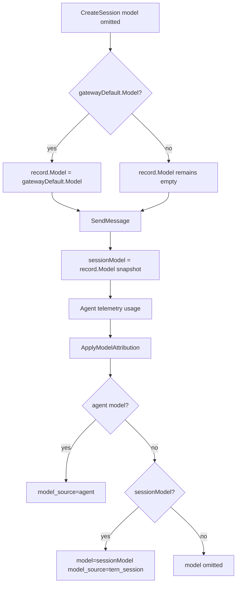

# 004: モデル未指定時の Tern デフォルト model 補完

> **Related**: [003-Usage-Model-Source.md](file://prompts/phases/001-phase02/branches/feat-token-counter/ideas/003-Usage-Model-Source.md)（`model_source` / `tern_session` 補完）

## 背景 (Background)

### 利用フィードバック（2026-09-02）

モデルを**未指定**でセッションを作成・実行したとき、usage の `model` が **空欄**のまま返るケースがある。`model_source: tern_session` 補完（003）があっても、補完元のセッション `model` 自体が空だと何も入らない。

一方 Tern 側には、LLMGP / gateway 経由で把握している **デフォルトモデル**（`GET /api/v1/models` の `default_model`、内部では `Server.gatewayDefault`）が存在する。実際のエージェント実行でも、セッションにモデルが無い場合は Tern / アダプタ側のデフォルトが効く想定である。利用側としては **「空」ではなく、その適用デフォルトを `model` として返してほしい**。

### 再現確認（単体テストで確認済み）

追加テスト:

`TestHandleSendMessage_OmittedModel_UsageModelEmptyDespiteGatewayDefault`
（`shared/libs/go/agentservice/handler_usage_test.go`）

手順:

1. `SetGatewayModels(..., &ModelInfo{Model: "claude-sonnet-4-20250514"})` で gateway デフォルトを注入
2. `POST /api/v1/sessions` で **`model` フィールド省略**
3. モックエージェントが **テレメトリに model 無し**の `EventResult.Usage` を返す
4. SendMessage / `GET .../usage` のターン usage を確認

**確認結果（現状・PASS）**:

| 項目 | 現状 |
| :--- | :--- |
| Create レスポンスの `model` | 空 |
| `result.usage.model` / `model_source` | 空 / 省略 |
| `GET /usage` のターン `model` / `model_source` | 空 / 省略 |
| サーバが知る `gatewayDefault.Model` | `"claude-sonnet-4-20250514"`（未使用） |

つまり **003 の `tern_session` 補完は `record.Model`（ターン開始スナップショット）依存**であり、作成時にモデル未指定だとスナップショットが空のままになる。

### 根本原因

```text
CreateSession(model omitted)
  → record.Model = ""          （gatewayDefault を書き込まない）
SendMessage
  → sessionModel = record.Model = ""
  → ApplyModelAttribution(u, "")
  → agent model 無し + sessionModel 空 → model 空のまま
```

`handleCreateSession` は `req.Model != ""` のときだけ Resolve/Validate し、空のときは **デフォルト適用を行わない**。

```go
// 現行（概念）
record := &SessionRecord{ Model: req.Model, ... } // req.Model == "" のまま
```

### 本仕様で決めること

1. モデル未指定時に Tern が把握している **有効デフォルト**をセッション `model` に確定する。
2. usage Finalize 時、その値を **`model_source: tern_session`** で返す（003 の優先順位を拡張）。
3. Create / GetSession でも同じ有効モデルが見えるようにする（usage だけ特別扱いにしない）。

---

## 要件 (Requirements)

### 必須要件 (Must)

#### R1: セッション有効モデルの確定タイミング

次のいずれか（または両方）で、`record.Model` が空なら Tern デフォルトを適用する。

1. **CreateSession**: `req.Model == ""` かつ `gatewayDefault != nil` かつ `gatewayDefault.Model != ""` のとき  
   `record.Model = gatewayDefault.Model` を永続化する。
2. **ターン開始（SendMessage / runTurn）**: Create 時点で未適用だった場合の保険として、`record.Model == ""` なら同じ規則で埋めてから `sessionModel` スナップショットを取る。

不変条件:

- クライアントが明示した `model`（Resolve 後）は **上書きしない**。
- `gatewayDefault` が無い / Model 空のときは現状どおり `model` 空を許容する（強制エラーにしない。003 R2 ステップ 3）。

#### R2: usage への反映（003 拡張）

`ApplyModelAttribution` の入力 `sessionModel` は、ターン開始時点の **確定済み `record.Model`** とする。

優先順位（003 R2 を維持し、ステップ 2 の前提を強化）:

1. Agent テレメトリ `model` 非空 → `model_source = agent`
2. `sessionModel` 非空（**明示指定 or Tern デフォルト適用後**）→ `model = sessionModel`、`model_source = tern_session`
3. 両方無し → `model` / `model_source` 省略

> **Must**: デフォルト適用後の値も `model_source` は **`tern_session`**（新規 enum は増やさない）。  
> 意味は「Tern が当該ターンで有効とみなしたセッションモデル」であり、明示指定かデフォルト補完かはセッションレコード上は区別しない。

#### R3: GetSession / Create レスポンス

- Create レスポンスおよび `GET /api/v1/sessions/:id` の `model` は、R1 適用後の `record.Model` を返す。
- モデル未指定でデフォルト適用された場合も **空欄にしない**（gatewayDefault がある限り）。

#### R4: 単体テストの更新

現状のギャップ確認テスト:

`TestHandleSendMessage_OmittedModel_UsageModelEmptyDespiteGatewayDefault`

を **望ましい挙動を検証するテストに置き換える**（または別名で追加し、ギャップ確認テストは削除）:

| 検証 | 期待 |
| :--- | :--- |
| Create 後の `model` | `gatewayDefault.Model`（例: `claude-sonnet-4-20250514`） |
| `result.usage.model` | 同上 |
| `result.usage.model_source` | `tern_session` |
| `GET /usage` ターンの `model` / `model_source` | 同上 |

追加ケース（Must）:

- **明示 model あり**: デフォルトで上書きされない（既存 `TestHandleSendMessage_ResultUsageAndGetUsage` の回帰）。
- **gatewayDefault 無し + model 省略**: `model` 空のまま（003 ステップ 3）。
- **agent テレメトリに model あり**: `model_source=agent` が優先（デフォルトで上書きしない）。

### 任意要件 (Should)

#### S1: AdapterConfig.DefaultModel との関係

エージェントアダプタの `AdapterConfig.DefaultModel` は CLI 起動時の別経路。本仕様の一次ソースは **`Server.gatewayDefault`（LLMGP default_model）** とする。

- Should: `gatewayDefault` が無く `AdapterConfig.DefaultModel` だけある場合のフォールバックは、別 idea または実装計画で検討可。
- Must ではない（ゲートウェイが既定の運用では `gatewayDefault` が入る）。

#### S2: 既存セッションの後方互換

既に `model=""` で保存されたセッションに対し、次回 SendMessage で R1-2 を適用してよい（ターン開始時バックフィル）。過去ターンの usage.json は書き換え不要。

---

## 実現方針 (Implementation Approach)

### データフロー（望ましい）



### 変更箇所（概要）

| 領域 | 内容 |
| :--- | :--- |
| `agentservice/handler.go` `handleCreateSession` | `req.Model == ""` 時に `gatewayDefault` を `record.Model` へ適用 |
| `agentservice/handler_retry.go` / runTurn | スナップショット前に空なら再適用（保険） |
| `handler_usage_test.go` | ギャップ確認テストを期待挙動テストへ更新 |
| ドキュメント | `ReferenceManual-WebAPIs.md` に「model 省略時は default_model をセッションに確定」を追記 |

### `ApplyModelAttribution` 自体

シグネチャ変更は不要。**入力 `sessionModel` が空にならないこと**が本仕様の本質。003 の関数ロジックはそのまま継承する:

```go
func ApplyModelAttribution(u *TokenUsage, sessionModel string) {
	if u == nil {
		return
	}
	if u.Model != "" {
		if u.ModelSource == "" {
			u.ModelSource = ModelSourceAgent
		}
		return
	}
	if sessionModel != "" {
		u.Model = sessionModel
		u.ModelSource = ModelSourceTernSession
	}
}
```

### デフォルト適用ヘルパ（案）

```go
// effectiveSessionModel returns record.Model, or gatewayDefault.Model when record is empty.
func (s *Server) effectiveSessionModel(recordModel string) string {
	if recordModel != "" {
		return recordModel
	}
	if s.gatewayDefault != nil && s.gatewayDefault.Model != "" {
		return s.gatewayDefault.Model
	}
	return ""
}
```

Create 時は戻り値を `record.Model` に書き戻す。ターン開始時も同様に書き戻してから `activeExecution.sessionModel` に載せる。

---

## 検証シナリオ (Verification Scenarios)

ユーザー報告に基づく確認シナリオ（要約せず転記・具体化）:

1. モデル未指定でセッションを作成する。
2. Tern 側には適用可能なデフォルトモデルがある（gateway `default_model`）。
3. エージェントが usage にモデル名を載せない（または載せられない）経路でメッセージを送る。
4. **現状**: usage の `model` が空欄。
5. **望ましい**: usage の `model` に Tern デフォルトモデル名が入り、`model_source` は `tern_session`。

単体での再現は上記 `TestHandleSendMessage_OmittedModel_UsageModelEmptyDespiteGatewayDefault` で確認済み（現状は空）。実装後は同条件で非空を期待する。

---

## テスト項目 (Testing)

### 単体テスト

```bash
go test ./shared/libs/go/agentservice/ -run 'TestHandleSendMessage_OmittedModel|TestHandleSendMessage_ResultUsage' -count=1
./scripts/process/build.sh
```

### 統合テスト

```bash
./scripts/process/integration_test.sh --specify "TokenUsage"
```

E2E 追記（Should）: モデル省略でセッション作成し、ターン usage の `model` が非空かつ `model_source` が `agent` または `tern_session` であることを assert（エージェントが model を返す場合は `agent` でも可）。

---

## 受け入れ基準 (Acceptance Criteria)

- [ ] モデル省略 + `gatewayDefault` あり → Create / GetSession / usage のターン `model` がデフォルト値
- [ ] そのときの `model_source` は `tern_session`（agent テレメトリ無しの場合）
- [ ] 明示 model はデフォルトで上書きされない
- [ ] agent テレメトリの model は優先される
- [ ] ギャップ確認テストが望ましい挙動のテストに更新され、`build.sh` と TokenUsage 統合テストが通る
