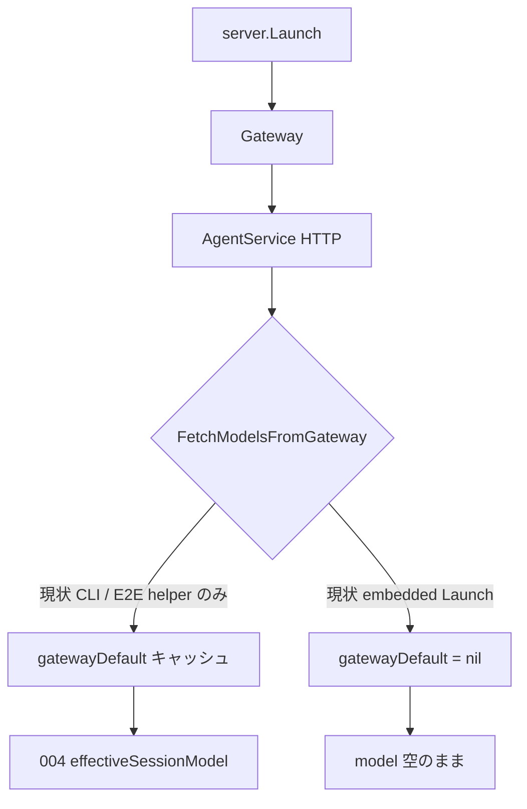

# 005: Embedded Launch で gatewayDefault が埋まらない（Issue #63）

> **Related Issue**: [#63](https://github.com/axsh/arctic-tern/issues/63)  
> **Related Specs**: [004-Usage-Default-Model-Backfill.md](file://prompts/phases/001-phase02/branches/feat-token-counter/ideas/004-Usage-Default-Model-Backfill.md)（セッション model 補完ロジック自体は実装済み）

## 背景 (Background)

### 報告内容（Issue #63）

v0.2.11 で、埋め込み Tern（`github.com/axsh/arctic-tern/server` の `Server.Launch`）経由だと:

1. LLMGP `GET /v1/models` には `default_model` がある
2. なのに Agent Service `GET /api/v1/models` は `default_model` が空 / `models` も空
3. `model` 省略の CreateSession 後、セッション `model` と usage の `model` / `model_source` が空のまま

推論自体は LLMGP のプロファイル既定で動くが、**セッション／usage の帰属だけが空**になる。

### 再現確認（本ブランチで実施済み）

追加 E2E: `tests/embedded_gateway_default_e2e_test.go`  
`TestEmbeddedLaunch_OmitsGatewayDefaultWithoutFetch`

手順（要約）:

1. `server.New` + `Launch` のみ（**`FetchModelsFromGateway` を呼ばない**）
2. LLMGP `/v1/models` → `default_model=claude-sonnet-4-6`（コントロール）
3. Agent Service `/api/v1/models` → `default_model` 空・`n_models=0`
4. CreateSession（`model` 省略）→ GetSession の `model` が空

実行結果（2026-09-02）:

```text
./scripts/process/integration_test.sh --specify 'TestEmbeddedLaunch_OmitsGatewayDefaultWithoutFetch'
--- FAIL: TestEmbeddedLaunch_OmitsGatewayDefaultWithoutFetch
  Issue #63 reproduced: Agent Service default_model empty after Launch alone
  Issue #63 reproduced: CreateSession without model left session.model empty
```

### 根本原因

004 の補完ロジック（`effectiveSessionModel` / `applySessionModelDefault`）は **`Server.gatewayDefault` キャッシュ依存**である。キャッシュを埋めるのは `FetchModelsFromGateway()` のみ。

| 経路 | Launch 後に fetch するか |
| :--- | :--- |
| スタンドアロン CLI `features/tern/cmd/server.go` | **する**（`Launch` の直後に明示呼び出し） |
| 埋め込み `server.Launch` | **しない** |
| 多くの E2E（`startE2EServer` 等） | **する**（「Mirror tern cmd」コメント付きで手動呼び出し） |

そのため:

- 単体／既存 E2E（`SetGatewayModels` または手動 fetch）では 004 が PASS する
- 埋め込みライブラリ利用者（Issue 報告者のパス）では `gatewayDefault == nil` のまま → 004 が効かない

```text
server.Launch
  → Gateway up
  → AgentService up
  → (fetch なし) gatewayDefault == nil

CreateSession(model omitted)
  → effectiveSessionModel("") → ""
SendMessage / usage
  → ApplyModelAttribution(u, "") → model 空
```

想定外ユースケースというより、**CLI では用意していた初期化が埋め込み API に漏れていた**。

### 本仕様で決めること

1. 埋め込み `server.Launch`（または同等の本番起動経路）でも gateway モデル一覧／`default_model` をキャッシュする。
2. Issue #63 を回帰できない E2E（上記テストが PASS する状態）を必須化する。
3. 004 のセマンティクス（省略時は gateway 既定をセッションに確定）を埋め込みでも保証する。

### スコープ外

- 004 の補完アルゴリズム自体の再設計（既に実装済み。本仕様はキャッシュ投入の配線）。
- LLMGP に `default_profile` が無い場合に model を強制すること（004 R1: 空許容）。
- CLI の挙動変更（既に fetch 済み）。

---

## 要件 (Requirements)

### 必須要件 (Must)

#### R1: `server.Launch` 完了後に gateway モデルをキャッシュする

- Gateway と AgentService が起動したあと、`AgentService().FetchModelsFromGateway()` を呼び出すこと。
- 呼び出し箇所の推奨: `server.Launch` 内（AgentService.Launch 成功直後）。CLI と二重呼び出しになっても冪等でよい。
- fetch 失敗時: **起動自体は失敗させない**（CLI と同様に警告ログ）。004 R1「default 無しなら空許容」と整合。

#### R2: 埋め込み経路で `GET /api/v1/models` が LLMGP と整合する

- `model_profiles.yaml` に `default_profile` がある構成で Launch 後:
  - Agent Service の `default_model` が LLMGP のそれと一致する（非 null）
  - `models` が空でない（プロファイル由来の一覧）

#### R3: 埋め込み経路で model 省略セッションに既定が入る

- CreateSession で `model` 省略時、GetSession の `model` が R2 の `default_model.model` と一致する（gatewayDefault がある場合）。
- これにより 004 の usage `tern_session` 補完が埋め込みでも機能する前提を満たす。

#### R4: 回帰 E2E

- `TestEmbeddedLaunch_OmitsGatewayDefaultWithoutFetch`（または改名後の同等テスト）が **PASS** すること。
- 当該テストは **`FetchModelsFromGateway` をテスト側で呼ばない**こと（埋め込み本番経路を模擬）。
- 既存の `startE2EServer` が手動 fetch する点は残してよいが、コメントで「CLI / server.Launch が本来担う初期化のミラー」と明記を維持する。

#### R5: ドキュメント

- 埋め込み利用（`server.Launch`）でもモデル一覧／default が自動取得されることを README または Reference Manual の該当箇所に短く追記する（CLI 専用だった印象を避ける）。

### 任意要件 (Nice to Have)

| # | 内容 |
| :--- | :--- |
| O1 | Create/SendMessage 時に `gatewayDefault == nil` なら一度だけ fetch をリトライ（起動レース対策） |
| O2 | CLI の明示 fetch を削除し `server.Launch` のみに一本化（二重呼び出し解消） |
| O3 | `AgentService.Launch` 内部で fetch する案（server 以外の起動経路もカバー） |

---

## 実現方針 (Implementation Approach)

### 推奨案

**`server.Launch` の末尾（AgentService 起動成功後）で fetch**する。

```go
// server/server.go Launch (概念)
if err := s.agentService.Launch(ctx, agentPort); err != nil {
    return fmt.Errorf("tern: agentservice launch: %w", err)
}
if err := s.agentService.FetchModelsFromGateway(); err != nil {
    s.logger.Warn("failed to fetch models from gateway", "error", err.Error())
} else {
    s.logger.Debug("gateway models cached")
}
```

理由:

- Issue の Suggested fix と一致
- CLI と同じタイミング（Gateway が listen 済み）
- 埋め込み利用者が追加コードを書かなくてよい

### 代替案との比較

| 案 | 長所 | 短所 |
| :--- | :--- | :--- |
| A: `server.Launch` で fetch（推奨） | 埋め込み／CLI の共通入口 | `NewWithStore` 等テスト用起動は対象外（現状どおり手動） |
| B: `AgentService.Launch` 内で fetch | agentservice 単体起動もカバー | gatewayURL 未設定時の扱い・テスト影響が広い |
| C: 利用側に fetch を文書化のみ | コード変更最小 | Issue #63 は未解消（埋め込み API の欠陥のまま） |

### 既存テストとの関係



修正後は D が embedded Launch でも実行され、G に合流する。

### 主な変更箇所（想定）

| 領域 | パス |
| :--- | :--- |
| Launch 配線 | `server/server.go` |
| 回帰 E2E | `tests/embedded_gateway_default_e2e_test.go`（既存・FAIL→PASS） |
| 任意で CLI 整理 | `features/tern/cmd/server.go`（O2） |
| docs | `README.md` / `docs/ReferenceManual-WebAPIs.md` |

---

## 検証シナリオ (Verification Scenarios)

Issue #63 の Steps to reproduce を埋め込み E2E に落としたもの（要約せず要件として保持）:

1. `server.New` + `Launch`（fetch をテストから呼ばない）
2. `curl` 相当で LLMGP `GET /v1/models` → `default_model` 非 null
3. Agent Service `GET /api/v1/models` → 同じ `default_model`（修正後）
4. `POST /api/v1/sessions` で `model` 省略
5. `GET /api/v1/sessions/{id}` の `model` が gateway 既定と一致（修正後）

（任意・live）Codex で短いターンを送り `usage.model` / `model_source` が空でないこと — 既存 `TestClaudeCodeE2E_TokenUsage_OmittedModel_UsesDefault` は `startE2EServer`（手動 fetch）依存のため、本仕様の主検証は R4 の埋め込み E2E とする。

---

## テスト項目 (Testing)

手動確認のみは禁止。

| ID | 内容 | 種別 |
| :--- | :--- | :--- |
| T1 | `TestEmbeddedLaunch_OmitsGatewayDefaultWithoutFetch` が PASS | 統合 / E2E |
| T2 | `server.Launch` 後の fetch 失敗が起動を壊さない（単体またはログ検証） | 単体推奨 |
| T3 | 既存 004 系・`TestClaudeCodeE2E_TokenUsage_OmittedModel_UsesDefault` がリグレッションしない | 統合 |

実行コマンド:

```bash
./scripts/process/build.sh && ./scripts/process/integration_test.sh --specify 'TestEmbeddedLaunch_OmitsGatewayDefaultWithoutFetch'
```

リグレッション（任意・時間が許せば）:

```bash
./scripts/process/integration_test.sh --specify 'TestClaudeCodeE2E_TokenUsage_OmittedModel|TestHandleCreateSession.*Model|TestHandleSendMessage_OmittedModel'
```

---

## 関連コード

| 種別 | パス |
| :--- | :--- |
| 埋め込み Launch | `server/server.go` |
| CLI fetch | `features/tern/cmd/server.go` |
| キャッシュ／補完 | `shared/libs/go/agentservice/service.go`（`FetchModelsFromGateway`, `effectiveSessionModel`） |
| E2E がバグを隠す箇所 | `tests/agentservice_e2e_test.go`（`startE2EServer`） |
| 再現 E2E | `tests/embedded_gateway_default_e2e_test.go` |
| 先行仕様 | `prompts/phases/001-phase02/branches/feat-token-counter/ideas/004-Usage-Default-Model-Backfill.md` |
