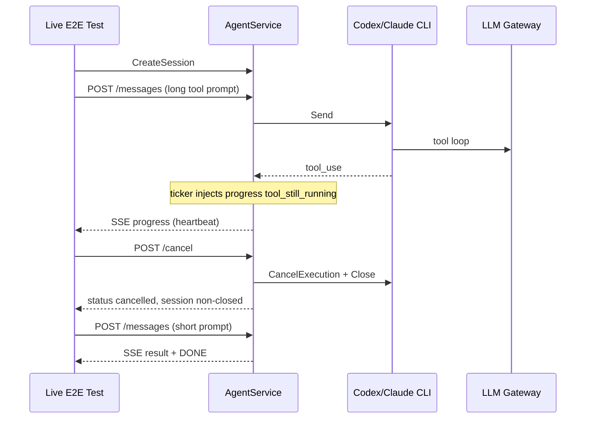

# 000: ツールハートビートとターンキャンセルのライブ E2E

## 背景 (Background)

### なぜ必要か

[PR #58](https://github.com/axsh/arctic-tern/pull/58)（`feat/tool-heartbeat-and-turn-cancel`）は次を追加した:

1. **Tool SSE heartbeat**: ツール実行中に `progress` / `content: "tool_still_running"` を定期注入（既定 30s）
2. **Turn cancel**: `POST /api/v1/sessions/:id/cancel`（`Session.CancelTurn`）でインフライトターンを中断し、**同一 session id を閉じずに再利用**

現状の検証は **モック agent の単体・HTTP テストのみ**である（`handler_cancel_test.go` / `exec_registry_test.go` / `client/v1`）。実 CLI（Codex / Claude Code）と LLM を通したライブ E2E は **未追加・未実行**。

マージ判断・下流（sysnavi agent-runner / kanban-gui）での利用前に、次をライブで固定する必要がある:

- 実ツール実行中にハートビートが SSE に届くこと
- cancel がターンを止めつつ session を `closed` にしないこと
- cancel 後に同一 id で次ターンを送れること
- terminate は従来どおり `closed` になること（回帰）

### 現状の課題（調査結果の要約）

| 観点 | 現状 |
| :--- | :--- |
| 単体 / HTTP モック | PASS（heartbeat・cancel ハッピーパス） |
| ライブ E2E | 無し |
| Cancel エラー系（404 / 409 closed） | 単体でも薄い |
| `TestHandleCancel_KeepsSessionIDNonClosed` | 約 30s（第2ターンが mock の sleep を待つ）。ライブでは同型の遅延を避ける |

### 関連

- PR: https://github.com/axsh/arctic-tern/pull/58
- API: `file://docs/ReferenceManual-WebAPIs.md`（Cancel / Tool liveness）
- 既存ライブ基盤: `file://tests/agentservice_e2e_test.go`、`file://tests/llm_live_codex_test.go`、`file://tests/session_recover_live_test.go`
- ブランチ作業ディレクトリ名: `feat-tool-heartbeat-and-turn-cancel`（git ブランチは `feat/tool-heartbeat-and-turn-cancel`。detached HEAD 時も本パスに仕様を置く）

### スコープ外

- ハートビート／cancel 本体の再設計（PR #58 の実装を前提とする。バグが出たら別仕様）
- GUI / Playwright
- Wayfinder / Gemini 専用ライブ（任意で後続可）
- 下流リポジトリ（agent-runner / kanban-gui）側のテスト

---

## 要件 (Requirements)

### 必須要件 (Must)

#### M1. ライブ E2E ファイルの追加

- `tests/` に新規ファイルを追加する（推奨名: `tool_heartbeat_cancel_live_test.go`）。
- パッケージは既存ライブと同型（`llm_test`）。
- テスト名プレフィックス:
  - `TestLiveToolHeartbeat_` … ハートビート
  - `TestLiveTurnCancel_` … キャンセルと再開
- `t.Skip` / `t.Skipf` **禁止**。CLI 不在・認証不可・gateway 失敗は **Fatal**。

#### M2. Tool heartbeat（実エージェント）

最低 1 エージェント（**Codex 必須**。モデルは既存ライブと同系、例: `gpt-4o`）で次を満たす:

1. サーバのハートビート間隔を **テスト用に短縮**する（既定 30s のまま待たない）。手段は次のいずれか（実装計画で確定）:
   - プロセス環境 `SSE_TOOL_HEARTBEAT_INTERVAL`（例: `1s` / `2s`）を Launch 前に設定
   - または AgentService に同等の設定経路がある場合はそれを使う
2. プロンプトで **明確に長めのシェル／ツール実行**を誘発する（例: `sleep 8` 相当。OS 差はプロンプトと検証で吸収）。
3. `POST .../messages` の SSE で、ツール実行中に少なくとも 1 回:
   - `type` が `progress`
   - `content` が `tool_still_running`
   - `tool_name` が空でない（実 CLI のツール名。厳密一致は必須にしないが欠落は Fail）
4. ターンは有限時間内に終端（`result` または明示 `error` + `[DONE]`）。テスト全体の上限例: **120s**。

#### M3. Turn cancel（実エージェント）

Codex ライブで次を満たす:

1. 長時間ツール（例: `sleep 60` 相当）を開始し、SSE 購読を並行で開始する。
2. `followable: true`（または同等のインフライト検知）を待ってから `POST .../cancel` を呼ぶ（client `CancelTurn` でも可）。
3. cancel 応答は HTTP 200 かつ body に `cancelled`。
4. 直後の `GET .../sessions/:id`:
   - 同一 `id`
   - `status` は **`closed` でない**
   - 推奨: `status` が `error` かつ `error` フィールドが `turn cancelled`（ドキュメント契約）
5. 元の SSE が妥当な時間内に終了する（ハング禁止。上限例: cancel 後 **30s**）。
6. **同一 session id** で短い次ターン（例: `Reply with exactly: OK`）を送り、**409 busy / 404** にならないこと。次ターンは短時間で完了すること（全体上限例: **90s**）。

#### M4. Terminate 回帰（対比）

- ライブまたは既存ヘルパで、terminate 後に session が `closed` になることを 1 ケースで確認する（新規でも既存 `TestHandleTerminateAgent` のライブ相当でも可）。
- cancel と terminate を同一テスト内で混同しないこと（別関数）。

#### M5. ヘルパ再利用とサーバ起動

- `startE2EServer` / `createE2ESessionWithModel` / `sendE2EMessage` / `parseE2ESSEEvents` 等の既存ヘルパを可能な限り再利用する。
- ハートビート短縮のため、必要なら **専用の start ヘルパ**（環境変数設定付き）を同ファイルまたは既存ヘルパ近傍に追加する。
- sandbox は既存 Codex E2E と同様、テストが安定する設定（多くの E2E は `disable_sandbox: true`）を用いる。cancel 対象の `sleep` が sandbox で拒否されないこと。

#### M6. Claude Code 透過性（必須ゲートの範囲）

- **Codex を必須ゲート**とする。
- **Claude Code** についても同型シナリオ（heartbeat または cancel の少なくとも一方）を **1 本以上**追加する。失敗時に「Claude だけ Skip」は禁止。環境要件（`claude` CLI）は Codex と同様 Fatal。
- プロンプト・アサーションの緩さは両エージェントで対称であること（エージェント固有の tool_name 表記差のみ許容）。

#### M7. 実行・確認までを成果物とする

本仕様の完了条件には次を含む（実装計画・実行フェーズで実施）:

1. テストコードの実装
2. `build.sh` 成功
3. 下記 Testing 節の `--specify` ライブ実行が **PASS**
4. 結果を実装計画の Verification チェックボックスに記録

### 任意要件 (Optional)

#### O1. client/v1 経由の CancelTurn ライブ

- HTTP 直叩きに加え、`client/v1.Session.CancelTurn` を使う経路を 1 本。

#### O2. Follow 中の cancel

- `POST /messages` 切断後に `GET .../events`（Follow）購読中に cancel し、Follow 側も終端すること。

#### O3. ネスト tool / EventError 停止の単体補強

- ライブではなく既存 `exec_registry_test.go` に toolDepth / disable interval ケースを足す（前回調査の不足分）。本仕様の必須ゲートには含めない。

### 非要件 (Out of Scope)

- 既定 30s 間隔のまま待つライブ（CI 時間を無駄にするため禁止）
- GUI / Playwright
- PR #58 のドキュメント大幅改訂（テスト追加に伴う 1 行追記は可）

---

## 実現方針 (Implementation Approach)

### 全体像



### 設計決定

1. **間隔短縮は必須**: ライブで 30s 待ちはしない。`SSE_TOOL_HEARTBEAT_INTERVAL` をテストプロセスに設定するのが PR #58 実装との最短経路（config.yaml 未対応なら env で足りる）。
2. **プロンプトは決定的に**: 「必ず shell で N 秒 sleep」と明示し、ツール未起動による偽陰性を減らす。モデルが従わない場合は Fail（リトライ方針は実装計画で 1 回までに制限）。
3. **cancel 待ち**: `GET session` の `followable` または最初の `tool_use` SSE を観測してから cancel（PR のモックテストと同趣旨）。
4. **第2ターンは短文**: mock の 30s 問題をライブで再現しない。
5. **命名**: `--specify "TestLiveToolHeartbeat_|TestLiveTurnCancel_"` で必須ゲートを一括実行できるようにプレフィックスを固定する。

### 配置案

| パス | 役割 |
| :--- | :--- |
| `tests/tool_heartbeat_cancel_live_test.go` | ライブ本体 |
| （必要なら）`tests/agentservice_e2e_test.go` 近傍ヘルパ | 短縮 heartbeat 付きサーバ起動 |

### 失敗時の扱い

- 実装バグ（cancel 後 busy 残存、heartbeat 未到達など）→ 本ブランチで修正し再実行。
- モデル非決定性のみ → プロンプト強化・タイムアウト調整。Skip で逃げない。

---

## 検証シナリオ (Verification Scenarios)

ユーザー指定の手順は無し。以下を受け入れシナリオとする。

### S1. Heartbeat（Codex）

1. 短縮 heartbeat でサーバ起動
2. Codex セッション作成（`gpt-4o` 等）
3. 長めツールを誘発するメッセージ送信（SSE）
4. SSE に `progress` + `tool_still_running` を観測
5. ターン終端と `[DONE]`

### S2. Cancel + resume（Codex）

1. 同上サーバ
2. 長時間ツール開始
3. インフライト検知後に cancel
4. session が non-closed（推奨: `error` / `turn cancelled`）
5. 同一 id で短い次ターンが成功

### S3. Heartbeat または Cancel（Claude Code）

1. `claude` CLI 必須
2. S1 または S2 と同型の 1 本以上

### S4. Terminate 対比

1. セッション作成 → terminate → `status == closed`

---

## テスト項目 (Testing)

> `scripts/process/integration_test.sh` に **`--categories` は無い**。未知フラグで失敗するため **付けない**。フィルタは `--specify` のみ。

### 必須コマンド（Windows / 一般）

```bash
./scripts/process/build.sh
./scripts/process/integration_test.sh --specify "TestLiveToolHeartbeat_|TestLiveTurnCancel_"
```

### 必須コマンド（Linux / Remote-SSH Linux）

```bash
./scripts/process/build.sh --skip-etc
xvfb-run -a ./scripts/process/integration_test.sh --specify "TestLiveToolHeartbeat_|TestLiveTurnCancel_"
```

### 単体退行（モック。任意だが推奨）

```bash
go test ./shared/libs/go/agentservice/ -count=1 -timeout 120s -run 'TestEventRelay_ToolHeartbeat|TestHandleCancel_|TestHandleSendMessage_ToolHeartbeat'
go test ./client/v1/ -count=1 -run 'TestCancelTurn_UsesCancelPath'
```

### 位置づけ

| 分類 | 内容 |
| :--- | :--- |
| ライブ必須ゲート | `TestLiveToolHeartbeat_*` / `TestLiveTurnCancel_*` |
| 単体 | PR #58 既存（本仕様では新規必須としない。O3 は任意） |

---

## 受け入れ基準 (Acceptance)

- [ ] `tests/tool_heartbeat_cancel_live_test.go`（または同等）がマージ対象に含まれる
- [ ] Codex: heartbeat ライブ PASS
- [ ] Codex: cancel + 同一 id 再開 ライブ PASS
- [ ] Claude Code: 同型少なくとも 1 本 PASS（Skip 無し）
- [ ] Terminate 対比（または明示的回帰）PASS
- [ ] 上記 `--specify` コマンドの実行ログが検証記録に残る

---

## 次ステップ

仕様レビュー OK のあと、`/create-implementation-plan` で実装計画を作成し、続けて `/execute-implementation-plan` で実装・ライブ実行・確認を行う。  
（本ワークフローでは仕様作成のみ。実装には進まない。）
