# 000: ファイル変更収集アルゴリズムの選択（セッション単位）

## 背景 (Background)

### 現状

Tern は System Artifact として「どのファイルが create / update / delete されたか」を記録する。記録経路は次の 3 層（Tier）に分かれている。

| Tier | 現行の実装 | タイミング | 主な実装 |
| :--- | :--- | :--- | :--- |
| Tier 1 | 構造化ツールイベント（`Write` / `Edit` / `file_change` 等） | リアルタイム | `ToolCallAnalyzer` |
| Tier 2 | シェルコマンド解析（`Bash` / `command_execution` 等） | リアルタイム | `ParseShellCommand` |
| Tier 3 | workDir 差分補完（git diff またはディレクトリ snapshot） | ターン／セッション終了時 | `RunSessionReconciliation` |

現状は **サーバに `artifactStore` がある限り、3 層すべてが常時有効** である。セッション作成 API（`POST /api/v1/sessions`）や Client SDK（`client/v1.SessionRequest`）に、収集方式を選ぶ設定はない。

### 課題

1. **Tier 3（workDir 差分）は出所を区別しない**  
   `git diff --name-status HEAD` / snapshot size 比較は、エージェントのツール呼び出し以外の変更（バックグラウンドプロセス、手編集、ビルド出力など）も System Artifact に混入しうる。利用者によっては「エージェントが明示的に触ったファイルだけ」が欲しい。

2. **用途ごとに最適な組み合わせが異なる**  
   - 厳密なエージェント起因のみ: Tier 1（＋必要なら Tier 2）  
   - 漏れを最小化: 現行どおり Tier 1+2+3  
   - Artifact 追跡そのものを無効化したいケースもある

3. **ON/OFF がサーバ全体に閉じている**  
   `configDir` 未設定で ArtifactStore 自体を落とす以外に、セッション単位で収集アルゴリズムを切る手段がない。

### 本仕様で決めること

1. Tier 1〜3 に **安定したアルゴリズム名（識別子）** を付ける。
2. それらを **組み合わせ選択（各 ON/OFF）** できる単位として定義する。
3. **セッション作成時に Client API から指定** できるようにする。
4. 省略時の既定は **Tier 1–2 ON / Tier 3 OFF**（`structured_tool`・`shell_parser` = true、`workdir_reconcile` = false）とする。  
   workDir 差分のセッション外混入を既定で避ける。フル補完が必要な利用者は明示的に `workdir_reconcile: true` を指定する。

### スコープ外

- unified diff / パッチ本文の永続化（現状どおり path + operation メタデータのみ）。
- User Artifact（明示 PUT）の仕様変更。
- Tier 3 の `structured output` 補助（現行未配線）の新規実装。
- ArtifactStore 自体のサーバ起動条件（`configDir`）の変更。本仕様は **Store が有効なうえでの収集アルゴリズム選択** を扱う。

---

## 要件 (Requirements)

### 必須要件 (Must)

#### R1: 収集アルゴリズムに安定 ID を付ける

次の 3 つを **ファイル変更差分の収集アルゴリズム** として定義する。API・ログ・`tool_name` 補完イベントのドキュメントでこの ID を使う。

| アルゴリズム ID | 対応 Tier | 意味 |
| :--- | :--- | :--- |
| `structured_tool` | Tier 1 | 構造化ファイルツール／`file_change` から path + operation を記録 |
| `shell_parser` | Tier 2 | シェル系ツールのコマンド文字列を解析して path + operation を推定・記録 |
| `workdir_reconcile` | Tier 3 | ターン／セッション終了時に workDir の差分で未記録 path を補完 |

`workdir_reconcile` の内部実装は現行どおり次を自動選択する（本 Must では利用者に git / snapshot を別 ID として公開しない）。

| workDir の状態 | 実装 |
| :--- | :--- |
| Git リポジトリ | `git diff --name-status HEAD` + `git ls-files --others --exclude-standard` |
| 非 Git かつターン開始 snapshot あり | ディレクトリ snapshot の size 比較 |
| それ以外 | 補完なし |

制約（現行と同じ。ドキュメントに明記すること）:

- git 経路では `.gitignore` 対象は検出されない。
- workDir 差分はセッション外変更を含みうる。

#### R2: セッション単位で各アルゴリズムの ON/OFF を指定できる

- `POST /api/v1/sessions` に任意フィールドを追加し、3 アルゴリズムそれぞれの有効／無効を指定できること。
- 推奨スキーマ（実装計画で JSON キー名を固定する）:

```json
{
  "agent": "codex",
  "work_dir": "/path/to/project",
  "file_change_collectors": {
    "structured_tool": true,
    "shell_parser": true,
    "workdir_reconcile": false
  }
}
```

- フィールド省略時（またはオブジェクト未送信時）の既定:

| キー | 既定 |
| :--- | :--- |
| `structured_tool` | `true` |
| `shell_parser` | `true` |
| `workdir_reconcile` | `false` |

- オブジェクトを送ったが一部キーのみ指定した場合: **未指定キーは上表のキー別既定値で埋める**（部分上書き）。実装計画でこの解決規則に固定する。
- 全 OFF にしたい場合は明示的に 3 つとも `false` を送る。
- `workdir_reconcile` を有効にしたい場合は明示的に `true` を送る。
- 未知のキーは `400 Bad Request`（許可キーをメッセージに含める）。
- 値が boolean 以外の場合も `400`。

#### R3: 解決済み設定をセッションに保持し、GET で返す

- `SessionRecord` および `GET /api/v1/sessions/{id}`（および Create レスポンスを拡張する場合）に、解決済みの `file_change_collectors` を含める。
- レスポンスでは **常に 3 キーすべてを明示** する（暗黙の省略を避ける）。

#### R4: 実行時の挙動が設定に従う

| 設定 | 期待挙動 |
| :--- | :--- |
| `structured_tool: false` | Tier 1 由来の `SaveSystemArtifactEvent` を行わない |
| `shell_parser: false` | Tier 2（シェル解析）由来の保存を行わない |
| `workdir_reconcile: false` | `captureTurnSnapshot` / `reconcileSessionArtifacts`（git・snapshot 補完）を行わない |
| 3 つとも `false` | 当該セッションでは System Artifact イベントを新規記録しない（一覧 API 自体は Store が有効なら存在する） |

- ArtifactStore がサーバで無効（`nil`）の場合は現行どおり追跡なし。セッション設定は無視してよい（または作成時に警告ログ）。
- `workdir_reconcile: true` でも ArtifactStore が無い場合は現行どおり no-op。

#### R5: `client/v1` から同じ設定を指定できる

| 対象 | 変更 |
| :--- | :--- |
| `SessionRequest` | `FileChangeCollectors`（または同等）を追加し Create ボディに載せる |
| `SessionInfo` | 解決済みの同構造を返す |
| 定数／型 | アルゴリズム ID を型または定数として公開（推奨） |
| 単体テスト | JSON へのマッピングと省略時の挙動を検証 |

#### R6: PATCH では変更しない（本 Must）

- `file_change_collectors` は **セッション作成時に固定** する。`PATCH` での変更は本仕様の Must 外（任意要件 O2）。

#### R7: ドキュメント更新（Reference Manual + README）

- `docs/ReferenceManual-WebAPIs.md` にフィールド、既定値、各アルゴリズムの意味と制約（gitignore／セッション外混入）を追記する。
- ルート `README.md` の Artifact API 節（および Create Session の例がある箇所）に次を追記する:
  - `file_change_collectors` の概要と JSON／Go Client の使用例
  - 既定値（Tier 1–2 ON / Tier 3 OFF）
  - `workdir_reconcile: true` が必要なケース（漏れ最小化）と、既定 OFF の理由（セッション外・バックグラウンド混入）
  - 実行可能 example へのリンク（R9）
- 「差分」は path + operation のイベントであり、unified diff 本文ではないことを明記する。

#### R8: 互換性と破壊的変更の扱い

- **Tier 1/2**: フィールド省略時も ON のため、既存のリアルタイム System Artifact 記録は維持する。
- **Tier 3**: 省略時は OFF になる。これは現行（常時 reconcile）からの **意図的な破壊的変更** である。ドキュメントとリリースノートで明記する。
- 既存の reconcile 統合テスト／E2E は、必要なら `workdir_reconcile: true` を明示して期待どおり補完されることを検証するよう更新する。
- Tier 1/2 のみに依存する既存 Artifact E2E は、省略時でも PASS を維持すること。

#### R9: `examples/` への追加

`examples/sandbox-mode/` と同様に、セッション作成時のコレクタ指定を示す実行可能 example を追加する。

| 項目 | 内容 |
| :--- | :--- |
| 推奨パス | `examples/file-change-collectors/`（名前は実装計画で固定可） |
| 内容 | `client/v1` で CreateSession → GET して解決済み `file_change_collectors` を表示。CLI 引数で既定／`workdir_reconcile` ON／全 OFF などを切り替えられること |
| 付属 | 短い README または `main.go` 先頭コメントに Usage・既定値・アルゴリズム ID を記載 |
| 既存例 | `examples/artifact-pipeline/` でも、CreateSession 時に設定を渡す（またはコメントで既定と `workdir_reconcile: true` の違いを示す）こと。パイプライン本体の挙動を壊さない範囲でよい |

README（R7）から当該 example へリンクすること。
### 任意要件 (Nice to Have)

| # | 内容 |
| :--- | :--- |
| O1 | プリセット文字列（例: `"realtime"` = Tier1+2＝既定相当、`"full"` = 1+2+3、`"off"` = 全 OFF）を API で受け、内部で boolean マップに展開する |
| O2 | `PATCH /api/v1/sessions/{id}` で収集設定を変更（未実行ターン以降のみ有効、などルールを要定義） |
| O3 | `workdir_reconcile` を `git_reconcile` / `snapshot_reconcile` に分割して個別 ON/OFF |
| O4 | サーバ全体の既定（config）で「セッション未指定時の既定マップ」を上書き可能にする |
| O5 | 補完イベントの `tool_name`（`reconcile:git` 等）に加え、レスポンスに `collector` フィールドを露出する |

---

## 実現方針 (Implementation Approach)

### 設計方針

1. **アルゴリズムを第一級の設定単位にする**  
   「Tier」は内部説明用。「API 上の名前」は上記 ID（`structured_tool` / `shell_parser` / `workdir_reconcile`）に統一する。

2. **組み合わせ = 各フラグの積集合**  
   有効なアルゴリズムだけがイベントを生成する。無効な経路は早期 return し、無効経路の結果を他経路が「補完」しない（例: Tier1 OFF かつ reconcile ON のとき、ツール由来で拾えるはずだった変更も reconcile が拾えば記録される — これは意図どおり「有効にしたアルゴリズムの和」）。

3. **セッション作成時に解決して保持**  
   `sandbox_mode` と同様、Create 時に正規化し `SessionRecord` に保存。ターン処理はレコードを参照する。

### アーキテクチャ

```mermaid
flowchart TD
    A["POST /sessions<br/>file_change_collectors"] --> B[SessionRecord に解決済みマップを保存]
    B --> C{SendMessage / Turn}
    C --> D[TaskLog tool_use]
    D --> E{structured_tool?}
    E -->|ON| F[Tier1 SaveSystemArtifactEvent]
    E -->|OFF| G[スキップ]
    D --> H{shell_parser?}
    H -->|ON| I[Tier2 SaveSystemArtifactEvent]
    H -->|OFF| J[スキップ]
    C --> K{workdir_reconcile?}
    K -->|ON| L[snapshot / git reconcile]
    K -->|OFF| M[reconcile スキップ]
    L --> N[未記録 key のみ supplemental]
```



### 主な変更箇所（想定）

| 領域 | ファイル（目安） | 変更 |
| :--- | :--- | :--- |
| API | `agentservice/handler.go` | CreateSession でパース・検証・保存 |
| セッション型 | `SessionRecord` / GET レスポンス | フィールド追加 |
| Analyzer | `artifact/analyzer/analyzer.go` | セッション設定を参照して Tier1/2 をゲート（resolver 経由で取得） |
| Reconcile | `agentservice/artifact_reconcile.go` | `workdir_reconcile` OFF なら snapshot／reconcile を呼ばない |
| Client | `client/v1/session.go` | リクエスト／レスポンス型 |
| ドキュメント | `docs/ReferenceManual-WebAPIs.md`, `README.md` | フィールド・既定・example リンク |
| Example | `examples/file-change-collectors/`（新規）, `examples/artifact-pipeline/`（必要なら） | CreateSession での指定デモ |

### Analyzer への設定受け渡し

現状 `ToolCallAnalyzer` はセッション単位のコレクタ設定を知らない。次のいずれかとする（実装計画で選択）。

| 案 | 内容 | 長所 / 短所 |
| :--- | :--- | :--- |
| A | `WorkDirResolver` と同様に `CollectorConfigResolver(sessionID) FileChangeCollectors` を注入 | 既存パターンに近い |
| B | TaskLog Entry や StreamEvent に設定を載せる | 配線が広がる |
| C | reconcile のみセッション側でゲートし、Tier1/2 は Analyzer 内で sessions ストアを参照 | 依存が増える |

**推奨: 案 A**（セッション ID → 設定の resolver）。

### 既定値の解決例

```text
入力なし
  → { structured_tool: true, shell_parser: true, workdir_reconcile: false }

{ "workdir_reconcile": true }
  → { structured_tool: true, shell_parser: true, workdir_reconcile: true }  // 部分上書き + キー別既定

{ "structured_tool": false }
  → { structured_tool: false, shell_parser: true, workdir_reconcile: false }

{ "structured_tool": false, "shell_parser": false, "workdir_reconcile": false }
  → 全 OFF
```

### 利用イメージ（Client）

```go
// 既定（Tier1-2 ON / Tier3 OFF）— FileChangeCollectors 省略で可
sess, err := client.CreateSession(ctx, v1.SessionRequest{
    Agent:   "codex",
    WorkDir: dir,
})

// workDir 差分補完も使いたい場合のみ明示
sess, err = client.CreateSession(ctx, v1.SessionRequest{
    Agent:   "codex",
    WorkDir: dir,
    FileChangeCollectors: &v1.FileChangeCollectors{
        WorkdirReconcile: true, // 他キーはキー別既定（Tier1-2 ON）
    },
})
```

---

## 検証シナリオ (Verification Scenarios)

ユーザーから具体手順の提示はないため、仕様上の受け入れシナリオを定義する。

### S1: 省略時は Tier1–2 ON / Tier3 OFF

1. `file_change_collectors` なしでセッション作成。
2. Write（または同等）でファイル作成 → System Artifact に create が載る。
3. Git workDir で Tier1/2 に載らないディスク変更のみを行いターン終了 → **補完イベントが増えない**（既定で reconcile OFF）。
4. GET session の解決済み値は `{ structured_tool: true, shell_parser: true, workdir_reconcile: false }`。

### S2: workdir_reconcile を明示 ON

1. `workdir_reconcile: true` でセッション作成。
2. Tier1 で拾える Write は記録される。
3. Tier1/2 に載らない変更を置きターン終了 → `reconcile:git`（または snapshot）相当で補完される。

### S3: structured_tool / shell_parser OFF

1. 両方 false、`workdir_reconcile: true`。
2. Write ツールを使っても Tier1 イベントは出ない（設定どおり）。
3. ディスク上に変更があれば reconcile のみで記録されうる。

### S4: 全 OFF

1. 3 つとも false。
2. ファイル操作後も当該セッションの System Artifact 新規イベントが 0 件。

### S5: 不正入力

1. 未知キーまたは非 boolean → HTTP 400。

### S6: GET で解決済み値が読める

1. 部分指定で Create したセッションを GET し、3 キーすべてが解決済みで返る。

---

## テスト項目 (Testing)

手動確認のみは禁止。少なくとも次を自動化する。

### 単体・パッケージテスト

| ID | 内容 | 目安 |
| :--- | :--- | :--- |
| U1 | CreateSession の JSON パース・既定解決・未知キー 400 | `agentservice` |
| U2 | Analyzer が `structured_tool` OFF でイベントを書かない | `artifact/analyzer` |
| U3 | Analyzer が `shell_parser` OFF でシェル由来を書かない | `artifact/analyzer` |
| U4 | `workdir_reconcile` OFF で `RunSessionReconciliation` / snapshot が走らない | `agentservice` または analyzer |
| U5 | `client/v1` の SessionRequest マージャル | `client/v1` |
| U6 | `examples/file-change-collectors` がビルド可能（`go build` / `go test` があれば） | `examples/` |

実行例:

```bash
./scripts/process/build.sh
go test ./shared/libs/go/agentservice/ ./shared/libs/go/artifact/analyzer/ ./client/v1/ -count=1
go build -o /dev/null ./examples/file-change-collectors/
```

ドキュメント確認（実装完了時のチェックリスト）:

- [ ] `README.md` に `file_change_collectors` の説明・既定・example リンクがある
- [ ] `docs/ReferenceManual-WebAPIs.md` に Create Session フィールドがある
- [ ] `examples/file-change-collectors/`（または同等）が存在する
### 統合テスト

| ID | 内容 | カテゴリ |
| :--- | :--- | :--- |
| I1 | 省略時: Tier1/2 由来の Artifact は記録され、git 補完は付かない | `common` |
| I2 | `workdir_reconcile: true` 明示時: 既存 reconcile 相当の補完が動く | `common` |
| I3 | 全 OFF で System Artifact が増えない | `common` |
| I4 | Tier1/2 依存の既存 Artifact E2E が省略時でも PASS（リグレッション） | `common` または `llm` |

実行例（実装後のテスト名に合わせて `--specify` を調整）:

```bash
./scripts/process/integration_test.sh --categories common --specify 'TestReconcile|TestE2E_.*Artifact|TestFileChangeCollector'
```

LLM 依存の Codex E2E を触る場合:

```bash
./scripts/process/integration_test.sh --categories llm --specify 'TestCodexE2E_SystemArtifact'
```

---

## 関連ドキュメント・コード

| 種別 | パス |
| :--- | :--- |
| Tier 1/2 | `shared/libs/go/artifact/analyzer/analyzer.go` |
| Tier 3 | `shared/libs/go/artifact/analyzer/reconcile.go`, `git_diff.go`, `snapshot_diff.go` |
| 呼び出し | `shared/libs/go/agentservice/artifact_reconcile.go` |
| セッション API | `shared/libs/go/agentservice/handler.go` |
| Client | `client/v1/session.go`, `client/v1/artifacts.go` |
| Example 参考 | `examples/sandbox-mode/`, `examples/artifact-pipeline/` |
| README | `README.md`（Artifact API Examples 節） |
| 先行仕様（追跡） | `prompts/phases/000-foundation/branches/bugfix-#28/ideas/000-Codex-SystemArtifact-Tracking.md` |
| 類似パターン（セッション設定） | `prompts/phases/001-phase02/branches/fix-bug-session-home/ideas/001-Session-Sandbox-Mode-Client-API.md` |
