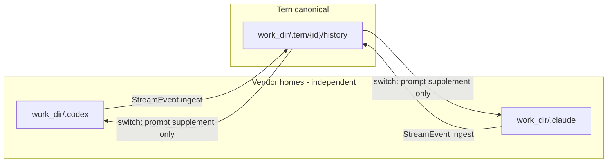
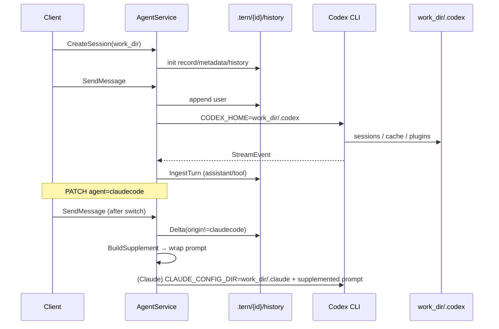

# 000: Coding Agent vendor ホームを `.tern` 外へ戻し、正本と分離する

## 背景 (Background)

### 発端 (Issue #48)

Codex バックエンドの Tern セッションを複数回作成すると、ワークスペース配下の `.tern/` がセッション数に比例して肥大化する。観測では 1 セッションあたり約 80MB / 約 5,300 ファイルで、大半は:

```text
{work_dir}/.tern/{session_id}/native/.tmp/plugins/
```

に置かれた Codex marketplace plugins（`.git` pack とアセットを含むフルクローン）である。`history/` や `metadata.json` は KB 規模のままである。

参照: [axsh/arctic-tern#48](https://github.com/axsh/arctic-tern/issues/48)

### 意図していたディレクトリ役割（本仕様の正）

議論の結果、プロダクト意図は次のとおりである。

| パス | 役割 | 管理者 |
|---|---|---|
| `{work_dir}/.tern/{session_id}/` | Tern / Wayfinder 形式の**セッション正本**（中立な req/res 記録） | Tern |
| `{work_dir}/.codex/` | Codex CLI の **vendor ホーム** | Codex |
| `{work_dir}/.claude/` | Claude Code の **vendor ホーム** | Claude Code |

三者は互いに無関係であり、混ぜてはならない。各 Coding Agent は自前のホームでセッション・キャッシュ・設定を独自管理し続ける。

エージェント切替時のみ、Tern は正本 `.tern/` を参照し、切替先エージェントのプロンプトへダイジェストを注入する。vendor ホーム同士で transcript / rollout をコピーしない。



### 現行実装との乖離

現行実装（および `feat-session-migration` の Wayfinder 可搬性仕様の一部）は、次のようになっている。

```text
{work_dir}/.tern/{session_id}/
  history/ metadata.json record.json   # 正本（意図どおり）
  native/                              # CODEX_HOME / CLAUDE_CONFIG_DIR（意図外）
    sessions/ .tmp/plugins/ ...
```

`SendMessage` 時に:

```text
WithSessionDir(NativeSessionDir(session_dir))
→ CODEX_HOME = {session_dir}/native
→ CLAUDE_CONFIG_DIR = {session_dir}/native
```

を渡している。そのため:

1. Codex / Claude の vendor ホームが `.tern` 配下に同居する（意図と矛盾）。
2. セッションごとに空の `CODEX_HOME` が作られ、Codex が marketplace plugins を毎回フルクローンする（Issue #48 の直接原因）。
3. terminate / DELETE はプロセス停止とメモリ削除のみで、`native/` ディスクを掃除しないため、肥大化が蓄積する。

### `.tern` 導入前の挙動

Wayfinder 正本導入（canonical `.tern/{id}`）より前は、未指定時の `SessionDir` フォールバックが `WorkDir/.AgentName` だった。

- agent=`codex` → `{work_dir}/.codex` が `CODEX_HOME`
- agent=`claudecode` → `{work_dir}/.claudecode` が `CLAUDE_CONFIG_DIR`

つまり **以前はワークスペース側の vendor ホームをそのまま使っていた**。`.tern` 導入時に「正本と vendor を分ける」目的で `native/` を新設したが、結果として vendor ホーム自体を `.tern` の内側へ引っ越しさせてしまった。

### 本仕様で決めること

1. `.tern/{id}/` は **正本のみ**とする。`native/` を CLI ホームとしては使わない（不要にする）。
2. Codex / Claude の `CODEX_HOME` / `CLAUDE_CONFIG_DIR` を、ワークスペース側の vendor ホームへ戻す。
3. エージェント切替の正本 → プロンプト補間は維持する。
4. Issue #48 のセッションツリー肥大化を解消する（plugins をセッション比例で複製しない）。
5. 先行仕様のうち「`native/` = `CODEX_HOME` / `CLAUDE_CONFIG_DIR`」の記述を、本仕様で置き換える。

---

## 要件 (Requirements)

### 必須要件 (Must)

#### R1: ディレクトリ役割の再定義

次の役割分担を仕様の正とする。

| パス | 含めてよいもの | 含めてはならないもの |
|---|---|---|
| `.tern/{id}/` | `record.json`, `metadata.json`, `history/`, 必要なら `context.json` | Codex/Claude の sessions / sqlite / `.tmp/plugins` / projects transcript |
| `{work_dir}/.codex/` | Codex が通常ホームに書くもの一式 | Tern 正本（history 等） |
| `{work_dir}/.claude/` | Claude が通常ホームに書くもの一式 | Tern 正本（history 等） |

- `.tern/{id}/native/` を **新設・維持しない**。既存ディスク上に残っていても、新規セッションでは作成・参照しない。
- ドキュメント・API 説明から「Agent native files are under `{session_dir}/native`」を削除し、vendor ホームはワークスペース側である旨に更新する。

#### R2: `CODEX_HOME` / `CLAUDE_CONFIG_DIR` の配線

- Tern が Codex を起動するとき、`CODEX_HOME` の既定値は **`{work_dir}/.codex`** とする（明示上書きが無い場合）。
- Tern が Claude Code を起動するとき、`CLAUDE_CONFIG_DIR` の既定値は **`{work_dir}/.claude`** とする（明示上書きが無い場合）。
- アダプタの論理名が `claudecode` であっても、ディレクトリ名は **`WorkDir/.AgentName`（`.claudecode`）ではなく必ず `.claude`** とする。導入前互換の `.claudecode` へフォールバックしない。
- `session_dir`（Tern 正本ルート）と vendor ホームは **別パス**である。`WithSessionDir(NativeSessionDir(...))` のように正本配下を CLI ホームへ渡してはならない。
- `config_dir` overlay の適用先は、正本ではなく **当該エージェントの vendor ホーム**とする。

#### R3: `.tern` 正本の責務は維持する

次は現行どおり維持する（壊してはならない）。

- CreateSession 既定: `session_dir = {work_dir}/.tern/{session_id}`
- user メッセージの正本追記、ターン完了時の `IngestTurn`（`StreamEvent` → `history/`）
- `origin` 付き履歴、`AgentBindings`、`active_agent`
- エージェント切替時: 他エージェントの resume id を渡さない
- 切替差分は **正本のみ**から算出し、vendor JSONL / rollout をパースしない
- 切替補完はプロンプト先頭への supplement 注入（`map_reduce` / `full` / `structured`）

#### R4: 同一エージェント連続実行時の resume

- 同一 Coding Agent の連続ターンでは、そのエージェント自身の vendor ホーム上の session / thread id を resume してよい。
- resume 先は `.tern/.../native` ではなく、R2 の vendor ホーム上の状態とする。
- 切替直後（当該 agent の binding に native id が無い、またはクリア済み）は新規 vendor セッション開始 + 正本からの supplement とする。

#### R5: セッション肥大化の解消 (Issue #48)

- 複数の短命 Codex セッションを同一 `work_dir` で繰り返しても、`.tern/{id}/` 配下に marketplace plugins のフルツリーがセッション数比例で増えないこと。
- plugins / `.tmp` などのキャッシュは vendor ホーム側（共有）に置かれ、Tern 正本ツリーの `du` は主に `history` / metadata 規模に留まること。
- terminate / DELETE が vendor ホーム全体を削除する必要はない（共有ホームのため）。正本ディレクトリの削除ポリシーは別途任意要件とする。

#### R6: 先行仕様との関係

- `000-Wayfinder-Format-Session-Portability` のうち、次を **本仕様で改訂**する。
  - 「`native/` を `CLAUDE_CONFIG_DIR` / `CODEX_HOME` とする」
  - 「Claude の `projects/` と Codex の `sessions/` を同一 `native/` 配下に同居させてよい」
- Wayfinder 形式を正本とする方針、切替は正本→プロンプト補間、JSONL 直コピー禁止、といった中核は維持する。

#### R7: Claude vendor ホーム名は `.claude` に統一する

- Claude Code の vendor ホームは **`{work_dir}/.claude` のみ**とする（必須）。
- Tern が新規に `{work_dir}/.claudecode` を `CLAUDE_CONFIG_DIR` として作成・参照してはならない。
- 既存ワークスペースに `.claudecode` が残っていても、本仕様の既定動作は `.claude` を使う（自動マイグレーションは必須としない）。

### 任意要件 (Should / May)

#### R8: 既存 `native/` の移行・掃除 (May)

- 既に生成された `.tern/{id}/native/` の自動移行や GC は必須としない。
- ドキュメントに手動削除可能である旨（正本 `history` を消さないこと）を書いてよい。

#### R9: 観測ログ (May)

- vendor ホームへ plugins 相当の大量書き込みを検出したときの debug ログは任意。

#### R10: 正本ディレクトリの明示削除 API (May)

- DELETE session で `.tern/{id}/` 正本をディスクから消すかは本仕様の必須範囲外（現状はメモリのみ削除）。別仕様で扱ってよい。

---

## 実現方針 (Implementation Approach)

### 設計上の決定

1. **正本と vendor ホームをパスレベルで分離する**  
   「同じ親の下でサブディレクトリを分ける」（現行 `native/`）ではなく、ワークスペース直下の従来 vendor ディレクトリを使う。

2. **共有キャッシュは意図的に許容する**  
   同一 `work_dir` 上の複数 Tern セッションが同じ `{work_dir}/.codex` を共有する。現行プロダクトの主ユースケース（直列・同一ワークスペース）では、これが `.tern` 導入前の実運用でもあった。同時実行の厳密隔離は本仕様の必須範囲外とする（必要なら将来別仕様）。

3. **切替の擬似継続は正本経由のみ**  
   `.codex` に無い Claude 時代の文脈は、`.tern` のダイジェストをプロンプトに載せることで補う。vendor ファイルの相互移植はしない。

4. **`NativeSessionDir` の廃止または意味変更**  
   「`{session_dir}/native` をアダプタに渡す」ヘルパは削除するか、正本パスと混同しない名前に置き換える。アダプタへ渡すのは vendor ホームパス。

### 想定コンポーネント変更（実装計画フェーズで詳細化）

| 領域 | 変更の方向 |
|---|---|
| `agentservice` | `WithSessionDir(NativeSessionDir(...))` をやめ、agent 種別に応じた vendor ホームを渡す。Canonical Init で `native/` を作らない |
| `codingagent/codex` | `CODEX_HOME={work_dir}/.codex`（または明示 SessionDir が vendor を指す場合のみ） |
| `codingagent/claudecode` | `CLAUDE_CONFIG_DIR={work_dir}/.claude`（R2 / R7） |
| `config_overlay` | overlay 先を vendor ホームへ。正本パスを誤って上書きしない保護を維持 |
| API / README / ReferenceManual | `native/` 記述の削除と役割表の更新 |
| 先行 ideas | `native/` = CLI ホームの記述を本仕様へ追随 |

### 目標レイアウト

```text
{work_dir}/
  .codex/                         # Codex vendor ホーム（共有）
    sessions/ ...
    .tmp/plugins/ ...             # キャッシュはここに一度だけ（想定）
  .claude/                        # Claude vendor ホーム（共有・必須）
    projects/ ...
  .tern/
    {session_id}/                 # Tern 正本のみ
      record.json
      metadata.json
      history/
        0000001.json
        ...
      # native/ は置かない
```

### データフロー（改訂後）



### 非目標 (Non-goals)

- Codex / Claude 公式のホーム仕様そのものの変更
- marketplace plugins を Tern が独自キャッシュ実装すること（CLI の共有ホームに任せる）
- 複数 Tern セッションの同時実行における vendor ホーム排他制御
- 既存 `native/` ツリーの必須自動マイグレーション

---

## 検証シナリオ (Verification Scenarios)

### V1: 正本のみが `.tern` に残る

1. 空のワークスペースで Codex セッションを Create → 短文 SendMessage → terminate する。
2. `{work_dir}/.tern/{id}/` を列挙する。
3. 期待: `record.json` / `metadata.json` / `history/` が存在する。
4. 期待: `native/` ディレクトリが新規作成されていない。
5. 期待: `.tmp/plugins` が `.tern` 配下に存在しない。

### V2: Codex vendor ホームがワークスペース側にある

1. V1 と同じ操作を行う。
2. `{work_dir}/.codex/` を確認する。
3. 期待: Codex のセッションまたは状態ファイルが `.codex` 配下に存在する（環境・Codex 版によりパス詳細は変わりうる）。
4. 期待: プロセス環境で `CODEX_HOME` が `{work_dir}/.codex` を指している（ログまたはアダプタ単体テストで確認可）。

### V3: 複数セッションでも `.tern` が plugins 比例で膨らまない

1. 同一 `work_dir` で Create → 短文ターン → terminate を 5 回繰り返す（セッション id は都度新規）。
2. 各回のあと `du -sh {work_dir}/.tern/*` と `du -sh {work_dir}/.codex`（存在すれば）を記録する。
3. 期待: 各 `.tern/{id}` は小さく、セッション数に対して ~80MB 級の線形増加をしない。
4. 期待: plugins 相当の大きなデータがある場合、それは `.codex` 側にあり、セッション数分のフル複製にはならない。

### V4: エージェント切替の正本補間が維持される

1. Codex で数ターン会話する（正本 `history` に origin=`codex` が溜まる）。
2. PATCH で agent を `claudecode`（または逆方向）へ切り替える。
3. 切替後の最初の SendMessage で、プロンプトに transferred context / supplement が付与されることを確認する（テストまたはログ）。
4. 期待: 切替先に他エージェントの resume id が渡らない。
5. 期待: `.codex` のファイルを `.claude` へコピーしていない。
6. 期待: 切替先 Claude の `CLAUDE_CONFIG_DIR` は `{work_dir}/.claude` である。

### V5: 同一エージェント連続 resume

1. 同一 Codex Tern セッションで 2 ターン送る。
2. 期待: 2 ターン目が同一 vendor thread を resume できる（binding / AgentSessionID 経由）。
3. 期待: resume 状態の参照先は `{work_dir}/.codex` であり `.tern/.../native` ではない。

---

## テスト項目 (Testing)

手動確認のみは禁止。少なくとも次を自動化し、統合テストランナーで実行する。

### 単体・パッケージテスト（実装時に追加・更新）

- `NativeSessionDir` をアダプタ起動パスから除去したことのテスト
- Codex `BuildEnv`: `CODEX_HOME` が `{work_dir}/.codex`（または明示 vendor パス）であること
- Claude `BuildEnv`: `CLAUDE_CONFIG_DIR` が **`{work_dir}/.claude`** であること（`.claudecode` ではないこと）
- Canonical `Init` が `native/` を作成しないこと
- `wrapPromptWithSupplement` / agent switch の既存テストが回帰しないこと
- overlay 先が vendor ホーム（`.codex` / `.claude`）であること（正本を壊さないこと）

### 統合テスト実行コマンド

本リポジトリの `scripts/process/integration_test.sh` は `--specify` でフィルタする（`--categories` は未提供）。

```bash
# セッション可搬性・切替補間の回帰
./scripts/process/integration_test.sh --specify "SessionPortability|Portability"

# Codex セッション経路の回帰
./scripts/process/integration_test.sh --specify "Codex"

# エージェントサービス / セッション API の回帰
./scripts/process/integration_test.sh --specify "AgentService|Session"
```

実装完了後は、本仕様向けに例えば次を追加し `--specify` で狙えるようにする。

- `TestTernSessionDir_NoNativeVendorHome`
- `TestCodexUsesWorkDirCodexHome`
- `TestClaudeUsesWorkDirClaudeHome`
- `TestRepeatedCodexSessions_TernTreeDoesNotAccumulatePlugins`

（実ファイル名・テスト名は実装計画で確定する。）

LIVE / 実 CLI が必要なケースは既存の skip 方針に従い、フェイク CLI でパス配線と正本レイアウトを必ずカバーする。

---

## 受け入れ条件 (Acceptance Criteria)

1. 新規 Tern セッションで `.tern/{id}/native/` が作られない。
2. Codex 起動時の `CODEX_HOME` が `{work_dir}/.codex` である（既定）。
3. Claude 起動時の `CLAUDE_CONFIG_DIR` が **`{work_dir}/.claude`** である（既定）。`.claudecode` を既定にしない。
4. エージェント切替の正本 → プロンプト補間が既存どおり動作する。
5. 同一 `work_dir` で複数短命 Codex セッションを繰り返しても、`.tern` 配下に plugins フルクローンがセッション比例で残らない。
6. API / README / 関連仕様から「`native/` = CLI ホーム」の説明が除去または改訂されている。

---

## 参考 (References)

- Issue: https://github.com/axsh/arctic-tern/issues/48
- 先行仕様（改訂対象を含む）: file://prompts/phases/001-phase02/branches/feat-session-migration/ideas/000-Wayfinder-Format-Session-Portability.md
- 現行配線の要点:
  - file://shared/libs/go/agentservice/handler.go（`NativeSessionDir` 渡し）
  - file://shared/libs/go/agentservice/workspace_session_store.go（`NativeSessionDir` / Canonical Init）
  - file://shared/libs/go/codingagent/codex/process.go（`CODEX_HOME`）
  - file://shared/libs/go/codingagent/claudecode/process.go（`CLAUDE_CONFIG_DIR`）
  - file://shared/libs/go/agentservice/handler_session.go（supplement / switch）
  - file://shared/libs/go/agentservice/ingest.go（正本取り込み）
)
