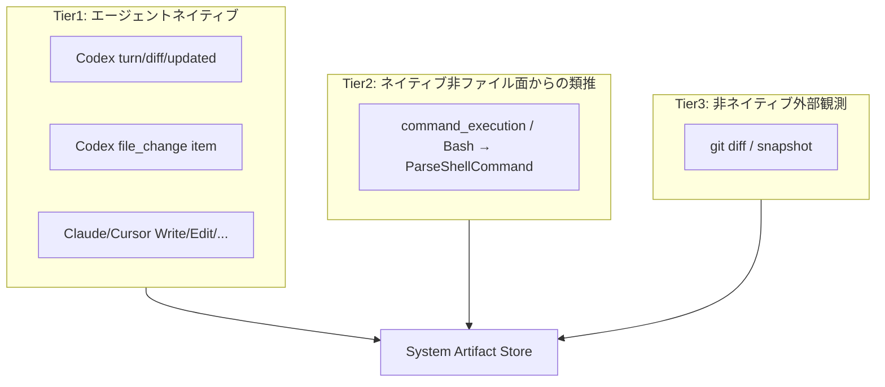

# 000: Tier 再定義と Codex `turn/diff` の Tier1 採用

## 背景 (Background)

### なぜ必要か

System Artifact の収集を「エージェントがネイティブに提供する変更情報」と「推定・外部補完」で明確に分けたい。現状の Tier ラベルは実装手段（構造化ツール／シェルパース／git）に寄っており、**Coding Agent が公式に出すファイル変更面**と、**類推・外部観測**の境界が利用者・実装者に伝わりにくい。

調査（ブランチ `fix-bug-file-changes`）で次が判明した。

1. Tern の Codex 統合は **`codex exec --json` のみ** である。
2. Codex がネイティブに提供するファイル変更面は少なくとも次の 2 系統ある。
   - **exec JSONL の `item.completed` / `file_change`**（path + kind）。Tern はこれを既にパースし、`structured_tool`（現行 Tier1）として記録する。
   - **App Server の `turn/diff/updated`**（ターン集約 unified diff）。`fileChange` item 後に最新の集約 diff スナップショットを通知する。**Tern は未使用**（リポジトリ内に `app-server` / `turn/diff` 参照なし）。
3. 実 E2E ではモデルがシェルでファイルを書くことがあり、その場合 **`file_change` も `turn/diff` も出ず**、現行では Tier2（`command_execution` のシェル解析）に落ちる。成功時の artifact の `tool_name` が `command_execution` だったのはこのためである。
4. 省略時は `workdir_reconcile`（現行 Tier3）が OFF のため、Tier1/2 で拾えない変更は補完されない。
5. SSE 経路では TaskLog（→ Analyzer）が side-effect pump 依存で、完了直後の `Unregister` と競合しうる（フレークの一因）。

「`turn/diff` はもう使っている」という想定は誤りで、**まだ配線されていない**。本仕様で Tier の定義を正し、Codex の Tier1 に `turn/diff` を正式採用する。

### 現行 Tier（実装ラベル）との関係

| 現行アルゴリズム ID | 現行の呼び方 | 本仕様での位置づけ |
| :--- | :--- | :--- |
| `structured_tool` | Tier1 | **Tier1 の一部**（Claude/Cursor の Write/Edit、Codex exec の `file_change`）。Codex については **不十分** — `turn/diff` が欠落 |
| `shell_parser` | Tier2 | **Tier2**（ネイティブ・シェル系イベントからの類推）として維持 |
| `workdir_reconcile` | Tier3 | **Tier3**（エージェント非ネイティブの外部観測）として維持 |

### 本仕様で決めること

1. Tier1 / Tier2 / Tier3 の **意味定義**（エージェントネイティブ／類推／外部補完）。
2. Codex の Tier1 に **`turn/diff/updated` を必須ソースとして採用**すること。
3. 既存 `file_change_collectors` API との **互換方針**（キー名・既定値）。
4. App Server 導入に伴う **Codex 実行経路の方針**（現行 `exec` との関係）。
5. 非 LLM で回帰できる **検証・テスト** の最低ライン。

### スコープ外

- unified diff / パッチ本文の **永続化必須化**（まずは path + operation の System Artifact。diff 本文の保存は任意要件）。
- User Artifact API の変更。
- Claude Code / Cursor を App Server 相当へ移行すること（各エージェントの Tier1 は各ネイティブ面のまま）。
- Codex Cloud / `codex apply <TASK_ID>` 専用フロー。
- Tier3 の structured output 補助の新規実装。

---

## 要件 (Requirements)

### 必須要件 (Must)

#### R1: Tier の意味定義を固定する

ドキュメント・API 説明・実装コメントで、次の定義を正とする。

| Tier | 定義 | 典型例 |
| :--- | :--- | :--- |
| **Tier1** | Coding Agent が **ネイティブでサポートするファイル変更面**から検知する | Codex: `turn/diff/updated` および（互換）`file_change` item。Claude/Cursor: `Write` / `Edit` / `StrReplace` 等 |
| **Tier2** | 同じくエージェントがネイティブに出すが、**ファイル変更専用面ではない**イベントから **類推・補間**する | `command_execution` / `Bash` 等のコマンド文字列解析 |
| **Tier3** | エージェント非ネイティブの手段で **外部観測・補完**する | `git diff` / workDir snapshot（`workdir_reconcile`） |

制約（明記すること）:

- Tier1 は「エージェントが公式にファイル変更として報告した内容」に限る。シェルで書いただけの変更は Tier1 に入らない（Codex の `turn/diff` も FileChange item 起因の集約であり、シェル単独変更は対象外、という公式挙動を前提にする）。
- Tier2 は推定であり、未対応コマンドパターンでは欠ける。
- Tier3 はセッション外変更や `.gitignore` 盲点を含みうる。

#### R2: Codex の Tier1 に `turn/diff` を採用する

- Codex セッションにおいて、App Server が通知する **`turn/diff/updated`**（または同等のターン集約 diff 通知）を **Tier1 ソースとして消費**し、変更 path + operation を System Artifact に記録すること。
- 記録時の `tool_name` は安定した識別子とすること（推奨: `turn_diff`。実装計画で固定）。
- unified diff 文字列から path / 操作種別（add/update/delete）を抽出できること。抽出不能な断片はスキップし、ログに残す（サイレント全捨て禁止）。
- 同一ターン・同一 path で `file_change` item 由来イベントと重複する場合は **key 単位で重複排除**し、Tier1 同士では先勝ちまたは `turn_diff` 優先のいずれかを実装計画で一つに固定する（どちらでもよいがテストで固定）。

#### R3: 既存 `file_change`（exec）は Tier1 として維持する

- `codex exec --json` 経路が残る間、既存の `file_change` → Analyzer（`structured_tool`）経路は **壊さない**。
- `turn/diff` 導入後も、`file_change` 単体で届くケース（または移行過渡期）で System Artifact が空にならないこと。

#### R4: Claude / Cursor の Tier1 は現行の構造化ファイルツールのまま

- Claude Code: `Write` / `Edit` / `MultiEdit` / `NotebookEdit` 等。
- Cursor 相当: `Write` / `StrReplace` / `Delete` 等。
- これらは引き続き Tier1（`structured_tool` / 下記 R6 のエージェントネイティブ収集）として ON/OFF 可能であること。

#### R5: Tier2 / Tier3 の役割は維持する

- Tier2: `shell_parser`（`command_execution` / `Bash` 等）による類推。
- Tier3: `workdir_reconcile`（git / snapshot）。省略時既定は **OFF**（現行 `000-File-Change-Collector-Algorithms` と同じ）。

#### R6: `file_change_collectors` との互換

公開 JSON キーは現行を維持することを Must とする（破壊的リネーム禁止）。

| キー | 新定義での意味 |
| :--- | :--- |
| `structured_tool` | **Tier1 全体**（エージェントネイティブのファイル変更面）。Codex では `turn/diff` +（互換）`file_change`、他エージェントでは Write/Edit 等 |
| `shell_parser` | Tier2 |
| `workdir_reconcile` | Tier3 |

- `structured_tool: false` のとき、Codex の `turn/diff` 由来イベントも **記録しない**。
- 既定値: `structured_tool=true`, `shell_parser=true`, `workdir_reconcile=false`（変更なし）。
- README / Reference Manual の Tier 説明文を本仕様の定義に更新する。

#### R7: Codex 実行経路で `turn/diff` を実際に受け取れること

- 現状の `codex exec --json` だけでは `turn/diff/updated` は得られない。**App Server（または公式に同等の diff 通知を出す経路）を Tern の Codex 統合に組み込む**こと。
- 具体方式（exec 併用のハイブリッド / App Server への全面移行）は実現方針に従い、実装計画で一つに固定する。
- 方式選定の受け入れ条件: 通常の「ファイルを作成・編集する」ターンのあと、**LLM なしのフィクスチャまたは fake App Server** で `turn/diff` → System Artifact を検証できること。

#### R8: Tier1 イベントが List に届くことの信頼性

- SSE 完了直後に `SystemArtifacts.List` しても、当該ターンの Tier1 イベントが欠落しないこと（side-effect pump と `Unregister` の競合を解消、または List 前にフラッシュを保証）。
- 非 LLM 統合テストで再現・回帰すること。

#### R9: テスト

- Codex `turn/diff` → Tier1 記録を **実 LLM なし**で検証するテストを追加すること。
- Tier 定義・コレクタ OFF 時に `turn_diff` が書かれないこと。
- 既存の `file_change` / `shell_parser` / `workdir_reconcile` の単体・統合が退行しないこと。

### 任意要件 (Optional)

#### O1: diff 本文の永続化

- System Artifact に unified diff 本文または要約を保存する（ストレージ増加・秘匿性のトレードオフあり）。

#### O2: App Server の `fileChange.changes[].diff` を直接消費

- `turn/diff` に加え、item 単位の diff も Tier1 ソースとする。

#### O3: `tool_name` をコレクタ ID と併記するメタデータ

- List API やログで `collector=structured_tool` と `source=turn_diff|file_change` を区別しやすくする。

---

## 実現方針 (Implementation Approach)

### 1. Tier モデル（概念）



### 2. Codex と `turn/diff` の取り込み

**現状**: `CodexAdapter` → `codex exec --json` → JSONL（`file_change` / `command_execution` 等）。

**目標**: Tier1 として `turn/diff/updated` を受ける。

推奨方針（実装計画で詳細化・選定）:

| 案 | 概要 | 長所 | 短所 |
| :--- | :--- | :--- | :--- |
| **A. App Server へ Codex セッションを移行** | 対話・ツールを JSON-RPC App Server に寄せ、`turn/diff/updated` を購読 | 公式の diff 面をそのまま使える | 既存 exec 経路の置換コスト大 |
| **B. ハイブリッド** | 当面 exec で実行し、並行または後段で App Server / 同等通知から diff だけ取る | 段階移行しやすい | 二重プロセス・整合の複雑さ |
| **C. exec のまま代替ソースのみ強化** | `turn/diff` を使わず `file_change` + Tier2/3 | 変更小 | **本仕様 R2 を満たさない**（不採用） |

**本仕様では案 C は不可。** A または B を実装計画で一つに決める。調査時点の理解では `turn/diff/updated` は App Server 通知であり、exec JSONL スキーマ（`exec_events.rs`）には含まれない。

### 3. Analyzer / コレクタ配線

- `structured_tool == true` のとき:
  - 既存: mapped tools + `file_change`
  - 新規: `turn_diff`（パース結果を `SystemArtifactEvent` 化）
- `structured_tool == false` なら上記すべてスキップ。
- `shell_parser` / `workdir_reconcile` は現行どおり。

### 4. 重複排除

優先度（提案・実装計画で確定）:

1. Tier1 `turn_diff`
2. Tier1 `file_change` / Write/Edit
3. Tier2 shell
4. Tier3 reconcile

同一 session + key では高優先のみ残す、または既存 reconcile のマージ規則に合わせる。

### 5. 信頼性（SSE）

- SSE の TaskLog 追記を、クライアント配送と同一の同期パスにする、または `finishActiveExecution` 前に pump をドレイン／フラッシュする。
- JSON 経路は既に同期 `Add` のため、主に SSE E2E を対象とする。

### 6. ドキュメント

- `docs/ReferenceManual-WebAPIs.md` および README の `file_change_collectors` 説明を、本仕様の Tier 定義と「Codex Tier1 = turn/diff（+ file_change）」に更新。
- 「exec だけ見ると file_change はあるが turn/diff は App Server 側」という混同を避ける注記を入れる。

### 7. 既存仕様との関係

- `feat-updated-files-detection` の `000-File-Change-Collector-Algorithms.md`（コレクタ ON/OFF・既定）は **維持**し、本仕様は **Tier 意味の再定義 + Codex Tier1 の turn/diff 採用**で上書き・拡張する。
- Issue #28 系の `file_change` Primary 方針は、Codex については **`turn/diff` を Primary、`file_change` を互換 Tier1** に更新する。

---

## 検証シナリオ (Verification Scenarios)

### S1: Codex `turn/diff` → Tier1（非 LLM）

1. Fake / フィクスチャで `turn/diff/updated`（または正規化済み内部イベント）を注入する。
2. `structured_tool` 既定 ON のセッションで Analyzer / Store まで流す。
3. `SystemArtifacts.List` に対象 path が載り、`tool_name` が `turn_diff`（固定した識別子）である。

### S2: `structured_tool: false` で turn/diff も記録されない

1. コレクタで `structured_tool: false`。
2. 同一の `turn/diff` を注入しても当該セッションの新規 System Artifact が増えない。

### S3: `file_change` 互換（退行なし）

1. 既存どおり `file_change` item.completed を注入。
2. Tier1 として記録される（`tool_name=file_change`）。

### S4: シェルのみ → Tier2（turn/diff 無し）

1. `command_execution` で `echo x > hello.txt` 相当のみ（`turn/diff` / `file_change` なし）。
2. `shell_parser: true` なら `command_execution` 由来で記録。
3. `shell_parser: false` かつ `workdir_reconcile: false` なら記録されない。

### S5: SSE 完了直後 List で Tier1 が欠落しない

1. 実 `agentservice.New`（Analyzer 配線あり）で SSE メッセージ経路を使い、ターン末に Tier1 イベントを含むストリームを流す。
2. `[DONE]` 直後に List しても対象 key が存在する（フレークしないこと）。

### S6: Claude/Cursor Tier1 退行なし

1. 既存 Analyzer の Write/Edit 単体が PASS のまま。

---

## テスト項目 (Testing)

手動確認のみは禁止。

### 単体・パッケージ

| ID | 内容 | 目安 |
| :--- | :--- | :--- |
| U1 | `turn/diff`（または正規化イベント）→ path/operation 抽出 | `codingagent/codex` または analyzer |
| U2 | `structured_tool` OFF で turn_diff 非記録 | analyzer |
| U3 | file_change と turn_diff の重複排除 | analyzer |
| U4 | Tier 定義コメント / コレクタ解決の退行なし | codingagent / agentservice |
| U5 | SSE フラッシュまたは同期 Add の単体 | agentservice |

```bash
./scripts/process/build.sh
go test ./shared/libs/go/codingagent/codex/ ./shared/libs/go/artifact/analyzer/ ./shared/libs/go/agentservice/ -count=1
```

### 統合（非 LLM）

| ID | 内容 | カテゴリ |
| :--- | :--- | :--- |
| I1 | Fake turn/diff → `agentservice.New` + ArtifactStore → List で `turn_diff` | `common` |
| I2 | SSE 完了直後 List で Tier1 欠落なし | `common` |
| I3 | collectors 既定 / structured_tool OFF | `common` |
| I4 | 既存 `TestFileChangeCollectors_*` / reconcile 系の退行なし | `common` |

```bash
./scripts/process/integration_test.sh --specify 'TestTurnDiff|TestFileChangeCollector|TestReconcile|TestSystemArtifact'
```

（実装後のテスト名に合わせて `--specify` を調整すること。）

### LLM E2E（補助・フレーク許容）

| ID | 内容 | カテゴリ |
| :--- | :--- | :--- |
| L1 | Codex 実ファイル作成後、可能なら `tool_name` が Tier1（`turn_diff` または `file_change`）であること。シェルのみの場合は Tier2 を許容するが、ログに理由を残す | `llm` |

```bash
./scripts/process/integration_test.sh --specify 'TestCodexE2E_SystemArtifact'
```

---

## 受け入れの目安

- [ ] ドキュメント上の Tier1/2/3 が本仕様の定義に更新されている
- [ ] Codex で `turn/diff`（または正規化イベント）が Tier1 として System Artifact に載る（非 LLM テスト PASS）
- [ ] `structured_tool: false` で turn_diff も止まる
- [ ] 既存 `file_change` / Claude Write 経路が退行していない
- [ ] SSE 直後 List の欠落が非 LLM テストで再現しない
- [ ] `file_change_collectors` の公開キー名・既定値が維持されている

---

## 参考

- Codex App Server: `turn/diff/updated`（ターン集約 unified diff）
- Codex exec JSONL: `item.completed` + `file_change`（path/kind のみ。`turn/diff` は含まない）
- 既存: [file://prompts/phases/001-phase02/branches/feat-updated-files-detection/ideas/000-File-Change-Collector-Algorithms.md](file://prompts/phases/001-phase02/branches/feat-updated-files-detection/ideas/000-File-Change-Collector-Algorithms.md)
- 既存: [file://prompts/phases/000-foundation/branches/bugfix-#28/ideas/000-Codex-SystemArtifact-Tracking.md](file://prompts/phases/000-foundation/branches/bugfix-#28/ideas/000-Codex-SystemArtifact-Tracking.md)
