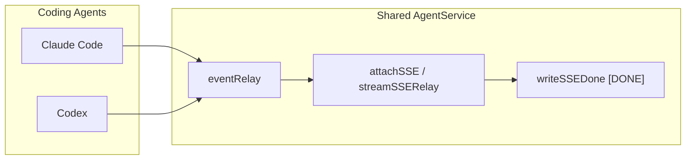

# 001: 共通 SSE 終端の安定化と Codex / Claude Code E2E 透過性

## 背景 (Background)

### なぜ必要か

ブランチ `fix-bug-file-changes` で Anthropic 既定モデルを利用可能な ID（`claude-sonnet-4-6`）へ更新したあと、認証エラーは解消した。しかし Claude Code 向けライブ E2E の一部がなお失敗する。

| テスト | 結果 | 観察 |
| :--- | :--- | :--- |
| `TestE2E_SessionContinuation` | PASS | テキストのみ。`[DONE]` 到達 |
| `TestE2E_CodingAgentStreaming` | FAIL | CLI は `result/success` かつ `exit_code=0` なのに SSE が `[DONE]` 前でハング（keepalive のみ） |
| `TestE2E_CodingAgentDefaultModel` | FAIL | ストリームは完了するが、成果物が Windows `workDir` ではなく `/tmp/...` 系パスに書かれる |
| `TestE2E_ClaudeCode_TernctlRealCommand` | FAIL | 部分出力のあと `ternctl` が exit 1（ストリーム未完了と整合） |

調査（`/investigate`）とレビューポイントでの Codex 影響評価より:

1. **`[DONE]` 未達**は AgentService 共通経路（`eventRelay` + `attachSSE` / `streamSSERelay`）の終端待ちに起因しうる。Claude / Codex の両方が同じ経路を使う。
2. **パス不一致**は主に Claude Code（モデルが Unix 風 `file_path` を生成）の Windows 問題。Codex 側は既に `MSYS_NO_PATHCONV` と `SHELL=cmd.exe` 等で `/tmp` 系を抑止している。
3. 本ブランチの目的（ファイル変更検出・Tier 再定義）とは直交するが、**同じライブ E2E 基盤を両エージェントがクリアできなければ**、以降の回帰判断ができない。

### 受け入れの原則（ユーザー決定）

> Codex / Claude Code は**共通のテストをクリア**できる必要がある。その意味での**透過性**が保てれば、テストクリア＝実装妥当とみなしてよい。

したがって本仕様の成功条件は「Claude だけ通す特例」ではなく、**共有契約（SSE 終端・セッション完了・同一プロンプト系統の成果物検証）を両エージェントが満たすこと**である。

### 関連仕様

- `file://prompts/phases/001-phase02/branches/fix-bug-file-changes/ideas/000-Tier-Redefinition-And-Codex-Turn-Diff.md` — Codex `turn/diff`・Tier 再定義。
- `file://prompts/phases/001-phase02/branches/fix-bug-file-changes/ideas/002-Claude-Code-Tier1-File-Change-Parity.md` — Claude Code 側の Tier1 / ターン集約相当（本仕様のスコープ外だった Analyzer 面）。

### スコープ外

- Tier / Analyzer / Claude ターン集約の追加実装（→ **002**。Codex `turn/diff` 本体は **000**）。
- Anthropic upstream のモデルカタログ変更そのもの（既定モデル ID 更新は前提作業として扱う）。
- Cursor エージェント固有の追加 E2E。
- 共有層での「あらゆる Unix パスを Windows に書き換える」汎用マジック（Codex 成果物キーを壊すリスク）。

---

## 要件 (Requirements)

### 必須要件 (Must)

#### M1. 共有 SSE 終端の信頼性

- エージェント（Claude Code / Codex）がターンを正常終了し、プロセス／イベントソースが閉じたあと、AgentService は**有限時間内に**クライアントへ `data: [DONE]` を送ること。
- `EventResult`（または同等の成功終端）観測後に、ソース閉鎖を待ち続けてハングしないこと。断続的な lost-wakeup があっても終端できること。
- 本修正は **AgentService 共通経路**に入れ、エージェント種別で分岐しないこと（透過性）。

#### M2. 共通 E2E 契約（透過性）

次の契約を **Claude Code と Codex の両方**が満たすこと（既存テストの同型、または明示的に共通化したヘルパ／テーブル駆動）。

| 契約 | 内容 |
| :--- | :--- |
| C-Stream | ファイル作成プロンプトで SSE に `[DONE]` が届く |
| C-Artifact | 指定 `workDir` 上に期待ファイルが存在する（エージェント申告パスと実ディスクのずれをテストが吸収する場合は、**両エージェント同じ吸収ルール**） |
| C-Status | セッション最終 status が `completed`（エラー終端でない） |
| C-Ternctl | （該当バイナリがある環境で）`ternctl run --agent <name>` が非ゼロ終了にならない、または共通の成功判定を満たす |

「Claude だけ Skip / 緩いアサーション」は、透過性を壊すため**禁止**（環境欠如による Skip は両エージェント対称に限る）。

#### M3. Codex 非回帰

- 既存の Codex ライブ E2E（例: `TestCodexE2E_*` のファイル作成・`[DONE]`・成果物）を壊さないこと。
- Codex が既に持つ Windows パス対策（`BuildEnv` 内の `MSYS_NO_PATHCONV` / `cmd.exe` 強制など）を、共有層の安易な上書きで無効化しないこと。

#### M4. Claude パス問題の扱い

- Windows 上で Claude が `/tmp/...` や `/hello.txt` に書く問題は、次のいずれか（または併用）で **C-Artifact を両エージェント同基準で**満たすこと。
  - **A**: `claudecode` アダプタ限定の環境／起動引数／cwd 正規化（Codex の `BuildEnv` に触れない）。
  - **B**: テスト側でプロンプトに絶対 `workDir` を明示し、かつ tool_result / `ToolInput` の実パスを両エージェント共通ヘルパで検証する。
- **禁止**: AgentService 共有層でパス文字列をエージェント横断リライトする Magical path rewrite（Codex artifact key との不整合リスク）。

#### M5. 単体で再現できる終端回帰

- LLM なしで、`eventRelay` / `attachSSE` の「ソース閉鎖後に必ず購読が終わる」ことを単体テストで固定すること。
- 可能なら「`EventResult` 後に sourceDone 通知が落ちる」競合を回帰ケースに含める。

#### M6. 既定モデル ID のドキュメント同期（旧 O2・実施対象）

- `tests/testdata/model_profiles.yaml` / `settings/demo` / `settings/example` / README の Claude 既定を、アカウントで利用可能な ID（例: `claude-sonnet-4-6`）に揃える。
- 本項目はレビュー時点でワーキングツリー反映済み。実装計画・コミット範囲に含める。

#### M7. `EventResult` 後の SSE 停滞診断ログ（旧 O3・実施対象）

- SSE が `EventResult` 後 N 秒（既定 5s）以内に閉じない場合、一度だけ WARN する。
- ログフィールド: `session_id` / `source_done` / `events_sent` / `stall_after`（シークレットを出さない）。
- 終端バグ修正前でも観測可能にし、修正後の回帰検知にも使う。

#### M8. `EventResult` 後の短時間 drain（旧 O1・採用）

- `EventResult` 観測後、既定 **2 秒**（テストでは短縮可）は relay から後続イベントを掃き出す。
- 掃き出し窓が尽きたら、上流 channel が未閉鎖でも SSE を終端し `[DONE]` へ進む（ハング保険）。
- 窓内に届いた後続イベントは欠落させないこと（Codex / Claude 共通経路）。
- drain は relay lost-wakeup 根本修正の**代替ではなく併用**する保険である。

### 任意要件 (Optional)

（現時点で追加の任意要件なし。旧 O1 は M8 へ昇格済み。）

### 非要件 (Out of Scope)

- Analyzer / Tier コレクタの正誤そのもの。
- Anthropic アカウントに存在しないモデル ID を強制し続けること。
- GUI / Playwright カテゴリの変更。

---

## 実現方針 (Implementation Approach)

### 設計原則



- **終端ロジックは共有**、**パス／CLI 環境はアダプタ局所**。
- 透過性の判定は「同じ契約のテストを両方 PASS」であり、実装の見た目の対称性より**契約の対称性**を優先する。

### 方針 1（必須）: `eventRelay` 終端の堅牢化

現状 `notify` は buffer 1 かつ送信失敗を `default` で捨てるため、`sourceDone=true` と購読側の `<-notify` の間で lost-wakeup しうる。

推奨:

- `sourceDone` 確定時に購読が必ず起き上がる仕組みへ変更する（例: `sync.Cond`、`close(doneCh)` の一度きりクローズ、または done 専用シグナルと event 通知の分離）。
- 公開 API を増やさず、`exec_registry.go` 内に閉じる。
- Claude / Codex 双方の StartProcess が channel を閉じる既存契約はそのまま利用する。

### 方針 2: `EventResult` 後の短時間 drain（M8・採用済み）

`attachSSE` は `EventResult` 後に `postResultDrainTimeout`（既定 2s）だけ購読を続け、後続イベントを SSE に出す。窓が尽きたら上流未閉鎖でも `attachSSE` を返し、呼び出し側が `[DONE]` する。

- ハング保険（ソース閉鎖待ちの無限待機を避ける）
- 欠落抑制（即閉じより安全）
- Codex / Claude 共通（エージェント分岐なし）

方針 1（relay 堅牢化）はなお本線として実装計画に残す。drain は併用。

### 方針 3: Claude パスはアダプタまたは共通テスト契約で解決

| 選択肢 | Codex 影響 | 採用判断 |
| :--- | :--- | :--- |
| claudecode `BuildEnv` / 起動オプションのみ | なし | **第一候補** |
| テスト共通ヘルパ + 絶対パス明示プロンプト | なし（両エージェント同ヘルパ） | **併用可** |
| AgentService 共有パスリライト | 高い | **不採用** |

### 方針 4: テストの透過性

- 既存の Claude / Codex ファイル作成 E2E を、可能な範囲で**同一アサーションヘルパ**（`[DONE]`、workDir 上のファイル、status）に寄せる。
- エージェント差分がどうしても必要な場合は、ヘルパ引数（agent name）で明示し、Skip 条件は環境対称（例: バイナリ未インストール）に限る。

### リスクと緩和

| リスク | 緩和 |
| :--- | :--- |
| 方針 2（M8 drain）で Codex の後続イベント欠落 | 既定 2s の掃き出し窓。即閉じはしない。単体で trailing イベントを検証済み |
| Claude パス修正が効かない（モデルが絶対に `/tmp` を選ぶ） | 共通ヘルパで tool_result 実パスを検証しつつ、workDir への作成をプロンプトで強制。それでも不可ならアダプタ側 cwd/sandbox 設定を再調査（共有リライトはしない） |
| ライブ E2E フレーク | 単体で終端競合を固定し、ライブは `--specify` で両エージェント対を再実行 |

---

## 検証シナリオ (Verification Scenarios)

### VS-1: 共有終端（単体・非 LLM）

1. `eventRelay` に複数イベントを流し、最後に source を閉じる。
2. 購読側が全イベント受信後に channel が閉じることを確認する。
3. 「全イベント処理直後・`sourceDone` 直前」の競合をゴルーチンで繰り返し、ハングしないことを確認する。

### VS-2: Claude Code ファイル作成 E2E

1. vault に有効な Anthropic キー、`claude` CLI あり。
2. `TestE2E_CodingAgentStreaming` / `TestE2E_CodingAgentDefaultModel` を実行。
3. `[DONE]` 到達、および `workDir`（または共通ヘルパが認める実パス）に期待ファイルがあること。

### VS-3: Codex ファイル作成 E2E（非回帰）

1. vault に有効な OpenAI キー、`codex` CLI あり。
2. 既存 Codex ファイル作成 E2E（例: `TestCodexE2E` 系の hello.txt / DONE）を実行。
3. Claude と同型の契約（DONE・ファイル・completed）を満たすこと。

### VS-4: ternctl 対称（可能な環境）

1. `TestE2E_ClaudeCode_TernctlRealCommand` および Codex 側の同等 ternctl E2E（存在すれば）を実行。
2. ストリーム完了後に非ゼロ終了しないこと。

### VS-5: 透過性チェックリスト（人手）

実装完了時、次を両方 YES にする。

- [ ] 共有 SSE 終端の単体テストが追加／更新されている
- [ ] Claude ファイル作成 E2E が PASS
- [ ] Codex ファイル作成 E2E が PASS
- [ ] Claude だけに甘い Skip / 緩いアサーションを増やしていない
- [ ] 共有パスリライトを入れていない
- [x] M6: 既定 Claude モデル ID を利用可能 ID に同期（testdata / demo / example / README）
- [x] M7: `EventResult` 後 SSE 停滞の WARN ログ（先行実装済み。終端修正と合わせて回帰確認）
- [x] M8: `EventResult` 後短時間 drain（先行実装済み。relay 堅牢化と併用）

---

## テスト項目 (Testing)

手動確認のみの完了 Cond は禁止。少なくとも次を実行する。

### 単体（ビルドパイプライン）

```bash
./scripts/process/build.sh
```

（Windows / 本環境の慣例に従う。Linux / Remote-SSH Linux の場合は `./scripts/process/build.sh --skip-etc`。）

終端修正に触れたパッケージを重点的に:

```bash
go test ./shared/libs/go/agentservice/ -count=1 -run 'Relay|SSE|attachSSE|EventResult|Drain'
```

### 統合（`--specify`）

本リポジトリの `scripts/process/integration_test.sh` は `--specify` のみサポート（`--categories` は未実装）。スキル記載のカテゴリ名は本リポジトリでは使わず、以下で代替する。

```bash
# 共有終端・AgentService 周辺（非 LLM を含むフィルタは実装計画で最終確定）
./scripts/process/integration_test.sh --specify 'TestSSE_|TestAgentService|TestRelay'

# Claude Code ライブ対
./scripts/process/integration_test.sh --specify 'TestE2E_CodingAgentStreaming$|TestE2E_CodingAgentDefaultModel$|TestE2E_SessionContinuation$|TestE2E_ClaudeCode_TernctlRealCommand$'

# Codex ライブ非回帰対
./scripts/process/integration_test.sh --specify 'TestCodexE2E_'
```

Windows では Git Bash から実行。Linux / Remote-SSH Linux では headless 前提で `xvfb-run -a` ラップ（プロジェクト共通指示に従う）。

### 合否

- 上記のうち、環境前提（CLI・vault）を満たすライブ対は **Claude と Codex の両方が PASS** すること。
- 前提欠如で Skip する場合は両エージェント対称。片方だけ「モデル事情で Skip」は不可（モデル ID は testdata で利用可能なものに揃える）。

---

## 成果物・作業メモ

| 項目 | 内容 |
| :--- | :--- |
| 想定変更箇所 | `shared/libs/go/agentservice/exec_registry.go`（relay）、必要なら `handler_retry.go`；`claudecode` の env；`tests/agentservice_e2e_test.go` / `tests/codex_e2e_test.go` の共通ヘルパ |
| 前提 | Anthropic 既定モデルを利用可能 ID へ更新済み（ワーキングツリーまたは先行コミット） |
| 次フェーズ | ユーザー承認後に `/create-implementation-plan` |

---

## 完了条件（仕様として）

1. 必須要件 M1–M5 が実装計画に分解可能な粒度で書かれている。
2. Codex 非回帰と透過性（共通テストクリア）が受け入れ原則として明示されている。
3. 検証シナリオと `integration_test.sh --specify` コマンドが具体的である。
