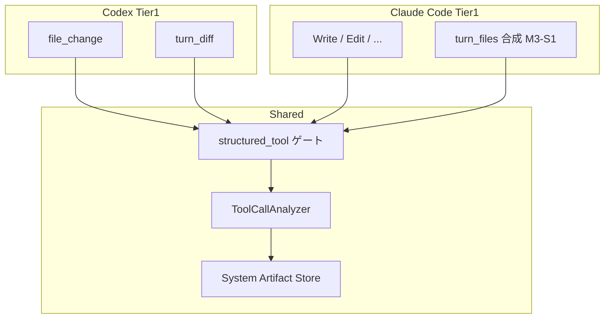

# 002: Claude Code Tier1 ファイル変更面の Codex 透過性

## 背景 (Background)

### なぜ必要か

001 のスコープ外に「Tier / Analyzer / `turn/diff` の追加実装（000 側）」と書いた。000 は **Codex の `turn/diff` 採用と Tier 再定義**が主眼であり、Claude Code については「Write/Edit 等の既存 Tier1 のまま」と明示している（000 R4）。

しかし利用者・検証の観点では次のギャップが残る。

| 観点 | Codex（000 の目標含む） | Claude Code（現状） |
| :--- | :--- | :--- |
| ネイティブ・ファイル変更 item | `file_change`（path + kind） | なし（ツール名が操作種別） |
| ターン集約 diff / パス一覧 | `turn/diff/updated` → `tool_name=turn_diff`（パーサ実装済・本番 fan-in は 000） | **同等のネイティブ面・パーサなし** |
| 個別ファイルツール | （Cursor 共有マッピングはあるが主経路ではない） | `Write` / `Edit` / `MultiEdit` / `NotebookEdit` → Analyzer Tier1 |
| シェル経由の作成 | Tier2（`command_execution`）または将来 `turn/diff` 対象外 | Tier2（`Bash`） |

つまり **「Codex で実現できている／しようとしているターン単位のネイティブ変更面」に相当するものが Claude Code 側に無い**。Analyzer 上は Write を Tier1 として扱えるが、

1. ライブではモデルが `Bash` に逃げる・パスが workDir 外になる・SSE/TaskLog 競合などで **List に載らない**ことがあり、
2. Codex の `turn_diff` のような **ターン集約の第一級イベント**が Claude 経路に存在しない。

001（SSE 終端・E2E 透過性）が通ったうえで、**成果物 List の透過性**（同じ「ファイルを作る」契約で両エージェントが Tier1 System Artifact を見せる）を Claude 側でも満たす必要がある。

### 関連仕様

| 仕様 | 関係 |
| :--- | :--- |
| `file://prompts/phases/001-phase02/branches/fix-bug-file-changes/ideas/000-Tier-Redefinition-And-Codex-Turn-Diff.md` | Codex `turn/diff`・Tier 定義の正。本仕様は **Claude 側の対称**を扱う（000 R4 を拡張） |
| `file://prompts/phases/001-phase02/branches/fix-bug-file-changes/ideas/001-Shared-SSE-Terminal-And-Agent-E2E-Parity.md` | SSE/`[DONE]`・共通 E2E。Tier1 が List に届く前提の実行基盤 |

### 本仕様で決めること

1. Claude Code の Tier1 を、Codex のネイティブ変更面と **結果として透過**にするための必須契約。
2. Claude に App Server `turn/diff` が無い前提での **ターン集約相当**の実現方針。
3. Analyzer / `structured_tool` との互換と、Codex 非回帰。
4. 非 LLM で固定できる検証と、両エージェント共通の List アサーション。

### スコープ外

- Codex App Server 本番 fan-in そのもの（000 のまま）。
- Claude Code を Codex App Server に載せる、または Anthropic に公式 `turn/diff` を要求すること。
- Tier2/Tier3 アルゴリズムの新規設計（既定 ON/OFF は 000 に従う）。
- User Artifact API の変更。
- 001 のパス問題の製品修正詳細（本仕様は **申告されたネイティブツール path が Artifact になること**を主眼。ディスク上の実ファイル位置は 001 の契約と併用）。

---

## 要件 (Requirements)

### 必須要件 (Must)

#### M1. 結果透過性（受け入れ原則）

次を **Claude Code と Codex の両方**で満たすこと（メカニズムの同一は不要、**List 上の契約**の同一が必要）。

| 契約 | 内容 |
| :--- | :--- |
| P-Native | ネイティブ・ファイル変更面（Codex: `file_change` / `turn_diff`、Claude: `Write` / `Edit` / …）で作成・更新した path が、ターン完了後 `SystemArtifacts.List` に現れる |
| P-Collector | 上記は `file_change_collectors.structured_tool == true` のときのみ。`false` なら両エージェントとも出ない |
| P-ToolName | List 上でソースを識別できる安定した `tool_name`（Claude 個別ツール名、および下記 M3 の集約名） |

「Claude だけ Artifact アサーションを Skip」は禁止（環境欠如 Skip は対称）。

#### M2. Claude 個別ツール Tier1 の信頼性

- 既存マッピングを維持・欠落なく Analyzer が記録すること: `Write`, `Edit`, `MultiEdit`, `NotebookEdit`（必要なら Claude 実ツール名の追加を実装計画で列挙）。
- `file_path` / `path` / `notebook_path` の取りこぼしを回帰テストで固定すること。
- SSE 経路でも TaskLog → Analyzer がターン完了前に完了すること（001 の同期 Add / drain と整合。本仕様では **Claude フィクスチャで List 欠落が再現しないこと**を受け入れ条件にする）。

#### M3. Claude ターン集約相当（Codex `turn_diff` の対称）

Claude Code CLI に公式の `turn/diff/updated` は無い。次のいずれかを実装し、**ターン単位で変更 path 一覧を Tier1 として List 可能**にすること。

| 案 | 概要 | 採用条件 |
| :--- | :--- | :--- |
| **S1. Tern 側合成** | 同一 `session_id` + `turn_id` の Claude Tier1 ツールイベントから path 集合を集約し、終端時に `tool_name` 安定 ID（推奨: `turn_files` または既存 `turn_diff` と区別した名前）の合成 StreamEvent / Artifact を 1 件（または path 毎）記録する | **既定の推奨案**。Claude 公式 API 不要 |
| **S2. CLI 将来面の消費** | Claude が将来出す集約通知があればパーサを追加し Tier1 に載せる | 公式面が確認できた場合のみ。S1 と併用可 |
| **S3. 何もしない** | 個別 Write のみ | **本仕様では不可**（Codex `turn_diff` との透過性が足りない） |

制約:

- 合成イベントも `structured_tool` ゲート下であること。
- Codex の `turn_diff` パーサ／キーと衝突しないこと（名前・優先度を実装計画で固定）。
- 同一 turn・同一 path で個別 Write と集約が二重になる場合は **key 単位で重複排除**（000 の先勝ち規則に合わせる）。

#### M4. Codex 非回帰

- 000 の `file_change` / `turn_diff` / Analyzer 経路を壊さないこと。
- Claude 向け合成・マッピング追加が Codex E2E・`tests/turn_diff_tier1_e2e_test.go` 相当を落とさないこと。

#### M5. 000 R4 の更新

- 000 で「Claude Tier1 は Write/Edit のまま」とした記述を、本仕様採用後は **「個別ツール + ターン集約相当（M3）」** と読み替える。必要なら 000 に相互リンク注記を 1 段落追加してよい（本仕様が正）。

#### M6. テスト

- **非 LLM**: Claude JSONL フィクスチャ（Write → result）を流し、List に Tier1 が出ること。ターン内複数 Write で集約（M3）が出ること。
- **`structured_tool: false`**: Claude 経路でも Artifact が増えないこと。
- **透過性**: Codex 用フィクスチャ（`file_change` または `turn_diff`）と Claude 用フィクスチャで、同じ「path が List に載る」アサーションヘルパを共有すること。
- 可能ならライブ: Claude が実際に Write したターンで List 非空（フレーク時はフィクスチャ必須＋ライブは best-effort と明記してよいが、Skip 条件は Codex と対称）。

### 任意要件 (Optional)

#### O1. diff 本文

- Claude の Edit 引数や tool_result からパッチ断片を Artifact メタに残す（秘匿・容量トレードオフあり）。

#### O2. Bash で書いた変更の Tier1 昇格はしない

- 000 と同じく、シェル単独変更は Tier2。本仕様で Tier1 に昇格しない（透過性は「ネイティブ面」に限定）。

#### O3. 診断

- Tier1 ツールを観測したのに List が空のとき、session/turn と `structured_tool` 状態を WARN（シークレットなし）。

### 非要件 (Out of Scope)

- Codex App Server 全面移行。
- Tier3 を Claude だけ既定 ON にする特例。
- GUI 専用フロー。

---

## 実現方針 (Implementation Approach)

### 概念



### S1 合成の置き場所（推奨）

1. **Analyzer 終端フック**: ターン完了（`EventResult` 相当の ingest / `reconcileSessionArtifacts` 前）に、当該 turn の Tier1 Claude ツールから path を集約して保存する。  
2. または **claudecode アダプタ**: result 前に合成 `EventToolUse` を channel へ注入する。

推奨は **1（共有 Analyzer / agentservice ingest）** — Codex の `turn_diff` も Analyzer で消費しているため、エージェント横断の List 契約を一箇所で揃えやすい。注入方式は「偽の Claude イベント」になりテストが分かりにくい。

`tool_name` 推奨: `turn_files`（`turn_diff` は Codex unified diff 専用のまま）。

### 重複排除

000 提案に合わせる:

1. Codex `turn_diff`
2. Codex `file_change` / Claude `turn_files` / Write/Edit
3. Tier2 shell
4. Tier3

同一 session + artifact key では高優先または先勝ちをテストで固定。

### 001 との依存

- List 欠落の実行基盤原因（SSE/TaskLog）は 001 で扱う。
- 本仕様のフィクスチャテストは 001 修正後の同期 Add 前提で書く。001 未完了でも Analyzer 単体注入テストは先行可能。

### リスク

| リスク | 緩和 |
| :--- | :--- |
| ライブ Claude が Write せず Bash のみ | P-Native はネイティブ面の契約。Bash のみは Tier2。プロンプトで Write を促す E2E は 001 と共有 |
| `turn_files` と Write の二重計上 | key 重複排除 + テスト |
| Codex の `turn_diff` と名前衝突 | `turn_files` に分離 |

---

## 検証シナリオ (Verification Scenarios)

### VS-1: Claude Write → List（非 LLM）

1. TaskLog / Analyzer に Claude 風 `tool_use` Write（`file_path=hello.txt`）を注入する。
2. `structured_tool=true` で List に `hello.txt` 相当が現れ、`tool_name=Write` であること。

### VS-2: ターン集約（非 LLM）

1. 同一 turn で Write×2（a.txt, b.txt）を注入し、ターン終端処理を走らせる。
2. List に個別および／または `turn_files` 集約で両 path が説明できること（実装が選んだ形をテストで固定）。

### VS-3: コレクタ OFF

1. `structured_tool=false` で VS-1 相当を実行し、新規 System Artifact が増えないこと。

### VS-4: Codex 対称

1. 既存 `turn_diff` / `file_change` フィクスチャ E2E が PASS のままであること。
2. 共通ヘルパで「期待 path が List に含まれる」を Claude / Codex 両フィクスチャに適用する。

### VS-5: 人手チェックリスト

- [ ] M3 の案（S1 推奨）が実装計画で一つに固定されている
- [ ] `tool_name`（`turn_files` 等）がドキュメントに追記されている
- [ ] 000 R4 への相互参照が更新されている
- [ ] Claude だけ甘い Skip が無い

---

## テスト項目 (Testing)

手動のみの完了 Cond は禁止。

```bash
./scripts/process/build.sh
```

（Linux / Remote-SSH Linux では `--skip-etc`。）

```bash
# Analyzer / Tier1 回帰
go test ./shared/libs/go/artifact/analyzer/ -count=1

# Claude / turn_diff 関連の統合（実装後にフィルタを計画で確定）
./scripts/process/integration_test.sh --specify 'TestTurnDiff|TestFileChangeCollector|TestClaude.*Artifact|TestE2E.*Artifact|TestAnalyzer'
```

ライブ対（001 透過性と併用）:

```bash
./scripts/process/integration_test.sh --specify 'TestCodexE2E_SystemArtifact|TestE2E_CodingAgent|TestE2E_Artifact'
```

（実際のテスト名は実装計画でリポジトリの既存名に合わせて確定する。）

### 合否

- VS-1〜VS-4 相当の自動テストが PASS。
- Codex 既存 Tier1 テストが非回帰。
- 受け入れ原則 M1（P-Native / P-Collector）を両エージェントのフィクスチャで満たす。

---

## 成果物・作業メモ

| 項目 | 内容 |
| :--- | :--- |
| 想定変更 | `artifact/analyzer`（集約）、必要なら `agentservice` ingest、docs（Reference Manual）、000 への相互リンク |
| 依存 | 001 の SSE/TaskLog 信頼性（ライブ List）。単体フィクスチャは先行可 |
| 次フェーズ | ユーザー承認後 `/create-implementation-plan`（000 / 001 / 002 の順序はレビューで調整可） |
