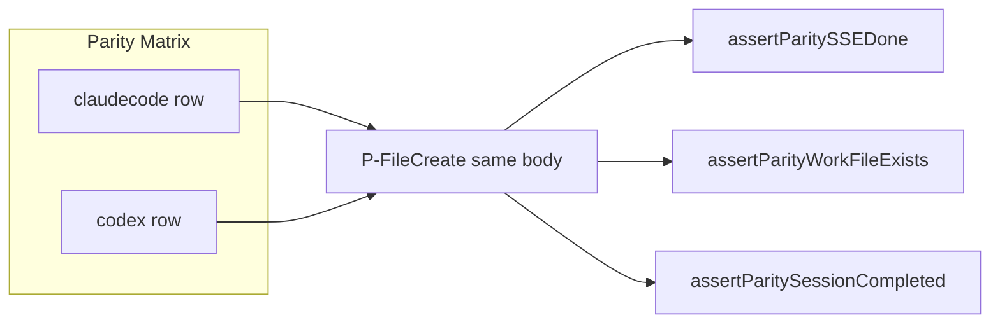

# 003: Coding Agent 差し替え透過 E2E マトリクス

## 背景 (Background)

### なぜ必要か

仕様 `001-Shared-SSE-Terminal-And-Agent-E2E-Parity` で共通契約ヘルパ（`fileCreatePrompt` / `assertParity*`）を導入し、Claude Code 向け・Codex 向けの**別テスト関数**へ配線した。これにより契約の文言は揃ったが、次の意味での透過性はまだ弱い。

> **Coding Agent 名（と必要な CLI / モデル）だけを差し替え、同一の E2E ケース本体を実行する**

現状は `TestE2E_CodingAgentStreaming`（Claude 固定）と `TestCodexE2E_FileCreation`（Codex 固定）が似たシナリオを別々に持っており、アサーション差分やプロンプト差分が再び入り込みやすい。ユーザー要求は「すげ替えて同じケースが通る」ことの**試験コードとしての固定**である。

### 現状のギャップ

| 観点 | 001 までの状態 | 本仕様で達成すること |
| :--- | :--- | :--- |
| 共通ヘルパ | あり | 維持・マトリクスから必須利用 |
| 同一ケース本体 | なし（エージェント別関数） | `for _, agent := range ...` または同等のテーブル駆動 |
| Claude だけ緩い Skip | 一部残存しうる | **禁止**（CLI 欠如など環境要因は両対称） |
| 非 LLM でハーネス透過 | なし | fake agent 名だけ差し替えのフィクスチャ行列を必須化 |

### 関連仕様

- `file://prompts/phases/001-phase02/branches/fix-bug-file-changes/ideas/001-Shared-SSE-Terminal-And-Agent-E2E-Parity.md` — 共通契約 C-Stream / C-Artifact / C-Status / C-Ternctl。
- `file://prompts/phases/001-phase02/branches/fix-bug-file-changes/ideas/002-Claude-Code-Tier1-File-Change-Parity.md` — Tier1 List 透過（本仕様のスコープ外。フィクスチャ側で Write→List の最小確認のみ可）。

### スコープ外

- 新しい AgentService 本番ロジックの追加（透過試験のハーネス整備が主目的）。
- Cursor エージェントのマトリクス追加。
- Codex `turn/diff` App Server 移行そのもの。
- 既存 `TestE2E_*` / `TestCodexE2E_*` の全廃（段階的にマトリクスへ寄せる。本仕様では**新規マトリクス必須**、既存の削除は任意）。

---

## 要件 (Requirements)

### 必須要件 (Must)

#### M1. エージェント差し替えテーブル駆動ライブ E2E

- `tests/` 配下に **1 つのテストエントリ（親テストまたは明示的なマトリクス関数群）** を置き、少なくとも次のエージェント行を持つこと。

| agent | CLI 前提 | 既定モデル（行ごと） |
| :--- | :--- | :--- |
| `claudecode` | `claude` on PATH | `claude-sonnet-4-6`（`e2eDefaultModel` と一致） |
| `codex` | `codex` on PATH | `gpt-4o`（既存 Codex ファイル作成 E2E と同等） |

- **ケース本体はエージェント非依存**であること。分岐してよいのは次のみ:
  - `CreateSession` の `agent` / `model` フィールド
  - CLI 欠如時の **対称 Skip**（その行だけ Skip。他行は実行）
  - ternctl の `--agent` 引数
- 禁止: Claude 行だけ `t.Skip` で成果物検証を避ける、Codex 行だけ `[DONE]` を要求しない、など契約の非対称。

#### M2. 共通契約ケース（ライブ）

マトリクスが少なくとも次の契約を、**各エージェント行で同じアサーション関数**により検証すること。

| ケース ID | 契約 | 検証内容 |
| :--- | :--- | :--- |
| P-FileCreate | C-Stream + C-Artifact + C-Status | `fileCreatePrompt` → SSE `[DONE]` → workDir 上ファイル → session `completed` |
| P-Ternctl | C-Ternctl | `ternctl run --agent <name>` が成功し、共通成功判定（Session created / Tool 痕跡 / completed\|active） |

- P-FileCreate のプロンプト・ファイル名・期待文字列は両行で同一（エージェント固有の文言を埋め込まない）。
- ヘルパは既存 `tests/e2e_agent_parity_helpers_test.go` を必須利用する（複製禁止）。

#### M3. 非 LLM フィクスチャ行列（ハーネス透過）

- LLM / 実 CLI に依存しないテストで、**fake CodingAgent の `Name()` だけ** `claudecode` / `codex` を差し替え、同一の注入イベント列（例: Write `hello.txt` + Result）に対し、同一の SystemArtifacts List アサーションが通ること。
- 目的: 「サーバ／解析パイプラインがエージェント名で分岐して壊れていない」ことをライブ無しで固定する。
- 既存 `turnDiffFakeAgent` / `AssertSystemArtifactPathsContain` を再利用してよい。

#### M4. 実行入口の明示

- 検証コマンドは `integration_test.sh --specify` でマトリクスを指名できること（例: `TestAgentParityMatrix`）。
- `build.sh` 成功後に実行すること。

#### M5. 001 / 002 との整合

- 001 の「Claude だけ緩いアサーション禁止」を本マトリクスで再確認する。
- 002 の Tier1 詳細は必須としないが、フィクスチャ行列で Write→List が両エージェント名で通ることは M3 でカバーする。

### 任意要件 (Optional)

#### O1. 既存個別 E2E のマトリクス委譲

- `TestE2E_CodingAgentStreaming` / `TestCodexE2E_FileCreation` を薄いラッパにしてマトリクス本体を呼ぶ（重複削減）。必須ではない。

#### O2. P-StatusOnly / セッション継続のマトリクス化

- Continuation 系を同じ差し替えテーブルに載せる。必須ではない。

---

## 実現方針 (Implementation Approach)

### 方針 1: 単一ファイルにマトリクスを集約

- 新規: `tests/agent_parity_matrix_e2e_test.go`
- 構造（概念）:

```go
type parityAgentRow struct {
    Agent   string // "claudecode" | "codex"
    Model   string
    CLIName string // LookPath 用 "claude" | "codex"
}

var parityAgents = []parityAgentRow{
    {Agent: "claudecode", Model: e2eDefaultModel, CLIName: "claude"},
    {Agent: "codex", Model: "gpt-4o", CLIName: "codex"},
}

func TestAgentParityMatrix_FileCreate(t *testing.T) {
    for _, row := range parityAgents {
        row := row
        t.Run(row.Agent, func(t *testing.T) {
            requireParityCLI(t, row.CLIName)
            runParityFileCreate(t, row)
        })
    }
}
```

### 方針 2: サーバ起動ヘルパ

- 両エージェントが `codingagent.CreateAll()` で登録される既存 `startE2EServer` / `startCodexE2EServer` を流用するか、**CLI 前提を行ごとに遅延チェックする**薄い `startParityMatrixServer` を追加する。
- `startE2EServer` は現状 `claude` 必須で Fatal するため、Codex 行だけ動かしたいときに不都合。マトリクス用は「要求 CLI がその行で無ければ Skip」とし、サーバは CreateAll 前提で起動する。

### 方針 3: Ternctl 行

- `bin/ternctl` 解決ロジックは既存 Claude/Codex Ternctl テストから共通化し、`--agent` のみ差し替える。

### 方針 4: フィクスチャ行列

- httptest + fake agent（`Name()` 差し替え）+ Write 注入 + List。エージェント名以外の差分を禁止。



---

## 検証シナリオ (Verification Scenarios)

### VS-1: ライブ FileCreate マトリクス

1. `TestAgentParityMatrix_FileCreate` を実行する。
2. `claudecode` サブテストと `codex` サブテストの両方が、同一プロンプトで `[DONE]`・ファイル存在・`completed` を満たす（CLI 欠如行のみ Skip）。

### VS-2: ライブ Ternctl マトリクス

1. `TestAgentParityMatrix_Ternctl` を実行する。
2. 各行で `--agent` のみ差し替え、共通成功判定を満たす。

### VS-3: フィクスチャ行列

1. `TestAgentParityMatrix_FixtureWriteList` を実行する（LLM 不要）。
2. agent 名 `claudecode` / `codex` の両方で `hello.txt` が List に現れる。

---

## テスト項目 (Testing)

手動確認のみは禁止。次を必須とする。

```bash
./scripts/process/build.sh && ./scripts/process/integration_test.sh --specify 'TestAgentParityMatrix'
```

補助（既存非回帰）:

```bash
./scripts/process/build.sh && ./scripts/process/integration_test.sh --specify 'TestE2E_CodingAgentStreaming$|TestCodexE2E_FileCreation$'
```

（Linux / Remote-SSH Linux: `build.sh --skip-etc`、統合は `xvfb-run -a` ラップ。）

### E2E コード化

| ファイル | 内容 |
| :--- | :--- |
| `tests/agent_parity_matrix_e2e_test.go` | M1–M3 のマトリクス本体（必須・新規） |
| `tests/e2e_agent_parity_helpers_test.go` | 既存ヘルパ利用（拡張可） |

---

## 受け入れ条件

1. Coding Agent 行を差し替えるだけで同一ケース本体が走るテストが `tests/` に存在する。
2. ライブ行列で C-Stream / C-Artifact / C-Status（および Ternctl）が両エージェント対称に検証される。
3. 非 LLM フィクスチャ行列がエージェント名差し替えのみで List を通す。
4. 上記 `integration_test.sh --specify 'TestAgentParityMatrix'` が PASS（環境欠如は対称 Skip のみ）。
