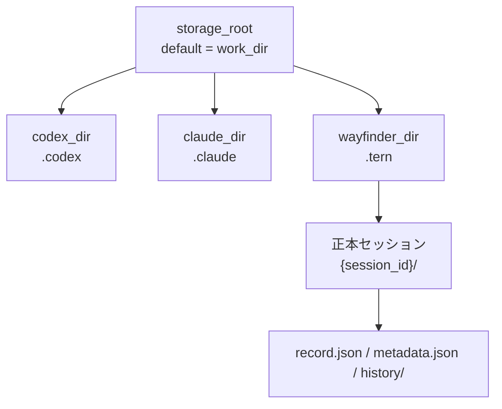
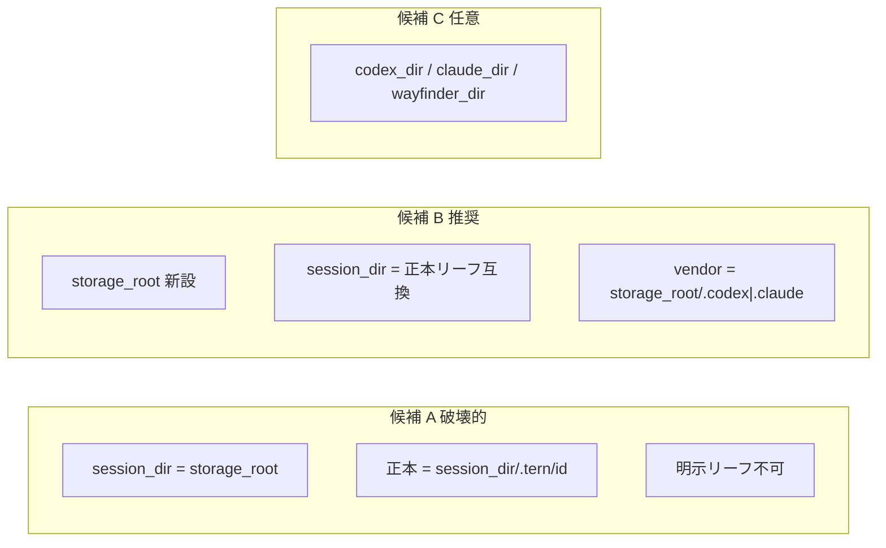

# 000: Storage Root と Agent Home の概念整理（session_dir 再定義）

## 背景 (Background)

### 発端となった誤解

当初の理解は次のとおりだったが、いずれも現行実装とは一致しない。

1. **`session_dir` を指定すると vendor home（`.codex` / `.claude`）も指定される**  
   → 現行では誤り。`session_dir` は Tern 正本（リーフ）用で、Codex/Claude の Home には使われない。
2. **`session_dir` の下に `.tern/` が付く**（`{session_dir}/.tern/{session_id}/`）  
   → 現行では誤り。省略時は `{work_dir}/.tern/{session_id}` が **そのまま** API 上の `session_dir` になる。
3. **明示 `session_dir` には `{session_id}` まで含めて指定する必要がある**  
   → 誤り。明示時は渡したパスが正本リーフそのもの。ID の自動付与は省略時のみ。

これらの誤解は、設計が途中で変わったことと、API フィールド名 `session_dir` の意味が曖昧なことに起因する。

### 歴史的な 3 段階

| 時代 | `session_dir` の意味 | Codex / Claude Home |
|---|---|---|
| **最古**（`.tern` 前） | 未指定時 `{work_dir}/.{agent}`。実質 vendor home 兼用 | `session_dir` そのもの（`CODEX_HOME` / `CLAUDE_CONFIG_DIR`） |
| **`.tern` + `native/`** | `{work_dir}/.tern/{session_id}`（Tern 正本） | `{session_dir}/native` |
| **現行**（Restore-Vendor-Homes） | `{work_dir}/.tern/{session_id}`（Tern 正本リーフ） | `{work_dir}/.codex` / `{work_dir}/.claude`（`session_dir` とは無関係） |

`native/` 時代はセッションごとに空の `CODEX_HOME` ができ、marketplace plugins がセッション数比例で肥大化した（Issue #48）。そのため vendor home を `.tern` 外のワークスペース直下へ戻した（`000-Restore-Vendor-Homes-Outside-Tern`）。

### 「戻す」議論で出た選択肢

| 案 | 内容 | 評価 |
|---|---|---|
| A | `session_dir` を再び vendor home に統合 | Tern 正本との二重役割が再発し後退しやすい |
| B | `{session_dir}/native` に戻す | 実装は容易だが Issue #48 再発 |
| C | `vendor_home_dir` 等を新設し役割分離を維持 | 要件には合うが、親ルートの統一感が弱い |
| D | **親ルートを 1 つまみにし、各 Agent Home はそこから導出** | **本仕様の方向** |

### 到達したメンタルモデル

- **`session_dir` の既定は `work_dir` であり、変更できるのは「親ルート」だけ**であるべき、という直感。
- したがって期待するレイアウトは:

```text
{session_dir}/          # 既定 = work_dir（ストレージ親）
  .tern/                # Wayfinder / Tern Home
  .codex/               # Codex Home
  .claude/              # Claude Home
```

- Tern Home（`.tern`）と vendor home（`.codex` / `.claude`）を「分けるか / 分けないか」は二択に見えるが、実際は粒度がある:
  - **同じリーフに混ぜる** → だめ（Issue #48・正本汚染）
  - **親は同じ、子ディレクトリは Agent ごと** → よい
- Wayfinder も Coding Agent の Home である。Codex/Claude の vendor home と同列の概念。
- 分けるなら Agent ごとに分ける。分けないなら全部同じ親。  
  → 既定は **親を共有し、子だけ Agent 別**。
- 内部では `wayfinder_dir` / `codex_dir` / `claude_dir` を識別し、既定は同じ親（`storage_root`）から導出する。

### Home と session_id の区別（重要）

誤った整理:

```text
wayfinder_dir = {parent}/.tern/{session_id}   # ← Home と 1 セッションを混同
```

正しい対比（Codex / Claude と同列）:

| Agent | Home（共有ルート） | Home 内の個別セッション |
|---|---|---|
| Codex | `{parent}/.codex/` | `sessions/...` 等 |
| Claude | `{parent}/.claude/` | `projects/<hash>/...` 等 |
| Wayfinder / Tern | `{parent}/.tern/` | `{session_id}/` |

したがって:

```text
wayfinder_dir = {parent}/.tern/     # Home のみ。session_id は含めない
個別セッション = {wayfinder_dir}/{session_id}/
```

`session_id` は API が別途発行・受け渡す識別子であり、Home 定義の一部ではない。

### 現行仕様の問題点

1. **API の `session_dir` が「正本リーフ」を指す**ため、直感的な「ストレージ親」と一致しない。
2. **vendor home の親が常に `work_dir` 固定**で、`session_dir` を変えても `.codex` / `.claude` は動かない。
3. **Wayfinder Home（`.tern`）と 1 セッションフォルダ（`.tern/{id}`）が、同じ `session_dir` 語彙に押し込まれている**。
4. 省略時のディスク配置は実は「親 = work_dir、子 = `.tern` / `.codex` / `.claude`」に近いのに、**API 命名がそれを説明できていない**。

### 議論サマリ

`session_dir` が vendor home や `.tern` の親を指すという直感は、歴史的経緯から自然だが現行 API とは一致しない。現行は正本リーフと `work_dir` 固定の vendor home に分かれており、省略時ディスク配置は直感に近いのに命名がずれている。望ましいモデルは、既定 `storage_root = work_dir` を親とし、`.tern` / `.codex` / `.claude` を同列の Agent Home としてそこから導出することである。Wayfinder Home は `{parent}/.tern/` であり `{session_id}` は Home 内のセッション識別に留める。リーフを混ぜるのではなく親を共有する、が Issue #48 以降の教訓と両立する方針である。

---

## 要件 (Requirements)

### 必須要件 (Must)

#### R1: 用語と概念モデルの固定

次の用語を仕様の正とする。

| 用語 | 意味 |
|---|---|
| **`work_dir`** | エージェントの作業 cwd（ファイル操作の基準）。必須。 |
| **`storage_root`**（仮称。現行 `session_dir` の再定義候補） | Coding Agent Home 群の親ディレクトリ。既定 = `work_dir`。 |
| **`codex_dir`** | Codex Home。既定 = `{storage_root}/.codex` |
| **`claude_dir`** | Claude Code Home。既定 = `{storage_root}/.claude` |
| **`wayfinder_dir`** | Wayfinder / Tern Home。既定 = `{storage_root}/.tern` |
| **`session_id`** | Tern が発行する HTTP セッション ID。API パス・一覧・正本サブフォルダ名に使う。 |
| **正本セッションフォルダ** | `{wayfinder_dir}/{session_id}/`（`record.json` / `metadata.json` / `history/`） |

> フィールド正式名（`storage_root` 新設か、`session_dir` の意味変更か）は本仕様の API 決定で確定する。概念名として当面 `storage_root` を使う。

#### R2: 目標レイアウト

```text
{storage_root}/                    # 既定 = work_dir
  .codex/                          # codex_dir（Home）
    sessions/ ...
    .tmp/plugins/ ...              # 共有キャッシュ（セッション数比例にしない）
  .claude/                         # claude_dir（Home）
    projects/ ...
  .tern/                           # wayfinder_dir（Home）
    {session_id}/                  # 1 Tern セッション
      record.json
      metadata.json
      history/
        0000001.json
        ...
```

#### R3: 既定値

| 内部識別子 | 既定値 |
|---|---|
| `storage_root` | `work_dir` |
| `codex_dir` | `{storage_root}/.codex` |
| `claude_dir` | `{storage_root}/.claude` |
| `wayfinder_dir` | `{storage_root}/.tern` |
| 正本パス | `{wayfinder_dir}/{session_id}` |

「同じ」とは **親（`storage_root`）が同じ** という意味であり、各 Home のリーフパスが同一であることではない。

#### R4: 分離と共有の方針

| 分離するもの | 理由 |
|---|---|
| Tern 正本 ↔ Codex/Claude CLI 状態 | Issue #48 再発防止、正本可搬性、overlay 安全性 |
| `.codex` ↔ `.claude` | 各 CLI の Home 規約が異なる。同居禁止 |
| `wayfinder_dir`（Home）↔ `{session_id}/`（1 セッション） | Home は共有ルート。セッションは Home 内の管理単位 |

| 共有してよいもの | 理由 |
|---|---|
| `storage_root`（親） | 1 つまみでワークスペース外ストレージへ寄せられる |
| 同一 `work_dir` / `storage_root` 上の複数 Tern セッションによる `.codex` / `.claude` 共有 | Issue #48 対策として意図的。同時実行の厳密隔離は別仕様 |

#### R5: 環境変数マッピング（Codex / Claude）

| Agent | 環境変数 | 値 |
|---|---|---|
| Codex | `CODEX_HOME` | `codex_dir`（既定 `{storage_root}/.codex`） |
| Claude Code | `CLAUDE_CONFIG_DIR` | `claude_dir`（既定 `{storage_root}/.claude`） |
| Wayfinder | （アダプタ SessionDir） | 実行時は正本パス `{wayfinder_dir}/{session_id}` を渡す想定（実装都合で要確認） |

> Wayfinder 起動時に渡すパスが「Home（`.tern`）」か「当該セッションフォルダ」かは実装都合で要確認。概念上の Home は `.tern` である。

#### R6: `config_dir` は現行維持

- skills / rules / settings のオーバーレイ元。
- 適用先は **当該 Agent の Home**（`codex_dir` / `claude_dir` / Wayfinder 時は正本または `wayfinder_dir`）。
- `storage_root` / Home の場所指定とは別概念。

#### R7: API 方針の推奨（候補 B + 内部識別）

本仕様の推奨は次のとおり。正式実装前に確定する。

| 候補 | 概要 | 本仕様での扱い |
|---|---|---|
| **A** | `session_dir` の意味を親（`storage_root`）に再定義（破壊的） | 不採用（明示リーフ指定が失われる） |
| **B** | `storage_root` を新設し、現行 `session_dir`（正本リーフ）を残す | **推奨** |
| **C** | Agent ごとの上書きフィールド（`codex_dir` 等） | 初期は必須としない。内部識別のみでも可 |

**候補 B の詳細**:

- `storage_root`（任意）: Home 群の親。既定 `work_dir`
- `session_dir`（任意）: 正本リーフ上書き（現行互換）。未指定時 `{storage_root}/.tern/{session_id}`
- vendor home は `{storage_root}/.codex` / `{storage_root}/.claude`

#### R8: 一覧 API の拡張方針

現行 `GET /api/v1/sessions?work_dir=` は `{work_dir}/.tern/*/record.json` をスキャンする。

`storage_root ≠ work_dir` を許す場合、次のいずれかを正式仕様で必須化する。

- `?work_dir=` のままでは `storage_root` を別途持てない問題を解消する
- `?storage_root=` クエリ、またはレコード内の `storage_root` を見る、などの拡張

#### R9: ドキュメント上の用語区別

API / ReferenceManual で次を用語として明確に区別する。

- **Home**（`wayfinder_dir` / `codex_dir` / `claude_dir`）
- **正本セッションフォルダ**（`{wayfinder_dir}/{session_id}/`）
- **`session_id`**

#### R10: Issue #48 非再発

複数 Tern セッションを同一 `storage_root` で作っても、`.codex` 配下の marketplace plugins がセッション数比例で増えないこと。

### 任意要件 (Should / May)

#### R11: Agent ごとの上書きフィールド (May)

- 例: `codex_dir` / `claude_dir` / `wayfinder_dir`（いずれも任意）
- 未指定時は `storage_root` から導出
- 初期スコープでは必須としない（内部識別のみでも可）

#### R12: 既存 `native/` の扱い (May)

- 古い `{session_dir}/native/` は未使用のまま。手動削除可（正本 `history/` は消さない）
- 必須の自動移行はしない

### 非目標 (Non-goals)

- Codex / Claude 公式の Home レイアウト変更
- marketplace plugins の Tern 独自キャッシュ実装
- 複数 Tern セッション同時実行時の vendor home 排他制御（別仕様）
- 既存 `native/` の必須自動移行
- 本仕様ドラフト段階での実装・テスト変更（実装は実装計画フェーズ以降）

---

## 実現方針 (Implementation Approach)

### 設計上の決定

1. **親（`storage_root`）を 1 つまみにし、各 Agent Home はそこから導出する**（議論案 D）
2. **Home と 1 セッションフォルダを混同しない**（`wayfinder_dir` に `session_id` を含めない）
3. **API は候補 B（`storage_root` 新設 + 現行 `session_dir` 互換）から入る**（破壊を抑えつつ親を動かせる）
4. **Restore-Vendor-Homes の分離方針は維持**する（リーフを混ぜない。親だけ共有）

### 目標レイアウトと既定の関係



### API 候補の対比



### 現行からの移行

| 項目 | 扱い |
|---|---|
| 既存 `{work_dir}/.tern/{id}/` | そのまま正本。`storage_root=work_dir` と互換 |
| 既存 `{work_dir}/.codex` / `.claude` | そのまま。親が `work_dir` の既定と一致 |
| 古い `{session_dir}/native/` | 未使用のまま。手動削除可（正本 `history/` は消さない） |
| 明示 `session_dir` で `.tern` 外に置いた正本 | 候補 B なら引き続き可。候補 A だと要マイグレーション方針 |

### 想定コンポーネント変更（実装計画フェーズで詳細化）

| 領域 | 変更の方向 |
|---|---|
| CreateSession API | `storage_root`（任意）追加。`session_dir` は正本リーフ互換を維持 |
| `VendorHomeDir` / フォールバック | vendor home 親を `work_dir` 固定から `storage_root` 導出へ |
| `ListByWorkDir` | `storage_root ≠ work_dir` 時の一覧手段を拡張 |
| ReferenceManual | Home / 正本 / `session_id` の用語区別、`storage_root` 説明 |
| 内部識別 | `wayfinder_dir` / `codex_dir` / `claude_dir` を明示 |

### 正式化時の作業メモ

1. 本仕様をレビューし、API 候補（A/B/C）を確定する（本仕様は B 推奨）
2. `/create-implementation-plan` で `VendorHomeDir` / CreateSession フォールバック / `ListByWorkDir` / ReferenceManual の更新方針を計画する
3. 実装・テストは実装計画フェーズ以降

### 関連ドキュメント

- `prompts/phases/001-phase02/branches/fix-bug-exproding-session-size/ideas/000-Restore-Vendor-Homes-Outside-Tern.md`
- `prompts/phases/001-phase02/branches/feat-session-migration/ideas/000-Wayfinder-Format-Session-Portability.md`
- `docs/ReferenceManual-WebAPIs.md`（Create Session: `session_dir` / `config_dir`）
- `shared/libs/go/agentservice/vendor_home.go`

---

## 検証シナリオ (Verification Scenarios)

### VS1: 既定レイアウト（storage_root 未指定）

1. `work_dir` のみ指定して CreateSession する。
2. ディスク上に `{work_dir}/.tern/{session_id}/`・`{work_dir}/.codex/`・`{work_dir}/.claude/`（当該 agent に応じて）が作られる。
3. 正本リーフは `{work_dir}/.tern/{session_id}` であり、API 応答の `session_dir`（現行互換フィールド）がそのリーフを指す。

### VS2: storage_root を work_dir 以外に指定

1. `storage_root` を `work_dir` とは別パスに指定して CreateSession する。
2. `.tern` / `.codex` / `.claude` が **同じ `storage_root` の下**に作られる。
3. `work_dir` 直下にはそれらの Home が（本指定により）作られない、または既存方針どおり作業 cwd のみとして扱われる。

### VS3: wayfinder_dir は Home まで

1. 内部またはドキュメント上の `wayfinder_dir` が `{storage_root}/.tern` であること（末尾に `{session_id}` を含まない）を確認する。
2. 正本セッションフォルダは `{wayfinder_dir}/{session_id}/` として別概念であることを確認する。

### VS4: Issue #48 非再発（同一親で複数セッション）

1. 同一 `storage_root`（既定なら同一 `work_dir`）で Codex セッションを複数作成し、各々でメッセージを送る。
2. `.codex` 配下の marketplace plugins がセッション数比例で増えないこと。
3. 各セッションの正本 `.tern/{id}/` に plugins フルツリーが乗らないこと。

### VS5: 明示 session_dir（正本リーフ上書き・候補 B）

1. `session_dir` に `.tern` 外の明示パスを渡して CreateSession する。
2. 正本はそのパスに置かれる（現行互換）。
3. vendor home は `storage_root`（未指定なら `work_dir`）配下の `.codex` / `.claude` を使う。

### VS6: 用語のドキュメント区別

1. ReferenceManual および関連 docs で Home / 正本セッションフォルダ / `session_id` が混同なく説明されていることを確認する。

---

## テスト項目 (Testing)

> 本仕様は概念・API 方針の固定が主目的である。実装完了後の検証では、次を手動確認のみにせず、統合テストで回帰を担保する。

### 統合テスト（実装後に必須）

```bash
# セッション作成・配置・vendor home 関連の既存カテゴリを網羅
./scripts/process/integration_test.sh --categories common,gui

# セッション / vendor home / CreateSession 周辺に絞り込む場合（実装後にテスト名を確定）
./scripts/process/integration_test.sh --specify "session"
```

### 単体テスト（実装後に必須）

- `storage_root` 未指定時の既定導出（`work_dir` → `.tern` / `.codex` / `.claude`）
- `storage_root` 明示時の親共有導出
- `wayfinder_dir` が `session_id` を含まないこと
- `session_dir` 明示時の正本リーフ互換（候補 B）
- `VendorHomeDir` が `storage_root` から導出されること

### 受け入れの目安（正式仕様化・実装後）

1. `storage_root`（または再定義 `session_dir`）未指定時、レイアウトが `{work_dir}/.tern|{.codex}|{.claude}` になる。
2. `storage_root` を `work_dir` 以外にすると、`.tern` / `.codex` / `.claude` が **同じ親の下**に作られる。
3. `wayfinder_dir` は `.tern` までであり、`{session_id}` を含まない。
4. 複数 Tern セッションを同一親で作っても、`.codex` 配下の plugins がセッション数比例で増えない（Issue #48 非再発）。
5. API / ReferenceManual で「Home」と「正本セッションフォルダ」と「`session_id`」が用語として区別される。

---

## レビュー時の確認ポイント

1. **API 候補 B（`storage_root` 新設 + `session_dir` 互換）でよいか**、それとも候補 A（破壊的再定義）や C（個別上書き）を初期から必須にするか。
2. 一覧 API（`ListByWorkDir`）を `storage_root ≠ work_dir` 時にどう拡張するか。
3. Wayfinder 起動時に渡すパスは Home（`.tern`）か正本セッションフォルダか。
4. フィールド正式名を `storage_root` とするか、別名称にするか。

