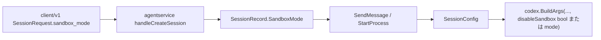

# 001: セッション単位のサンドボックスモード（Client API）

> **関連 Issue**: [axsh/arctic-tern#54](https://github.com/axsh/arctic-tern/issues/54)  
> **前史**: [axsh/arctic-tern#51](https://github.com/axsh/arctic-tern/issues/51) / PR #52（`BuildArgs` の bypass を `DisableSandbox` に紐づけ、省略時は Codex 既定の **read-only** になった）

## 背景 (Background)

### 問題

Issue #54 の報告どおり、Tern **v0.2.3 以降**では `agent_service.disable_sandbox` 未設定（`false`）のとき、Codex 起動引数に `--dangerously-bypass-approvals-and-sandbox` が付かない。Codex CLI の既定により `sandbox_policy.type = read-only` となり、ワークスペースへのファイル書き込み（`apply_patch` 等）が拒否される。

| 時期 | Codex 起動時の bypass |
| :--- | :--- |
| 〜 v0.2.2 | **常に** `--dangerously-bypass-approvals-and-sandbox` |
| v0.2.3〜（#51 修正後） | `AdapterConfig.DisableSandbox`（＝サーバ設定 `disable_sandbox`）が true のときのみ |

かつての「常時 bypass」は非対話 Agent Service としては書き込み可能だったが、サーバ全体の boolean しかなく、**セッション単位でモードを選べない**。一方、#51 以降の既定 read-only はサンドボックス拒否の再現には必要だが、書き込みが必要な消費者はサーバ設定を変えるしかない。

### 本仕様で決めること

1. **既定は現行どおり read-only を維持する**（#51 以降の安全側既定を崩さない）。
2. **Client API（Create Session）でモードを指定できるようにする**。
3. **`--dangerously-bypass-approvals-and-sandbox` 相当**を明示指定できること。
4. 既定挙動・モード切替は影響が大きいため、**リグレッションテストで既定と bypass を固定する**。

### スコープ外（本仕様ではやらない）

- 既定を再び「常時 bypass」に戻すこと（破壊的変更のため禁止）。
- Codex 上流（CLI 本体）の read-only 既定そのものの変更。
- Issue #51 の `tool_result` 合成ロジックの再設計。

---

## 要件 (Requirements)

### 必須要件 (Must)

#### R1: Create Session に `sandbox_mode` を追加する

- `POST /api/v1/sessions` の JSON ボディに任意フィールド `sandbox_mode`（string）を追加する。
- 許可値（本 Must の範囲）:

| 値 | 意味（Codex） |
| :--- | :--- |
| （省略） | **`read-only` と同じ**（既定） |
| `read-only` | `-s read-only`。ワークスペース書き込み不可 |
| `workspace-write` | `-s workspace-write`。ワークスペース配下は R/W、サンドボックスは維持 |
| `danger-full-access` | `--dangerously-bypass-approvals-and-sandbox`（フルバイパス） |

- 未知の値は `400 Bad Request`（メッセージに許可値を含める）。
- Go Client 側は **R8** を参照（HTTP と client/v1 の両方必須）。

#### R2: 既定は read-only を維持する（破壊的変更禁止）

- `sandbox_mode` 省略時、かつ後述 R4 のサーバ側フォールバックが効かない場合、Codex の `BuildArgs` は **bypass を付けない**（現行 v0.2.3+ と同じ）。
- 「省略＝常時 bypass」へ戻す変更は本仕様の対象外であり、将来行う場合は **別仕様＋本仕様のリグレッションが FAIL することを明示した破壊的変更** とする。

#### R3: セッションにモードを保持し、ターン起動に反映する

- `SessionRecord`（および GET `/api/v1/sessions/{id}` レスポンス）に解決済みの `sandbox_mode` を含める。
  - 省略時はレスポンス上 **`read-only` を明示して返す**（暗黙を避ける）か、省略のままとドキュメントで「未設定＝read-only」と定義する。**実装計画でどちらか一方に固定する**（推奨: レスポンスでは常に解決済み値を返す）。
- 各ターンの Codex プロセス起動時、`AdapterConfig.DisableSandbox` のみに依存せず、**当該セッションのモード**から bypass 有無を決める。
- `SessionConfig`（または同等）にセッション単位のフラグ／モードを載せ、`codex.BuildArgs` / `StartProcess` がそれを参照する。

#### R4: サーバ設定 `agent_service.disable_sandbox` との優先順位

既存 E2E・コンテナ運用（`disable_sandbox: true`）を壊さないため、次の優先順位とする。

```text
1. CreateSession で sandbox_mode が明示された → その値を採用
2. 明示がなく、サーバ disable_sandbox == true → danger-full-access として扱う
3. それ以外 → read-only
```

- `/health` の `server_settings.disable_sandbox` は現状どおりサーバ全体フラグとして維持する（意味は「セッション未指定時の既定を bypass にする」）。
- ドキュメント（`docs/ReferenceManual-WebAPIs.md`）に上記優先順位と Issue #54 向けの推奨（書き込みが必要ならセッションで `danger-full-access`、またはサーバで `disable_sandbox: true`）を追記する。

#### R5: Claude Code へのマッピング（最小）

| `sandbox_mode` | Claude 側 |
| :--- | :--- |
| `read-only` | `CLAUDE_CODE_SKIP_SANDBOX` をセットしない（現行 `DisableSandbox=false` 相当） |
| `workspace-write` | 同上（Claude に正確な workspace 限定はない。SKIP は付けない） |
| `danger-full-access` | `CLAUDE_CODE_SKIP_SANDBOX=1`（現行 `DisableSandbox=true` 相当） |

- Claude は従来どおり `--permission-mode bypassPermissions` を維持する（本仕様で変更しない）。
- Codex と Claude で「read-only」の厳密な意味は異なることをドキュメントに明記する。

#### R6: リグレッションテスト（既定と bypass）

影響が大きいため、少なくとも次を自動化する（モック CLI / 引数キャプチャで可。実 Codex 必須ではないが、既存 live テストとの共存を壊さないこと）。

| ID | 内容 |
| :--- | :--- |
| T1 | サーバ `disable_sandbox: false`、CreateSession で `sandbox_mode` 省略 → Codex 引数に bypass **なし** |
| T2 | 同上、`sandbox_mode: "read-only"` → bypass **なし** |
| T3 | `sandbox_mode: "danger-full-access"` → bypass **あり** |
| T4 | サーバ `disable_sandbox: true`、セッション省略 → bypass **あり**（R4） |
| T5 | サーバ `disable_sandbox: true` でもセッションが `read-only` 明示 → bypass **なし**（明示が優先） |
| T6 | 不正値 → HTTP 400 |
| T7 | GET session（または Create レスポンス拡張がある場合）で解決済み `sandbox_mode` が読める |

- 既存の `TestSessionRecoverLive_CodexSandboxReject`（サンドボックス有効前提）が、本変更後も **意図どおり sandbox 有効**で動くこと（サーバ `disable_sandbox: false` + 省略／`read-only`）。

#### R7: PATCH では変更しない（本 Must）

- `sandbox_mode` は **セッション作成時に固定**する。`PATCH /api/v1/sessions/{id}` での変更は本仕様の Must 外（Nice to Have）。

#### R8: `client/v1` に `sandbox_mode` を追加する（必須）

HTTP API だけでなく、公式 Go クライアントでも同じ設定を扱えること。

| 対象 | 変更内容 |
| :--- | :--- |
| `client/v1.SessionRequest` | `SandboxMode string \`json:"sandbox_mode,omitempty"\`` を追加。`CreateSession` のリクエストボディに含める |
| `client/v1.SessionInfo` | `SandboxMode string \`json:"sandbox_mode,omitempty"\`` を追加。`GetSession` / 更新系レスポンスで解決済み値を読める |
| 定数（推奨） | `SandboxModeReadOnly` / `SandboxModeWorkspaceWrite` / `SandboxModeDangerFullAccess` を `client/v1` に定義 |
| 単体テスト | `client/v1/session_test.go` で Create の JSON に `sandbox_mode` が載ること、省略時はキーが出ない（または空）ことを検証する |

使用イメージ（仕様上の契約。実装時はこの形に合わせる）:

```go
session, err := c.CreateSession(ctx, client.SessionRequest{
    Agent:        "codex",
    Model:        "gpt-5.3-codex",
    WorkDir:      workDir,
    SandboxMode:  client.SandboxModeDangerFullAccess, // 書き込みが必要な場合
})
```

- 省略時はフィールドを送らない（サーバ既定＝R2/R4）。クライアント側で勝手に `danger-full-access` を埋めない。

#### R9: `examples/` に利用例を追加する（必須）

消費者が `client/v1` 経由でモードを指定できることを示す実行可能な example を追加する。

| 項目 | 内容 |
| :--- | :--- |
| 配置 | 新規ディレクトリ `examples/sandbox-mode/`（`main.go` + 既存 example と同様の `go.mod` 構成）を推奨。既存 `minimal-client` への追記のみは不可（本機能の発見性が低い） |
| 内容 | (1) `sandbox_mode` **省略**（read-only 既定）と (2) `SandboxModeDangerFullAccess` の **両方**をコメントまたは実行パスで示す。サーバ URL は既存 example と同様に引数で指定 |
| 前提コメント | 書き込みが必要な Codex セッションでは `danger-full-access`（またはサーバ `disable_sandbox: true`）が必要であること、Issue #54 への言及を README コメントまたはファイル先頭コメントに含める |
| ビルド | 既存 example と同様、リポジトリの example ビルド手順でコンパイルできること（壊れた example を残さない） |

---

### 任意要件 (Nice to Have)

#### N1: PATCH での `sandbox_mode` 更新

- 実行中ターンがないときのみ更新可、など制約付き。

#### N2: ternctl でのフラグ公開

- 例: `ternctl session create --sandbox-mode workspace-write`。
- サンプルクライアント本体は **R9（Must）**。こちらは CLI 露出の任意拡張。

---

## 実現方針 (Implementation Approach)

### レイヤ構成



### 設計上の決定

1. **フィールド名は `sandbox_mode`**（boolean `disable_sandbox` をセッションに増やさない）。将来 `workspace-write` を足しやすい。
2. **Codex の Must 実装**は `BuildArgs` に `sandboxMode string` を渡し:
   - `read-only` → `-s read-only`
   - `workspace-write` → `-s workspace-write`
   - `danger-full-access` → `--dangerously-bypass-approvals-and-sandbox`
3. **起動時の単一ソース**: ターン開始時は `SessionRecord` の解決済みモード（＋R4 適用済み）を見る。`AdapterConfig.DisableSandbox` は「サーバ既定」として Create 時の解決に使い、プロセス起動ごとにサーバフラグだけを見ない（セッション明示を上書きしない）。
4. **永続化**: `MemorySessionStore` / workspace 永続がある場合は `sandbox_mode` をレコードに含める。既存セッション（フィールドなし）は読み取り時に `read-only` とみなす。
5. **API 互換**: 未知フィールドを無視する古いクライアントは従来どおり動く（既定 read-only）。新しいクライアントのみ明示指定。

### 変更ファイル（想定）

| 領域 | ファイル例 |
| :--- | :--- |
| API | `shared/libs/go/agentservice/handler.go`（Create）、`handler_session.go`（GET レスポンス） |
| モデル | `shared/libs/go/codingagent/session_store.go`、`options.go` |
| Codex | `shared/libs/go/codingagent/codex/process.go`（SessionConfig から bypass 決定） |
| Claude | `shared/libs/go/codingagent/claudecode/process.go`（R5） |
| Client | `client/v1/session.go`（`SessionRequest` / `SessionInfo` / 定数）、`client/v1/session_test.go`（R8） |
| Example | `examples/sandbox-mode/main.go`（および既存例に合わせた `go.mod` 等）（R9） |
| Docs | `docs/ReferenceManual-WebAPIs.md` |
| Tests | `codex/process_test.go`、`agentservice` handler テスト、`tests/*` 統合 |

### Issue #54 への回答方針（ドキュメント／メンテナ視点）

- 意図した契約: **省略時は read-only**。ワークスペース書き込みだけなら `workspace-write`、フルバイパスが必要なら `danger-full-access`（またはサーバ `disable_sandbox: true`）。
- Codex CLI 三段（`read-only` / `workspace-write` / `danger-full-access`）をすべて Client API で指定可能。

---

## 検証シナリオ (Verification Scenarios)

### シナリオ A: 既定は read-only（リグレッション）

1. Tern を `agent_service.disable_sandbox: false`（または未設定）で起動する。
2. `POST /api/v1/sessions` で `agent=codex`、`sandbox_mode` **なし**。
3. メッセージ送信で Codex プロセスが起動したとき、CLI 引数に `--dangerously-bypass-approvals-and-sandbox` が **含まれない**。
4. （任意・ライブ）書き込み系プロンプトが read-only 拒否になることを確認できる。

### シナリオ B: Client で bypass 相当を指定

1. 同上サーバ設定。
2. CreateSession で `"sandbox_mode": "danger-full-access"`。
3. Codex CLI 引数に `--dangerously-bypass-approvals-and-sandbox` が **含まれる**。
4. GET session で `sandbox_mode` が `danger-full-access`。

### シナリオ C: サーバ disable_sandbox フォールバック

1. `disable_sandbox: true` で起動。
2. CreateSession で `sandbox_mode` 省略 → bypass **あり**。
3. CreateSession で `"sandbox_mode": "read-only"` → bypass **なし**（明示優先）。

### シナリオ D: 不正値

1. `"sandbox_mode": "full-auto"` 等 → HTTP 400。

### シナリオ E: #51 サンドボックス拒否リカバリとの共存

1. `disable_sandbox: false`、モード省略または `read-only`。
2. 既存 `TestSessionRecoverLive_CodexSandboxReject`（または同等の sandbox 拒否シナリオ）が引き続き拒否を観測し、終端イベントを得られる。

### シナリオ F: client/v1 と example（R8 / R9）

1. `client/v1` で `SessionRequest{SandboxMode: client.SandboxModeDangerFullAccess}` を `CreateSession` に渡すと、HTTP ボディに `"sandbox_mode":"danger-full-access"` が含まれる。
2. `GetSession` の `SessionInfo.SandboxMode` に解決済み値が入る。
3. `examples/sandbox-mode` を既存 example と同様にビルド／実行でき、コメントまたは実行パスで省略と bypass 指定の両方を示している。

---

## テスト項目 (Testing)

手動確認のみは禁止。以下をゲートとする。

### 単体・パッケージ

- `shared/libs/go/codingagent/codex` — `BuildArgs` / 起動引数と mode の対応（T1–T3 相当）
- `shared/libs/go/agentservice` — CreateSession のパース・優先順位・400（T4–T6）
- `client/v1` — `SessionRequest` / `SessionInfo` の JSON マーシャリング（R8）
- `examples/sandbox-mode` — `go build` が通ること（R9）

### 統合テスト（必須ゲート）

Windows（Git Bash）:

```bash
./scripts/process/build.sh && ./scripts/process/integration_test.sh --specify "TestSandboxMode"
```

Linux / Remote-SSH（Linux）:

```bash
./scripts/process/build.sh --skip-etc && xvfb-run -a ./scripts/process/integration_test.sh --specify "TestSandboxMode"
```

検証すること（実装計画でテスト名を確定）:

- 既定省略で bypass なし（T1）
- `danger-full-access` で bypass あり（T3）
- サーバ `disable_sandbox` とセッション明示の優先順位（T4, T5）
- 不正値 400（T6）

### 既存リグレッション（破壊防止）

```bash
./scripts/process/build.sh && ./scripts/process/integration_test.sh --specify "TestSessionRecover"
```

Linux:

```bash
./scripts/process/build.sh --skip-etc && xvfb-run -a ./scripts/process/integration_test.sh --specify "TestSessionRecover"
```

- `TestSessionRecover*`（サンドボックス有効前提）が PASS すること。

### カテゴリ実行（関連が広い場合）

```bash
./scripts/process/integration_test.sh --categories common,llm
```

Linux では同様に `build.sh --skip-etc` と `xvfb-run -a` でラップする。

---

## 受け入れ基準 (Acceptance Criteria)

- [ ] CreateSession（HTTP）で `sandbox_mode` を指定できる
- [ ] `client/v1` の `SessionRequest` / `SessionInfo` に `SandboxMode` があり、単体テストがある（R8）
- [ ] `examples/sandbox-mode` が追加され、省略と `danger-full-access` の両方を示せる（R9）
- [ ] 省略時の Codex 挙動は **read-only（bypass なし）** のまま
- [ ] `danger-full-access` で `--dangerously-bypass-approvals-and-sandbox` 相当になる
- [ ] R4 の優先順位がテストで固定されている
- [ ] ドキュメントに契約と Issue #54 向け推奨が書かれている
- [ ] `TestSandboxMode*` および既存 `TestSessionRecover*` が PASS

---

## 参考

- 調査結論: #51（`224a52a`）で bypass を条件付きにしたことが Issue #54 の直接原因。本仕様は既定を戻さず、**セッション API で明示的に bypass 相当を選べるようにする**。
- Codex CLI: `-s read-only | workspace-write | danger-full-access` および `--dangerously-bypass-approvals-and-sandbox`
