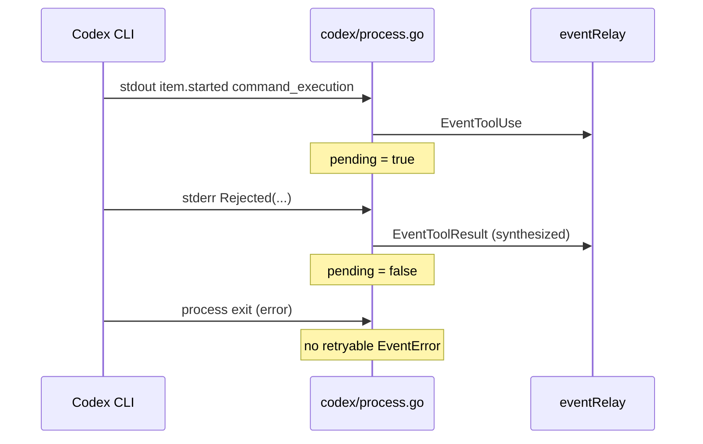

# 000: Phase 1 — Codex サンドボックス拒否の `tool_result` 正規化

> **関連 Issue**: [axsh/arctic-tern#51](https://github.com/axsh/arctic-tern/issues/51)
>
> **実装フェーズ**: Phase 1（P0）。本ブランチの **最初** に実装する。
>
> **後続仕様**: [001-Agentservice-SSE-Terminal-Guarantee.md](./001-Agentservice-SSE-Terminal-Guarantee.md)（Phase 2）、[002-Session-Recover-E2E-Regression.md](./002-Session-Recover-E2E-Regression.md)（Phase 3）

## 背景 (Background)

Codex CLI がサンドボックス／ポリシー層でシェルコマンドを拒否したとき（例: compound bash の末尾に `rm -f`）、stderr に `Rejected("... rm -f style commands are not permitted ...")` が出るが、stdout の `item.completed`（`command_execution` + `aggregated_output`）は来ないままプロセスが終了する。

Tern の正常パス（`protocol.go` の `parseItemEvent`）は stdout `item.completed` を `EventToolResult` にマップする設計だが、**拒否時はこのパスが通らない**。

現状の失敗パス（`codex/process.go`）:

1. stderr 全文をプロセス終了時に `EventError` として送出する。
2. `IsNonRetryableError` にサンドボックス拒否は含まれないため `Retryable: true` になる。
3. stderr のリアルタイム処理は stdin wait 検出のみで、拒否を `tool_result` に変換しない。

下流（`client/v1` の `FollowFrom`、worklog マッピング）は `tool_result` で in-turn リカバリを想定しているが、イベントが届かず長時間の無音と終端欠落につながる（Phase 2 / Issue 全体の調査結果）。

### 本 Phase で決めること

| 項目 | 決定 |
| :--- | :--- |
| 変更層 | `shared/libs/go/codingagent/codex` および共有 `codingagent` のエラー分類 |
| スコープ外 | `agentservice` の SSE 終端保証（Phase 2）、E2E（Phase 3）、**R6 / R7（レビューで対象外確定）** |
| 上流 Codex | stdout `item.completed` の理想動作はエスカレーション対象。本 Phase は **防御的フォールバック**（Issue コメント等の運用は行わない） |

---

## 要件 (Requirements)

### 必須要件 (Must)

#### R1: サンドボックス拒否パターンの検出

- 新規関数 `IsSandboxRejection(msg string) bool` を `codingagent` パッケージ（または `codex` 専用で export）に追加する。
- 最低限マッチするパターン:
  - `Rejected(`（大文字小文字は case-insensitive 可）
  - `rm -f style commands are not permitted`
  - `exec_command failed` と `Rejected` の同時出現（stderr 行またはバッファ全文）
- 誤検知を避けるため、**汎用の `exit status 1` 単体**は拒否とみなさない。

#### R2: pending `command_execution` の追跡

- `StartProcess` の stdout 読み取りゴルーチン内で、論理状態を追跡する:
  - `item.started` / stdout 由来の `EventToolUse`（`command_execution`）で **pending** を立てる。
  - 対応する `EventToolResult`（stdout `item.completed` または本 Phase で合成した結果）で **pending を解除**する。
- 同一ターン内で複数コマンドが連続する場合、**最後に開始した未完了コマンド**を pending とする（LIFO または 1 スロットで十分。実装計画で確定）。

#### R3: stderr リアルタイムまたは exit 時の `EventToolResult` 合成

- stderr 行または exit 時 stderr バッファに R1 の拒否パターンがあり、かつ **pending が残っている**、かつ **stdout から既に同コマンドの `EventToolResult` を送っていない** とき:
  - `EventToolResult` を ch に送る。`Content` は拒否テキスト（stderr 行または関連部分。全文 trim でも可）。
  - `ToolName` は既存の stdout パスと揃え `command_execution` とする（`protocol.go` の completed パスが ToolUse を出す場合と整合）。
- stdout に既に `item.completed` で `EventToolResult` が出ていた場合は **二重送出しない**。

#### R4: プロセス終了時の `EventError` 分類の修正

- R3 で `EventToolResult` を合成したサンドボックス拒否について:
  - **retryable な `EventError` を追加送出しない**（推奨）、または
  - `IsNonRetryableError` / `IsSandboxRejection` により non-retryable とし、内容は拒否テキストまたは短い要約にする。
- 合成していない通常のプロセス失敗（`exit status 1` 等）の既存分類は **リグレッションさせない**（`process_repro_test.go` の既存ケースを維持）。

#### R5: `wait: no child processes` のログノイズ（軽微）

- stdout ゴルーチンが `cmd.Wait()` 済みのあと `Stop()` が再度 `Wait()` して `wait: no child processes` が出る可能性がある。
- 本 Phase では **必須ではない** が、実装が容易なら `Stop()` 側で既終了を考慮する（任意）。

---

> **レビュー確定（対象外）**: 当初 Nice to Have としていた次は **実装しない**。
> - ~~R6 stderr 行単位の即時 `EventToolResult` 合成~~ → R3 の **exit 時合成のみ** で十分
> - ~~R7 上流 Codex への Issue #51 コメント~~ → 運用アクションは行わない

---

## 実現方針 (Implementation Approach)

### 変更ファイル（想定）

| ファイル | 変更 |
| :--- | :--- |
| `shared/libs/go/codingagent/retry.go` | `IsSandboxRejection` 追加（または `codex/rejection.go` に置き export） |
| `shared/libs/go/codingagent/codex/process.go` | pending 追跡、stderr / exit 時合成、終了時 EventError 抑制 |
| `shared/libs/go/codingagent/codex/rejection.go`（新規可） | パターン定義と抽出ヘルパ |
| `shared/libs/go/codingagent/retry_test.go` | `IsSandboxRejection` 単体 |
| `shared/libs/go/codingagent/codex/process_repro_test.go` | testfake による拒否 stderr 再現 |

### イベントフロー（目標）



### 設計上の注意

- **in-turn 継続の限界**: Codex プロセスが拒否直後に死ぬ場合、同一 Codex プロセス内での別コマンド試行は上流依存。本 Phase は **下流が拒否を tool 失敗として観測できる** ことを保証する。
- `TruncateToolResult` は合成 `EventToolResult` にも既存と同様適用する。
- Claude Code アダプタは本 Phase の対象外（Codex 固有の stderr 形式）。

---

## 検証シナリオ (Verification Scenarios)

Issue #51 の再現手順（原文相当）— 本 Phase 完了後の **codex アダプタ単体** での期待:

1. Tern セッションに `codex` エージェントを使い、既存会話を `resume` する。
2. モデルが compound bash（末尾 `rm -f`）を実行しようとするユーザーメッセージを送る。例:
   ```bash
   curl -fsS http://127.0.0.1:8080/some/path -o /tmp/check.html; \
   rg -o 'href="[^"]+\.css' /tmp/check.html; \
   rm -f /tmp/check.html
   ```
3. Codex stderr に `Rejected("... rm -f style commands are not permitted ...")` が出る。
4. stdout `item.completed` が無い場合でも、Tern codex アダプタの ch から **`EventToolResult`**（拒否テキスト含む）が観測される。
5. 続けて **retryable な `EventError` だけ** が出て Follow が無音になる、という状態は本 Phase では解消する。

---

## テスト項目 (Testing)

### 単体テスト（必須）

`./scripts/process/build.sh` 内の Go 単体テスト、または:

```bash
go test -count=1 ./shared/libs/go/codingagent/... ./shared/libs/go/codingagent/codex/...
```

検証すること:

- `TestIsSandboxRejection_*`: R1 パターンの true/false
- `TestStartProcess_SandboxRejectionSynthesizesToolResult`: testfake で stderr `Rejected(...)` + exit 1 → `EventToolResult` が 1 件、retryable `EventError` が無い（または non-retryable のみ）
- `TestStartProcess_SandboxRejectionNoDuplicateToolResult`: stdout `item.completed` ありの場合は合成しない
- 既存 `process_repro_test.go` / `retry_test.go` がすべて PASS（リグレッション）

Windows では Git Bash から上記を実行する。

### 統合テスト

本 Phase 単体では **新規 integration テストは必須ではない**（Phase 3 でカバー）。ビルドパイプライン:

```bash
./scripts/process/build.sh
```

---

## 対象外

- `agentservice` の SSE 書き込み・`[DONE]` 保証（Phase 2）
- Follow / `FollowFrom` の E2E（Phase 3）
- Codex 上流が stdout `item.completed` を出すようになる修正
- stderr 行単位の即時 `tool_result` 合成（旧 R6）
- Issue #51 への上流フィードバックコメント（旧 R7）

## 完了条件（Acceptance Criteria）

- [ ] testfake 再現で sandbox 拒否 stderr → `EventToolResult` が ch に届く
- [ ] 合成後に retryable `EventError` だけが残らない（R4）
- [ ] 既存 codex process / retry 単体テストがリグレッションなし
- [ ] `./scripts/process/build.sh` 成功
