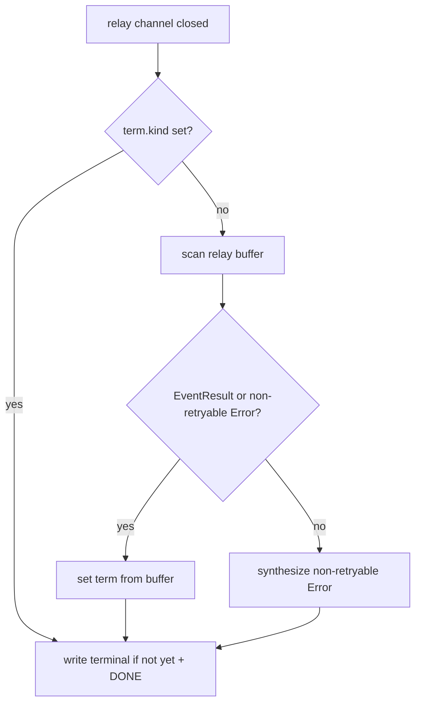

# 001: Phase 2 — SSE 終端イベント保証と retryable エラー可視性

> **関連 Issue**: [axsh/arctic-tern#51](https://github.com/axsh/arctic-tern/issues/51)
>
> **実装フェーズ**: Phase 2（P0）。**Phase 1 完了後** に実装する。
>
> **前提仕様**: [000-Codex-Sandbox-Rejection-ToolResult.md](./000-Codex-Sandbox-Rejection-ToolResult.md)
>
> **後続仕様**: [002-Session-Recover-E2E-Regression.md](./002-Session-Recover-E2E-Regression.md)（Phase 3）

## 背景 (Background)

Phase 1 で Codex 拒否を `EventToolResult` に正規化しても、`agentservice` 層に次の問題が残る。

1. **retryable `EventError` は SSE に書かれない**（`attachSSE` がスワロー）。Phase 1 前は sandbox 拒否が retryable `EventError` になり、Follow クライアントは **長時間無音** だった。
2. **relay 終了時に terminal が空**のとき、`handleFollow` は `[DONE]` を出さない（`term.kind` が空）。
3. **切断後 `waitDetached`** はセッション status 変化を待つが、retryable error では status が `active` のまま → 90 秒猶予まで無音。

`feat-reconnect-session` 仕様（R1）では `POST /messages` と同型の SSE が `EventResult` / `EventError` / `[DONE]` まで届く契約がある。Issue #51 はこの契約の破れである。

### 本 Phase で決めること

| 項目 | 決定 |
| :--- | :--- |
| 変更層 | `shared/libs/go/agentservice`（`handler_retry.go`, `handler_follow.go` 等） |
| Phase 1 との境界 | Codex のイベント生成は Phase 1。SSE 契約と終端保証は本 Phase |
| スコープ外 | 新規 E2E テストファイル（Phase 3）、Codex アダプタ本体 |

---

## 要件 (Requirements)

### 必須要件 (Must)

#### R1: `tool_result` は常に SSE に書く

- Phase 1 で合成された `EventToolResult` は、既存の `attachSSE` / `writeSSEWireEvents` パスで **必ずワイヤに出る**（現行でも `EventToolResult` は書かれる。リグレッション防止テストを Phase 3 で追加）。
- `handleRelaySideEffects` は `EventToolResult` に対して task log 等を通常どおり適用する。

#### R2: relay 終了時の終端保証

- `attachSSE` が relay channel 終了（`ok == false`）したとき、`term.kind` が空、かつ relay バッファに `EventResult` または非 retryable `EventError` が存在しない場合:
  - **合成 terminal** を決定する。優先順位:
    1. バッファ内の最後の非 retryable `EventError`
    2. バッファ内の最後の retryable `EventError`（Phase 1 後は sandbox 拒否はここに来ない想定）
    3. フォールバック: non-retryable `EventError`（content 例: `stream ended without terminal event`）
  - 合成 terminal を **SSE に 1 回書く**（Follow / `POST /messages` 共通）。
- `handleFollow` は terminal 判定後 **常に `[DONE]`** を送る（`term.kind` が `EventResult` または `EventError` のとき既存どおり。R2 により空 terminal が解消される）。

#### R3: `handleFollow` の終端整合

- `GET /api/v1/sessions/{id}/events`（Follow）が relay 完了時:
  - `EventResult`、または明示 `EventError`、および `data: [DONE]` をクライアントが受信できる。
  - **無言の HTTP ストリームクローズのみ**で終わらない。

#### R4: 切断中の internal process retry との整合

- クライアント切断後 `waitDetached` が動いている間、`runTurn` の process retry が進む場合:
  - relay 差し替え（`active.relay` 更新、`streamOffset` リセット）後も、Follow が `from` 付きで再接続したとき **破綻しない**（既存 `feat-reconnect-session` 契約を維持）。
- sandbox 拒否後に retryable `EventError` だけがバッファに残り SSE 無音になる経路は、Phase 1 + 本 Phase R2 で閉じる。

#### R5: セッション status の更新

- 合成 terminal `EventError`（R2 フォールバック）受信時は `StatusError` に更新する（既存 `updateSessionStatusOnTerminal` パス）。
- `EventToolResult` 単体ではターン完了とみなさない（既存どおり）。

### 任意要件 (Nice to Have)

#### R6: retryable upstream error の Follow 可視化

- 将来の upstream overload 用に、retryable `EventError` を `EventSystem`（content に `[upstream_overloaded]` 等）として **情報のみ SSE に出す**オプション。Issue #51 の必須ではない。Phase 1 完了後は sandbox 拒否は対象外。

#### R7: 猶予満了前の早期 terminal

- 切断後、relay に terminal が無く猶予タイマーだけが動いている状態を短縮するヒューリスティック。必須ではない。

---

## 実現方針 (Implementation Approach)

### 変更ファイル（想定）

| ファイル | 変更 |
| :--- | :--- |
| `handler_retry.go` | `attachSSE` の relay 終了処理、terminal 合成、`streamSSERelay` / `waitDetached` 整合 |
| `handler_follow.go` | `handleFollow` の `[DONE]` 条件（R2 後は簡素化可） |
| `handler_retry_test.go` / `handler_follow_test.go` | モック agent による terminal 保証 |

### 終端決定フロー



### `eventRelay` との関係

- terminal 合成は **バッファスナップショット**（`EventsSnapshot`）を使う。relay の source ゴルーチン終了後でも安全。
- 副作用（task log）は Phase 1 の `EventToolResult` が既に `pumpExecSideEffects` で適用済みである前提。合成 terminal の二重適用に注意。

### Follow 仕様との関係

- `feat-reconnect-session` の R1（イベント型・終端）は本 Phase で Issue #51 経路を満たす。
- steal / 90 秒猶予 / `from` 再生は変更しない。

---

## 検証シナリオ (Verification Scenarios)

### シナリオ A: Follow が terminal まで届く（モック・必須）

1. fake agent が `EventToolResult`（拒否テキスト）のみ送って ch を閉じる（`EventResult` 無し）。
2. `POST /messages` SSE で途中まで読み、切断する。
3. `GET .../events?from=<last id>` で Follow。
4. 残りの `tool_result` のあと **明示 `error` または `result`** と `[DONE]` を受信する（R2 フォールバック error 可）。
5. 無言クローズのみでは終わらない。

### シナリオ B: 通常完了はリグレッションなし（モック）

1. fake agent が text → result で終了。
2. Follow でも `EventResult` + `[DONE]`（既存 `TestSessionFollow` 系と同等）。

---

## テスト項目 (Testing)

### 単体・httptest（必須）

```bash
go test -count=1 ./shared/libs/go/agentservice/... -run 'TestAttachSSE|TestHandleFollow|TestStreamSSERelay|TestSessionRecover'
```

または build パイプライン:

```bash
./scripts/process/build.sh
```

新規テスト名プレフィックス: `TestSessionRecover`（Phase 3 の E2E と区別。handler 層は `TestSessionRecoverTerminal_*`）。

検証すること:

- `TestSessionRecoverTerminal_RelayEndWithoutResult`: R2 合成 error + SSE 書き込み
- `TestSessionRecoverTerminal_FollowWritesDone`: `handleFollow` が `[DONE]` を出す
- 既存 `handler_retry_test.go` / `handler_follow_test.go` / `TestSessionFollow_*` が PASS

### 統合テスト

本 Phase 単体では新規 `tests/` ファイルは **任意**。Phase 3 で必須化。

---

## 対象外

- Codex stderr パース・`tool_result` 合成（Phase 1）
- 実 Codex CLI による `rm -f` 再現（Phase 3）
- retryable upstream overload の SSE 可視化（R6、任意）

## 完了条件（Acceptance Criteria）

- [ ] relay 終了かつバッファに terminal 無し → 合成 `EventError` が SSE に出る
- [ ] Follow が無言クローズのみで終わらない
- [ ] 既存 `TestSessionFollow_*` および agentservice テストがリグレッションなし
- [ ] `./scripts/process/build.sh` 成功
